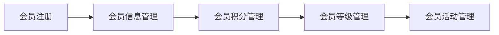

## 1.背景介绍

在当今的商业环境中，会员管理系统已经成为企业与客户互动的重要工具。它帮助企业建立与维护与客户的长期关系，提升客户的忠诚度，提高企业的市场竞争力。本文将详细介绍会员管理系统的详细设计与具体代码实现。

## 2.核心概念与联系

会员管理系统主要由会员注册、会员信息管理、会员积分管理、会员等级管理、会员活动管理等模块组成。这些模块之间的联系紧密，共同构成了一个完整的会员管理系统。在这个系统中，每个模块都扮演着重要的角色，相互之间的联系也十分紧密。



## 3.核心算法原理具体操作步骤

在会员管理系统中，我们主要采用了CRUD（Create、Read、Update、Delete）操作，这是任何数据驱动的系统的基础。我们将分别介绍每个模块的具体操作步骤。

### 3.1 会员注册

会员注册是会员管理系统的第一步。在这个模块中，我们需要收集用户的基本信息，如姓名、性别、出生日期、联系方式等，并将这些信息存储在数据库中。

### 3.2 会员信息管理

会员信息管理是会员管理系统的核心模块。在这个模块中，我们需要对会员的信息进行管理，包括查看会员信息、修改会员信息、删除会员信息等。

### 3.3 会员积分管理

会员积分管理是会员管理系统的重要模块。在这个模块中，我们需要对会员的积分进行管理，包括积分的获取、积分的使用、积分的查询等。

### 3.4 会员等级管理

会员等级管理是会员管理系统的重要模块。在这个模块中，我们需要对会员的等级进行管理，包括等级的设定、等级的提升、等级的降低等。

### 3.5 会员活动管理

会员活动管理是会员管理系统的重要模块。在这个模块中，我们需要对会员的活动进行管理，包括活动的发布、活动的参与、活动的查询等。

## 4.数学模型和公式详细讲解举例说明

在会员管理系统中，会员的等级和积分是两个重要的参数。我们通常使用数学模型来描述会员的等级和积分。

设 $N$ 为会员的积分，$L$ 为会员的等级，$P$ 为会员的消费金额，我们可以得到以下的数学模型：

$$
N = P \times R
$$

其中，$R$ 是积分的比例，通常由企业根据其业务需要来设定。

会员的等级通常由会员的积分来决定，我们可以得到以下的数学模型：

$$
L = f(N)
$$

其中，$f(N)$ 是一个阶梯函数，当会员的积分达到一定的阶梯时，会员的等级就会提升。

## 5.项目实践：代码实例和详细解释说明

下面我们将以会员注册模块为例，提供一段简单的代码实例，并进行详细的解释说明。

```python
class Member:
    def __init__(self, name, gender, birthday, contact):
        self.name = name
        self.gender = gender
        self.birthday = birthday
        self.contact = contact

    def register(self):
        # 将会员信息存储在数据库中
        pass
```

在这段代码中，我们首先定义了一个名为 `Member` 的类，这个类包含了会员的基本信息，如姓名、性别、出生日期、联系方式等。然后，我们定义了一个名为 `register` 的方法，这个方法用于将会员的信息存储在数据库中。

## 6.实际应用场景

会员管理系统广泛应用于各种商业环境中，如零售业、餐饮业、旅游业等。它帮助企业建立与维护与客户的长期关系，提升客户的忠诚度，提高企业的市场竞争力。

## 7.工具和资源推荐

在开发会员管理系统时，我们推荐使用以下的工具和资源：

- 数据库：MySQL、Oracle、SQL Server等
- 开发语言：Python、Java、C#等
- 开发工具：PyCharm、Eclipse、Visual Studio等
- 版本控制工具：Git、SVN等

## 8.总结：未来发展趋势与挑战

随着科技的发展，会员管理系统也将面临新的发展趋势和挑战。例如，如何利用大数据和人工智能技术提升会员管理系统的效率和效果，如何保护会员的隐私信息，如何提升会员的体验等。

## 9.附录：常见问题与解答

1. 问题：如何提升会员的忠诚度？
   解答：提升会员的忠诚度主要有以下几种方法：提供优质的产品和服务、提供吸引人的会员活动、提供个性化的服务等。

2. 问题：如何保护会员的隐私信息？
   解答：保护会员的隐私信息主要有以下几种方法：加强数据的加密和备份、加强系统的安全防护、加强员工的安全意识等。

作者：禅与计算机程序设计艺术 / Zen and the Art of Computer Programming