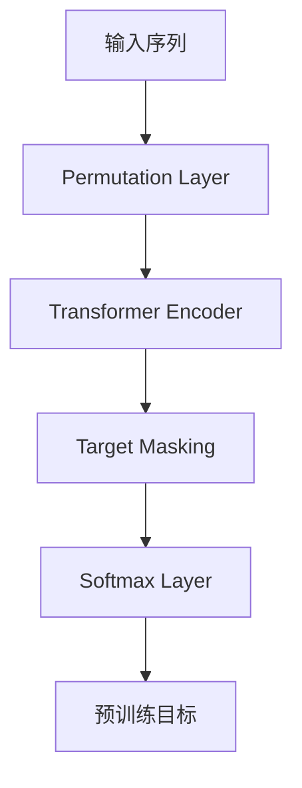

# 使用XLNet进行情感分析：模型训练与代码演示

## 1.背景介绍

### 1.1 情感分析的重要性

在当今的数字时代,社交媒体、在线评论和用户反馈等用户生成的内容快速增长。这些数据蕴含着宝贵的情感信息,对企业、政府和个人来说都是非常有价值的资源。通过有效地分析和利用这些情感数据,我们可以深入了解用户的需求、喜好和体验,从而为产品和服务的优化、营销策略的制定以及风险管理等方面提供有力支持。

情感分析(Sentiment Analysis),也被称为观点挖掘(Opinion Mining),是自然语言处理(NLP)领域的一个重要研究方向,旨在从文本数据中自动检测、识别和提取主观信息,如观点、情感、评价、态度等。通过情感分析技术,我们可以自动化地理解和量化文本数据中蕴含的情感倾向,从而为各种应用场景提供有价值的情感见解。

### 1.2 情感分析的挑战

尽管情感分析在理论和实践中都取得了长足的进展,但由于自然语言的复杂性和多义性,准确地捕捉和理解文本中的情感信息仍然是一个巨大的挑战。情感分析面临的主要挑战包括:

1. **语义歧义**:同一个词或短语在不同上下文中可能表达不同的情感,需要结合上下文来准确理解其情感含义。

2. **言外之意**:文本中的情感信息往往是隐含的,需要通过推理和综合多种线索来捕捉。

3. **主观性**:情感判断具有一定的主观性,不同的人对同一文本可能会有不同的情感理解。

4. **数据噪声**:真实世界的文本数据往往包含错误、缩写、俚语等噪声,增加了情感分析的难度。

5. **领域依赖性**:不同领域的文本可能使用不同的语言风格和术语,需要针对特定领域进行优化和调整。

为了应对这些挑战,研究人员不断探索和发展新的模型和算法,以提高情感分析的准确性和鲁棒性。其中,基于深度学习的方法展现出了巨大的潜力,能够自动学习文本的深层语义表示,从而更好地捕捉情感信息。

### 1.3 XLNet模型介绍

XLNet是由谷歌AI团队于2019年提出的一种新型的自然语言表示模型,旨在改进BERT等transformer模型在预训练过程中的一些缺陷。XLNet采用了一种新颖的自回归(Auto-Regressive)语言建模方式,通过最大化所有可能的因式分解顺序的概率来学习双向上下文表示。

相比BERT等模型,XLNet具有以下几个主要优势:

1. **更好的上下文建模能力**:XLNet通过最大化所有可能的因式分解顺序的概率,能够更好地捕捉双向上下文信息。

2. **缓解预训练-微调不一致问题**:XLNet在预训练和微调阶段采用了相同的自回归语言建模目标,避免了预训练-微调不一致的问题。

3. **更好的泛化能力**:XLNet在预训练过程中引入了一些噪声,使得模型在面对新的数据时具有更好的泛化能力。

4. **更长的上下文依赖捕捉能力**:XLNet能够更好地捕捉长距离的上下文依赖关系,对于长文本的建模具有优势。

由于XLNet在各种自然语言处理任务上展现出了卓越的性能,因此将其应用于情感分析任务是一个非常有趣和有价值的探索方向。本文将详细介绍如何使用XLNet模型进行情感分析,包括模型训练、调优和代码实现等内容。

## 2.核心概念与联系

### 2.1 情感分析任务定义

情感分析是一项自然语言处理任务,旨在自动识别和提取文本中蕴含的主观观点、情感和情绪等信息。根据分析的粒度不同,情感分析任务可以分为以下几个层次:

1. **文档级情感分析**:判断整个文档(如新闻报道、产品评论等)所表达的整体情感倾向,通常分为正面、负面或中性三类。

2. **句子级情感分析**:判断单个句子所表达的情感倾向,也可分为正面、负面或中性三类。

3. **观点级情感分析**:识别文本中提到的目标实体(如产品特征、话题等),并判断针对每个目标实体的情感倾向。

4. **观点词级情感分析**:进一步识别出文本中表达情感的观点词(如形容词、动词等),并确定它们的情感极性。

本文将重点关注句子级情感分析任务,即根据给定的句子文本,判断其所表达的情感倾向是正面、负面还是中性。这是情感分析领域中最基础和最常见的任务之一,也是进行更细粒度情感分析的基础。

### 2.2 XLNet模型架构

XLNet是一种基于Transformer的自回归(Auto-Regressive)语言模型,其核心思想是通过最大化所有可能的因式分解顺序的概率来学习双向上下文表示。与BERT等模型相比,XLNet采用了一种新颖的预训练方式,能够更好地捕捉长距离上下文依赖关系,并缓解预训练-微调不一致的问题。

XLNet模型的整体架构如下图所示:

1. **输入序列**:将原始文本序列转换为token序列作为模型的输入。

2. **Permutation Layer**:对输入序列进行随机排列,生成多个可能的因式分解顺序。这一步是XLNet与传统语言模型的关键区别所在。

3. **Transformer Encoder**:与BERT类似,使用多层Transformer编码器对排列后的序列进行编码,获取每个token的上下文表示。

4. **Target Masking**:对于每个可能的因式分解顺序,只保留目标token(需要预测的token)的上下文表示,并遮蔽其他位置的表示。

5. **Softmax Layer**:将目标token的上下文表示输入到Softmax层,预测目标token的概率分布。

6. **预训练目标**:最大化所有可能因式分解顺序的目标token概率之和,作为XLNet的预训练目标。

通过上述架构,XLNet能够学习到更好的双向上下文表示,并避免了BERT等模型在预训练和微调阶段目标不一致的问题。在情感分析任务中,我们可以将预训练好的XLNet模型进行微调,使其适应特定的情感分类任务。

## 3.核心算法原理具体操作步骤

### 3.1 XLNet预训练

XLNet的预训练过程包括以下几个关键步骤:

1. **数据预处理**:将原始文本数据转换为token序列,并添加特殊token(如[CLS]、[SEP]等)用于标记序列的开始和结束。

2. **Permutation**:对每个输入序列进行随机排列,生成多个可能的因式分解顺序。XLNet使用了一种基于部分排列(Partial Permutation)的方法,能够更好地捕捉长距离依赖关系。

3. **Transformer编码**:将排列后的序列输入到多层Transformer编码器中,获取每个token的上下文表示。

4. **Target Masking**:对于每个可能的因式分解顺序,只保留目标token(需要预测的token)的上下文表示,并遮蔽其他位置的表示。

5. **目标计算**:将目标token的上下文表示输入到Softmax层,预测目标token的概率分布。

6. **损失函数**:XLNet的预训练目标是最大化所有可能因式分解顺序的目标token概率之和。具体来说,损失函数定义为:

$$J(\theta) = \mathbb{E}_{x}\left[\sum_{\mathbf{z} \in \mathcal{Z}(x)} \log P_\theta(x_{z_t} | x_{\overline{z}_t})\right]$$

其中,$\theta$表示模型参数,$x$表示输入序列,$\mathcal{Z}(x)$表示所有可能的因式分解顺序,$z_t$表示目标位置,$\overline{z}_t$表示非目标位置。

7. **参数更新**:使用优化算法(如Adam)根据损失函数的梯度,更新模型参数$\theta$。

通过上述步骤,XLNet可以在大规模语料库上进行自监督预训练,学习到丰富的语言知识和双向上下文表示。预训练完成后,我们可以将XLNet模型应用于下游任务,如情感分析等,并进行进一步的微调。

### 3.2 XLNet微调

对于情感分析任务,我们需要在预训练好的XLNet模型基础上进行微调(Fine-tuning),使其适应特定的情感分类任务。微调过程包括以下步骤:

1. **数据准备**:收集并准备情感分析数据集,通常包括带有情感标签(正面、负面或中性)的句子文本。将数据集划分为训练集、验证集和测试集。

2. **数据预处理**:将句子文本转换为token序列,并添加特殊token(如[CLS]、[SEP]等)。对于分类任务,通常会在序列开头添加一个[CLS]token,其最终的上下文表示将用于预测句子的情感标签。

3. **模型初始化**:加载预训练好的XLNet模型权重,并在其之上添加一个分类头(Classification Head),用于将[CLS]token的上下文表示映射到情感标签空间。

4. **模型训练**:将预处理后的数据输入到XLNet模型中,计算[CLS]token的上下文表示,并通过分类头预测句子的情感标签。使用交叉熵损失函数计算预测值与真实标签之间的差异,并使用优化算法(如Adam)根据损失函数的梯度,更新模型参数。

5. **模型评估**:在验证集上评估模型的性能,可以使用准确率(Accuracy)、F1分数等指标。根据评估结果,可以调整模型超参数(如学习率、批大小等)以获得更好的性能。

6. **模型测试**:在保留的测试集上评估最终模型的性能,获得模型在未见数据上的真实表现。

通过上述微调过程,XLNet模型可以学习到特定任务的知识和模式,从而提高在该任务上的性能。在情感分析任务中,微调后的XLNet模型能够更好地捕捉句子中的情感信息,并准确地预测句子的情感倾向。

## 4.数学模型和公式详细讲解举例说明

### 4.1 XLNet自回归语言建模

XLNet采用了一种新颖的自回归(Auto-Regressive)语言建模方式,通过最大化所有可能的因式分解顺序的概率来学习双向上下文表示。具体来说,对于一个长度为$n$的序列$x = (x_1, x_2, \dots, x_n)$,我们可以将其概率分解为:

$$P(x) = \prod_{t=1}^n P(x_t | x_1, \dots, x_{t-1})$$

这是一种传统的自回归语言模型,它只考虑了从左到右的单向上下文。而XLNet则通过最大化所有可能的因式分解顺序的概率之和,来学习双向上下文表示:

$$\begin{aligned}
P(x) &= \sum_{\mathbf{z} \in \mathcal{Z}(x)} P(x, \mathbf{z}) \\
     &= \sum_{\mathbf{z} \in \mathcal{Z}(x)} \prod_{t=1}^n P(x_{z_t} | x_{\overline{z}_t})
\end{aligned}$$

其中,$\mathcal{Z}(x)$表示所有可能的因式分解顺序,$\mathbf{z}$是一个长度为$n$的向量,表示一种特定的因式分解顺序。$z_t$表示在顺序$\mathbf{z}$中位于第$t$位的token的索引,$\overline{z}_t$表示除了$z_t$之外的{"msg_type":"generate_answer_finish","data":"","from_module":null,"from_unit":null}