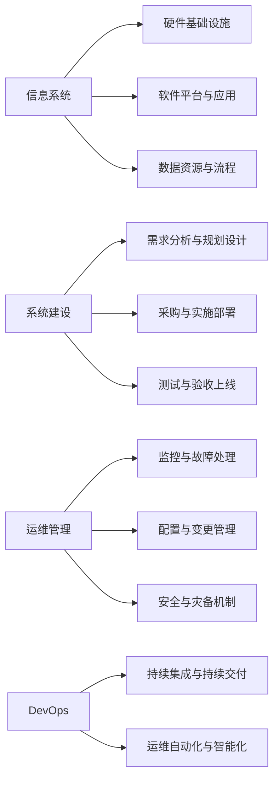

# 信息软硬件系统建设及运维管理

## 1.背景介绍

### 1.1 信息时代的软硬件系统
#### 1.1.1 信息技术的发展历程
#### 1.1.2 软硬件系统的重要性
#### 1.1.3 软硬件系统面临的挑战

### 1.2 系统建设与运维管理的必要性  
#### 1.2.1 保障系统稳定运行
#### 1.2.2 提高资源利用效率
#### 1.2.3 支撑业务发展需求

### 1.3 本文的主要内容和结构
#### 1.3.1 核心概念与联系
#### 1.3.2 关键技术原理与实践
#### 1.3.3 未来趋势与挑战展望

## 2.核心概念与联系

### 2.1 信息系统的构成要素
#### 2.1.1 硬件基础设施
#### 2.1.2 软件平台与应用
#### 2.1.3 数据资源与流程

### 2.2 系统建设的关键环节
#### 2.2.1 需求分析与规划设计
#### 2.2.2 采购与实施部署
#### 2.2.3 测试与验收上线

### 2.3 运维管理的主要内容
#### 2.3.1 监控与故障处理 
#### 2.3.2 配置与变更管理
#### 2.3.3 安全与灾备机制

### 2.4 DevOps理念与实践
#### 2.4.1 DevOps的内涵与价值
#### 2.4.2 持续集成与持续交付
#### 2.4.3 运维自动化与智能化



## 3.核心算法原理具体操作步骤

### 3.1 容量规划与评估
#### 3.1.1 容量指标与模型
#### 3.1.2 负载特征分析
#### 3.1.3 容量评估流程

### 3.2 自动化运维技术 
#### 3.2.1 配置管理工具
#### 3.2.2 自动化部署流程
#### 3.2.3 智能监控告警

### 3.3 AIOps智能运维
#### 3.3.1 海量运维数据处理
#### 3.3.2 机器学习异常检测
#### 3.3.3 智能决策优化调度

## 4.数学模型和公式详细讲解举例说明

### 4.1 排队论模型
#### 4.1.1 泊松到达过程
到达时间间隔 $T_n$ 服从参数为 $\lambda$ 的指数分布：

$$P(T_n \leq t) = 1 - e^{-\lambda t}, t \geq 0$$

#### 4.1.2 指数服务时间分布
服务时间 $S_n$ 服从参数为 $\mu$ 的指数分布：

$$P(S_n \leq t) = 1 - e^{-\mu t}, t \geq 0$$

#### 4.1.3 Little定律
在稳态条件下，系统中的平均客户数 $L$、到达率 $\lambda$ 和平均逗留时间 $W$ 满足：

$$L = \lambda W$$

### 4.2 可靠性模型
#### 4.2.1 串联系统可靠性
设系统由 $n$ 个部件串联而成，每个部件的可靠度为 $R_i$，则系统可靠度为：

$$R = \prod_{i=1}^n R_i$$

#### 4.2.2 并联系统可靠性
设系统由 $n$ 个部件并联而成，每个部件的可靠度为 $R_i$，则系统可靠度为：

$$R = 1 - \prod_{i=1}^n (1-R_i)$$

### 4.3 马尔可夫过程
#### 4.3.1 状态转移概率矩阵
对于离散时间马尔可夫链，从状态 $i$ 转移到状态 $j$ 的概率 $p_{ij}$ 构成转移概率矩阵 $\boldsymbol{P}$：

$$\boldsymbol{P} = 
\begin{bmatrix}
p_{11} & p_{12} & \cdots & p_{1n}\\
p_{21} & p_{22} & \cdots & p_{2n}\\
\vdots & \vdots & \ddots & \vdots\\
p_{n1} & p_{n2} & \cdots & p_{nn}
\end{bmatrix}
$$

#### 4.3.2 状态分布向量
设 $\boldsymbol{\pi}(t)$ 为时刻 $t$ 的状态分布向量，则有：

$$\boldsymbol{\pi}(t+1) = \boldsymbol{\pi}(t)\boldsymbol{P}$$

## 5.项目实践：代码实例和详细解释说明

### 5.1 自动化运维脚本
#### 5.1.1 Ansible playbook示例
```yaml
---
- hosts: webservers
  vars:
    http_port: 80
    max_clients: 200
  remote_user: root
  tasks:
  - name: ensure apache is at the latest version
    yum:
      name: httpd
      state: latest
  - name: write the apache config file
    template:
      src: /srv/httpd.j2
      dest: /etc/httpd.conf
    notify:
    - restart apache
  - name: ensure apache is running
    service:
      name: httpd
      state: started
  handlers:
    - name: restart apache
      service:
        name: httpd
        state: restarted
```

#### 5.1.2 脚本解释说明
- `hosts: webservers`：定义要管理的主机组为webservers
- `vars`：定义变量http_port为80，max_clients为200  
- `remote_user: root`：定义远程执行用户为root
- `tasks`：定义要执行的任务列表
  - 使用yum模块确保apache为最新版本
  - 使用template模块根据模板生成apache配置文件
  - 使用service模块确保apache服务已启动
- `handlers`：定义任务通知的处理器，用于重启apache服务

### 5.2 监控告警代码
#### 5.2.1 Zabbix监控项配置
```xml
<host>
  <name>Web Server</name>
  <groups>
    <group>
      <name>Linux servers</name>
    </group>
  </groups>
  <interfaces>
    <interface>
      <type>AGENT</type>
      <useip>YES</useip>
      <ip>192.168.1.10</ip>
      <dns></dns>
      <port>10050</port>
      <interface_ref>if1</interface_ref>
    </interface>
  </interfaces>
  <applications>
    <application>
      <name>Apache</name>
    </application>
  </applications>
  <items>
    <item>
      <name>Apache Status</name>
      <key>apache.status</key>
      <type>ZABBIX_ACTIVE</type>
      <value_type>FLOAT</value_type>
      <applications>
        <application>
          <name>Apache</name>
        </application>
      </applications>
    </item>
  </items>
  <triggers>
    <trigger>
      <expression>{Web Server:apache.status.last()}&lt;400</expression>
      <name>Apache is down on {HOST.NAME}</name>
      <priority>DISASTER</priority>
    </trigger>
  </triggers>
</host>
```

#### 5.2.2 配置解释说明
- `<host>`：定义一个要监控的主机
  - `<name>Web Server</name>`：主机名称为Web Server
  - `<groups>`：主机所属分组为Linux servers
  - `<interfaces>`：主机的网络接口配置
    - `<type>AGENT</type>`：使用Zabbix Agent方式监控
    - `<ip>192.168.1.10</ip>`：主机IP地址
    - `<port>10050</port>`：Agent端口号
  - `<applications>`：定义监控项所属应用集为Apache
  - `<items>`：定义监控项
    - `<name>Apache Status</name>`：监控项名称
    - `<key>apache.status</key>`：监控项键值
    - `<type>ZABBIX_ACTIVE</type>`：主动式监控
  - `<triggers>`：定义触发器
    - `<expression>`：触发器表达式，判断Apache状态码是否小于400
    - `<name>`：触发器名称
    - `<priority>DISASTER</priority>`：告警级别为灾难

## 6.实际应用场景

### 6.1 电商平台
#### 6.1.1 业务系统架构
#### 6.1.2 核心交易系统建设
#### 6.1.3 运维平台支撑

### 6.2 金融行业
#### 6.2.1 核心系统建设 
#### 6.2.2 监管合规要求
#### 6.2.3 灾备与业务连续性

### 6.3 智慧城市 
#### 6.3.1 政务服务平台
#### 6.3.2 大数据运营中心
#### 6.3.3 物联网设施管理

## 7.工具和资源推荐

### 7.1 基础架构即代码(IaC)
#### 7.1.1 Terraform
#### 7.1.2 AWS CloudFormation
#### 7.1.3 Pulumi

### 7.2 配置管理工具
#### 7.2.1 Ansible
#### 7.2.2 Puppet
#### 7.2.3 Chef

### 7.3 持续集成/持续交付(CI/CD)
#### 7.3.1 Jenkins
#### 7.3.2 GitLab CI
#### 7.3.3 Spinnaker

### 7.4 监控与日志分析
#### 7.4.1 Zabbix
#### 7.4.2 Prometheus
#### 7.4.3 ELK Stack

## 8.总结：未来发展趋势与挑战

### 8.1 云原生时代的到来
#### 8.1.1 微服务架构 
#### 8.1.2 容器化部署
#### 8.1.3 Serverless无服务器计算

### 8.2 AIOps的进一步发展
#### 8.2.1 大数据处理能力增强
#### 8.2.2 AI模型不断优化
#### 8.2.3 智能化运维决策

### 8.3 安全合规的新挑战
#### 8.3.1 数据隐私保护
#### 8.3.2 等保与监管要求 
#### 8.3.3 供应链安全风险

## 9.附录：常见问题与解答

### 9.1 如何进行需求分析和规划设计？
需求分析是系统建设的首要环节，需要充分了解业务发展需求，明确功能性和非功能性需求，合理规划系统架构和技术选型，制定详细的项目计划。

### 9.2 如何保障系统的高可用性？
系统高可用的关键在于架构设计和运维保障。架构上需要合理规划冗余和负载均衡，避免单点故障。运维上需要完善监控预警和故障处理机制，定期开展演练，不断优化。

### 9.3 如何实现自动化运维？
自动化运维的核心是将运维过程中的重复性工作固化为代码，通过工具实现自动化执行。主要涉及配置管理、自动化部署、智能监控等方面，需要选择合适的工具并不断积累优化。

### 9.4 如何应对系统安全风险？
系统安全需要从架构设计、开发、测试、部署、运维等各个环节入手，采取纵深防御策略。通过加固系统、安全审计、漏洞修复、访问控制、数据加密等手段，提高系统的整体安全性。

### 9.5 如何进行容量规划和评估？
容量规划需要根据业务发展预期，分析系统的负载特征，构建容量模型，评估资源需求。结合实际系统运行数据不断优化容量规划，及时扩容和优化，避免资源浪费和性能瓶颈。

作者：禅与计算机程序设计艺术 / Zen and the Art of Computer Programming