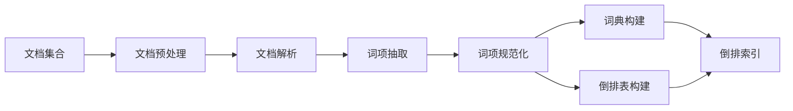

# 倒排索引 原理与代码实例讲解

## 1. 背景介绍

### 1.1 信息检索概述
#### 1.1.1 信息检索的定义
#### 1.1.2 信息检索的发展历程
#### 1.1.3 信息检索的应用场景

### 1.2 倒排索引的起源与发展
#### 1.2.1 倒排索引的起源
#### 1.2.2 倒排索引的发展历程
#### 1.2.3 倒排索引在信息检索中的地位

## 2. 核心概念与联系

### 2.1 正排索引与倒排索引
#### 2.1.1 正排索引的定义与特点
#### 2.1.2 倒排索引的定义与特点 
#### 2.1.3 正排索引与倒排索引的区别与联系

### 2.2 倒排索引的核心概念
#### 2.2.1 文档(Document)
#### 2.2.2 词项(Term)
#### 2.2.3 词典(Vocabulary)
#### 2.2.4 倒排表(Posting List)

### 2.3 倒排索引相关概念
#### 2.3.1 词频(Term Frequency)
#### 2.3.2 文档频率(Document Frequency)
#### 2.3.3 逆文档频率(Inverse Document Frequency)

## 3. 核心算法原理具体操作步骤

### 3.1 倒排索引的构建流程
#### 3.1.1 文档集合预处理
#### 3.1.2 文档解析与词项抽取
#### 3.1.3 词项规范化
#### 3.1.4 词典构建
#### 3.1.5 倒排表构建

### 3.2 倒排索引的查询流程 
#### 3.2.1 查询解析与词项提取
#### 3.2.2 词项查询
#### 3.2.3 文档排序
#### 3.2.4 查询结果返回

### 3.3 倒排索引的更新与删除
#### 3.3.1 新文档的添加
#### 3.3.2 文档的删除
#### 3.3.3 倒排表的更新



## 4. 数学模型和公式详细讲解举例说明

### 4.1 向量空间模型(Vector Space Model)
#### 4.1.1 文档向量
#### 4.1.2 查询向量
#### 4.1.3 相似度计算

文档$D_i$可表示为一个向量：

$$D_i=(w_{i1},w_{i2},...,w_{it})$$

其中，$w_{ij}$表示词项$t_j$在文档$D_i$中的权重。

查询$Q$也可表示为一个向量：

$$Q=(q_1,q_2,...,q_t)$$

文档$D_i$与查询$Q$的相似度可用余弦相似度计算：

$$sim(D_i,Q)=\frac{\sum_{j=1}^t w_{ij}q_j}{\sqrt{\sum_{j=1}^t w_{ij}^2} \sqrt{\sum_{j=1}^t q_j^2}}$$

### 4.2 BM25模型
#### 4.2.1 BM25模型原理
#### 4.2.2 BM25模型公式推导
#### 4.2.3 BM25模型参数调优

BM25是一种常用的文档排序算法，用于估计文档与查询的相关性。给定查询$Q$，文档$D$的BM25得分为：

$$score(D,Q)=\sum_{i=1}^n IDF(q_i) \cdot \frac{f(q_i,D) \cdot (k_1+1)}{f(q_i,D)+k_1 \cdot (1-b+b \cdot \frac{|D|}{avgdl})}$$

其中：
- $IDF(q_i)$是查询词$q_i$的逆文档频率
- $f(q_i,D)$是词$q_i$在文档$D$中的词频
- $|D|$是文档$D$的长度
- $avgdl$是文档集合的平均长度
- $k_1$和$b$是可调的参数

## 5. 项目实践：代码实例和详细解释说明

### 5.1 倒排索引构建代码实例
#### 5.1.1 文档解析与词项提取
#### 5.1.2 词项规范化
#### 5.1.3 词典构建
#### 5.1.4 倒排表构建

以Python为例，给出倒排索引构建的核心代码：

```python
import re

class InvertedIndex:
    def __init__(self):
        self.index = {}  # 倒排索引
        self.documents = {}  # 文档集合
        
    def add_document(self, doc_id, text):
        self.documents[doc_id] = text
        
        # 文档解析与词项提取
        terms = self.tokenize(text)
        
        # 词项规范化
        terms = self.normalize(terms)
        
        # 词典与倒排表构建
        for term in terms:
            if term not in self.index:
                self.index[term] = []
            self.index[term].append(doc_id)
            
    def tokenize(self, text):
        return re.findall(r'\w+', text.lower())
    
    def normalize(self, terms):
        return [term.lower() for term in terms]
```

### 5.2 倒排索引查询代码实例 
#### 5.2.1 查询解析与词项提取
#### 5.2.2 词项查询
#### 5.2.3 文档排序
#### 5.2.4 查询结果返回

以Python为例，给出倒排索引查询的核心代码：

```python
def search(self, query):
    # 查询解析与词项提取
    query_terms = self.tokenize(query)
    
    # 词项查询
    result = []
    for term in query_terms:
        if term in self.index:
            result.append(self.index[term])
            
    # 文档排序        
    doc_scores = {}
    for doc_lists in result:
        for doc_id in doc_lists:
            if doc_id not in doc_scores:
                doc_scores[doc_id] = 0
            doc_scores[doc_id] += 1
    
    sorted_docs = sorted(doc_scores.items(), key=lambda x: x[1], reverse=True)
    
    # 查询结果返回
    return [doc_id for doc_id, score in sorted_docs]
```

## 6. 实际应用场景

### 6.1 全文搜索引擎
#### 6.1.1 搜索引擎架构
#### 6.1.2 倒排索引在搜索引擎中的应用

### 6.2 推荐系统
#### 6.2.1 基于内容的推荐
#### 6.2.2 倒排索引在推荐系统中的应用

### 6.3 智能问答系统
#### 6.3.1 问答系统原理
#### 6.3.2 倒排索引在问答系统中的应用

## 7. 工具和资源推荐

### 7.1 开源搜索引擎
#### 7.1.1 Lucene
#### 7.1.2 Elasticsearch
#### 7.1.3 Solr

### 7.2 相关学习资源
#### 7.2.1 信息检索经典书籍
#### 7.2.2 倒排索引相关论文
#### 7.2.3 开源项目与教程

## 8. 总结：未来发展趋势与挑战

### 8.1 倒排索引的优化方向
#### 8.1.1 索引压缩
#### 8.1.2 动态索引
#### 8.1.3 分布式索引

### 8.2 语义检索的发展
#### 8.2.1 语义表示
#### 8.2.2 语义索引
#### 8.2.3 语义相关性计算

### 8.3 个性化搜索的挑战
#### 8.3.1 用户意图理解
#### 8.3.2 个性化排序
#### 8.3.3 隐私保护

## 9. 附录：常见问题与解答

### 9.1 倒排索引的存储方式
### 9.2 倒排索引的内存优化
### 9.3 倒排索引的实时更新策略
### 9.4 倒排索引的分布式扩展
### 9.5 倒排索引与机器学习的结合

作者：禅与计算机程序设计艺术 / Zen and the Art of Computer Programming