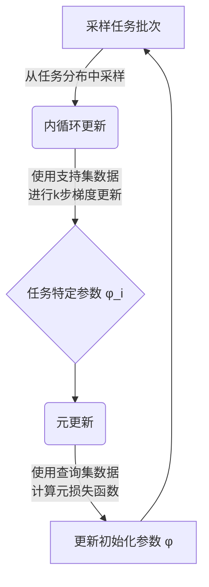
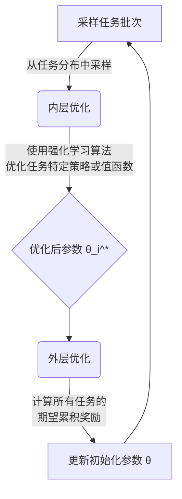

# 元强化学习(Meta-Reinforcement Learning) - 原理与代码实例讲解

## 1.背景介绍

### 1.1 强化学习的挑战

强化学习是机器学习的一个重要分支,旨在让智能体(Agent)通过与环境的交互来学习如何获取最大的累积奖励。然而,传统的强化学习算法在面对新的任务或环境时,往往需要从头开始学习,这种学习过程通常是缓慢和低效的。

### 1.2 元学习的概念

为了解决上述问题,元学习(Meta-Learning)应运而生。元学习的核心思想是利用过去任务的经验,从而加速新任务的学习过程。换句话说,它旨在学习"如何更好地学习"。

### 1.3 元强化学习的产生

元强化学习(Meta-Reinforcement Learning)正是将元学习的思想应用于强化学习领域。它的目标是设计一种通用的强化学习算法,能够快速适应新的任务和环境,从而提高学习效率和泛化能力。

## 2.核心概念与联系

### 2.1 元强化学习的形式化定义

在元强化学习中,我们将任务看作是一个马尔可夫决策过程(MDP),其中包含状态空间 $\mathcal{S}$、动作空间 $\mathcal{A}$、状态转移概率 $\mathcal{P}$ 和奖励函数 $\mathcal{R}$。我们的目标是找到一个策略 $\pi$,使得在任何给定的任务 $\mathcal{M} = \{\mathcal{S}, \mathcal{A}, \mathcal{P}, \mathcal{R}\}$ 下,智能体能够最大化其期望累积奖励:

$$
\max_{\pi} \mathbb{E}_{\tau \sim \pi, \mathcal{M}}\left[\sum_{t=0}^{T} \gamma^{t} r\left(s_{t}, a_{t}\right)\right]
$$

其中 $\tau = \left\{\left(s_{0}, a_{0}\right),\left(s_{1}, a_{1}\right), \ldots,\left(s_{T}, a_{T}\right)\right\}$ 表示一个由状态-动作对组成的轨迹序列, $\gamma \in [0,1]$ 是折现因子,用于平衡即时奖励和长期奖励的权重。

### 2.2 元强化学习与多任务学习的区别

元强化学习与多任务学习(Multi-Task Learning)有一定的相似之处,但也有明显的区别。多任务学习旨在同时解决多个相关任务,并利用任务之间的相关性来提高学习效率。而元强化学习则更关注如何从先前任务中获取元知识(Meta-Knowledge),以加速新任务的学习过程。

### 2.3 元强化学习的两个主要范式

目前,元强化学习主要分为两个范式:基于模型的方法(Model-Based Methods)和基于梯度的方法(Gradient-Based Methods)。

- **基于模型的方法**:这种方法通过学习一个可以快速适应新任务的模型,例如一个生成新策略的模型或者一个学习内部环境动力学的模型。
- **基于梯度的方法**:这种方法直接优化一个可以快速适应新任务的策略或者值函数,通常利用梯度下降等优化算法来实现。

## 3.核心算法原理具体操作步骤

在这一节,我们将详细介绍两种主要的元强化学习算法:基于模型的 MAML (Model-Agnostic Meta-Learning) 算法和基于梯度的 RL^2 算法。

### 3.1 MAML 算法

MAML 算法是一种基于模型的元强化学习算法,它旨在学习一个可以快速适应新任务的初始化参数。具体来说,MAML 算法包括以下步骤:

1. **采样任务批次**:从任务分布 $p(\mathcal{T})$ 中采样一个任务批次 $\mathcal{T}_i$。
2. **内循环更新**:对于每个任务 $\mathcal{T}_i$,使用支持集(Support Set)数据进行 $k$ 步梯度更新,得到任务特定的参数 $\phi_i$:

   $$
   \phi_i = \phi - \alpha \nabla_{\phi} \mathcal{L}_{\mathcal{T}_{i}}^{\text{tr}}(\phi)
   $$

   其中 $\alpha$ 是内循环的学习率, $\mathcal{L}_{\mathcal{T}_{i}}^{\text{tr}}$ 是任务 $\mathcal{T}_i$ 的训练损失函数。

3. **元更新**:使用查询集(Query Set)数据和任务特定的参数 $\phi_i$,计算元损失函数 $\mathcal{L}_{\mathcal{T}_{i}}^{\text{val}}(\phi_i)$,并对初始化参数 $\phi$ 进行元更新:

   $$
   \phi \leftarrow \phi - \beta \nabla_{\phi} \sum_{\mathcal{T}_{i} \sim p(\mathcal{T})} \mathcal{L}_{\mathcal{T}_{i}}^{\text{val}}(\phi_i)
   $$

   其中 $\beta$ 是元更新的学习率。

通过重复上述步骤,MAML 算法可以学习到一个良好的初始化参数 $\phi$,使得在新任务上只需要少量的梯度更新步骤,就能够获得良好的性能。

### 3.2 RL^2 算法

RL^2 算法是一种基于梯度的元强化学习算法,它直接优化一个可以快速适应新任务的策略或值函数。RL^2 算法的核心思想是将元学习过程建模为一个两层的强化学习问题:

1. **内层强化学习问题**:在每个任务 $\mathcal{T}_i$ 上,使用传统的强化学习算法(如 TRPO 或 PPO)来优化任务特定的策略 $\pi_{\theta_i}$ 或值函数 $V_{\theta_i}$,其中 $\theta_i$ 是任务特定的参数。
2. **外层强化学习问题**:通过最大化所有任务的期望累积奖励,来优化一个可以快速适应新任务的初始化参数 $\theta$。

具体来说,RL^2 算法包括以下步骤:

1. **采样任务批次**:从任务分布 $p(\mathcal{T})$ 中采样一个任务批次 $\mathcal{T}_i$。
2. **内层优化**:对于每个任务 $\mathcal{T}_i$,使用强化学习算法(如 TRPO 或 PPO)来优化任务特定的策略 $\pi_{\theta_i}$ 或值函数 $V_{\theta_i}$,得到优化后的参数 $\theta_i^*$。
3. **外层优化**:使用优化后的参数 $\theta_i^*$,计算所有任务的期望累积奖励 $J(\theta)$,并对初始化参数 $\theta$ 进行梯度更新:

   $$
   \theta \leftarrow \theta + \alpha \nabla_{\theta} J(\theta)
   $$

   其中 $\alpha$ 是外层优化的学习率, $J(\theta)$ 是所有任务的期望累积奖励之和。

通过重复上述步骤,RL^2 算法可以学习到一个良好的初始化参数 $\theta$,使得在新任务上只需要少量的内层优化步骤,就能够获得良好的策略或值函数。

## 4.数学模型和公式详细讲解举例说明

在这一节,我们将详细讲解元强化学习中的一些重要数学模型和公式,并给出具体的例子说明。

### 4.1 马尔可夫决策过程 (MDP)

马尔可夫决策过程(Markov Decision Process, MDP)是强化学习的基础数学模型。一个 MDP 可以用一个五元组 $(\mathcal{S}, \mathcal{A}, \mathcal{P}, \mathcal{R}, \gamma)$ 来表示,其中:

- $\mathcal{S}$ 是状态空间,表示环境中可能出现的所有状态。
- $\mathcal{A}$ 是动作空间,表示智能体可以执行的所有动作。
- $\mathcal{P}$ 是状态转移概率函数,定义了在执行动作 $a$ 时,从状态 $s$ 转移到状态 $s'$ 的概率 $\mathcal{P}(s'|s, a)$。
- $\mathcal{R}$ 是奖励函数,定义了在状态 $s$ 执行动作 $a$ 后获得的即时奖励 $\mathcal{R}(s, a)$。
- $\gamma \in [0, 1]$ 是折现因子,用于平衡即时奖励和长期奖励的权重。

在元强化学习中,我们将每个任务看作是一个独立的 MDP,目标是找到一个策略 $\pi$,使得在任何给定的 MDP 下,智能体能够最大化其期望累积奖励:

$$
\max_{\pi} \mathbb{E}_{\tau \sim \pi, \mathcal{M}}\left[\sum_{t=0}^{T} \gamma^{t} r\left(s_{t}, a_{t}\right)\right]
$$

其中 $\tau = \left\{\left(s_{0}, a_{0}\right),\left(s_{1}, a_{1}\right), \ldots,\left(s_{T}, a_{T}\right)\right\}$ 表示一个由状态-动作对组成的轨迹序列。

**示例**:考虑一个简单的网格世界(Grid World)环境,其中智能体需要从起点移动到终点。在这个环境中,状态空间 $\mathcal{S}$ 是所有可能的网格位置,动作空间 $\mathcal{A}$ 是 {上, 下, 左, 右} 四个移动方向。状态转移概率函数 $\mathcal{P}$ 定义了在执行某个动作后,智能体移动到相邻网格的概率。奖励函数 $\mathcal{R}$ 可以设置为到达终点时获得正奖励,其他情况获得零奖励或者负奖励(如果撞墙)。折现因子 $\gamma$ 控制了智能体是否更偏好即时奖励还是长期奖励。

### 4.2 策略梯度定理 (Policy Gradient Theorem)

策略梯度定理是强化学习中一个非常重要的理论基础,它为直接优化策略参数提供了理论依据。具体来说,策略梯度定理给出了期望累积奖励相对于策略参数的梯度:

$$
\nabla_{\theta} J(\theta)=\mathbb{E}_{\tau \sim \pi_{\theta}}\left[\sum_{t=0}^{T} \nabla_{\theta} \log \pi_{\theta}\left(a_{t} | s_{t}\right) Q^{\pi}\left(s_{t}, a_{t}\right)\right]
$$

其中 $J(\theta)$ 是期望累积奖励, $\pi_{\theta}$ 是参数化的策略, $Q^{\pi}(s, a)$ 是在策略 $\pi$ 下,从状态 $s$ 执行动作 $a$ 后的期望累积奖励。

策略梯度定理为我们提供了一种直接优化策略参数的方法,即通过梯度上升来最大化期望累积奖励。这种方法被广泛应用于许多强化学习算法中,如 REINFORCE、TRPO 和 PPO 等。

**示例**:假设我们有一个简单的环境,智能体需要决定是否采取某个动作。我们使用一个二元逻辑回归模型来参数化策略 $\pi_{\theta}(a|s) = \sigma(\theta^{\top} \phi(s))$,其中 $\sigma$ 是 Sigmoid 函数, $\phi(s)$ 是状态特征向量。根据策略梯度定理,我们可以计算期望累积奖励相对于策略参数 $\theta$ 的梯度:

$$
\nabla