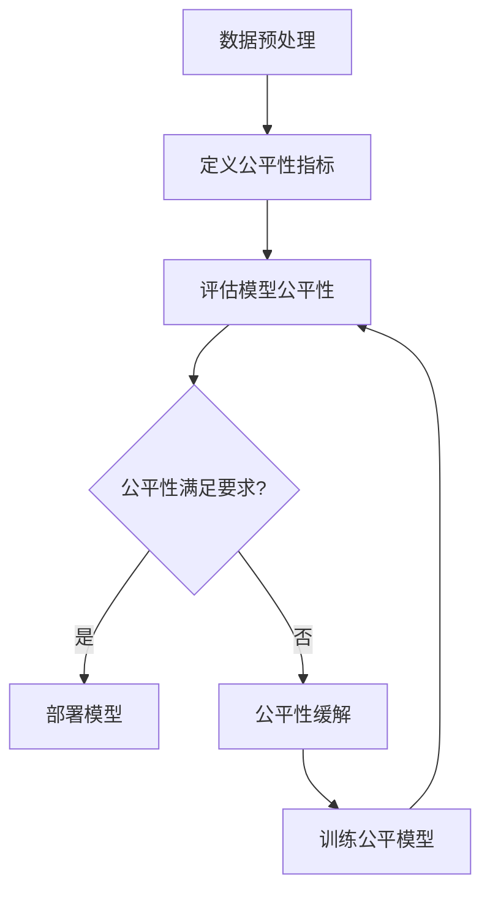

# 公平性在机器学习中的评价指标

## 1. 背景介绍

在当今的数据驱动时代,机器学习系统被广泛应用于各个领域,如信贷审批、招聘、医疗诊断等。然而,由于训练数据中存在的偏差和系统性偏见,这些系统可能会对某些群体产生不公平的结果。因此,评估和提高机器学习模型的公平性变得越来越重要。

公平性是一个复杂的概念,需要从多个角度来定义和衡量。一个公平的机器学习系统应该能够对所有个人和群体做出公正和无偏的决策,不受种族、性别、年龄等因素的影响。然而,在现实世界中,由于数据和模型的局限性,完全消除偏见并达到绝对公平是一个巨大的挑战。

### 1.1 为什么公平性很重要?

公平性对于建立一个公正、包容的社会至关重要。如果机器学习系统存在偏见,它可能会加剧现有的不平等,剥夺某些群体的机会,并造成严重的社会后果。例如,如果一个招聘系统对某些种族群体存在偏见,那么这些群体就可能被系统性地排除在就业机会之外,从而加剧社会不平等。

此外,公平性也是确保机器学习系统可靠性和可信度的关键因素。如果一个系统被认为是不公平的,那么人们就可能失去对该系统的信任,从而降低其实用性和采用率。

### 1.2 公平性的挑战

实现公平性面临着许多挑战,包括:

1. **定义公平性**:公平性是一个复杂的概念,不同的利益相关者可能对公平性有不同的定义和期望。
2. **数据偏差**:训练数据中存在的偏差可能会导致模型继承和放大这些偏差。
3. **多重敏感属性**:现实世界中,个体通常属于多个受保护群体,需要考虑多个敏感属性之间的相互作用。
4. **公平性与其他目标的权衡**:在某些情况下,提高公平性可能会牺牲模型的准确性或其他性能指标。

## 2. 核心概念与联系

评估机器学习系统的公平性需要定义一些核心概念和指标。以下是一些常用的公平性概念:

### 2.1 群体公平性 (Group Fairness)

群体公平性要求不同的人口统计群体在模型的预测结果上具有相似的统计特性。常见的群体公平性指标包括:

1. **统计率公平性 (Statistical Parity)**: 要求不同群体的正例率(或负例率)相等。
2. **等机会 (Equal Opportunity)**: 要求具有相同结果(正例或负例)的不同群体具有相同的真正例率。
3. **条件统计率公平性 (Conditional Statistical Parity)**: 在给定合法的非敏感属性条件下,要求不同群体的正例率(或负例率)相等。

### 2.2 个体公平性 (Individual Fairness)

个体公平性关注的是相似的个体应该得到相似的预测结果,而不是基于群体统计量。常见的个体公平性指标包括:

1. **反事实公平性 (Counterfactual Fairness)**: 如果一个个体的敏感属性发生变化,而其他属性保持不变,则预测结果不应该发生变化。
2. **因果公平性 (Causal Fairness)**: 基于因果模型,要求预测结果只依赖于非敏感的因果父节点,而不受敏感属性的影响。

### 2.3 其他公平性概念

除了上述概念外,还有一些其他重要的公平性概念,如:

1. **公平表示 (Fair Representation)**: 在模型的中间层次(如嵌入空间)上实现公平性。
2. **公平机会 (Fair Chance)**: 确保不同群体在获得机会(如被录用)方面具有相同的机会。
3. **公平风险 (Fair Risk)**: 确保不同群体承担的风险(如被拒绝贷款)相同。

这些概念之间存在一定的联系和权衡,需要根据具体的应用场景和需求来选择合适的公平性定义和评价指标。

## 3. 核心算法原理具体操作步骤

评估和提高机器学习系统的公平性需要遵循一些核心算法原理和具体操作步骤。以下是一个典型的流程:



### 3.1 数据预处理

1. **识别敏感属性**: 确定可能导致偏见的敏感属性,如种族、性别、年龄等。
2. **处理缺失值**: 使用适当的方法(如删除、插值等)处理数据集中的缺失值。
3. **特征工程**: 根据领域知识选择合适的特征,并进行必要的特征转换和编码。
4. **数据分割**: 将数据集分割为训练集、验证集和测试集,以评估模型的泛化能力和公平性。

### 3.2 定义公平性指标

根据应用场景和需求,选择合适的公平性定义和评价指标。常见的指标包括统计率公平性、等机会、反事实公平性等。

### 3.3 评估模型公平性

1. **训练基线模型**: 使用标准的机器学习算法(如逻辑回归、决策树等)在训练集上训练一个基线模型。
2. **计算公平性指标**: 在测试集上计算所选择的公平性指标,评估模型的公平性表现。
3. **可视化分析**: 使用各种可视化技术(如条形图、散点图等)分析模型在不同群体上的表现差异。

### 3.4 公平性缓解

如果模型的公平性不满足要求,需要采取一些缓解措施来提高公平性,常见的方法包括:

1. **预处理**: 在训练数据上进行重新采样、重新加权或其他形式的数据转换,以减少偏差。
2. **在训练过程中处理**: 修改损失函数或约束条件,使模型在优化过程中考虑公平性。
3. **后处理**: 在模型预测之后,对结果进行校正或转换,以提高公平性。

### 3.5 训练公平模型

采用选定的公平性缓解方法,在训练集上训练一个新的公平模型。然后重复评估公平性的步骤,直到满足要求为止。

### 3.6 部署模型

如果公平性满足要求,就可以将模型部署到生产环境中使用。但是,需要持续监控模型的表现,因为数据分布的变化可能会影响模型的公平性。

## 4. 数学模型和公式详细讲解举例说明

在评估和提高机器学习模型的公平性时,我们需要使用一些数学模型和公式来量化和优化公平性指标。以下是一些常见的数学模型和公式,以及它们的详细讲解和举例说明。

### 4.1 统计率公平性 (Statistical Parity)

统计率公平性要求不同群体的正例率(或负例率)相等。数学上,我们可以定义如下:

$$P(Y=1|A=0) = P(Y=1|A=1)$$

其中 $Y$ 是模型的预测输出(二元值),而 $A$ 是敏感属性(如种族或性别)。

例如,在一个贷款审批系统中,如果我们将种族作为敏感属性,那么统计率公平性要求不同种族群体获得贷款批准的概率相等。

然而,统计率公平性的缺点是它可能会牺牲模型的准确性,因为它忽略了非敏感属性(如收入、信用评分等)对结果的影响。

### 4.2 等机会 (Equal Opportunity)

等机会要求具有相同结果(正例或负例)的不同群体具有相同的真正例率。数学上,我们可以定义如下:

$$P(Y=1|A=0,Y^*=1) = P(Y=1|A=1,Y^*=1)$$

其中 $Y^*$ 是真实的结果值。

在贷款审批系统的例子中,等机会要求对于那些真实应该获得贷款批准的申请人,不同种族群体获得批准的概率相等。

等机会相对于统计率公平性而言,它考虑了非敏感属性对结果的影响,因此可能会更加合理。

### 4.3 反事实公平性 (Counterfactual Fairness)

反事实公平性基于因果推理的概念,要求如果一个个体的敏感属性发生变化,而其他属性保持不变,则预测结果不应该发生变化。数学上,我们可以定义如下:

$$P(Y=y|X,A=0) = P(Y=y|X,A=1)$$

其中 $X$ 表示非敏感属性,而 $A$ 是敏感属性。

在实践中,我们可以使用因果模型或基于规则的方法来近似计算反事实公平性。

### 4.4 公平风险 (Fair Risk)

公平风险要求不同群体承担的风险(如被拒绝贷款)相同。数学上,我们可以定义如下:

$$P(Y=0|A=0,Y^*=1) = P(Y=0|A=1,Y^*=1)$$

在贷款审批系统的例子中,公平风险要求对于那些真实应该获得贷款批准的申请人,不同种族群体被拒绝的概率相等。

### 4.5 其他公式

除了上述公式外,还有一些其他常用的公平性相关公式,如:

- **准确率平等 (Accuracy Equality)**: $|P(Y=Y^*|A=0) - P(Y=Y^*|A=1)| \leq \epsilon$
- **条件统计率公平性 (Conditional Statistical Parity)**: $P(Y=1|X,A=0) = P(Y=1|X,A=1)$
- **平均绝对公平性 (Average Absolute Fairness)**: $\mathbb{E}_{X}[|P(Y=1|X,A=0) - P(Y=1|X,A=1)|]$

这些公式可以用于定义和评估不同类型的公平性指标,并作为机器学习模型优化的目标函数或约束条件。

## 5. 项目实践:代码实例和详细解释说明

为了更好地理解公平性评估和缓解的过程,我们将通过一个实际的代码示例来演示。在这个示例中,我们将使用 Python 中的 AIF360 库(AI Fairness 360,由 IBM 开发)来评估和提高一个信用评分模型的公平性。

### 5.1 导入必要的库

```python
import numpy as np
import pandas as pd
from aif360.datasets import BinaryLabelDataset
from aif360.metrics import ClassificationMetric
from aif360.algorithms.preprocessing import Reweighing
from aif360.algorithms.inprocessing import PrejudiceRemover
```

### 5.2 加载数据集

我们将使用 AIF360 提供的一个示例数据集,它模拟了一个信用评分场景。在这个数据集中,我们将使用 `race` 作为敏感属性。

```python
dataset_orig = BinaryLabelDataset(
    df=pd.read_csv("data/credit.csv"),
    label_names=["credit"],
    protected_attribute_names=["race"]
)
```

### 5.3 评估基线模型的公平性

我们首先训练一个基线逻辑回归模型,并使用 AIF360 提供的指标来评估其公平性。

```python
privileged_groups = [{'race': 1}]
unprivileged_groups = [{'race': 0}]

metric_orig = ClassificationMetric(
    dataset_orig,
    unprivileged_groups=unprivileged_groups,
    privileged_groups=privileged_groups
)

metric_orig.show_metrics()
```

输出结果显示,基线模型在统计率公平性和等机会方面存在一定的偏差。

### 5.4 使用重新加权进行公平性缓解

为了提高模型的公平性,我们将使用 Reweighing 算法对训练数据进行重新加权。

```python
rw = Reweighing(unprivileged_groups=unprivileged_groups,
                privileged_groups=privileged_groups)
dataset_rw = rw.fit_transform(dataset_orig)

metric_rw = ClassificationMetric(dataset_rw,
                                 unprivileged_groups=unprivile