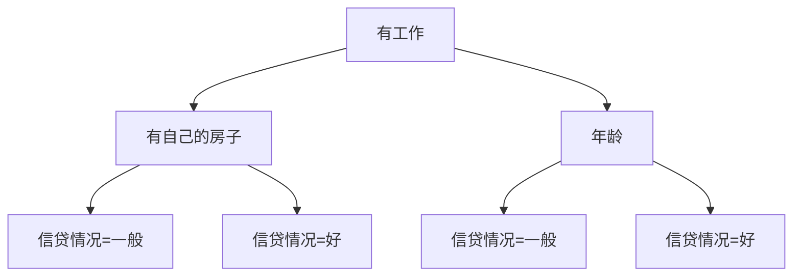

# 决策树 (Decision Trees) 原理与代码实例讲解

## 1.背景介绍

决策树是一种常用的机器学习算法,被广泛应用于数据挖掘、机器学习和模式识别等领域。它是一种监督学习算法,可以用于解决回归和分类问题。决策树模型的形式是一种树形结构,每个内部节点表示对输入数据的一个特征进行测试,每个分支代表该测试的一种结果,而每个叶节点则对应一个类别或数值。

决策树易于理解和解释,可以处理数值型和类别型数据,并且能够很好地处理缺失值。此外,决策树还具有鲁棒性强、计算速度快等优点。但同时也存在过拟合的风险,因此需要对其进行剪枝等操作来控制模型的复杂度。

## 2.核心概念与联系

### 2.1 信息增益(Information Gain)

信息增益是决策树算法中最核心的概念之一。它描述了在获取某一特征信息后,对数据集的无序程度的减少情况。信息增益越大,意味着该特征对于数据集的无序程度的减少就越大,也就越应该选择该特征作为决策树的节点。

信息增益的计算公式如下:

$$Gain(D,a) = Ent(D) - \sum_{v=1}^{V}\frac{|D^v|}{|D|}Ent(D^v)$$

其中:
- $D$是当前数据集
- $a$是某一特征
- $V$是特征$a$的所有可能取值
- $D^v$是在$D$中特征$a$取值为$v$的数据子集
- $Ent(D)$是数据集$D$的信息熵,用于描述数据集的无序程度

信息熵的计算公式为:

$$Ent(D) = -\sum_{i=1}^{m}p_ilog_2p_i$$

其中$m$是类别数量,$p_i$是第$i$类的概率。

### 2.2 决策树生成算法

决策树的生成算法主要包括以下几个步骤:

1. 从根节点开始,对每个节点的每个可能特征计算信息增益,选择信息增益最大的特征作为该节点的分裂特征。
2. 根据该特征的不同取值将数据集分割成若干子集。
3. 对于每个子集,重复上述过程,构建决策树。
4. 当数据集中实例属于同一类别或满足其他停止条件时,将该节点标记为叶节点。

常见的决策树生成算法有ID3、C4.5和CART等。

### 2.3 剪枝(Pruning)

为了防止决策树过拟合训练数据,需要进行剪枝操作。主要有以下两种剪枝策略:

1. 预剪枝(Pre-pruning):在生成决策树的过程中,根据某些准则阻止某些分支的生长。
2. 后剪枝(Post-pruning):先生成一棵完整的决策树,然后根据某些准则去掉一些分支或节点。

## 3.核心算法原理具体操作步骤

以下是基于ID3算法构建决策树的具体步骤:

1. 从根节点开始
2. 对于当前节点,计算每个特征的信息增益,选择信息增益最大的特征作为分裂特征
3. 根据该特征的不同取值将数据集分割成若干子集
4. 对于每个子集,递归构建子树
5. 当数据集中实例属于同一类别或满足其他停止条件时,将该节点标记为叶节点

该算法的伪代码如下:

```
函数 ID3(数据集D, 特征集A) 返回 决策树:
    创建根节点root
    if D中所有实例属于同一类别C:
        将root标记为单节点树，返回root
    if A为空或D中实例在A上取值相同:
        将root标记为叶节点，类别为D中实例数最多的类别，返回root
    
    计算每个特征a的信息增益Gain(D,a)
    选择信息增益最大的特征a_max
    将a_max设为root的节点特征
    for a_max的每个值v:
        将D中a_max=v的实例加入子节点
        递归调用ID3构建子树，将返回的子树作为根节点的子节点
    返回root
```

该算法的时间复杂度为$O(n*m*log_2m)$,其中$n$是特征数量,$m$是实例数量。

## 4.数学模型和公式详细讲解举例说明

### 4.1 信息增益计算示例

假设有如下训练数据集:

| 年龄 | 有工作 | 有自己的房子 | 信贷情况 |
|------|--------|---------------|----------|
| 青年 | 否     | 否            | 一般     |
| 青年 | 否     | 否            | 好       |
| 中年 | 是     | 否            | 好       |
| 中年 | 是     | 是            | 一般     |
| 老年 | 否     | 是            | 一般     |
| 老年 | 否     | 是            | 好       |

现在计算"年龄"这一特征的信息增益:

1. 计算数据集D的信息熵:

   $$\begin{aligned}
   Ent(D) &= -\frac{3}{6}log_2\frac{3}{6}-\frac{3}{6}log_2\frac{3}{6}\\
          &= 1
   \end{aligned}$$

2. 计算"年龄"的各个值对应的数据子集的信息熵:

   青年:
   $$\begin{aligned}
   Ent(D^{青年}) &= -\frac{1}{2}log_2\frac{1}{2}-\frac{1}{2}log_2\frac{1}{2}\\
                &= 1
   \end{aligned}$$

   中年:
   $$\begin{aligned}  
   Ent(D^{中年}) &= -\frac{1}{2}log_2\frac{1}{2}-\frac{1}{2}log_2\frac{1}{2}\\
                &= 1
   \end{aligned}$$

   老年:
   $$\begin{aligned}
   Ent(D^{老年}) &= -\frac{1}{2}log_2\frac{1}{2}-\frac{1}{2}log_2\frac{1}{2}\\
                &= 1
   \end{aligned}$$

3. 计算"年龄"的信息增益:

   $$\begin{aligned}
   Gain(D,年龄) &= Ent(D) - \sum_{v}\frac{|D^v|}{|D|}Ent(D^v)\\
                &= 1 - \frac{2}{6}*1 - \frac{2}{6}*1 - \frac{2}{6}*1\\
                &= 0
   \end{aligned}$$

可见,在该数据集上,"年龄"这一特征的信息增益为0,说明它并不是很好的用于分类的特征。

### 4.2 决策树生成示例

以上述训练数据为例,构建一个决策树:

1. 计算每个特征的信息增益,选择增益最大的特征作为根节点。假设"有工作"的增益最大。
2. 根据"有工作"的取值将数据集分割为两个子集:

   有工作=是:
   
   | 年龄 | 有工作 | 有自己的房子 | 信贷情况 |
   |------|--------|---------------|----------|
   | 中年 | 是     | 否            | 好       |
   | 中年 | 是     | 是            | 一般     |

   有工作=否:

   | 年龄 | 有工作 | 有自己的房子 | 信贷情况 |
   |------|--------|---------------|----------|
   | 青年 | 否     | 否            | 一般     |
   | 青年 | 否     | 否            | 好       | 
   | 老年 | 否     | 是            | 一般     |
   | 老年 | 否     | 是            | 好       |

3. 对于"有工作=是"的子集,再选择最优特征继续分裂,假设是"有自己的房子"。则生成两个子节点。
4. 对于"有工作=否"的子集,再选择最优特征继续分裂,假设是"年龄"。则生成两个子节点。
5. 重复上述过程,直到满足停止条件。

最终生成的决策树可能如下所示:



## 5.项目实践:代码实例和详细解释说明

以下是使用Python和scikit-learn库实现决策树算法的代码示例:

```python
from sklearn.tree import DecisionTreeClassifier
from sklearn.datasets import load_iris
from sklearn.model_selection import train_test_split
from sklearn.metrics import accuracy_score
import matplotlib.pyplot as plt

# 加载鸢尾花数据集
iris = load_iris()
X = iris.data
y = iris.target

# 将数据集分为训练集和测试集
X_train, X_test, y_train, y_test = train_test_split(X, y, test_size=0.3, random_state=42)

# 创建决策树分类器
clf = DecisionTreeClassifier(criterion='entropy', max_depth=3)

# 训练模型
clf.fit(X_train, y_train)

# 在测试集上评估模型
y_pred = clf.predict(X_test)
accuracy = accuracy_score(y_test, y_pred)
print(f"Accuracy: {accuracy:.2f}")

# 可视化决策树
plt.figure(figsize=(10, 8))
plot_tree = plt.subplot()
iris.feature_names = ['Sepal Length', 'Sepal Width', 'Petal Length', 'Petal Width']
plot_tree = tree.plot_tree(clf, feature_names=iris.feature_names, filled=True)
```

代码解释:

1. 首先导入必要的库和加载鸢尾花数据集。
2. 将数据集分为训练集和测试集。
3. 创建一个决策树分类器对象,指定使用信息增益作为分裂准则,最大树深为3。
4. 使用`fit()`方法在训练集上训练模型。
5. 在测试集上评估模型的准确性。
6. 使用`matplotlib`库可视化决策树。

该示例使用鸢尾花数据集训练了一个决策树分类器,并在测试集上评估了其准确性。同时,它还提供了可视化决策树的功能,有助于理解模型的内部结构。

## 6.实际应用场景

决策树算法可以应用于各种领域,包括但不限于:

- **信用风险评估**: 银行和金融机构可以使用决策树来评估贷款申请人的信用风险,从而做出是否批准贷款的决策。
- **医疗诊断**: 决策树可以根据病人的症状和体征数据,帮助医生进行疾病诊断和治疗方案选择。
- **营销策略制定**: 企业可以利用决策树分析客户的购买行为,从而制定有针对性的营销策略。
- **欺诈检测**: 决策树可用于检测信用卡欺诈、网络入侵等欺诈行为。
- **图像识别**: 决策树在图像分类、目标检测等计算机视觉任务中也有应用。

总的来说,决策树算法适用于需要根据一些特征对实例进行分类或回归预测的场景。

## 7.工具和资源推荐

以下是一些与决策树算法相关的工具和资源:

- **scikit-learn**: Python中流行的机器学习库,提供了决策树算法的实现。
- **XGBoost**: 一种高效的分布式梯度提升库,可用于构建决策树集成模型。
- **LightGBM**: 另一种高性能的梯度提升决策树框架。
- **Weka**: 一个集成了多种机器学习算法的工具,包括决策树。
- **R**: 统计计算语言,提供了`rpart`、`party`等决策树包。
- **《决策树算法:原理及其应用》**:一本专门介绍决策树算法的书籍。
- **《机器学习实战》**:一本实用的机器学习入门书籍,其中包含决策树算法的介绍和实现。

## 8.总结:未来发展趋势与挑战

决策树算法在过去几十年中得到了广泛的研究和应用,但仍然存在一些需要解决的挑战:

1. **过拟合问题**: 决策树容易过拟合训练数据,因此需要采用剪枝等技术来控制模型复杂度。
2. **数据不平衡问题**: 当训练数据中某些类别的实