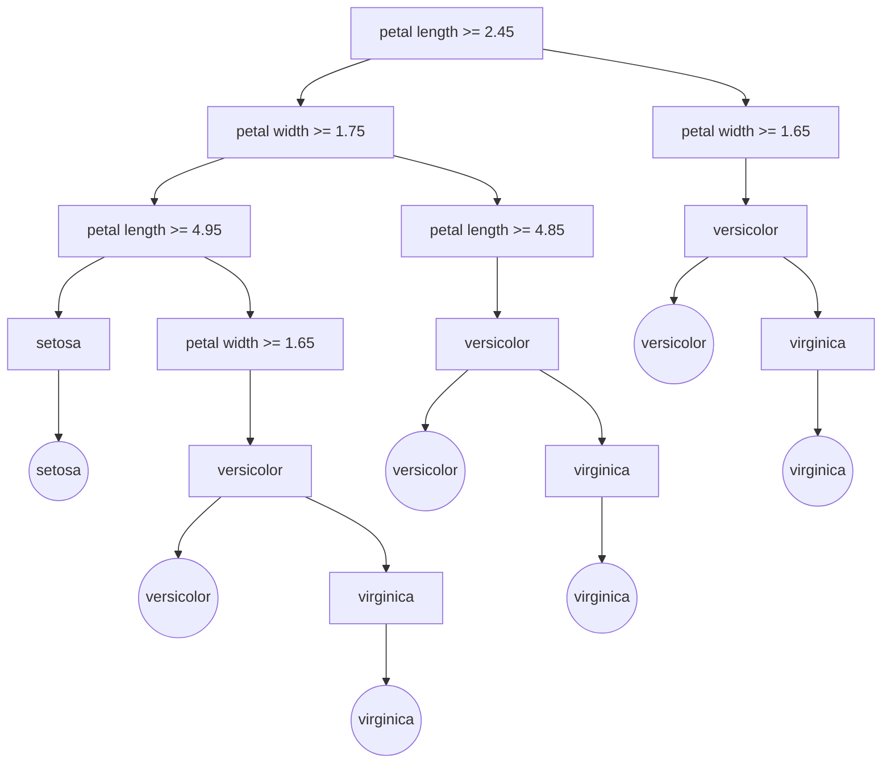

# 决策树和工作流：AI 代理如何进行决策分析

## 1.背景介绍

在当今快节奏的商业环境中,企业需要快速做出明智的决策来保持竞争优势。随着数据的激增和决策复杂性的提高,人工智能(AI)技术正在成为支持决策过程的重要工具。其中,决策树和工作流是两种常用的AI决策分析方法。

决策树是一种监督学习算法,通过构建决策模型来预测结果。它以树状结构表示决策过程,每个内部节点代表一个特征,每个分支代表该特征的一个值,而叶节点则代表预测的结果。决策树易于理解和解释,广泛应用于分类、回归和决策分析等领域。

工作流则是一种自动化业务流程的方法。它将复杂的任务分解为一系列有序的步骤,并指定每个步骤的执行条件和规则。工作流可以提高效率、减少错误,并确保业务流程的一致性和可追溯性。

将决策树与工作流相结合,可以创建智能决策系统,帮助企业做出更好的决策。本文将探讨AI代理如何利用决策树和工作流进行决策分析,并提供实用的技术见解和最佳实践。

## 2.核心概念与联系

### 2.1 决策树

决策树是一种基于树状结构的监督学习算法,用于解决分类和回归问题。它通过递归地将数据集划分为较小的子集,构建出一个决策模型。

决策树的核心概念包括:

- **节点(Node)**: 树中的每个元素,包括根节点、内部节点和叶节点。
- **根节点(Root Node)**: 树的起始点,整个决策过程从这里开始。
- **内部节点(Internal Node)**: 对应于一个特征,根据该特征的值将数据集划分为子集。
- **叶节点(Leaf Node)**: 代表最终的决策或预测结果。
- **分支(Branch)**: 连接节点的边,表示特征取值的不同路径。
- **深度(Depth)**: 从根节点到叶节点的最长路径长度。
- **信息增益(Information Gain)**: 用于选择最优特征进行数据划分的指标,通常使用熵或基尼指数计算。

### 2.2 工作流

工作流是一种自动化和优化业务流程的方法,将复杂的任务分解为一系列有序的步骤。

工作流的核心概念包括:

- **流程(Process)**: 一系列相关的活动或任务,旨在实现特定的业务目标。
- **活动(Activity)**: 流程中的单个步骤或任务。
- **控制流(Control Flow)**: 定义活动的执行顺序和条件。
- **数据流(Data Flow)**: 描述活动之间的数据传递和依赖关系。
- **角色(Role)**: 执行特定活动的参与者或系统。
- **事件(Event)**: 触发流程实例或活动执行的条件。
- **网关(Gateway)**: 控制流程的分支、合并和决策点。

### 2.3 决策树与工作流的联系

决策树和工作流可以相互补充,共同构建智能决策系统。

- 决策树可以作为工作流中的决策节点,根据输入数据做出决策,确定下一步执行的活动。
- 工作流可以将决策树的预测结果作为输入,执行相应的业务流程。
- 决策树可以从历史工作流数据中学习,提高决策准确性。
- 工作流可以收集和整理数据,为决策树提供高质量的训练数据。

通过将决策树与工作流相结合,AI 代理可以更好地理解和优化复杂的决策过程,提高决策质量和业务效率。

## 3.核心算法原理具体操作步骤

### 3.1 决策树算法

决策树算法通过递归地构建决策模型来解决分类或回归问题。主要步骤如下:

1. **准备数据集**: 收集并预处理训练数据,确保数据质量。

2. **计算信息增益**: 对于每个特征,计算其信息增益或其他指标,评估该特征对数据集的分类或回归能力。

3. **选择最优特征**: 选择信息增益最大的特征作为当前节点。

4. **创建决策节点**: 根据选定的特征,创建决策节点并生成分支。

5. **划分子集**: 将数据集按照特征值划分为子集。

6. **构建子树**: 对每个子集递归调用算法,生成子树。

7. **生成叶节点**: 当子集无法再划分或满足停止条件时,生成叶节点并赋予决策值。

8. **树的修剪**: 根据验证数据的表现,修剪决策树以防止过拟合。

常用的决策树算法包括 ID3、C4.5、CART 等。这些算法在特征选择、树的生长和修剪等方面有所不同,但总体流程类似。

### 3.2 工作流执行

工作流的执行过程通常由工作流引擎管理,主要步骤如下:

1. **定义流程**: 使用工作流建模语言(如 BPMN)定义流程模型,包括活动、控制流、数据流等元素。

2. **部署流程**: 将流程模型部署到工作流引擎中。

3. **启动实例**: 根据特定的事件或条件,启动一个新的流程实例。

4. **执行活动**: 按照控制流的顺序,执行各个活动。活动可以由人工执行,也可以由系统自动执行。

5. **决策网关**: 在遇到决策网关时,根据条件或规则,选择合适的分支继续执行。

6. **数据传递**: 活动之间按照数据流进行数据传递和共享。

7. **监控和管理**: 实时监控流程执行状态,并根据需要进行干预或优化。

8. **结束实例**: 当所有活动完成或满足结束条件时,流程实例结束。

工作流引擎通常提供图形化界面、日志记录、错误处理等功能,以支持工作流的设计、执行和监控。

## 4.数学模型和公式详细讲解举例说明

### 4.1 决策树中的信息增益

在决策树算法中,信息增益是一个重要的指标,用于评估特征对数据集的分类或回归能力。它基于信息论中的熵(Entropy)概念,衡量了特征对数据集的"纯度"的影响。

对于一个包含 k 个类别的数据集 D,其熵定义为:

$$H(D) = -\sum_{i=1}^{k} p_i \log_2 p_i$$

其中 $p_i$ 表示数据集中第 i 个类别的概率。熵越高,数据集的混乱程度越大。

假设我们根据特征 A 将数据集 D 划分为 n 个子集 $D_1, D_2, \dots, D_n$,则划分后的熵为:

$$H(D|A) = \sum_{j=1}^{n} \frac{|D_j|}{|D|} H(D_j)$$

其中 $|D_j|$ 和 $|D|$ 分别表示子集 $D_j$ 和数据集 D 的大小。

特征 A 对数据集 D 的信息增益定义为:

$$\text{Gain}(D, A) = H(D) - H(D|A)$$

信息增益越大,说明特征 A 对数据集的分类或回归能力越强。因此,我们可以选择信息增益最大的特征作为决策节点。

### 4.2 决策树剪枝

决策树在训练过程中可能会过拟合,导致模型在训练数据上表现良好,但在测试数据上表现不佳。为了防止过拟合,我们需要对决策树进行剪枝(Pruning)。

常用的剪枝方法包括预剪枝(Pre-pruning)和后剪枝(Post-pruning)。

**预剪枝**是在构建决策树的过程中就停止生长某些分支,以防止过拟合。常用的预剪枝方法包括:

- 设置最小节点大小: 当节点的数据量小于指定阈值时,停止生长该节点。
- 设置最大树深度: 限制决策树的最大深度,防止过度生长。
- 设置信息增益阈值: 当特征的信息增益小于指定阈值时,停止使用该特征进行划分。

**后剪枝**是先构建一棵完整的决策树,然后根据验证数据的表现,移除一些分支或节点。常用的后剪枝方法包括:

- 代价复杂度剪枝(Cost Complexity Pruning): 通过最小化一个代价函数来决定哪些节点应该被剪枝。
- 减少错误剪枝(Reduced Error Pruning): 移除那些对验证数据的预测精度没有提升或者降低的节点。

剪枝可以有效减少决策树的复杂性,提高模型的泛化能力,但也可能导致一些有用的信息丢失。因此,需要在模型复杂度和预测精度之间寻找平衡。

## 5.项目实践:代码实例和详细解释说明

在本节中,我们将使用 Python 中的 scikit-learn 库,构建一个决策树模型并将其应用于工作流决策。

### 5.1 准备数据

我们使用 scikit-learn 内置的 iris 数据集进行演示。该数据集包含 150 个样本,每个样本有 4 个特征(花萼长度、花萼宽度、花瓣长度、花瓣宽度)和 1 个目标类别(iris 种类)。

```python
from sklearn.datasets import load_iris
from sklearn.model_selection import train_test_split

# 加载数据集
iris = load_iris()
X, y = iris.data, iris.target

# 划分训练集和测试集
X_train, X_test, y_train, y_test = train_test_split(X, y, test_size=0.2, random_state=42)
```

### 5.2 构建决策树模型

我们使用 scikit-learn 中的 `DecisionTreeClassifier` 构建决策树模型。

```python
from sklearn.tree import DecisionTreeClassifier

# 创建决策树分类器
clf = DecisionTreeClassifier(criterion='entropy', max_depth=3)

# 训练模型
clf.fit(X_train, y_train)
```

在上面的代码中,我们设置了以下参数:

- `criterion='entropy'`: 使用信息增益(基于熵)作为特征选择标准。
- `max_depth=3`: 限制决策树的最大深度为 3,防止过拟合。

### 5.3 评估模型性能

我们可以在测试集上评估模型的性能。

```python
# 预测测试集
y_pred = clf.predict(X_test)

# 计算准确率
from sklearn.metrics import accuracy_score
accuracy = accuracy_score(y_test, y_pred)
print(f'Accuracy: {accuracy:.2f}')
```

输出:

```
Accuracy: 0.97
```

可以看到,在这个简单的示例中,决策树模型在测试集上取得了 97% 的准确率。

### 5.4 可视化决策树

为了更好地理解决策树的结构,我们可以使用 scikit-learn 提供的工具将其可视化。

```python
import matplotlib.pyplot as plt
from sklearn.tree import plot_tree

# 可视化决策树
plt.figure(figsize=(10, 8))
plot_tree(clf, filled=True, feature_names=iris.feature_names, class_names=iris.target_names)
plt.show()
```

这将生成一个类似于下面的决策树图:



### 5.5 应用于工作流决策

现在,我们将决策树模型集成到一个工作流中,用于自动化决策过程。假设我们有一个客户服务流程,需要根据客户的投诉严重程度采取不同的处理措施。我们可以使用上面训练的决策树模型来预测投诉的严重程度,然后在工作流中执行