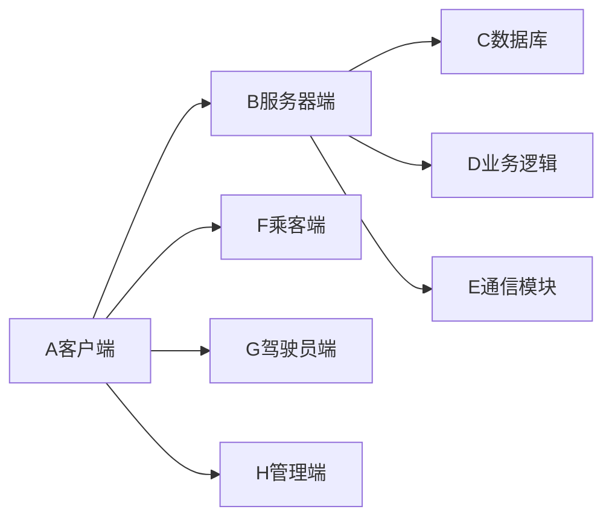
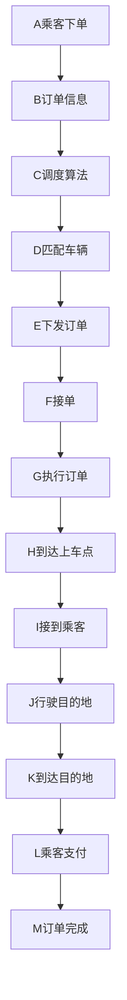

# 出租公司管理系统设计与实现

## 1. 背景介绍

### 1.1 项目背景

在现代社会中,出租车已成为人们日常出行的重要交通工具之一。随着出租车行业的不断发展,传统的人工管理模式已经无法满足日益增长的业务需求。因此,开发一个高效、智能化的出租公司管理系统势在必行。

### 1.2 项目目标

本项目旨在设计并实现一个功能完善、易于使用的出租公司管理系统,以提高出租公司的运营效率,优化资源配置,为乘客提供更加便捷、舒适的出行服务。

### 1.3 项目意义

- 提高出租公司的管理效率,降低人工成本
- 优化车辆调度,减少空驶率,提高运营效益  
- 为乘客提供更加便捷、舒适的出行体验
- 为驾驶员提供更加公平、合理的工作环境

## 2. 核心概念与联系

### 2.1 出租车调度

出租车调度是出租公司管理的核心业务之一,其目标是根据乘客需求和车辆位置,合理分配订单,使乘客尽快获得服务,同时提高车辆利用率。

### 2.2 车辆管理 

车辆管理包括车辆信息登记、车辆状态监控、车辆维修保养等,旨在确保车辆处于良好的运行状态,保障乘客安全。

### 2.3 驾驶员管理

驾驶员管理涉及驾驶员信息登记、工作排班、绩效考核等,目的是为驾驶员提供合理的工作安排,并对其服务质量进行监督和评估。

### 2.4 订单管理

订单管理包括订单受理、派单、结算等环节,是连接乘客、驾驶员和出租公司的纽带,直接影响到服务质量和运营效益。

### 2.5 系统架构

出租公司管理系统采用典型的C/S(客户端/服务器)架构,客户端包括乘客端、驾驶员端和管理端,服务器端负责数据存储、业务逻辑处理和通信协调。



## 3. 核心算法原理与具体操作步骤

### 3.1 出租车调度算法

#### 3.1.1 Hungarian算法

Hungarian算法是一种用于解决二分图最小权完美匹配问题的组合优化算法。在出租车调度中,可以将乘客需求视为二分图的一个顶点集,将车辆视为另一个顶点集,将乘客与车辆之间的距离视为边权,从而将调度问题转化为二分图匹配问题。

算法步骤:

1. 构建二分图的邻接矩阵,矩阵元素表示乘客与车辆之间的距离
2. 对矩阵的每一行减去该行的最小元素,对矩阵的每一列减去该列的最小元素
3. 用最少的水平线和垂直线覆盖矩阵中所有的0元素
4. 如果覆盖线的总数等于矩阵的阶数,则找到最优匹配,算法结束;否则,进入步骤5
5. 找到未被覆盖的最小元素,将其减去未被覆盖的行,加到被覆盖的列,返回步骤3

#### 3.1.2 KM算法

KM(Kuhn-Munkres)算法是Hungarian算法的一个变种,适用于求解带权二分图的最大权完美匹配问题。相比Hungarian算法,KM算法引入了顶标的概念,通过不断更新顶标,直到找到可行匹配为止。

算法步骤:

1. 初始化左右顶点集的顶标,左顶点的顶标等于与之相连的边的最大权值,右顶点的顶标为0
2. 在左顶点集中选择一个未匹配且顶标最大的顶点u,在右顶点集中选择一个与u相连的未匹配顶点v,若不存在这样的v,则更新u的顶标,返回步骤2;否则,将u与v匹配,若v原先已有匹配,则将v原先匹配的顶点加入未匹配集合,返回步骤2
3. 如果所有左顶点都已匹配,则找到最大权完美匹配,算法结束;否则,更新左右顶点集的顶标,返回步骤2

### 3.2 车辆调度策略

#### 3.2.1 就近原则 

根据车辆当前位置和乘客所在位置,优先派遣距离乘客最近的空车。这种策略可以最大限度地减少乘客等待时间,提高用户满意度。

#### 3.2.2 负载均衡

综合考虑车辆的当前载客量和行驶里程,尽量均衡各车辆的工作强度,避免出现部分车辆超负荷运转而其他车辆空闲的情况。

#### 3.2.3 预约优先

对于提前预约的订单,系统会优先安排车辆,以保证预约用户的出行需求。

### 3.3 订单派发流程



## 4. 数学模型与公式详细讲解

### 4.1 车辆调度模型

设有$n$个乘客和$m$辆车,乘客$i$的位置坐标为$(x_i,y_i)$,车辆$j$的位置坐标为$(X_j,Y_j)$,乘客$i$与车辆$j$之间的距离为$d_{ij}$,则车辆调度问题可以表示为如下的二分图匹配模型:

$$
\min \sum_{i=1}^n \sum_{j=1}^m d_{ij} x_{ij}
$$

$$
\text{s.t.} \quad \sum_{j=1}^m x_{ij} = 1, \quad i=1,2,\cdots,n
$$

$$
\sum_{i=1}^n x_{ij} \leq 1, \quad j=1,2,\cdots,m
$$

$$
x_{ij} \in \{0,1\}, \quad i=1,2,\cdots,n; \quad j=1,2,\cdots,m
$$

其中,$x_{ij}$为决策变量,当乘客$i$被分配给车辆$j$时,$x_{ij}=1$,否则$x_{ij}=0$。目标函数表示所有乘客与所分配车辆之间距离之和最小,约束条件保证每个乘客都被分配到一辆车,且每辆车最多服务一个乘客。

### 4.2 车辆路径规划模型

对于每个订单,车辆需要规划一条从当前位置到达乘客上车点,再到达目的地的最优路径。设车辆当前位置为$s$,乘客上车点为$o$,目的地为$d$,道路网络中的节点集合为$V$,边集合为$E$,边$(i,j)$的长度为$l_{ij}$,则车辆路径规划问题可以表示为如下的最短路模型:

$$
\min \sum_{(i,j) \in E} l_{ij} x_{ij}
$$

$$
\text{s.t.} \quad \sum_{j:(i,j) \in E} x_{ij} - \sum_{j:(j,i) \in E} x_{ji} = 
\begin{cases}
1, & i=s \\
-1, & i=d \\
0, & \text{otherwise}
\end{cases}, \quad \forall i \in V
$$

$$
\sum_{j:(o,j) \in E} x_{oj} = 1
$$

$$
x_{ij} \in \{0,1\}, \quad \forall (i,j) \in E
$$

其中,$x_{ij}$为决策变量,当边$(i,j)$在最优路径上时,$x_{ij}=1$,否则$x_{ij}=0$。目标函数表示路径总长度最小,约束条件保证路径的连续性和唯一性。

## 5. 项目实践:代码实例与详细解释

下面以Python为例,给出Hungarian算法和Dijkstra算法的代码实现。

### 5.1 Hungarian算法

```python
def hungarian(matrix):
    n = len(matrix)
    m = len(matrix[0])
    
    # 步骤1:矩阵预处理
    for i in range(n):
        min_val = min(matrix[i])
        for j in range(m):
            matrix[i][j] -= min_val
    for j in range(m):
        min_val = min(matrix[i][j] for i in range(n))
        for i in range(n):
            matrix[i][j] -= min_val
    
    # 步骤2:初始匹配
    match = [-1] * n
    for i in range(n):
        for j in range(m):
            if matrix[i][j] == 0 and match[i] == -1:
                match[i] = j
                break
    
    # 步骤3:寻找完美匹配
    while -1 in match:
        u = match.index(-1)
        S = {u}
        T = set()
        slack = [float('inf')] * m
        prev = [-1] * m
        
        while True:
            for j in range(m):
                if j not in T:
                    slack[j] = min(slack[j], min(matrix[i][j] for i in S))
            
            delta = min(slack[j] for j in range(m) if j not in T)
            for i in S:
                for j in range(m):
                    matrix[i][j] -= delta
            for j in T:
                for i in range(n):
                    matrix[i][j] += delta
            for j in range(m):
                slack[j] -= delta
            
            for j in range(m):
                if j not in T and slack[j] == 0:
                    prev[j] = u
                    if match[j] == -1:
                        while j != -1:
                            u = prev[j]
                            match[u] = j
                            j = match[u]
                        break
                    else:
                        u = match[j]
                        S.add(u)
                        T.add(j)
            
            if -1 not in match:
                break
    
    return match
```

代码解释:

1. 首先对矩阵进行预处理,对每一行减去该行的最小元素,对每一列减去该列的最小元素,这一步可以提高算法效率。
2. 初始匹配阶段,对每个未匹配的行,找到第一个为0的元素,将其匹配。
3. 寻找完美匹配阶段,不断更新顶点集S和T,计算松弛量slack,直到找到可行匹配。
4. 返回匹配结果,匹配结果以列表形式表示,列表的第i个元素表示第i行匹配到的列编号。

### 5.2 Dijkstra算法

```python
import heapq

def dijkstra(graph, start, end):
    n = len(graph)
    dist = [float('inf')] * n
    prev = [-1] * n
    dist[start] = 0
    
    pq = [(0, start)]
    while pq:
        d, u = heapq.heappop(pq)
        if d > dist[u]:
            continue
        if u == end:
            break
        for v, w in graph[u]:
            if dist[u] + w < dist[v]:
                dist[v] = dist[u] + w
                prev[v] = u
                heapq.heappush(pq, (dist[v], v))
    
    path = []
    u = end
    while u != -1:
        path.append(u)
        u = prev[u]
    path.reverse()
    
    return dist[end], path
```

代码解释:

1. 初始化距离数组dist和前驱数组prev,起点到自身的距离为0,其他点的距离为无穷大。
2. 将起点加入优先队列pq,优先队列中的元素为(距离,节点)的元组。
3. 循环从优先队列中取出距离最小的节点u,如果u的距离大于当前记录的距离,则跳过。
4. 如果u为终点,则跳出循环。
5. 遍历与u相邻的节点v,如果经过u到达v的距离更短,则更新v的距离和前驱,并将v加入优先队列。
6. 根