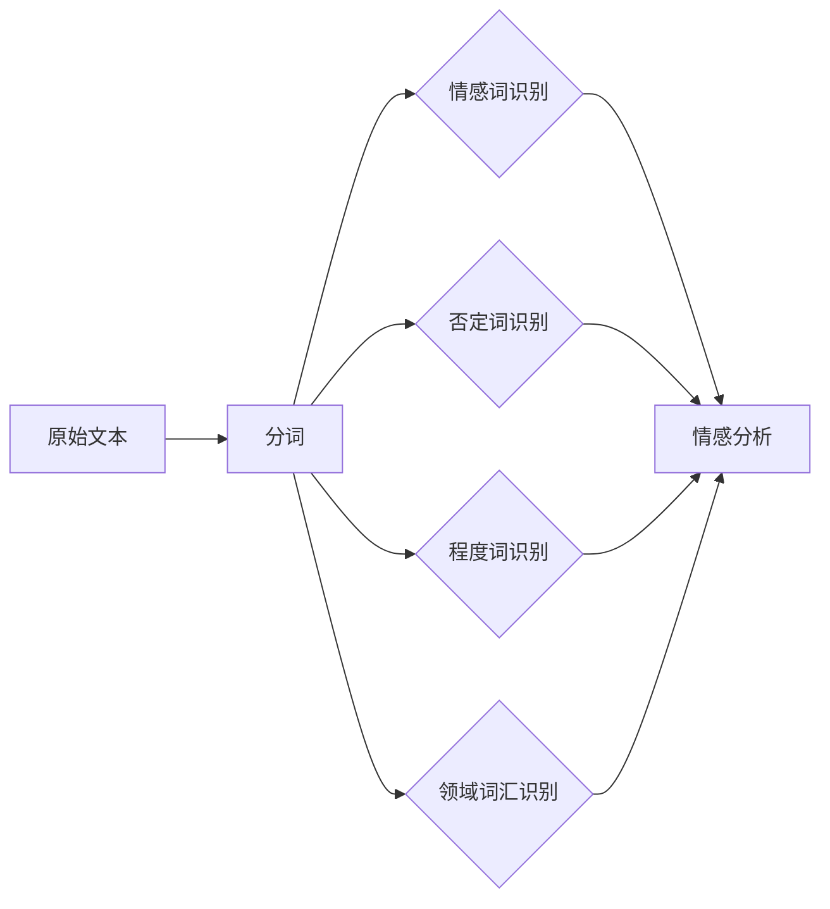

# 分词在情感分析中的作用及案例分析

## 1. 背景介绍
### 1.1 情感分析概述
#### 1.1.1 情感分析的定义
情感分析(Sentiment Analysis),也称为观点挖掘(Opinion Mining),是自然语言处理和文本挖掘领域的一个重要研究方向。它旨在分析文本中蕴含的情感倾向,即作者对某个目标实体(如产品、服务、事件等)持有的正面、中性或负面观点。

#### 1.1.2 情感分析的应用场景
情感分析在很多领域都有广泛的应用,例如:

- 商业智能:分析用户评论中的情感倾向,了解用户对产品的满意度,为产品改进提供依据。
- 社交媒体监测:分析社交网络上的舆情动向,把握网民对热点事件的情感态度。
- 金融市场预测:分析财经新闻和社交媒体的情感倾向,预测股市走势。
- 客户服务:自动分析用户反馈,识别负面情绪并及时响应,提升客户满意度。

### 1.2 分词概述 
#### 1.2.1 分词的定义
分词(Word Segmentation)是将连续的文本切分成一系列词语的过程。由于汉语文本没有显式的词界标记(如空格),因此需要通过分词来识别出句子中的词。分词是文本处理的基础步骤,下游的任务如词性标注、句法分析、信息抽取等都依赖于分词的结果。

#### 1.2.2 分词的常用方法
常用的分词方法主要有以下几种:

- 基于字符串匹配的机械分词:如正向最大匹配、逆向最大匹配等。
- 基于统计模型的分词:如隐马尔可夫模型(HMM)、条件随机场(CRF)等。
- 基于深度学习的分词:如BiLSTM-CRF等神经网络模型。
- 基于词典和规则的分词:利用预定义的词典和启发式规则进行分词。

### 1.3 分词在情感分析中的重要性
分词是情感分析的重要前置步骤。高质量的分词结果可以提升情感分析的精度。具体而言,分词在情感分析中的重要性体现在以下几个方面:

- 情感词的识别:很多情感信息都蕴含在词汇中,如"喜欢"、"讨厌"等。只有正确地切分出这些词,才能捕捉到句子的情感倾向。
- 否定词的识别:如"不"、"没"等否定词会反转情感倾向。需要将否定词与情感词正确地组合,才能得到准确的情感判断。
- 程度词的识别:程度词如"非常"、"十分"等会影响情感强度。将程度词与情感词正确搭配,有助于细粒度的情感分析。
- 领域词汇的识别:不同领域有其特定的情感词汇。例如,"高达"一词在手机领域可能是正面情感,但在房价领域则可能是负面情感。

## 2. 核心概念与联系
### 2.1 分词与情感分析的关系


如上图所示,分词是情感分析的基础。原始文本经过分词处理后,可以识别出对情感分析至关重要的情感词、否定词、程度词和领域词汇。这些词汇的识别结果直接影响情感分析的性能。可以说,分词的质量在很大程度上决定了情感分析的上限。

### 2.2 情感词典
情感词典是一种重要的情感分析资源。它收录了带有情感倾向的词语,并标注了它们的极性(积极、消极)和强度。在基于词典的情感分析方法中,情感词典扮演着关键角色。

常见的中文情感词典有:
- 台湾大学NTUSD情感词典
- 清华大学李军中文褒贬义词典
- 大连理工大学中文情感词汇本体库

### 2.3 情感分析的粒度
情感分析可以在不同粒度上进行,主要有以下三种:

- 文档级:判断整个文档的总体情感倾向,如一篇评论的态度是正面还是负面。
- 句子级:判断单个句子的情感倾向。一篇文档可能包含不同情感倾向的句子。
- 属性级:判断文本对目标实体的不同属性的情感倾向。例如,一条手机评论可能对手机的外观持正面态度,但对电池续航持负面态度。

分词粒度的选择要与情感分析的粒度相匹配。例如,文档级情感分析只需要粗粒度分词,而属性级情感分析则需要细粒度分词来准确定位属性词。

## 3. 核心算法原理具体操作步骤
本节以基于词典的情感分析算法为例,介绍其核心步骤。该算法利用预定义的情感词典,通过匹配分词结果中的情感词来判断文本的情感倾向。

### 3.1 构建情感词典
首先需要构建一个情感词典,包括以下步骤:

1. 收集种子情感词。可以从已有的情感词典中选取一些典型的正面和负面情感词作为种子。
2. 利用WordNet等词汇资源,通过同义词和反义词扩充种子词,得到更多的情感词。
3. 人工审核筛选,去除不合适的词语。
4. 对情感词标注极性和强度。可以采用人工标注或借助语料自动标注。

### 3.2 对文本进行分词
利用选定的分词工具对待分析的文本进行分词。分词结果以列表形式存储,每个元素为一个词。例如:

```python
text = "这款手机外观漂亮,但电池续航太差了。"
seg_list = ["这款", "手机", "外观", "漂亮", "，", "但", "电池", "续航", "太", "差", "了", "。"]
```

### 3.3 情感词匹配
遍历分词结果列表,匹配预定义的情感词典,识别出文本中出现的情感词。可以用字典(Dict)这种数据结构来存储匹配结果,key为情感词,value为对应的极性和强度。例如:

```python
sentiment_dict = {"漂亮": (1, 3), "差": (-1, 2)}
```

其中,1表示积极,-1表示消极;3表示强度为3(1-5级)。

### 3.4 处理否定词和程度词
分析情感词前后是否有否定词或程度词。若有否定词,需要反转情感极性;若有程度词,需要相应调整情感强度。可以预定义否定词和程度词词典,在情感词匹配的同时进行检查。例如:

```python
# 检测否定词
if seg_list[i-1] in negation_dict:
    sentiment_dict[word] = (-sentiment_dict[word][0], sentiment_dict[word][1])

# 检测程度词  
if seg_list[i-1] in degree_dict:
    sentiment_dict[word] = (sentiment_dict[word][0], sentiment_dict[word][1]*degree_dict[seg_list[i-1]])
```

### 3.5 情感得分计算
根据匹配到的情感词的极性和强度,综合计算文本的情感得分。最简单的算法是将所有情感词的极性值求和,得到总的情感得分。为了平衡正负情感词的数量差异,也可以分别计算正面得分和负面得分,然后用正面得分减去负面得分。例如:

```python
pos_score = sum(strength for word, (polarity, strength) in sentiment_dict.items() if polarity > 0)
neg_score = sum(strength for word, (polarity, strength) in sentiment_dict.items() if polarity < 0)

sentiment_score = pos_score - neg_score
```

### 3.6 情感倾向判断
根据情感得分的正负和大小,判断文本的情感倾向。可以设置阈值,当情感得分大于正向阈值时判断为积极情感,小于负向阈值时判断为消极情感,介于两个阈值之间时判断为中性情感。例如:

```python
if sentiment_score >= pos_threshold:
    sentiment_label = 'positive'
elif sentiment_score <= neg_threshold:
    sentiment_label = 'negative'  
else:
    sentiment_label = 'neutral'
```

以上就是基于词典的情感分析算法的主要步骤。该算法的优点是实现简单,易于理解;缺点是完全依赖词典的质量,对未登录词的情感无能为力。在实际应用中,常常将其与其他算法(如基于机器学习的算法)结合,以提升整体性能。

## 4. 数学模型和公式详细讲解举例说明
情感分析可以看作是一个文本分类问题。给定一个文本$d$,情感分析的目标是预测它的情感标签$y \in \{1,-1\}$,其中1表示积极情感,-1表示消极情感。

### 4.1 朴素贝叶斯模型
朴素贝叶斯是一种常用于文本分类的概率模型。它基于贝叶斯定理和属性条件独立性假设。用于情感分析时,朴素贝叶斯模型可以表示为:

$$P(y|d) = \frac{P(y)P(d|y)}{P(d)}$$

其中,$P(y|d)$是在给定文本$d$的条件下,类别标签为$y$的后验概率;$P(y)$是类别标签$y$的先验概率;$P(d|y)$是在给定类别标签$y$的条件下,文本$d$出现的似然概率;$P(d)$是文本$d$出现的边缘概率。

朴素贝叶斯模型假设文本中的词条件独立,因此$P(d|y)$可以分解为:

$$P(d|y) = \prod_{i=1}^n P(w_i|y)$$

其中,$w_i$是文本$d$中的第$i$个词,$n$是文本的长度。

在训练阶段,朴素贝叶斯模型通过极大似然估计来估计$P(y)$和$P(w_i|y)$:

$$P(y) = \frac{N_y}{N}$$

$$P(w_i|y) = \frac{N_{yi}+\alpha}{N_y+\alpha V}$$

其中,$N$是训练集中文本的总数,$N_y$是训练集中标签为$y$的文本数,$N_{yi}$是训练集中标签为$y$的文本中词$w_i$出现的次数,$V$是词汇表的大小,$\alpha$是平滑参数(通常取1,即Laplace平滑)。

在预测阶段,对于一个新文本$d$,朴素贝叶斯模型计算$P(y|d)$,并选择后验概率最大的类别标签:

$$y^* = \arg\max_y P(y|d) = \arg\max_y P(y)\prod_{i=1}^n P(w_i|y)$$

下面是一个简单的例子。假设训练集中有10个正面文本和10个负面文本,词汇表中有5个词。

正面文本:
- "这款 手机 外观 漂亮" (2次)
- "手机 质量 不错" (3次)
- "外观 时尚 手感 好" (5次)

负面文本:
- "手机 电池 续航 差" (4次)  
- "信号 太 差 了" (4次)
- "系统 不 流畅 卡顿" (2次)

根据极大似然估计,我们可以得到:

$$P(y=1) = P(y=-1) = \frac{10}{20} = 0.5$$

$$P(w_i|y=1) = \frac{N_{1i}+1}{10+5} = \begin{cases} 
\frac{3}{15}, & w_i=手机 \\
\frac{7}{15}, & w_i=外观 \\
\frac{2}{15}, & w_i=漂亮 \\
\frac{1}{15}, & w_i=质量,不错,时尚,手感,好 \\
\frac{1}{15}, & 其他词
\end{cases}$$

$$P(w_i|y=-1) = \frac{N_{-1i}+1}{10+5} = \begin{cases}
\frac{4}{15}, & w_i=手机,差 \\
\frac{2}{15}, & w_i=电池,续航,信号,太,了,系统,不,流畅,卡顿 \\
\