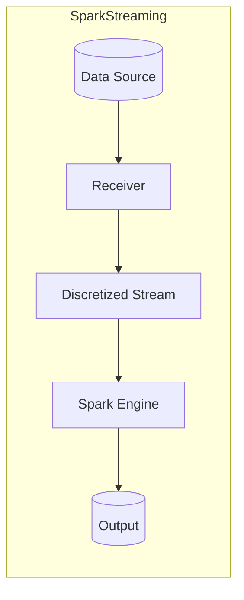
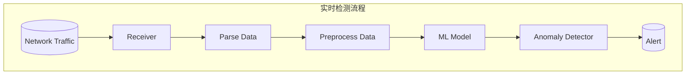

以下是题为《利用SparkStreaming构建实时网络攻击检测系统》的技术博客文章正文：

# 利用SparkStreaming构建实时网络攻击检测系统

## 1.背景介绍

### 1.1 网络安全的重要性

在当今互联网时代，网络安全已成为一个日益严峻的挑战。随着网络犯罪活动的不断升级和网络攻击手段的日益复杂,有效的网络攻击检测和防御系统变得至关重要。传统的网络安全解决方案通常基于规则或签名,难以及时发现未知威胁和持续变化的攻击模式。

### 1.2 大数据和实时处理的需求

现代网络产生的海量数据流,需要实时高效地处理和分析。大数据技术为构建实时网络攻击检测系统提供了可能。Apache Spark作为一种快速、通用的大数据处理引擎,其流式计算组件SparkStreaming可用于构建实时数据处理管道。

### 1.3 机器学习在网络安全中的应用

机器学习算法能从大量网络流量数据中自动学习攻击模式,从而检测已知和未知攻击。将机器学习与大数据实时处理相结合,可以构建出高效、准确的实时网络攻击检测系统。

## 2.核心概念与联系

### 2.1 SparkStreaming概述

SparkStreaming是Apache Spark的流式计算组件,用于实时处理来自各种数据源(如Kafka、Flume、Kinesis等)的数据流。它将数据流划分为一系列的微批数据集(Discretized Stream),并使用Spark引擎的快速批处理能力进行处理和分析。



### 2.2 网络流量数据处理

网络流量数据通常采用标准格式,如NetFlow、sFlow等。这些数据包含了源IP、目的IP、端口号、协议类型等字段,描述了网络连接的元数据信息。通过分析这些数据,可以检测出异常行为和潜在攻击。

### 2.3 机器学习模型

常用的机器学习模型包括:

- 无监督学习:聚类算法(如K-Means)可用于发现异常流量模式
- 监督学习:分类算法(如逻辑回归、决策树、随机森林等)可用于检测已知攻击类型
- 深度学习:递归神经网络、自编码器等可用于从原始数据中自动提取特征并检测攻击

## 3.核心算法原理具体操作步骤

### 3.1 数据预处理

1) 解析原始网络流量数据,提取特征字段
2) 数据清洗,处理缺失值和异常值
3) 特征编码,将分类特征转换为数值型
4) 特征缩放,将特征值归一化到相似的数值范围

### 3.2 构建机器学习模型

1) 将预处理后的数据划分为训练集和测试集
2) 选择合适的机器学习算法,如逻辑回归、随机森林等
3) 在训练集上训练模型,调整超参数以优化模型性能
4) 在测试集上评估模型,计算准确率、精确率、召回率等指标

### 3.3 SparkStreaming实时检测



1) 从数据源(如网络流量采集器)接收实时数据流
2) 解析原始数据,提取特征
3) 对特征数据进行预处理(清洗、编码、缩放)
4) 使用训练好的机器学习模型对预处理后的数据进行评分
5) 根据模型输出结果,检测异常流量并发出告警

## 4.数学模型和公式详细讲解举例说明 

### 4.1 逻辑回归

逻辑回归是一种常用的监督学习分类算法,可用于网络攻击检测。其数学模型如下:

$$
P(Y=1|X) = \sigma(w^TX+b) = \frac{1}{1+e^{-(w^TX+b)}}
$$

其中:
- $X$是输入特征向量
- $Y$是二元类别标签(0或1)
- $w$是权重向量
- $b$是偏置项
- $\sigma$是Sigmoid函数,将线性组合$w^TX+b$的值映射到(0,1)范围

使用最大似然估计,通过优化目标函数求解最优参数$w$和$b$:

$$
\max_{w,b} \sum_{i=1}^N \Big[ y^{(i)}\log\sigma(w^Tx^{(i)}+b) + (1-y^{(i)})\log(1-\sigma(w^Tx^{(i)}+b)) \Big]
$$

对于给定的网络流量特征$x$,模型输出$P(Y=1|x)$的值即为其被判定为攻击流量的概率。我们可以设置一个阈值,将高于阈值的样本判定为攻击。

### 4.2 随机森林

随机森林是一种基于决策树的集成学习算法,也可用于网络攻击检测。其原理是通过构建多个决策树,对单个树的高方差进行平均,从而获得更好的模型性能。

对于二元分类问题,给定样本$x$,随机森林模型输出的是:

$$
P(Y=1|x) = \frac{1}{M}\sum_{m=1}^M P_m(Y=1|x)
$$

其中$M$是森林中树的数量,$P_m(Y=1|x)$是第$m$棵树对样本$x$预测为正类的概率。我们仍可设置阈值,将高于阈值的样本判定为攻击流量。

## 5.项目实践：代码实例和详细解释说明

以下是一个使用SparkStreaming和Spark ML库构建网络攻击检测系统的Python代码示例:

### 5.1 导入所需库

```python
from pyspark.sql import SparkSession
from pyspark.sql.functions import *
from pyspark.ml.feature import VectorAssembler, StandardScaler
from pyspark.ml.classification import RandomForestClassifier
from pyspark.ml import Pipeline
```

### 5.2 创建SparkSession

```python
spark = SparkSession.builder \
            .appName("NetworkAttackDetection") \
            .getOrCreate()
```

### 5.3 读取训练数据

```python
# 从CSV文件读取训练数据
training = spark.read.format("csv") \
      .option("header","true") \
      .option("inferSchema", "true") \
      .load("path/to/training_data.csv")
      
# 显示数据示例
training.show(5)
```

### 5.4 特征工程

```python
# 将特征列组装为向量
assembler = VectorAssembler(inputCols=["duration","src_bytes","dst_bytes",...],
                            outputCol="features")
                            
# 标准化特征向量                    
scaler = StandardScaler(inputCol="features", outputCol="scaledFeatures")
```

### 5.5 构建机器学习管道

```python
# 使用随机森林分类器
rf = RandomForestClassifier(labelCol="label", featuresCol="scaledFeatures")

# 构建机器学习管道
pipeline = Pipeline(stages=[assembler, scaler, rf])

# 训练模型
model = pipeline.fit(training)
```

### 5.6 实时数据流处理

```python
# 创建数据流
socket_stream = spark \
    .readStream \
    .format("socket") \
    .option("host", "localhost") \
    .option("port", 9999) \
    .load()
    
# 对流数据应用同样的特征工程
query = socket_stream \
        .select(expr("CAST(value AS STRING)")) \
        .select(from_csv(col("value"), schema).alias("temp")) \
        .select("temp.*") \
        .na.drop() \
        .withColumn("features", assemble_features(col("duration"), col("src_bytes"), ...)) \
        .withColumn("scaledFeatures", scaler.transform(col("features"))) \
        .select("scaledFeatures")
        
# 使用训练好的模型对流数据进行评分        
prediction_query = model \
                    .transform(query) \
                    .select("prediction")
                    
# 启动流式查询,检测攻击并输出结果                
stream_prediction = prediction_query \
                    .writeStream \
                    .format("console") \
                    .queryName("attack_detection") \
                    .start()
                    
stream_prediction.awaitTermination()
```

上述代码首先读取训练数据,进行特征工程并构建随机森林分类器模型。然后创建一个Socket数据流,对流数据应用同样的特征工程转换。最后,使用训练好的模型对流数据进行评分,检测攻击流量并输出结果。

## 6.实际应用场景

实时网络攻击检测系统可应用于以下场景:

- 网络安全运营中心(SOC):对网络流量进行实时监控和攻击检测
- 入侵检测系统(IDS):检测网络入侵行为并发出警报
- Web应用防火墙(WAF):保护Web应用程序免受攻击
- 物联网安全:检测物联网设备的异常行为和攻击

## 7.工具和资源推荐

- Apache Spark: https://spark.apache.org/
- Spark MLlib: https://spark.apache.org/mllib/
- Scikit-learn: https://scikit-learn.org/
- NetFlow/sFlow解析库: https://github.com/certtools/intelmq
- 网络流量数据集: https://www.unb.ca/cic/datasets/index.html

## 8.总结：未来发展趋势与挑战

实时网络攻击检测系统将会在未来网络安全领域扮演越来越重要的角色。未来的发展趋势包括:

- 更复杂的攻击模式需要更强大的检测算法,如深度学习模型
- 边缘计算和物联网安全对实时检测系统提出新的要求
- 系统需要支持更大规模的数据处理和更低的延迟
- 人工智能技术将会更多地应用于网络安全领域

同时,实时网络攻击检测系统也面临一些挑战:

- 数据隐私和安全性问题
- 模型可解释性和可信度问题
- 系统的鲁棒性和容错能力
- 新兴攻击手段的快速检测和应对

## 9.附录：常见问题与解答

1. **为什么要使用SparkStreaming进行实时检测?**

SparkStreaming能够高效地处理大规模的实时数据流,并与Spark生态系统无缝集成,可以利用Spark强大的批处理能力和机器学习算法库。相比其他流处理系统,SparkStreaming在延迟、吞吐量和容错方面表现出色。

2. **如何选择合适的机器学习算法?**

算法的选择取决于具体的应用场景和数据特征。无监督算法如聚类更适合发现未知攻击模式,而监督算法如逻辑回归、决策树等则擅长检测已知攻击类型。对于高维稠密数据,深度学习模型可以自动提取有效特征。通常需要对多种算法进行比较,选择性能最优的模型。

3. **如何评估模型的性能?**

常用的评估指标包括准确率、精确率、召回率、F1分数、ROC曲线下面积等。在网络攻击检测中,我们更关注的是精确率和召回率,即尽可能减少误报和漏报。同时,评估数据集应该具有代表性,包含各种正常流量和攻击类型。

4. **如何处理类别不平衡的数据?**

网络流量数据通常是不平衡的,攻击样本远少于正常样本。可以采用过采样或欠采样的方法平衡训练数据,或者使用能够自动处理不平衡数据的算法(如决策树)。此外,还可以调整分类阈值或使用专门的评估指标(如F-beta分数)。

5. **如何提高系统的实时性能?**

可以从多个方面优化系统性能:增加计算资源、使用高效的数据格式(如Parquet)、优化Spark作业配置、缓存热数据等。同时,也需要控制数据接收速率,避免下游处理过载。此外,使用增量式模型更新可以减少完全重新训练的开销。

作者: 禅与计算机程序设计艺术 / Zen and the Art of Computer Programming