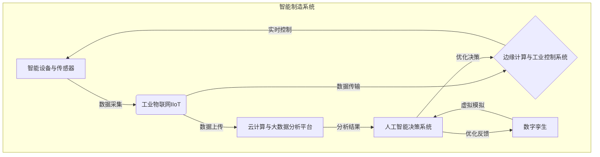

# 制造行业数字化、人工智能、大数据技术转型

## 1.背景介绍

在当今快速发展的数字时代,制造业正面临着前所未有的机遇与挑战。全球化竞争、客户需求多样化、产品生命周期缩短等因素,推动制造企业不得不加快数字化转型的步伐。数字化、人工智能和大数据技术的融合应用,为制造业带来了全新的发展动能,正在彻底改变传统制造模式。

制造业数字化转型的核心目标是通过利用先进技术,实现智能制造、提高运营效率、优化决策过程、提升客户体验等,从而获得更大的竞争优势。人工智能和大数据是实现制造业数字化转型的两大关键技术支柱。

### 1.1 人工智能在制造业中的作用

人工智能技术在制造业中的应用主要体现在以下几个方面:

- 智能优化:利用机器学习算法优化生产计划、工艺路线等,提高资源利用效率。
- 预测性维护:基于大数据分析,预测设备故障,实现预防性维护。
- 质量控制:通过计算机视觉、图像识别等技术,实时监控产品质量。
- 智能机器人:机器人在生产线上执行重复劳动,提高生产效率。
- 新产品设计:基于人工智能的虚拟设计和仿真,加速新产品开发周期。

### 1.2 大数据在制造业中的作用  

大数据在制造业中的应用主要包括:

- 数据采集与整合:从生产设备、供应链、产品使用等环节采集海量数据,并进行数据清洗和集成。
- 数据分析与可视化:对采集的数据进行多维度分析,发现潜在规律,为决策提供支持。
- 预测与优化:基于历史数据和机器学习算法,预测未来趋势,优化生产计划和资源配置。

人工智能和大数据在制造业的融合应用,将极大提升生产效率、产品质量和客户体验,助力制造企业实现数字化转型。

## 2.核心概念与联系

制造业数字化转型涉及多个核心概念,下面将对这些概念及其内在联系进行阐述。

### 2.1 智能制造(Smart Manufacturing)

智能制造是制造业数字化转型的核心目标,旨在通过信息化和智能化手段,实现制造过程的自动化、智能化和可视化,从而提高生产效率、优化资源利用、提升产品质量和灵活性。

智能制造系统通常由以下几个关键组成部分构成:

1. 智能设备与传感器:智能化生产设备、工业机器人、各类传感器等,负责数据采集和执行生产任务。

2. 工业物联网(IIoT):将生产设备、传感器等连接到网络,实现数据实时传输和远程监控。

3. 边缘计算与工业控制系统:在生产现场进行实时数据处理和控制,保证生产高效运行。

4. 云计算与大数据分析平台:将采集的数据上传至云端,进行大数据分析、机器学习建模等。

5. 人工智能决策系统:基于大数据分析结果,利用人工智能算法进行生产计划优化、预测性维护等决策。

6. 数字孪生:构建虚拟模型与物理系统实时映射,用于产品设计、工艺优化、虚拟仿真等。

智能制造系统的核心是通过数据驱动,利用人工智能、大数据等技术,实现生产过程的自动化和智能化,最终实现智能决策与优化。

### 2.2 工业大数据(Industrial Big Data)

工业大数据是指来自于工业生产环境的海量、多源、异构的数据集,包括设备运行数据、产品质量数据、供应链数据等。工业大数据的特点是5V:

- Volume(大量):来自于海量传感器、控制系统等的数据。
- Variety(多样):包括结构化、非结构化、时序等多种类型数据。
- Velocity(高速):需要实时采集、传输和处理数据。
- Veracity(真实性):存在噪声、异常、不完整等质量问题。
- Value(价值):通过分析发现数据价值,提高制造效率。

工业大数据分析的目标是从海量复杂数据中发现隐藏的模式、趋势和规律,为制造业决策提供支持。常用的分析方法包括:

- 描述性分析:了解过去和当前状态,如设备运行状态监控。
- 诊断性分析:分析导致某种现象的根本原因,如故障诊断。
- 预测性分析:基于历史数据预测未来趋势,如需求预测、剩余使用寿命预测等。
- 规范性分析:确定最优决策,如生产计划优化、工艺路线优化等。

工业大数据分析需要先进的大数据处理技术,如流式计算、机器学习等,并与人工智能技术紧密结合,实现智能决策与优化。

### 2.3 人工智能与大数据的关系

人工智能和大数据在制造业数字化转型中存在紧密关联,相辅相成。

大数据为人工智能提供了源源不断的训练数据和应用场景,使得人工智能算法能够不断学习和优化,从而提高决策的准确性和智能化水平。同时,人工智能技术为大数据分析提供了强大的建模和优化能力,能够从海量复杂数据中发现隐藏的规律和洞见。

在智能制造系统中,人工智能和大数据的融合应用贯穿了整个生命周期:

- 数据采集与处理阶段,利用大数据技术实现多源异构数据的高效获取、集成和存储。

- 数据分析阶段,运用机器学习等人工智能算法对工业大数据进行分析建模,挖掘潜在知识。

- 决策优化阶段,将人工智能分析结果应用于生产计划、工艺优化、预测性维护等,实现智能化决策。

- 反馈优化阶段,根据决策执行效果,持续优化人工智能模型和大数据分析流程。

总的来说,人工智能和大数据在制造业数字化转型中相互促进、环环相扣,共同推动智能制造的发展。

## 3.核心算法原理具体操作步骤

制造业数字化转型涉及多种人工智能和大数据算法,下面将介绍其中几种核心算法的原理和操作步骤。

### 3.1 机器学习算法

机器学习是人工智能的一个重要分支,通过从数据中自动分析获得规律,并用于决策或预测。在制造业中,常用的机器学习算法包括:

#### 3.1.1 监督学习算法

监督学习算法通过学习带有标签的训练数据,建立映射关系模型,用于分类或回归预测。常用算法包括:

- 决策树(Decision Tree)
- 支持向量机(SVM)
- 人工神经网络(ANN)

以决策树为例,构建步骤如下:

1. 收集数据:获取带标签的训练数据集
2. 准备数据:对数据进行预处理,填补缺失值,归一化等
3. 分析数据:计算各特征对目标变量的重要性
4. 构建决策树:基于特征重要性,递归构建决策树模型
5. 剪枝决策树:控制模型复杂度,防止过拟合
6. 预测:使用构建的决策树模型对新数据进行分类或回归预测

监督学习广泛应用于制造业的质量检测、故障诊断、需求预测等领域。

#### 3.1.2 无监督学习算法

无监督学习算法在没有标签数据的情况下,从原始数据中发现潜在模式和规律。常用算法包括:

- 聚类算法(如K-Means)
- 关联规则挖掘(如Apriori)
- 降维算法(如PCA)

以K-Means聚类算法为例,步骤如下:

1. 收集数据:获取无标签的原始数据集
2. 准备数据:对数据进行预处理,填补缺失值,归一化等
3. 确定K值:设置聚类中心数量K
4. 初始化聚类中心
5. 计算数据到各聚类中心的距离,归类到最近的聚类
6. 重新计算各聚类的中心点
7. 重复步骤5-6,直至聚类中心不再变化
8. 输出聚类结果

无监督学习常用于制造业的工序优化、产品分类、异常检测等领域。

#### 3.1.3 强化学习算法

强化学习是机器学习的一种范式,通过与环境的交互,自动获取经验并优化决策策略。常用算法包括:

- Q-Learning
- 策略梯度(Policy Gradient)
- 深度Q网络(DQN)

以Q-Learning为例,算法步骤如下:

1. 初始化Q表格,表示在各状态下采取各动作的价值
2. 观测当前状态s,选择动作a(初始随机,后期根据Q值选择)
3. 执行动作a,获得奖励r,转移到新状态s'
4. 更新Q(s,a)值:Q(s,a) = Q(s,a) + α[r + γ*max(Q(s',a')) - Q(s,a)]
5. 重复步骤2-4,直至收敛

强化学习在智能装配、机器人控制等领域有广泛应用。

### 3.2 大数据处理算法

制造业产生的工业大数据具有多源、异构、实时等特点,需要先进的大数据处理算法进行高效计算。常用算法包括:

#### 3.2.1 流式计算算法

流式计算算法用于实时处理持续到来的数据流,如设备运行数据流。常用算法包括:

- 滑动窗口(Sliding Window)
- 增量迭代(Incremental Iteration)

以滑动窗口为例,算法步骤如下:

1. 设置窗口大小(时间或计数)
2. 对到达的新数据进行处理(统计、过滤等)
3. 将新数据放入窗口
4. 从窗口中移除过期数据
5. 输出窗口内数据的统计结果
6. 重复步骤2-5,持续处理数据流

流式计算广泛应用于实时监控、复杂事件处理等场景。

#### 3.2.2 大规模并行计算算法

面对海量数据,需要并行计算框架高效处理,如MapReduce、Spark等。

以MapReduce为例,算法分两阶段:

1. Map阶段:
    - 输入分片(Split)被多个Map任务并行处理
    - 每个Map任务对分片数据进行转换处理,生成键值对
    - Map任务输出被分区(Partition),分发到不同的Reduce任务
2. Reduce阶段:
    - Reduce任务对Map输出进行排序和合并
    - 对每个键值对,执行Reduce函数进行计算
    - 输出最终结果

大规模并行计算算法适用于离线处理海量数据,如日志分析、数据统计等。

上述算法为制造业数字化转型提供了有力的技术支撑,实现了数据的高效处理和智能分析,是构建智能制造系统的基础。

## 4.数学模型和公式详细讲解举例说明

在制造业数字化转型中,数学模型和公式扮演着重要角色,用于描述和优化各种过程。本节将介绍几种常用的数学模型,并详细讲解相关公式及应用实例。

### 4.1 时间序列模型

时间序列模型用于对连续时间点上的数据进行分析和预测,在制造业中有广泛应用,如需求预测、故障预测等。

常用的时间序列模型包括:

#### 4.1.1