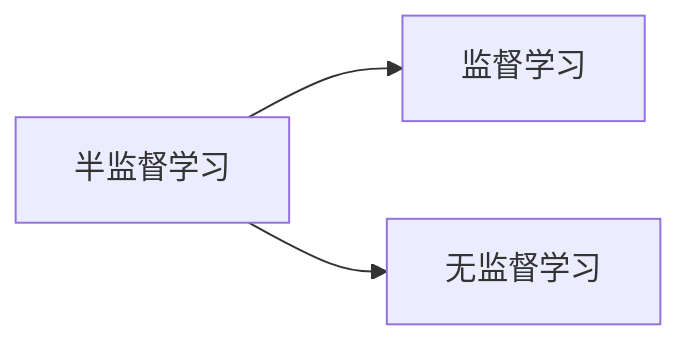

# 半监督学习入门指南:从零到精通的学习路线

## 1.背景介绍

随着数据的快速增长,标注数据的成本也在不断增加。相比之下,未标注数据的获取成本较低,因此如何有效利用未标注数据成为了机器学习领域的一个重要课题。半监督学习(Semi-Supervised Learning)作为一种有效利用未标注数据的方法,近年来受到了广泛关注。

半监督学习是介于无监督学习和监督学习之间的一种机器学习范式,它同时使用少量标注数据和大量未标注数据进行模型训练。与监督学习相比,半监督学习可以利用未标注数据来提高模型的泛化能力;与无监督学习相比,半监督学习可以利用少量标注数据来指导模型学习更加有意义的特征表示。

## 2.核心概念与联系

### 2.1 半监督学习的核心思想

半监督学习的核心思想是:利用少量标注数据来学习数据的判别性知识,同时利用大量未标注数据来学习数据的生成性知识,从而获得更加准确和鲁棒的模型。

### 2.2 半监督学习与其他学习范式的关系

半监督学习与监督学习和无监督学习都有一定的联系:

- 监督学习:当只使用标注数据时,半监督学习就等同于监督学习。
- 无监督学习:当只使用未标注数据时,半监督学习就等同于无监督学习。

因此,半监督学习可以看作是监督学习和无监督学习的一种有机结合和扩展。



## 3.核心算法原理具体操作步骤

半监督学习的核心算法原理主要包括以下几个方面:

### 3.1 生成模型方法

生成模型方法假设数据是由一个潜在的模型生成的,通过同时建模标注数据和未标注数据的生成过程来学习模型参数。常见的生成模型方法包括:

1. **高斯混合模型(Gaussian Mixture Model, GMM)**: 假设数据由多个高斯分布混合而成,通过期望最大化(EM)算法来估计每个高斯分布的参数。

2. **深度生成模型(Deep Generative Model)**: 利用深度神经网络来建模数据的生成过程,例如变分自编码器(Variational Autoencoder, VAE)和生成对抗网络(Generative Adversarial Network, GAN)。

算法步骤:

1. 初始化模型参数
2. E步:计算每个数据点属于每个类别的后验概率
3. M步:最大化模型对数似然,更新模型参数
4. 重复2-3步,直到收敛

### 3.2 半监督支持向量机

半监督支持向量机(Semi-Supervised Support Vector Machine, S3VM)是在支持向量机的基础上,引入未标注数据来辅助训练的一种方法。常见的半监督支持向量机算法包括:

1. **S3VM**: 在标注数据上最小化经验风险,在未标注数据上最小化光滑度。
2. **TSVM(Transductive SVM)**: 在标注数据和未标注数据上同时最小化结构风险。

算法步骤:

1. 初始化模型参数
2. 在标注数据上最小化经验风险
3. 在未标注数据上最小化光滑度或结构风险
4. 重复2-3步,直到收敛

### 3.3 图半监督方法

图半监督方法将数据表示为一个图,其中节点表示数据样本,边表示样本之间的相似度。通过在图上传播标签信息,来利用未标注数据辅助模型训练。常见的图半监督算法包括:

1. **标签传播(Label Propagation)**: 利用图上的邻近关系,将标注样本的标签传播到未标注样本。
2. **高斯随机场(Gaussian Random Field)**: 在图上定义一个高斯马尔可夫随机场,通过最大化边缘似然来学习标签。

算法步骤:

1. 构建数据图,计算节点之间的相似度
2. 初始化标注节点的标签
3. 在图上传播标签信息
4. 重复3步,直到收敛

### 3.4 半监督聚类

半监督聚类是在聚类的基础上,引入少量标注数据来辅助聚类过程的一种方法。常见的半监督聚类算法包括:

1. **约束型聚类(Constrained Clustering)**: 在聚类过程中,加入必链约束(must-link)和不可链约束(cannot-link)。
2. **种子型聚类(Seeded Clustering)**: 将标注样本作为种子,然后将未标注样本聚类到最近的种子周围。

算法步骤:

1. 从标注数据中提取约束或种子
2. 初始化聚类中心
3. 在未标注数据上进行聚类,满足约束或种子条件
4. 重复3步,直到收敛

## 4.数学模型和公式详细讲解举例说明

### 4.1 高斯混合模型(GMM)

高斯混合模型假设数据由多个高斯分布混合而成,其概率密度函数为:

$$
p(x) = \sum_{k=1}^{K} \pi_k \mathcal{N}(x|\mu_k,\Sigma_k)
$$

其中,$K$是混合成分的个数,$\pi_k$是第$k$个成分的混合系数,$\mathcal{N}(x|\mu_k,\Sigma_k)$是第$k$个成分的高斯分布密度函数,定义为:

$$
\mathcal{N}(x|\mu_k,\Sigma_k) = \frac{1}{(2\pi)^{d/2}|\Sigma_k|^{1/2}}\exp\left(-\frac{1}{2}(x-\mu_k)^T\Sigma_k^{-1}(x-\mu_k)\right)
$$

其中,$d$是数据的维度,$\mu_k$是第$k$个成分的均值向量,$\Sigma_k$是第$k$个成分的协方差矩阵。

在半监督学习中,我们可以利用标注数据和未标注数据的组合来估计GMM的参数$\{\pi_k,\mu_k,\Sigma_k\}_{k=1}^K$,通常采用期望最大化(EM)算法进行参数估计。

### 4.2 标签传播算法

标签传播算法利用数据之间的相似度来传播标签信息。设$X=\{x_1,x_2,...,x_n\}$为数据集,$Y=\{y_1,y_2,...,y_l\}$为标注数据的标签,$l$为标注数据的个数。我们构建一个权重矩阵$W\in\mathbb{R}^{n\times n}$,其中$W_{ij}$表示样本$x_i$和$x_j$之间的相似度。标签传播算法的目标是学习一个函数$f:X\rightarrow\mathbb{R}^c$,使得在标注数据上与真实标签尽可能一致,在未标注数据上函数值在相似样本之间尽可能平滑。这可以通过优化以下损失函数来实现:

$$
\min_f \sum_{i=1}^l\|f(x_i)-y_i\|^2 + \mu\sum_{i,j=1}^nW_{ij}\|f(x_i)-f(x_j)\|^2
$$

其中第一项是标注数据的损失,第二项是平滑项,用于保证相似样本的函数值相近,$\mu$是一个权重参数,用于平衡这两个项。

通过求解上述优化问题,我们可以得到标签传播算法的闭式解:

$$
f^* = (I-\alpha S)^{-1}Y
$$

其中,$I$是单位矩阵,$S=D^{-1/2}WD^{-1/2}$是归一化的相似度矩阵,$D$是$W$的度矩阵,$\alpha$是一个调节参数,$Y$是标注数据的one-hot编码矩阵。

### 4.3 半监督支持向量机(S3VM)

半监督支持向量机(S3VM)在监督支持向量机的基础上,引入未标注数据来辅助训练。S3VM的目标是在标注数据上最小化经验风险,在未标注数据上最小化光滑度。具体来说,S3VM需要求解以下优化问题:

$$
\min_{w,b,\xi,\xi^*}\frac{1}{2}\|w\|^2 + C\sum_{i=1}^l\xi_i + C^*\sum_{j=l+1}^{l+u}\xi_j^*\\
\text{s.t.} \quad y_i(w^Tx_i+b)\geq 1-\xi_i,\quad i=1,...,l\\
|w^Tx_j+b|\geq 1-\xi_j^*,\quad j=l+1,...,l+u\\
\xi_i\geq 0,\quad \xi_j^*\geq 0
$$

其中,$w$和$b$是SVM的权重和偏置参数,$\xi_i$和$\xi_j^*$分别是标注数据和未标注数据的松弛变量,$C$和$C^*$是相应的正则化参数。第一项是SVM的结构风险,第二项是标注数据的经验风险,第三项是未标注数据的光滑度项。

通过求解上述优化问题,我们可以得到S3VM的解析解,从而利用标注数据和未标注数据对SVM模型进行训练。

## 5.项目实践:代码实例和详细解释说明

以下是一个使用Python和scikit-learn库实现标签传播算法的示例:

```python
from sklearn.semi_supervised import LabelPropagation
from sklearn.datasets import make_blobs
import matplotlib.pyplot as plt

# 生成模拟数据
X, y = make_blobs(n_samples=1000, centers=4, n_features=2, random_state=0)

# 只标注20%的数据
rng = np.random.RandomState(0)
random_unlabeled_points = rng.rand(len(y)) < 0.8
y[random_unlabeled_points] = -1

# 创建标签传播模型
label_prop_model = LabelPropagation()

# 训练模型
label_prop_model.fit(X, y)

# 可视化结果
plt.scatter(X[:, 0], X[:, 1], c=label_prop_model.labels_)
plt.legend(['Unlabeled', 'Label 0', 'Label 1', 'Label 2', 'Label 3'])
plt.show()
```

上述代码首先使用`make_blobs`函数生成了一个模拟数据集,包含4个高斯簇。然后我们随机选择了20%的数据作为标注数据,其余80%的数据作为未标注数据。

接下来,我们创建了一个`LabelPropagation`对象,并调用`fit`方法进行模型训练。在`fit`方法中,标签传播算法会利用标注数据和未标注数据之间的相似度,将标注数据的标签传播到未标注数据。

最后,我们可视化了模型的预测结果。可以看到,虽然只标注了20%的数据,但标签传播算法能够较好地将未标注数据聚类到正确的簇中。

## 6.实际应用场景

半监督学习在以下场景中有广泛的应用:

1. **图像分类**: 在图像分类任务中,标注图像数据的成本较高,而未标注图像数据则相对容易获取。通过半监督学习,我们可以利用大量未标注图像数据来提高分类模型的性能。

2. **自然语言处理**: 在文本分类、情感分析等自然语言处理任务中,标注语料库的成本也较高。半监督学习可以利用大量未标注语料库来辅助模型训练。

3. **生物信息学**: 在基因表达数据、蛋白质结构数据等生物信息学数据中,标注数据的获取往往需要昂贵的实验,而未标注数据则相对容易获取。半监督学习可以有效利用这些未标注数据。

4. **推荐系统**: 在推荐系统中,用户对商品的显式反馈(如评分)是标注数据,而用户的浏览记录、购买记录等则是未标注数据。半监督学习可以同时利用这两种数据来提高推荐系统的性能。

5. **异常检测**: 在异常检测任务中,通常只有少量已知的异常样本(标注数据),而大部分数据都是未标注的。半监督学习可以利用这些未标注数据来学习数据的正常模式,从而更好地检测异常。

## 7.工具和资源推荐

以下是一些半监督学习的常