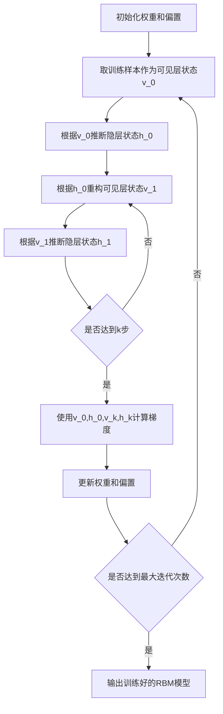

# 受限玻尔兹曼机(RBM)原理与代码实战案例讲解

## 1. 背景介绍

### 1.1 RBM的起源与发展历程

受限玻尔兹曼机(Restricted Boltzmann Machine, RBM)是一种特殊类型的生成式随机神经网络,最早由Smolensky于1986年提出。RBM作为浅层网络,可以作为更复杂的深度学习模型(如深度信念网络)的组成模块。近年来,RBM及其变体在机器学习和人工智能领域得到了广泛应用,尤其在特征学习、协同过滤、分类和生成模型等任务中表现优异。

### 1.2 RBM的应用价值

RBM具有以下几个方面的应用价值:

1. 特征学习:RBM可以用于学习数据的高级特征表示,捕捉数据内在的关联性和模式。这种自动学习到的特征可用于后续的分类、聚类等任务。

2. 协同过滤:在推荐系统中,RBM可以用于学习用户和物品的隐式特征,从而预测用户对未评分物品的喜好程度。

3. 分类:通过在RBM之上叠加分类器(如Softmax层),可以构建判别式RBM用于分类任务。

4. 生成模型:RBM是一种生成式模型,训练好的RBM可用于生成与训练数据相似的新样本。

### 1.3 本文的组织结构

本文将从以下几个方面深入探讨RBM的原理和应用:

- 第2部分介绍RBM的核心概念与各部分之间的联系
- 第3部分详细讲解RBM的核心算法和训练过程
- 第4部分阐述RBM背后的数学模型和关键公式
- 第5部分通过代码实例演示RBM的具体实现
- 第6部分总结RBM在实际场景中的应用案例
- 第7部分推荐RBM相关的工具和学习资源
- 第8部分展望RBM的未来发展趋势和面临的挑战
- 第9部分的附录解答RBM常见的问题

## 2. 核心概念与联系

### 2.1 能量模型

RBM是一种基于能量的生成式随机神经网络模型。在RBM中,每个状态(即神经元的配置)都对应一个标量能量。网络的学习目标是调整参数,使观测数据的状态能量尽可能低,而其他状态的能量较高。能量函数定义为:

$$
E(v,h)=-\sum_{i\in vis}a_iv_i-\sum_{j\in hid}b_jh_j-\sum_{i,j}v_iw_{ij}h_j
$$

其中$v_i$和$h_j$分别表示可见层和隐层神经元的状态,$a_i$和$b_j$是它们的偏置项,$w_{ij}$是连接权重。

### 2.2 无向图模型

RBM可以看作一个二分图模型,可见层神经元和隐层神经元之间存在全连接,但同层神经元之间没有连接。这种结构使得在给定一层神经元状态的条件下,另一层神经元的状态变得相互独立。

### 2.3 Gibbs采样

RBM的训练和推断过程依赖于Gibbs采样。Gibbs采样通过反复交替地对可见层和隐层进行条件采样,最终使网络达到平衡态。在平衡态下,可见层神经元的状态服从训练数据的分布。

### 2.4 对比散度算法

对比散度(Contrastive Divergence, CD)是一种快速训练RBM的近似算法。CD通过初始化可见层为训练样本,进行k步Gibbs采样,然后使用采样得到的统计量来近似真实的梯度。CD-k算法可以有效地加速RBM的训练过程。

以下是RBM核心概念之间的联系图:

## 3. 核心算法原理具体操作步骤

### 3.1 RBM的推断

给定可见层状态$v$,隐层神经元$h_j$的激活概率为:

$$
p(h_j=1|v)=\sigma(b_j+\sum_iw_{ij}v_i)
$$

其中$\sigma$是Sigmoid函数。类似地,给定隐层状态$h$,可见层神经元$v_i$的激活概率为:

$$
p(v_i=1|h)=\sigma(a_i+\sum_jw_{ij}h_j)
$$

### 3.2 RBM的训练

RBM的训练目标是最大化训练数据的对数似然函数:

$$
\mathcal{L}=\sum_{v\in \mathcal{D}}\log p(v)
$$

其中$\mathcal{D}$表示训练集。对数似然函数的梯度为:

$$
\frac{\partial \mathcal{L}}{\partial w_{ij}}=\mathbb{E}_{data}[v_ih_j]-\mathbb{E}_{model}[v_ih_j]
$$

$\mathbb{E}_{data}$表示数据分布下的期望,$\mathbb{E}_{model}$表示模型分布下的期望。

### 3.3 对比散度算法步骤

1. 将可见层状态初始化为训练样本$v^{(0)}$
2. 对当前可见层状态$v^{(0)}$进行推断,得到隐层状态$h^{(0)}$
3. 根据$h^{(0)}$重构可见层状态,得到$v^{(1)}$
4. 继续对$v^{(1)}$进行推断,得到$h^{(1)}$
5. 重复步骤3-4直到进行了k次Gibbs采样
6. 使用$v^{(0)}$,$h^{(0)}$,$v^{(k)}$,$h^{(k)}$来近似梯度:

$$
\Delta w_{ij}=v_i^{(0)}h_j^{(0)}-v_i^{(k)}h_j^{(k)}
$$

7. 根据学习率更新权重:

$$
w_{ij} \leftarrow w_{ij}+\eta \Delta w_{ij}
$$

### 3.4 RBM训练流程图

## 4. 数学模型和公式详细讲解举例说明

### 4.1 能量函数

RBM的能量函数定义为:

$$
E(v,h)=-\sum_{i\in vis}a_iv_i-\sum_{j\in hid}b_jh_j-\sum_{i,j}v_iw_{ij}h_j
$$

其中$v_i \in \{0,1\}$表示可见层第i个神经元的状态,$h_j \in \{0,1\}$表示隐层第j个神经元的状态,$a_i$和$b_j$分别是可见层和隐层神经元的偏置项,$w_{ij}$是连接可见层第i个神经元和隐层第j个神经元的权重。

能量函数衡量了一个状态的"合理性",能量越低的状态在RBM模型下出现的概率越大。RBM的学习过程就是调整权重和偏置,使得训练数据的状态能量尽可能低。

举例说明:假设有一个包含4个可见层神经元和3个隐层神经元的RBM,权重矩阵为:

$$
W=\begin{bmatrix}
1 & -2 & 3 \\
-1 & 2 & -1 \\
2 & 1 & -3 \\
1 & -1 & 2
\end{bmatrix}
$$

可见层偏置为$a=[1,-2,3,-1]$,隐层偏置为$b=[-1,2,1]$。给定可见层状态$v=[1,0,1,0]$和隐层状态$h=[1,0,1]$,则状态$(v,h)$的能量为:

$$
\begin{aligned}
E(v,h)&=-\sum_{i\in vis}a_iv_i-\sum_{j\in hid}b_jh_j-\sum_{i,j}v_iw_{ij}h_j \\
&=-(1\times1+(-2)\times0+3\times1+(-1)\times0)-(-1\times1+2\times0+1\times1)-(1\times1\times1+0\times(-2)\times0+1\times3\times1+0\times1\times1) \\
&=-4-0-4=-8
\end{aligned}
$$

### 4.2 概率分布

RBM定义了一个基于能量函数的联合概率分布:

$$
p(v,h)=\frac{1}{Z}\exp(-E(v,h))
$$

其中$Z$是配分函数,用于归一化概率分布:

$$
Z=\sum_{v,h}\exp(-E(v,h))
$$

边缘分布$p(v)$可以通过对所有可能的隐层状态求和得到:

$$
p(v)=\frac{1}{Z}\sum_h\exp(-E(v,h))
$$

给定可见层状态$v$,隐层神经元$h_j$的条件概率为:

$$
p(h_j=1|v)=\sigma(b_j+\sum_iw_{ij}v_i)
$$

其中$\sigma(x)=\frac{1}{1+\exp(-x)}$是Sigmoid函数。

类似地,给定隐层状态$h$,可见层神经元$v_i$的条件概率为:

$$
p(v_i=1|h)=\sigma(a_i+\sum_jw_{ij}h_j)
$$

举例说明:对于上一节中的RBM,假设配分函数$Z=100$,则状态$(v=[1,0,1,0],h=[1,0,1])$的联合概率为:

$$
p(v,h)=\frac{1}{Z}\exp(-E(v,h))=\frac{1}{100}\exp(8)\approx0.0294
$$

给定可见层状态$v=[1,0,1,0]$,第一个隐层神经元的条件概率为:

$$
\begin{aligned}
p(h_1=1|v)&=\sigma(b_1+\sum_iw_{i1}v_i) \\
&=\sigma(-1+1\times1+(-1)\times0+2\times1+1\times0) \\
&=\sigma(2)\approx0.8808
\end{aligned}
$$

### 4.3 对比散度算法

对比散度算法通过近似梯度来加速RBM的训练。权重$w_{ij}$的梯度近似为:

$$
\frac{\partial \mathcal{L}}{\partial w_{ij}}\approx v_i^{(0)}h_j^{(0)}-v_i^{(k)}h_j^{(k)}
$$

其中$v^{(0)}$是训练样本,$h^{(0)}$是根据$v^{(0)}$推断得到的隐层状态,$v^{(k)}$和$h^{(k)}$是经过k步Gibbs采样得到的状态。

偏置项$a_i$和$b_j$的梯度近似为:

$$
\begin{aligned}
\frac{\partial \mathcal{L}}{\partial a_i}&\approx v_i^{(0)}-v_i^{(k)} \\
\frac{\partial \mathcal{L}}{\partial b_j}&\approx h_j^{(0)}-h_j^{(k)}
\end{aligned}
$$

权重和偏置的更新规则为:

$$
\begin{aligned}
w_{ij}&\leftarrow w_{ij}+\eta(v_i^{(0)}h_j^{(0)}-v_i^{(k)}h_j^{(k)}) \\
a_i&\leftarrow a_i+\eta(v_i^{(0)}-v_i^{(k)}) \\
b_j&\leftarrow b_j+\eta(h_j^{(0)}-h_j^{(k)})
\end{aligned}
$$

其中$\eta$是学习率。

举例说明:假设对于某个训练样本$v^{(0)}=[1,0,1,0]$,经过推断和1步Gibbs采样得到:

$$
\begin{aligned}
h^{(0)}&=[1,0,1] \\
v^{(1)}&=[1,1,0,0] \\
h^{(1)}&=[0,1,0]
\end{aligned}
$$

则权重$w_{11{"msg_type":"generate_answer_finish","data":"","from_module":null,"from_unit":null}