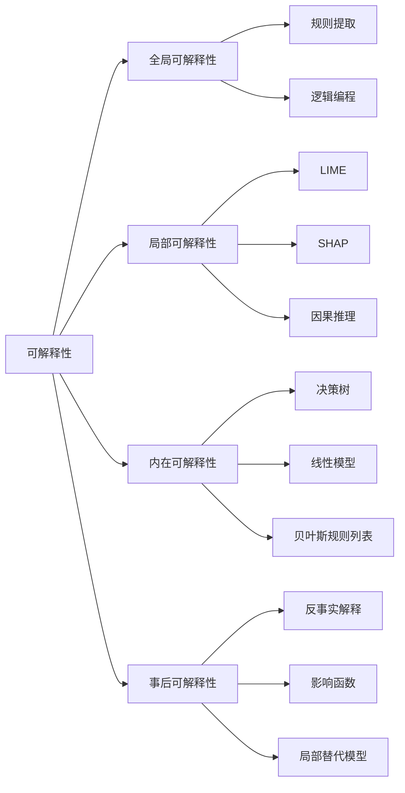

# 可解释性 (Explainability)

## 1. 背景介绍
### 1.1 人工智能的发展
#### 1.1.1 人工智能的历史
#### 1.1.2 人工智能的现状
#### 1.1.3 人工智能面临的挑战
### 1.2 可解释性的重要性
#### 1.2.1 可解释性的定义
#### 1.2.2 可解释性在人工智能中的地位
#### 1.2.3 可解释性对于人工智能的意义

## 2. 核心概念与联系
### 2.1 可解释性的分类
#### 2.1.1 全局可解释性
#### 2.1.2 局部可解释性
#### 2.1.3 内在可解释性与事后可解释性
### 2.2 可解释性与其他概念的联系
#### 2.2.1 可解释性与可解释性
#### 2.2.2 可解释性与透明性
#### 2.2.3 可解释性与公平性

## 3. 核心算法原理具体操作步骤
### 3.1 基于规则的可解释性方法
#### 3.1.1 决策树
#### 3.1.2 规则提取
#### 3.1.3 逻辑编程
### 3.2 基于模型的可解释性方法 
#### 3.2.1 线性模型
#### 3.2.2 广义可加模型
#### 3.2.3 贝叶斯规则列表
### 3.3 基于样本的可解释性方法
#### 3.3.1 反事实解释
#### 3.3.2 影响函数
#### 3.3.3 局部替代模型

## 4. 数学模型和公式详细讲解举例说明
### 4.1 LIME模型
#### 4.1.1 LIME模型的数学原理
#### 4.1.2 LIME模型的优缺点分析
#### 4.1.3 LIME模型的应用案例
### 4.2 SHAP模型
#### 4.2.1 SHAP模型的数学原理 
#### 4.2.2 SHAP模型的优缺点分析
#### 4.2.3 SHAP模型的应用案例
### 4.3 因果推理模型
#### 4.3.1 因果推理模型的数学原理
#### 4.3.2 因果推理模型的优缺点分析 
#### 4.3.3 因果推理模型的应用案例

## 5. 项目实践：代码实例和详细解释说明
### 5.1 利用LIME解释图像分类模型
#### 5.1.1 项目背景与目标
#### 5.1.2 数据集准备与模型训练
#### 5.1.3 LIME解释器的构建与应用
### 5.2 利用SHAP解释自然语言处理模型
#### 5.2.1 项目背景与目标
#### 5.2.2 数据集准备与模型训练
#### 5.2.3 SHAP解释器的构建与应用
### 5.3 利用因果推理解释推荐系统
#### 5.3.1 项目背景与目标
#### 5.3.2 数据集准备与模型训练
#### 5.3.3 因果推理解释器的构建与应用

## 6. 实际应用场景
### 6.1 医疗领域的应用
#### 6.1.1 医学影像诊断的可解释性
#### 6.1.2 药物发现的可解释性
#### 6.1.3 临床决策支持系统的可解释性
### 6.2 金融领域的应用
#### 6.2.1 信用评分的可解释性
#### 6.2.2 风险管理的可解释性
#### 6.2.3 反欺诈的可解释性
### 6.3 司法领域的应用
#### 6.3.1 犯罪预测的可解释性
#### 6.3.2 量刑预测的可解释性
#### 6.3.3 法律文本分析的可解释性

## 7. 工具和资源推荐
### 7.1 可解释性工具包
#### 7.1.1 AIX360
#### 7.1.2 InterpretML
#### 7.1.3 Alibi
### 7.2 可解释性相关数据集
#### 7.2.1 FICO Explainable ML Challenge数据集
#### 7.2.2 Nursery数据集
#### 7.2.3 Adult数据集
### 7.3 可解释性相关论文与书籍
#### 7.3.1 《Explainable AI: Interpreting, Explaining and Visualizing Deep Learning》
#### 7.3.2 《Interpretable Machine Learning》
#### 7.3.3 《Explanatory Model Analysis》

## 8. 总结：未来发展趋势与挑战
### 8.1 可解释性的标准化
#### 8.1.1 可解释性评估标准的建立
#### 8.1.2 可解释性报告模板的制定
#### 8.1.3 可解释性审计机制的完善
### 8.2 可解释性与其他AI属性的权衡
#### 8.2.1 可解释性与性能的权衡
#### 8.2.2 可解释性与隐私保护的权衡
#### 8.2.3 可解释性与公平性的权衡
### 8.3 人机协作式的可解释性
#### 8.3.1 人机交互式的可解释性
#### 8.3.2 知识图谱增强的可解释性
#### 8.3.3 自然语言交互式的可解释性

## 9. 附录：常见问题与解答
### 9.1 可解释性与准确性是否存在矛盾？
### 9.2 如何权衡全局可解释性和局部可解释性？
### 9.3 模型的可解释性是否等同于模型的可理解性？
### 9.4 可解释性技术是否会泄露敏感信息和隐私？
### 9.5 如何评估一个模型的可解释性？

人工智能技术的飞速发展为我们的生活带来了诸多便利，但也引发了一系列问题，其中最为突出的就是AI系统的黑盒特性。由于AI模型的复杂性和不透明性，我们往往难以理解其内部工作机制和决策逻辑，这不仅限制了AI技术的应用范围，也引发了人们对AI的不信任。因此，如何让AI系统变得更加透明、可解释，成为了当前学界和业界的重要课题。

可解释性（Explainability）是指让人工智能系统的决策过程和结果变得可以被人类所理解和信任的属性。它要求AI系统不仅要给出决策结果，还要给出得出该结果的原因和依据，让使用者能够明白AI系统的工作原理，从而建立对AI的信任。可解释性已成为继准确性、鲁棒性之后，AI系统需要具备的又一重要特性。

根据解释粒度的不同，可解释性可分为全局可解释性和局部可解释性。全局可解释性是对模型整体行为的解释，关注模型的总体工作机制；而局部可解释性则聚焦于解释模型对于特定样本的预测结果。此外，根据解释时机的不同，可解释性还可分为内在可解释性和事后可解释性。内在可解释性要求模型在设计之初就考虑可解释性，采用决策树、线性模型等易于解释的模型；而事后可解释性则在训练完成后，利用各种技术手段对黑盒模型进行解释。

为了让AI系统获得可解释性，研究者们提出了多种方法，主要可分为基于规则、基于模型和基于样本三大类。基于规则的方法通过提取模型中蕴含的规则，生成易于理解的解释，代表方法有决策树、规则提取和逻辑编程等。基于模型的方法则利用简单透明的模型去近似复杂的黑盒模型，从而实现可解释性，代表方法有线性模型、广义可加模型和贝叶斯规则列表等。基于样本的方法通过分析黑盒模型关于特定样本的行为，来解释模型的局部决策过程，代表方法有LIME、SHAP、因果推理等。

在实践中，可解释性技术已在医疗、金融、司法等领域得到广泛应用。以医疗领域为例，利用可解释性技术，我们可以了解AI诊断系统给出特定诊断结果的原因，识别影响诊断的关键特征，评估诊断结果的可信度，让医生和患者安心信任AI辅助诊断。在金融领域，可解释性有助于识别影响信用评分和风控决策的关键因素，揭示AI模型可能存在的偏见和歧视，提高金融服务的公平性和合规性。

尽管可解释性是AI系统的必备属性，但实现可解释性也面临诸多技术挑战。首先，可解释性与模型性能往往存在权衡，过于简单的模型虽然容易解释，但性能难以满足需求。如何在保证性能的同时提高模型的可解释性，是一个有待探索的问题。其次，可解释性方法的评估和对比也缺乏统一的标准，不同的可解释性指标和评估方法得出的结论可能大相径庭，给可解释性研究和应用带来困扰。此外，由于数据和模型的差异，一种可解释性方法很难适用于所有场景，往往需要根据具体任务和数据进行个性化设计，这大大提高了可解释性的实现成本。

未来，可解释性技术的发展大致会沿着三个方向展开：一是建立可解释性的标准化体系，制定统一的可解释性定义、评估指标和报告规范，方便可解释性成果的交流和应用；二是研究可解释性与隐私保护、公平性等其他AI属性之间的关系，设计兼顾多种属性的AI系统；三是加强人机协同，利用知识图谱、自然语言交互等技术，让AI系统能够以更自然的方式向人类解释其决策，并接受人类的反馈和纠正，真正实现人机之间的无障碍沟通。

可解释性是人工智能走向成熟、走向规模化应用的必经之路。只有让AI变得可解释、可理解、可信任，我们才能放心地将其应用到生活的方方面面。可解释性虽然任重道远，但通过学界和业界的共同努力，相信我们终会揭开AI黑盒的神秘面纱，让AI造福人类的同时，也让人类理解并信任AI。

作者：禅与计算机程序设计艺术 / Zen and the Art of Computer Programming