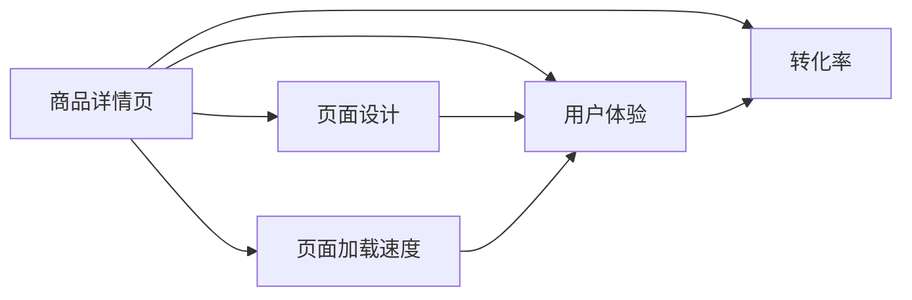

# 商品详情页优化：提升转化率

## 1. 背景介绍
### 1.1 电商行业竞争激烈
随着互联网技术的不断发展,电子商务行业日益繁荣。然而,伴随着行业的高速发展,竞争也变得越来越激烈。在这样的大环境下,如何在激烈的竞争中脱颖而出,成为每个电商平台都必须思考和面对的问题。

### 1.2 详情页在电商中的重要性
在电商网站中,商品详情页扮演着至关重要的角色。它是顾客了解商品、产生购买欲望的关键页面,对转化率的提升有着直接的影响。一个优秀的商品详情页不仅能够清晰地展示商品的特点,还能引导顾客快速下单,提升转化。

### 1.3 商品详情页优化的必要性
面对激烈的行业竞争,电商平台要想在销售业绩上更进一步,商品详情页的优化就显得尤为重要和迫切。通过优化详情页,不仅能够为顾客提供更好的购物体验,同时还能够提升商品的转化率,为电商平台带来更多的销售额和利润。

## 2. 核心概念与联系
### 2.1 转化率
转化率是指访问网站的用户中,有多少完成了预期的目标,通常以百分比表示。在电商网站中,转化率通常指的是有多少访问商品详情页的用户最终完成了购买。它是衡量商品详情页优化效果的重要指标。

### 2.2 用户体验
用户体验是指用户在使用产品或服务的过程中建立起来的主观感受。良好的用户体验能够让顾客在浏览商品详情页的过程中感到舒适和愉悦,从而更有购买的欲望。提升详情页的用户体验是优化的重点。

### 2.3 页面设计
页面设计是指根据用户需求,对页面的布局、色彩、交互等方面进行设计和规划。优秀的页面设计能够引导用户关注重点内容,同时提供流畅的浏览和交互体验。页面设计是影响详情页转化率的关键因素。

### 2.4 页面加载速度
页面加载速度是指页面从开始加载到完全呈现在用户面前所需要的时间。页面加载速度越快,用户等待的时间就越短,浏览体验就越好。反之,加载速度慢则容易引起用户的不耐烦,导致页面跳出率上升。

### 核心概念关系图



## 3. 核心算法原理具体操作步骤
### 3.1 A/B测试
A/B测试是一种常用的页面优化方法。其基本原理是同时设计两个版本的页面(A和B),让一部分用户访问A版本,另一部分访问B版本,通过比较两个版本的转化率,来判断哪个版本的效果更好。

#### 3.1.1 确定测试目标
确定要测试的页面元素,例如标题、主图、按钮等,并设定评估指标,例如点击率、转化率等。

#### 3.1.2 设计测试方案
根据要测试的页面元素,设计两个不同的版本。两个版本只在测试元素上有差异,其他部分保持一致。

#### 3.1.3 流量分配
将访问页面的用户随机分配到两个版本中,保证每个版本的访问量相当。

#### 3.1.4 数据收集与分析
在测试期间收集各版本的数据,包括访问量、点击量、订单量等。在测试结束后,对数据进行统计分析,根据评估指标,得出优化的结论。

### 3.2 用户行为分析
通过分析用户在页面上的行为数据,可以发现页面存在的问题,并有针对性地进行优化。常用的用户行为分析方法包括热力图、点击流等。

#### 3.2.1 数据采集
在页面中埋点,收集用户的行为数据,例如点击、滚动、停留时间等。

#### 3.2.2 数据处理
对采集到的行为数据进行清洗和处理,去除异常数据,将数据规整为便于分析的格式。

#### 3.2.3 数据可视化
将处理后的数据进行可视化展示,生成热力图、点击流等,便于分析页面中的用户行为模式。

#### 3.2.4 问题发现与优化
根据可视化分析的结果,发现页面中存在的问题,例如用户关注度低的区域、跳出率高的位置等,并针对性地进行优化。

## 4. 数学模型和公式详细讲解举例说明
### 4.1 转化率计算
转化率的计算公式为:
$$
转化率 = \frac{完成转化的用户数}{页面访问总用户数} \times 100\%
$$

例如,一个商品详情页一天内有1000个访客,最终有50人完成了购买,则转化率为:
$$
转化率 = \frac{50}{1000} \times 100\% = 5\%
$$

### 4.2 提升转化率
若优化前页面的转化率为 $x$,优化后转化率提升了 $y$,则优化后的转化率为:
$$
优化后转化率 = x \times (1+y)
$$

例如,一个页面原本的转化率为5%,经过优化之后,转化率提升了20%,则优化后的转化率为:
$$
优化后转化率 = 5\% \times (1+20\%) = 6\%
$$

### 4.3 A/B测试显著性
在A/B测试中,要评估两个版本转化率差异是否显著,可以使用假设检验的方法。其中,z检验可以用来评估两个版本转化率的差异。

两个版本转化率之差(d)的计算公式为:
$$
d = \frac{X_A}{N_A} - \frac{X_B}{N_B}
$$
其中,$X_A$ 和 $X_B$ 分别为两个版本的转化次数,$N_A$ 和 $N_B$ 分别为两个版本的访问次数。

z值的计算公式为:
$$
z = \frac{d}{\sqrt{p(1-p)(\frac{1}{N_A}+\frac{1}{N_B})}}
$$
其中,
$$
p = \frac{X_A+X_B}{N_A+N_B}
$$

若计算出的z值大于等于1.96(或小于等于-1.96),则认为两个版本的转化率差异显著,否则认为差异不显著。

## 5. 项目实践：代码实例和详细解释说明
### 5.1 页面加载速度优化
页面加载速度是影响转化率的重要因素。下面是一些常用的页面加载速度优化方法和代码示例。

#### 5.1.1 图片压缩
对页面中的图片进行压缩,可以减小图片体积,加快加载速度。可以使用如下 Python 代码对图片进行压缩:

```python
from PIL import Image

def compress_image(image_path, output_path, quality=85):
    with Image.open(image_path) as img:
        img.save(output_path, "JPEG", optimize=True, quality=quality)

compress_image("original.jpg", "compressed.jpg", quality=85)
```

以上代码使用 Python 的 Pillow 库,将原始图片压缩为质量为85%的JPEG图片,大大减小了图片的体积。

#### 5.1.2 静态资源缓存
对页面中的静态资源(如JS、CSS文件)设置缓存,可以减少重复请求,提高加载速度。可以在Nginx配置中添加如下缓存设置:

```nginx
location ~* \.(js|css|png|jpg|jpeg|gif|ico)$ {
    expires 7d;
    add_header Cache-Control "public, no-transform";
}
```

以上配置对JS、CSS、图片等静态资源设置了7天的缓存时间,并添加了 Cache-Control 头,提示浏览器缓存这些资源。

#### 5.1.3 CDN加速
使用CDN(内容分发网络)可以将页面的静态资源分发到距离用户更近的服务器,减少网络传输时间,提高加载速度。可以将静态资源的URL修改为CDN的URL,例如:

```html

<script src="https://cdn.example.com/script.js"></script>
```

以上代码将图片和JS文件的URL修改为CDN的URL,实现了静态资源的CDN加速。

### 5.2 页面布局优化
页面布局是影响用户体验和转化率的重要因素。下面是一些常用的页面布局优化方法和代码示例。

#### 5.2.1 响应式设计
使用响应式设计可以让页面在不同尺寸的设备上都能有良好的展示效果。可以使用CSS的媒体查询来实现响应式布局,例如:

```css
.container {
    width: 100%;
}

@media (min-width: 768px) {
    .container {
        width: 750px;
    }
}

@media (min-width: 992px) {
    .container {
        width: 970px;
    }
}

@media (min-width: 1200px) {
    .container {
        width: 1170px;
    }
}
```

以上代码根据屏幕宽度,设置了不同的容器宽度,实现了响应式布局。

#### 5.2.2 模块化设计
将页面划分为不同的模块,可以提高页面的可维护性和可扩展性。可以使用HTML5的语义化标签和CSS的类名来实现模块化设计,例如:

```html
<header>
    <nav>
        <ul>
            <li><a href="#">首页</a></li>
            <li><a href="#">分类</a></li>
            <li><a href="#">购物车</a></li>
        </ul>
    </nav>
</header>
<main>
    <section class="product-info">
        <h1>商品名称</h1>
        <p>商品描述</p>
        <div class="price">¥99.00</div>
        <button class="btn-buy">立即购买</button>
    </section>
    <section class="product-detail">
        <h2>商品详情</h2>
        <p>详细描述</p>
        
    </section>
</main>
<footer>
    <p>&copy; 2023 XXX公司</p>
</footer>
```

以上代码使用了语义化的标签(`<header>`、`<nav>`、`<main>`、`<section>`、`<footer>`)和有意义的类名(`product-info`、`product-detail`、`btn-buy`),实现了页面的模块化设计。

## 6. 实际应用场景
商品详情页的优化在各大电商平台中都有广泛的应用,下面是一些实际案例。

### 6.1 京东商品详情页优化
京东是国内最大的自营式电商平台之一,其商品详情页的设计和优化一直走在行业前列。近年来,京东对商品详情页进行了多方面的优化,主要包括:

- 页面布局优化:采用模块化设计,将页面划分为商品信息、价格走势、评价、推荐等多个模块,提高页面的清晰度和易用性。
- 页面加载速度优化:使用CDN加速、图片压缩、静态资源缓存等技术,大幅提升了页面的加载速度。
- 页面信息优化:根据不同商品的特点,优化商品信息的展示方式,突出商品卖点,提高转化率。

通过以上优化,京东的商品详情页用户体验和转化率都有了明显的提升。

### 6.2 淘宝商品详情页优化
淘宝是国内最大的平台型电商,拥有海量的商家和商品。为了帮助商家提升详情页的转化率,淘宝推出了"详情页优化助手"等工具,主要功能包括:

- 页面分析:对详情页的各项指标(如访问量、停留时间、转化率等)进行统计分析,帮助商家发现问题所在。
- 页面诊断:根据页面分析结果,对详情页进行诊断,提出优化建议,例如优化页面标题、调整页面布局等。
- A/B测试:提供A/B测试工具,帮助商家对不同版本的详情页进行对比测试,选出最优方案。

通过使用"详情页优化助手",众多商家的详情页转化率都有了不同程度的提升,为商家带来