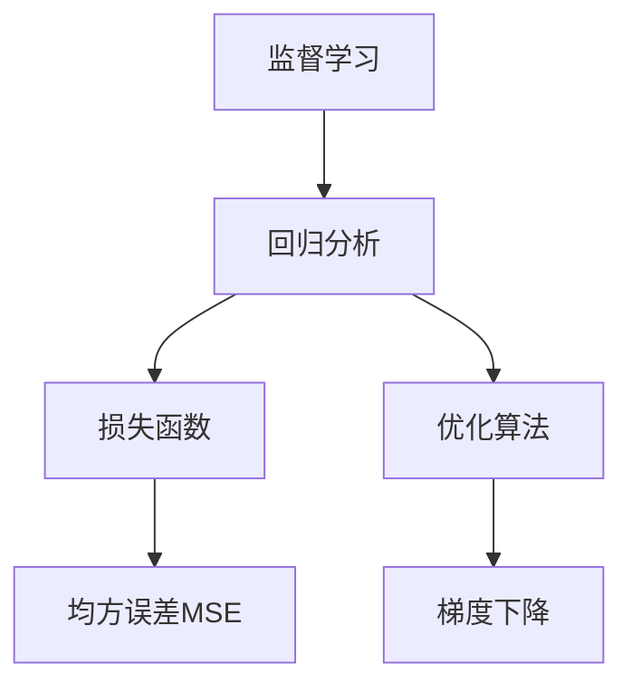
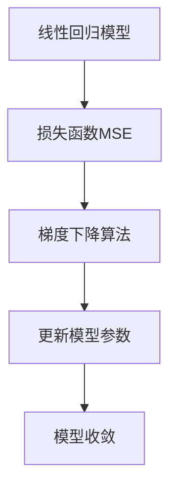

# 回归(Regression) - 原理与代码实例讲解

## 1.背景介绍

在数据分析和机器学习领域中,回归分析是一种非常重要和常用的技术。它旨在研究自变量(独立变量)和因变量(依赖变量)之间的关系,并建立数学模型来描述和预测它们之间的关联。回归分析广泛应用于各个领域,如金融、经济、工程、医学等,用于预测分析、决策支持等场景。

回归问题可以分为线性回归和非线性回归两大类。线性回归试图找到自变量和因变量之间的线性关系,而非线性回归则考虑更复杂的非线性映射关系。本文将重点介绍线性回归的原理、算法和实现。

## 2.核心概念与联系

### 2.1 监督学习

回归分析属于监督学习的范畴。监督学习是机器学习中一个重要的分支,它利用已知的输入数据和相应的标签(监督信号)训练模型,使模型能够学习输入和输出之间的映射关系。在回归问题中,输入数据是自变量,输出是连续的数值型因变量。

### 2.2 损失函数

为了评估模型的预测效果,我们需要定义一个损失函数(Loss Function)或代价函数(Cost Function)。损失函数用于衡量模型预测值与真实值之间的差距,差距越小,模型的预测效果就越好。对于回归问题,常用的损失函数是均方误差(Mean Squared Error, MSE)。

### 2.3 优化算法

训练模型的目标是找到能够最小化损失函数的模型参数值。这是一个优化问题,通常采用梯度下降(Gradient Descent)等优化算法来迭代更新模型参数,使损失函数的值不断减小,直到收敛到最小值。



## 3.核心算法原理具体操作步骤

### 3.1 线性回归模型

线性回归试图找到一个线性方程,使自变量和因变量之间的关系最佳拟合。对于单变量线性回归,模型可以表示为:

$$y = \theta_0 + \theta_1x$$

其中$y$是因变量,也就是我们要预测的目标值;$x$是自变量,也就是输入特征;$\theta_0$和$\theta_1$是需要学习的模型参数,分别表示直线的截距和斜率。

对于多元线性回归,模型可以扩展为:

$$y = \theta_0 + \theta_1x_1 + \theta_2x_2 + ... + \theta_nx_n$$

其中$x_1, x_2, ..., x_n$是多个自变量特征,$\theta_0, \theta_1, ..., \theta_n$是对应的模型参数。

### 3.2 损失函数:均方误差(MSE)

均方误差(MSE)是线性回归中常用的损失函数,用于衡量模型预测值与真实值之间的差距。对于给定的训练数据集$\{(x^{(i)}, y^{(i)}); i=1,...,m\}$,其中$x^{(i)}$是第$i$个训练样本的自变量特征向量,$y^{(i)}$是对应的因变量标签值。均方误差的计算公式为:

$$J(\theta) = \frac{1}{2m}\sum_{i=1}^{m}(h_\theta(x^{(i)}) - y^{(i)})^2$$

其中$h_\theta(x)$是模型的预测函数,对于线性回归就是前面提到的线性方程;$\theta$是需要学习的模型参数向量。目标是找到能够最小化均方误差$J(\theta)$的参数值$\theta$。

### 3.3 梯度下降算法

梯度下降是一种常用的优化算法,用于找到能够最小化损失函数的模型参数值。对于线性回归问题,梯度下降算法的具体步骤如下:

1. 初始化模型参数$\theta$为随机值。
2. 计算损失函数$J(\theta)$对每个参数$\theta_j$的偏导数(梯度):
   $$\frac{\partial J(\theta)}{\partial \theta_j} = \frac{1}{m}\sum_{i=1}^{m}(h_\theta(x^{(i)}) - y^{(i)})x_j^{(i)}$$
3. 更新每个参数$\theta_j$:
   $$\theta_j := \theta_j - \alpha\frac{\partial J(\theta)}{\partial \theta_j}$$
   其中$\alpha$是学习率,控制每次更新的步长。
4. 重复步骤2和3,直到损失函数收敛或达到停止条件。

梯度下降算法通过不断迭代更新参数值,使损失函数的值不断减小,直到收敛到最小值。学习率$\alpha$的选择对算法的收敛速度和性能有重要影响。



## 4.数学模型和公式详细讲解举例说明

在这一部分,我们将详细解释线性回归的数学模型和公式,并通过具体的例子来帮助理解。

### 4.1 单变量线性回归

假设我们有一个数据集,包含房屋面积($x$)和房价($y$)的数据点。我们的目标是找到一条最佳拟合的直线,描述房屋面积和房价之间的线性关系。

$$y = \theta_0 + \theta_1x$$

其中$y$是房价,$x$是房屋面积,$\theta_0$和$\theta_1$分别是直线的截距和斜率,需要通过训练数据来学习这两个参数。

为了评估模型的预测效果,我们使用均方误差(MSE)作为损失函数:

$$J(\theta_0, \theta_1) = \frac{1}{2m}\sum_{i=1}^{m}(h_\theta(x^{(i)}) - y^{(i)})^2$$

其中$m$是训练数据的样本数量,$h_\theta(x^{(i)}) = \theta_0 + \theta_1x^{(i)}$是模型对第$i$个样本的预测值,$y^{(i)}$是第$i$个样本的真实房价。

我们的目标是找到$\theta_0$和$\theta_1$的值,使得均方误差$J(\theta_0, \theta_1)$最小化。这可以通过梯度下降算法来实现。

对于单变量线性回归,梯度下降算法的更新步骤如下:

$$\theta_0 := \theta_0 - \alpha\frac{1}{m}\sum_{i=1}^{m}(h_\theta(x^{(i)}) - y^{(i)})$$
$$\theta_1 := \theta_1 - \alpha\frac{1}{m}\sum_{i=1}^{m}(h_\theta(x^{(i)}) - y^{(i)})x^{(i)}$$

其中$\alpha$是学习率,控制每次更新的步长。我们不断迭代更新$\theta_0$和$\theta_1$,直到损失函数收敛或达到停止条件。

### 4.2 多元线性回归

在实际应用中,我们经常需要考虑多个自变量特征对因变量的影响。这种情况下,我们使用多元线性回归模型:

$$y = \theta_0 + \theta_1x_1 + \theta_2x_2 + ... + \theta_nx_n$$

其中$x_1, x_2, ..., x_n$是多个自变量特征,$\theta_0, \theta_1, ..., \theta_n$是对应的模型参数。

对于多元线性回归,均方误差的计算公式为:

$$J(\theta) = \frac{1}{2m}\sum_{i=1}^{m}(h_\theta(x^{(i)}) - y^{(i)})^2$$

其中$h_\theta(x^{(i)}) = \theta_0 + \theta_1x_1^{(i)} + \theta_2x_2^{(i)} + ... + \theta_nx_n^{(i)}$是模型对第$i$个样本的预测值,$x^{(i)} = (x_1^{(i)}, x_2^{(i)}, ..., x_n^{(i)})$是第$i$个样本的自变量特征向量,$y^{(i)}$是第$i$个样本的真实因变量值。

梯度下降算法的更新步骤为:

$$\theta_j := \theta_j - \alpha\frac{1}{m}\sum_{i=1}^{m}(h_\theta(x^{(i)}) - y^{(i)})x_j^{(i)}$$

其中$j=0,1,...,n$,对应模型参数$\theta_0, \theta_1, ..., \theta_n$的更新。

通过不断迭代更新模型参数,我们可以找到最小化均方误差的参数值,从而得到最佳拟合的多元线性回归模型。

## 5.项目实践:代码实例和详细解释说明

在这一部分,我们将通过Python代码实例来实现线性回归算法,并详细解释每一步的操作。

### 5.1 导入所需库

```python
import numpy as np
import matplotlib.pyplot as plt
```

我们将使用NumPy进行数值计算,Matplotlib用于数据可视化。

### 5.2 生成示例数据

```python
# 生成示例数据
X = 2 * np.random.rand(100, 1)
y = 4 + 3 * X + np.random.randn(100, 1)
```

这里我们生成了100个样本的训练数据。`X`是一个100x1的矩阵,表示自变量特征(随机生成的0到2之间的值)。`y`是一个100x1的矩阵,表示因变量标签值,由线性方程`y = 4 + 3*X + noise`生成,其中`noise`是随机噪声。

### 5.3 数据可视化

```python
# 数据可视化
plt.scatter(X, y)
plt.xlabel('X')
plt.ylabel('y')
plt.show()
```

我们可以绘制散点图来可视化数据分布,如下所示:

```
// 插入散点图图像
```

从图中可以看出,数据点大致呈线性分布,但存在一定的噪声。

### 5.4 线性回归实现

```python
# 线性回归实现
def linear_regression(X, y):
    # 添加偏置项
    X = np.concatenate((np.ones((X.shape[0], 1)), X), axis=1)
    
    # 计算模型参数
    theta = np.dot(np.dot(np.linalg.inv(np.dot(X.T, X)), X.T), y)
    
    return theta

# 训练模型
theta = linear_regression(X, y)
print(f'模型参数: {theta.flatten()}')
```

在这个实现中,我们首先为输入数据`X`添加一列全为1的偏置项,以便计算截距项`theta_0`。

接下来,我们使用了Normal Equation(正规方程)来计算模型参数`theta`。Normal Equation是解析求解线性回归参数的闭式解,它的计算公式为:

$$\theta = (X^TX)^{-1}X^Ty$$

其中$X$是包含偏置项的输入数据矩阵,$y$是因变量标签向量。

最后,我们打印出学习到的模型参数`theta`。对于我们生成的示例数据,输出结果应该接近`[4.0, 3.0]`,这与我们生成数据时使用的线性方程`y = 4 + 3*X`相符。

### 5.5 模型评估和可视化

```python
# 模型评估
y_pred = np.dot(X, theta[1]) + theta[0]
mse = np.mean((y - y_pred) ** 2)
print(f'均方误差(MSE): {mse}')

# 可视化结果
plt.scatter(X, y)
plt.plot(X, y_pred, 'r')
plt.xlabel('X')
plt.ylabel('y')
plt.show()
```

在训练完模型后,我们可以使用学习到的参数`theta`来预测新的输入数据,并计算均方误差(MSE)来评估模型的预测效果。

最后,我们在散点图上绘制出模型的预测直线,以直观地观察拟合效果。结果如下所示:

```
// 插入散点图和拟合直线图像
```

从图中可以看出,我们训练的线性回归模型能够很好地拟合给定的数据分布。

## 6.实际应用场景

线性回归在各个领域都有广泛的应用,下面列举了一些典型的应用场景:

1. **房地