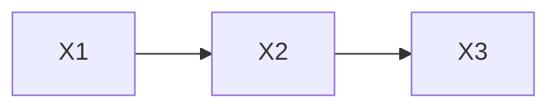

# 因果推理与因果学习原理与代码实战案例讲解

## 1.背景介绍

在现实世界中,事物之间存在着复杂的因果关系网络。能够理解和推理这些因果关系,对于科学研究、决策制定和智能系统建模都至关重要。传统的机器学习方法主要关注预测,但却忽视了对因果机制的挖掘。而因果推理和因果学习则旨在从数据中发现潜在的因果关系,并建立解释性的因果模型。

### 1.1 因果推理的重要性

因果推理可以帮助我们回答"为什么"这一根本性的问题,而不仅仅是预测"会发生什么"。例如,在医疗领域,我们不仅需要诊断疾病,更需要了解疾病的根源以及治疗方案的效果;在社会科学中,我们需要分析政策的因果影响,而不仅仅是关联性;在经济学中,我们需要评估一项干预措施对经济指标的影响。

### 1.2 传统方法的局限性

传统的机器学习算法,如回归、分类等,主要关注预测性能,但并不能解释变量之间的因果关系。这种缺乏因果解释性的方法存在一些固有的局限性:

1. 无法处理反事实推理(counterfactual reasoning),即"如果..."这种情况下会发生什么。
2. 无法区分真正的因果关系和简单的相关性,从而可能导致错误的决策。
3. 无法推广到新的环境或干预情况,因为它们无法捕捉底层的因果机制。

### 1.3 因果学习的兴起

为了克服这些局限性,近年来因果学习(Causal Learning)作为一个新兴的研究领域逐渐兴起。它结合了机器学习、统计学、经济学和哲学等多个学科的理论和方法,旨在从数据中发现因果关系,并建立具有因果语义的模型。

因果学习不仅关注预测,更重要的是要揭示变量之间的因果机制,从而支持决策、干预和推理。它为传统的数据驱动方法提供了一种新的解释性视角,有助于构建更加透明、可解释和可靠的智能系统。

## 2.核心概念与联系

在深入探讨因果学习的算法和方法之前,我们需要先了解一些核心概念和它们之间的联系。

### 2.1 因果图

因果图(Causal Graph)是一种用于表示变量之间因果关系的图形模型。在因果图中,节点表示变量,有向边表示直接的因果影响。例如,下图表示"吸烟"直接导致"肺癌",而"基因"则间接影响"肺癌"。

因果图不仅直观地展示了变量之间的因果结构,而且还编码了一些重要的条件独立性假设,这对于因果推理和学习都是至关重要的。

### 2.2 结构方程模型

结构方程模型(Structural Equation Model, SEM)是一种将因果关系形式化的数学模型。在SEM中,每个变量都由其直接原因变量和一个随机噪声项决定,用如下形式表示:

$$
X_i = f_i(PA_i, \epsilon_i)
$$

其中,$PA_i$表示$X_i$的父节点(直接原因变量),$\epsilon_i$是一个外生噪声项,代表了其他未观测到的原因。$f_i$是一个确定性函数,描述了$X_i$如何由其父节点和噪声项决定。

SEM不仅为因果关系提供了紧凑的数学表示,而且还为后续的因果推理和学习奠定了理论基础。

### 2.3 d-分离和条件独立性

在因果图中,如果两个非相交集合$X$和$Y$之间的所有"径路"都被第三个集合$Z$阻塞(d-separated),那么在给定$Z$的条件下,$X$和$Y$就是条件独立的。这种条件独立性是从因果图的结构中导出的,反映了底层数据生成的因果机制。

利用这一性质,我们可以从观测数据中检验条件独立性,进而推断出变量之间可能存在的因果关系。这是许多因果发现算法的核心思想。

### 2.4 反事实推理

反事实推理(Counterfactual Reasoning)是指推理在某种情况下会发生什么,即使这种情况并不是真实发生的。例如,"如果我没有吸烟,我是否还会患肺癌?"这就需要进行反事实推理。

具有因果语义的模型能够支持这种推理,而传统的机器学习模型由于缺乏因果解释性,无法处理这类问题。反事实推理在决策支持、个性化治疗等领域有着广泛的应用。

### 2.5 因果等价类

由于存在因果模糊性(causal ambiguity),有时候无法从观测数据中唯一确定真实的因果结构。这时,我们只能确定一个等价类(Equivalence Class),即一组在给定数据下具有相同条件独立性关系的因果图。

虽然无法确定真实的因果结构,但是等价类中的任何一个图都能够正确编码数据的条件独立性关系,因此在进行因果推理时,等价类中的任何一个图都是等效的。

## 3.核心算法原理具体操作步骤

因果学习的目标是从有限的观测数据中发现变量之间的因果关系,并学习出一个具有因果语义的模型。根据是否利用先验知识,主要的因果学习算法可分为以下三类:

### 3.1 基于约束的因果发现

如果我们对研究领域没有任何先验知识,只有观测数据,那么就需要使用基于约束的因果发现算法。这类算法的基本思路是:

1. 从观测数据中检验变量之间的条件独立性关系。
2. 利用这些条件独立性约束,搜索与之相容的因果图的等价类。

常见的算法包括PC算法(Peter-Clark算法)、FCI算法等。以PC算法为例,其具体步骤如下:

1. 构建完全未决定的图(完全图)。
2. 对变量对进行条件独立性检验,移除无条件独立关系对应的边。
3. 对剩余边进行方向确定。
   - 对于V-Structure(两个变量的后代有共同的祖先),将箭头朝向共同祖先。
   - 利用已确定的V-Structure,对其他边进行方向确定。
4. 对剩余未确定方向的边,构建等价类。

PC算法的核心是利用条件独立性约束来逐步限制可能的因果结构,最终得到一个等价类。

### 3.2 基于分数的因果发现

如果我们有一些先验知识,例如已知部分变量之间的因果关系,或者已知某些变量是外生变量,那么就可以使用基于分数的因果发现算法。这类算法的基本思路是:

1. 定义一个评分函数,用于评估候选因果图与观测数据的契合程度。
2. 在先验知识约束下,搜索评分最高的因果图。

常见的算法包括GES算法(Greedy Equivalence Search)、GIES算法等。以GES算法为例,其具体步骤如下:

1. 从空图或先验图开始。
2. 计算所有单边操作(增加、删除或反转边)后的评分变化。
3. 选择评分提高最大的操作执行,重复步骤2。
4. 直到评分不再提高,得到最优因果图。

GES算法采用贪婪搜索策略,通过局部操作逐步优化评分函数,最终得到一个与观测数据和先验知识最为契合的因果图。

### 3.3 基于机器学习的因果发现

除了基于约束和分数的传统方法,近年来也出现了一些基于机器学习的因果发现算法,尤其是利用神经网络进行因果表示学习。这类算法的基本思路是:

1. 设计一种神经网络结构,能够同时对观测数据和干预数据进行建模。
2. 在训练过程中,通过最小化重构误差等目标函数,学习出变量之间的因果关系。

例如,CausalVAE算法使用变分自编码器(VAE)框架,通过最小化ELBO(Evidence Lower Bound)来同时学习生成模型和因果图。而NRI(Neural Relational Inference)算法则利用消息传递神经网络,从交互数据中学习出动态物理系统的因果关系。

这些基于深度学习的算法展现了极大的潜力,但目前仍处于初级阶段,存在一些局限性和挑战,如缺乏理论保证、难以解释等。

## 4.数学模型和公式详细讲解举例说明

在因果学习领域,数学模型和公式扮演着至关重要的角色。它们不仅为因果概念提供了精确的定义,而且为推理和学习算法奠定了理论基础。本节将详细介绍一些核心的数学模型和公式。

### 4.1 结构方程模型(SEM)

正如前文所述,结构方程模型(SEM)是将因果关系形式化的数学模型。在SEM中,每个变量$X_i$由其父节点$PA_i$和一个外生噪声项$\epsilon_i$决定,形式化表示为:

$$
X_i = f_i(PA_i, \epsilon_i)
$$

其中,$f_i$是一个确定性函数,描述了$X_i$如何由其父节点和噪声项决定。$\epsilon_i$是一个随机变量,代表了其他未观测到的原因。

通过对所有变量建模,我们可以得到一个完整的SEM模型:

$$
\begin{aligned}
X_1 &= f_1(PA_1, \epsilon_1) \\
X_2 &= f_2(PA_2, \epsilon_2) \\
&\cdots \\
X_n &= f_n(PA_n, \epsilon_n)
\end{aligned}
$$

SEM模型不仅提供了因果关系的紧凑表示,而且还编码了一些重要的条件独立性假设,这对于因果推理和学习都是至关重要的。

例如,在下图所示的因果图中,根据SEM模型,我们可以推导出$X_1$和$X_3$在给定$X_2$的条件下是条件独立的,因为$X_1$和$X_3$之间没有直接或间接的因果路径。

### 4.2 d-分离和条件独立性

在因果图中,如果两个非相交集合$X$和$Y$之间的所有"径路"都被第三个集合$Z$阻塞(d-separated),那么在给定$Z$的条件下,$X$和$Y$就是条件独立的。形式化地,我们可以表示为:

$$
P(X, Y | Z) = P(X | Z) P(Y | Z)
$$

这种条件独立性是从因果图的结构中导出的,反映了底层数据生成的因果机制。利用这一性质,我们可以从观测数据中检验条件独立性,进而推断出变量之间可能存在的因果关系。

例如,在上面的例子中,$X_1$和$X_3$之间的唯一径路被$X_2$阻塞,因此有:

$$
P(X_1, X_3 | X_2) = P(X_1 | X_2) P(X_3 | X_2)
$$

### 4.3 反事实推理

反事实推理(Counterfactual Reasoning)是指推理在某种情况下会发生什么,即使这种情况并不是真实发生的。形式化地,给定一个SEM模型和观测到的事实$X=x$,我们想知道如果进行某种干预$X=x'$,其他变量会是什么值。

具体地,我们定义反事实语句为:

$$
Y_x(x') = y
$$

表示如果$X$被设置为$x'$,那么$Y$的值会是$y$。根据SEM模型,我们可以计算出$Y_x(x')$的分布:

$$
P(Y_x(x') = y) = \sum_{x_1, \cdots, x_n} P(y | x', x_1, \cdots, x_n) \prod_{i \neq X} P(x_i | pa_i)
$$

其中,$pa_i$表示$X_i$的父节点集合。这个公式体现了反事实推理的核心