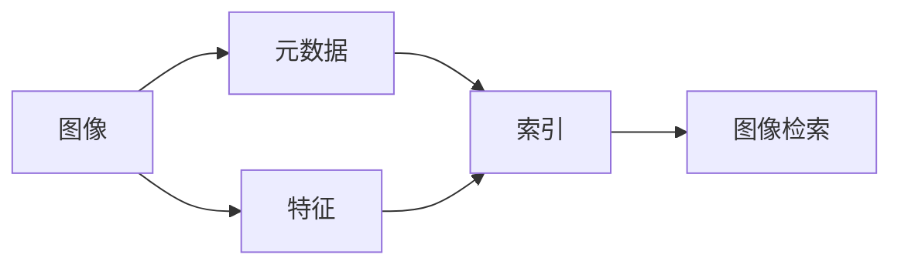

# 图像管理系统详细设计与具体代码实现

## 1.背景介绍

### 1.1 图像管理系统的重要性

在当今数字化时代,图像已成为人们生活和工作中不可或缺的一部分。随着图像数量的急剧增加,高效管理和组织图像资源变得越来越重要。图像管理系统应运而生,它能够帮助用户对海量图像进行分类、检索、存储和分析,大大提高了图像资源的利用效率。

### 1.2 图像管理系统的应用场景

图像管理系统在各个领域都有广泛应用,例如:

- 医疗领域:医学影像的存储和检索
- 电商领域:商品图片的管理和展示  
- 安防领域:监控图像的存储和分析
- 媒体领域:图片素材的管理和编辑

### 1.3 图像管理系统面临的挑战

尽管图像管理系统为各行各业带来了便利,但在实际应用中仍面临诸多挑战:

- 海量图像数据的高效存储与检索
- 图像内容的智能识别与分类
- 用户友好的图像浏览与管理界面设计
- 多用户并发访问的性能优化
- 图像版权保护与安全管控

本文将围绕这些挑战,详细阐述图像管理系统的设计思路和核心技术,并给出具体的代码实现。

## 2.核心概念与联系

### 2.1 图像元数据(Image Metadata)

图像元数据是描述图像属性的数据,常见的元数据包括:

- 文件名(Filename)
- 拍摄日期(Date Taken)
- 图像尺寸(Dimensions)  
- 文件格式(File Format)
- 拍摄设备(Camera Make/Model)
- 地理位置(GPS Coordinates)

元数据为图像提供了丰富的上下文信息,是实现图像高效管理的基础。

### 2.2 图像特征(Image Features)

图像特征是从图像中提取的数值化指标,常见的图像特征包括:

- 颜色特征(Color Features):如颜色直方图
- 纹理特征(Texture Features):如灰度共生矩阵  
- 形状特征(Shape Features):如边缘、轮廓
- 关键点特征(Keypoint Features):如SIFT、SURF

图像特征为衡量图像相似性提供了量化指标,是实现图像内容检索的关键。

### 2.3 图像索引(Image Indexing)  

图像索引是为加速图像检索而创建的数据结构,常见的索引方法包括:

- 倒排索引(Inverted Index):基于关键词的索引
- KD树(KD-Tree):基于特征向量的索引
- 哈希索引(Hash Index):将特征向量映射为哈希值 

高效的索引结构能显著提升图像检索的速度和准确率。

### 2.4 核心概念关系图

下图展示了图像管理系统的核心概念及其关联:



## 3.核心算法原理具体操作步骤

### 3.1 图像特征提取

图像特征提取是图像管理系统的核心算法之一,其基本步骤如下:

1. 图像预处理:对原始图像进行尺寸归一化、噪声去除等操作
2. 特征计算:根据需求选择合适的特征描述子,如SIFT、CNN特征等
3. 特征后处理:对提取的特征进行归一化、降维等处理
4. 特征存储:将提取的特征保存到数据库或索引文件中

常用的图像特征提取算法包括:

- 传统特征:SIFT、SURF、ORB等
- 深度学习特征:基于卷积神经网络(CNN)的特征提取

### 3.2 图像索引构建

图像索引能够加速图像的检索速度,其构建步骤如下:  

1. 特征向量化:将图像特征转化为固定长度的向量表示
2. 选择索引结构:根据数据规模和分布选择合适的索引结构,如KD树、LSH等  
3. 构建索引:将特征向量插入到索引结构中
4. 索引存储:将构建好的索引保存到磁盘或内存中

常用的图像索引算法包括:

- 基于树的索引:KD树、VP树等
- 基于哈希的索引:局部敏感哈希(LSH)、哈希学习等

### 3.3 图像相似性度量

图像相似性度量是图像检索的关键,其具体步骤如下:

1. 特征相似度计算:计算两个图像特征之间的相似度,如欧氏距离、余弦相似度等
2. 多特征融合:综合多种特征的相似度,得到最终的相似度分数
3. 相似度排序:根据相似度分数对候选图像进行排序
4. 返回结果:将相似度最高的K个图像返回给用户

常用的相似性度量方法包括:

- 欧氏距离(Euclidean Distance)
- 余弦相似度(Cosine Similarity)
- 汉明距离(Hamming Distance)

## 4.数学模型和公式详细讲解举例说明

### 4.1 TF-IDF模型

TF-IDF(Term Frequency-Inverse Document Frequency)是一种常用于文本检索的加权模型,也可用于图像检索。其核心思想是:一个词(或特征)在一个文档(或图像)中出现的频率越高,在整个数据集中出现的文档(或图像)越少,则这个词(或特征)对这个文档(或图像)的重要性越高。

TF-IDF的数学定义如下:

$$
tfidf(t,d,D) = tf(t,d) * idf(t,D)
$$

其中:
- $tf(t,d)$表示词$t$在文档$d$中的频率
- $idf(t,D)$表示词$t$在整个数据集$D$中的逆文档频率,定义为:

$$
idf(t,D) = log(\frac{N}{1+df(t,D)})
$$

- $N$为数据集$D$中的文档总数
- $df(t,D)$为包含词$t$的文档数

在图像检索中,可以将图像特征看作"词",将图像看作"文档",从而将TF-IDF应用于图像特征加权。

### 4.2 KNN算法

KNN(K-Nearest Neighbors)是一种常用的监督学习算法,也广泛用于图像检索。其基本思想是:对于待分类的样本,在特征空间中找到与其最邻近的K个样本,然后根据"多数表决"原则将其分类到出现次数最多的那个类别中。

KNN算法的数学描述如下:

给定训练集$D=\{(x_1,y_1),(x_2,y_2),...,(x_N,y_N)\}$,其中$x_i$为第$i$个样本的特征向量,$y_i$为其对应的类别标签。对于待分类样本$x$,KNN算法的决策函数为:

$$
f(x) = \mathop{\arg\max}_{c_j} \sum_{x_i \in N_k(x)} I(y_i=c_j)
$$

其中:
- $N_k(x)$表示$x$的k个最近邻样本的集合  
- $I$为指示函数,当$y_i=c_j$时为1,否则为0
- $c_j$为第$j$个类别

在图像检索中,可以将图像库中的图像看作已标注的训练样本,将待检索的图像看作待分类样本,从而将KNN应用于图像相似性检索。

## 5.项目实践：代码实例和详细解释说明

下面以Python为例,给出图像管理系统的核心模块代码实现。

### 5.1 图像特征提取

```python
import cv2
import numpy as np

class FeatureExtractor:
    def __init__(self, feature_type='SIFT'):
        self.feature_type = feature_type
        if feature_type == 'SIFT':
            self.extractor = cv2.SIFT_create()
        elif feature_type == 'ORB':
            self.extractor = cv2.ORB_create()
        else:
            raise ValueError(f'Unsupported feature type: {feature_type}')

    def extract(self, img):
        # 转为灰度图像
        gray = cv2.cvtColor(img, cv2.COLOR_BGR2GRAY)
        # 提取特征
        keypoints, descriptors = self.extractor.detectAndCompute(gray, None)
        return descriptors
```

这段代码定义了一个`FeatureExtractor`类,用于提取图像的局部特征。它支持SIFT和ORB两种特征类型,并使用OpenCV库进行具体实现。`extract`方法接受一张图像作为输入,返回提取到的特征描述子。

### 5.2 图像索引构建

```python
import faiss

class ImageIndex:
    def __init__(self, dim, metric='L2'):
        self.dim = dim
        self.metric = metric
        self.index = faiss.IndexFlatL2(dim) if metric == 'L2' else faiss.IndexFlatIP(dim)
        self.img_ids = []

    def add(self, features, img_id):
        # 将图像特征加入索引
        self.index.add(features)
        self.img_ids.append(img_id)

    def search(self, query, k=10):
        # 在索引中检索最相似的k个图像
        distances, indices = self.index.search(query, k)
        return [self.img_ids[i] for i in indices[0]]
```

这段代码定义了一个`ImageIndex`类,用于构建和检索图像索引。它使用Faiss库实现,支持L2距离和内积两种相似度度量方式。`add`方法将一张图像的特征添加到索引中,`search`方法则在索引中检索与查询图像最相似的k张图像。

### 5.3 图像相似性检索

```python
import os

class ImageSearcher:
    def __init__(self, image_dir, feature_type='SIFT', metric='L2'):
        self.image_dir = image_dir
        self.feature_extractor = FeatureExtractor(feature_type)
        self.image_index = ImageIndex(dim=128, metric=metric)
        self.build_index()

    def build_index(self):
        # 建立图像索引
        for img_file in os.listdir(self.image_dir):
            img_path = os.path.join(self.image_dir, img_file)
            img = cv2.imread(img_path)
            features = self.feature_extractor.extract(img)
            self.image_index.add(features, img_file)

    def search(self, query_img, k=10):
        # 检索相似图像
        query_features = self.feature_extractor.extract(query_img)
        return self.image_index.search(query_features, k)
```

这段代码定义了一个`ImageSearcher`类,综合了图像特征提取和索引构建,实现了完整的图像相似性检索功能。`build_index`方法遍历图像数据集,提取每张图像的特征并加入索引。`search`方法则提取查询图像的特征,在索引中检索最相似的k张图像。

## 6.实际应用场景

图像管理系统在各行各业都有广泛应用,下面列举几个典型场景:

### 6.1 电商商品图片搜索

在电商平台中,用户经常需要通过图片来搜索相似的商品。图像管理系统可以对商品图片进行自动分类和索引,支持用户上传图片进行相似商品检索,大大提升了用户的购物体验。

### 6.2 医学影像管理

医疗机构每天会产生大量的医学影像数据,如何高效管理和检索这些影像资料是一大挑战。图像管理系统可以对医学影像进行元数据标注和内容索引,帮助医生快速找到所需的影像资料,提高诊断效率。

### 6.3 社交媒体图片分析  

在社交媒体平台上,用户上传和分享的图片数量极其庞大。图像管理系统可以对这些图片进行自动标注和分类,实现图片内容的智能审核和推荐,提升用户的社交体验。

### 6.4 智慧城市监控图像分析

在智慧城市建设中,各类监控摄像头时刻采集着海量的图像视频数据。图像管理系统可以对这些监控数据进行实时分析和索引,实现智能事件检测和目标跟踪,为城市管理提供有力支撑。

## 7.工具和资源推荐

下面推荐一些常用的图像管理相关工具和资源:

### 7.1 开源库

- OpenCV:https://opencv.org/
- Pillow:https://python-pillow.org/  
- scikit-image:https://scikit-image.