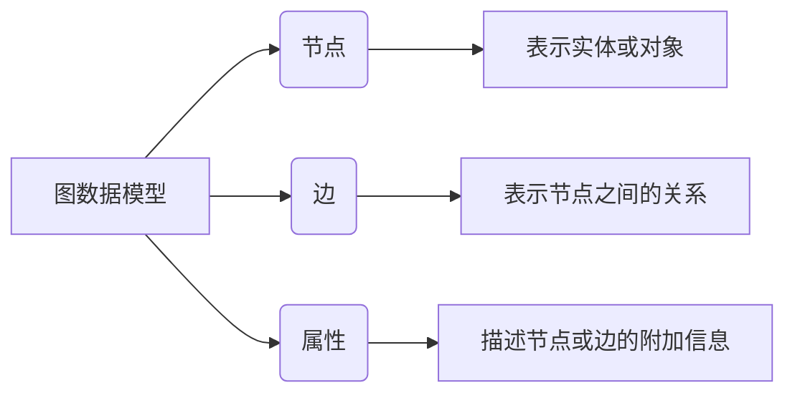
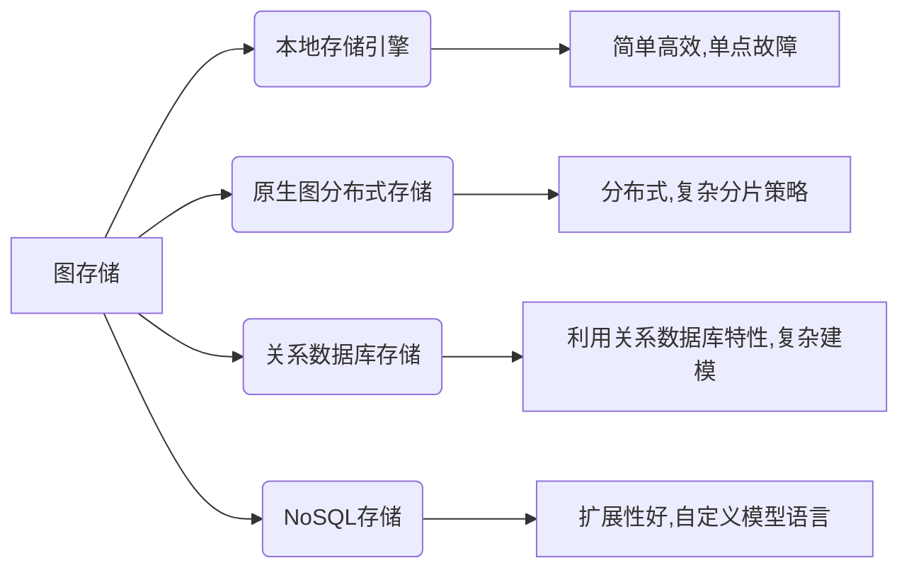
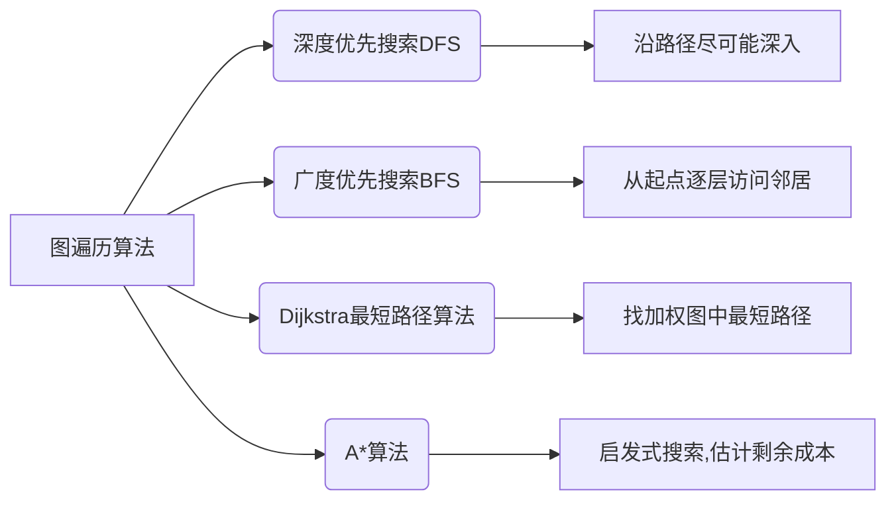
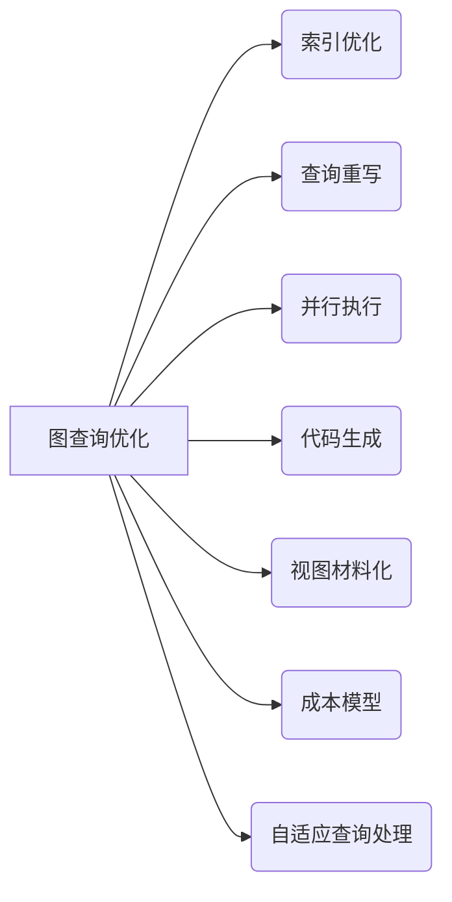
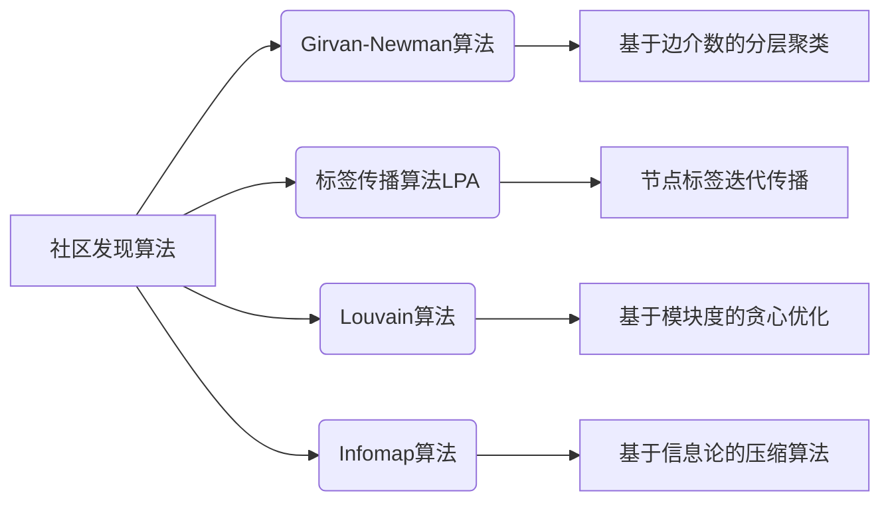

# 图数据库 原理与代码实例讲解

## 1.背景介绍

### 1.1 数据的演进

在当今的数字时代,数据无疑是推动科技创新和商业发展的核心动力。随着数据量的爆炸式增长,传统的关系型数据库在处理复杂、互连的数据时遇到了诸多挑战。这促使了新型数据库系统的出现,其中图数据库(Graph Database)凭借其独特的数据模型和查询语言,为高效管理和分析复杂关系数据提供了强大的解决方案。

### 1.2 图数据库的兴起

图数据库的核心理念是使用图形结构来表示和存储数据,其中节点(Node)代表实体,边(Edge)代表实体之间的关系。这种直观的数据模型非常适合描述复杂的网状结构,如社交网络、知识图谱、基因组学等领域。与关系型数据库相比,图数据库擅长高效查询和遍历关系数据,同时支持复杂的图分析算法,如最短路径、社区发现等。

随着图数据库技术的不断成熟,越来越多的企业和组织开始采用图数据库来管理和利用其复杂的数据资产。图数据库已经在社交网络、推荐系统、欺诈检测、生物信息学等多个领域得到了广泛应用。

## 2.核心概念与联系

### 2.1 图数据模型

图数据库的核心数据模型由三个基本元素组成:节点(Node)、边(Edge)和属性(Properties)。

- 节点(Node):表示实体或对象,如人物、地点、事件等。
- 边(Edge):表示节点之间的关系,如朋友关系、家庭关系、交易关系等。
- 属性(Properties):用于描述节点或边的附加信息,如姓名、年龄、金额等。

图数据模型的灵活性和富表现力使其能够自然地表达复杂的网状结构数据,从而避免了关系型数据库中的连接操作。这种本地存储和查询关系数据的方式大大提高了查询效率。



### 2.2 图查询语言

为了高效地查询和操作图数据,图数据库通常提供了专门的图查询语言。其中,最广为人知的是Cypher查询语言,它由Neo4j图数据库推广开来。Cypher查询语言使用类SQL的语法,但专门针对图数据模型进行了优化。它支持丰富的图模式匹配、遍历和分析操作,使得开发人员能够方便地表达复杂的图查询逻辑。

```cypher
// 查找两个人之间的最短路径
MATCH path = shortestPath(
  (p1:Person {name: 'Alice'})-[*..10]-(p2:Person {name: 'Bob'})
)
RETURN path;
```

除了Cypher之外,其他知名的图查询语言还包括Gremlin(Apache TinkerPop)、SPARQL(用于RDF数据)等。这些语言虽然语法有所不同,但都旨在提供直观、高效的图数据查询和操作方式。

## 3.核心算法原理具体操作步骤

### 3.1 图存储

图数据库需要高效地存储和管理大量的节点、边和属性数据。常见的图存储引擎包括:

1. **本地存储引擎**:将整个图数据存储在单个服务器的本地磁盘上,如Neo4j的本地存储引擎。这种方式简单高效,但存在单点故障和扩展性限制。

2. **原生图分布式存储**:将图数据分布式存储在多个节点上,如Amazon Neptune、TinkerPop等。这种方式提高了容错性和扩展性,但需要复杂的分片和复制策略。

3. **关系数据库存储**:将图数据存储在关系数据库中,如PostgreSQL、Oracle等。这种方式可以利用关系数据库的成熟特性,但需要复杂的数据建模和查询翻译。

4. **NoSQL存储**:将图数据存储在分布式NoSQL数据库中,如HBase、Cassandra等。这种方式具有良好的扩展性和高可用性,但需要自定义图数据模型和查询语言。

无论采用何种存储引擎,图数据库都需要高效地索引和压缩数据,以支持快速的图遍历和查询操作。常见的索引技术包括标签索引、全文索引、空间索引等。



### 3.2 图遍历算法

图遍历是图数据库中最核心的操作之一,它用于查找符合特定条件的节点和路径。常见的图遍历算法包括:

1. **深度优先搜索(DFS)**:从起点开始,沿着每一条路径尽可能深入,直到无法继续为止,然后回溯到上一层节点,继续搜索其他路径。

2. **广度优先搜索(BFS)**:从起点开始,先访问所有邻居节点,然后再访问邻居的邻居节点,以此类推,直到找到目标节点或遍历完整个图。

3. **Dijkstra最短路径算法**:用于在加权图中找到两个节点之间的最短路径。它维护一个优先队列,每次选择距离起点最近的未访问节点进行扩展。

4. **A*算法**:一种启发式搜索算法,在Dijkstra算法的基础上引入了启发函数,估计当前节点到目标节点的剩余成本,从而更快地找到最短路径。

除了上述基本算法外,图数据库还支持更高级的图分析算法,如PageRank(计算节点重要性)、社区发现(识别紧密连接的节点群)、连通分量(找出图中的独立子图)等。这些算法广泛应用于社交网络分析、推荐系统、欺诈检测等领域。



### 3.3 图查询优化

由于图数据库需要高效地处理复杂的图遍历和分析查询,因此查询优化是一个重要的课题。常见的图查询优化技术包括:

1. **索引优化**:利用高效的索引结构(如标签索引、全文索引)加速图遍历和匹配操作。

2. **查询重写**:将复杂的图查询重写为等价但更高效的形式,如子查询合并、谓词下推等。

3. **并行执行**:将图查询分解为多个子任务,并行执行以提高吞吐量。

4. **代码生成**:根据查询模式,动态生成高度优化的本地代码,避免解释器开销。

5. **视图材料化**:将常用的中间结果缓存为视图,加速后续查询。

6. **成本模型**:建立精确的成本模型,估计不同查询执行计划的代价,选择最优方案。

7. **自适应查询处理**:在查询执行过程中动态调整执行计划,以适应实际数据分布。

通过上述优化技术的综合应用,图数据库可以显著提升查询性能,满足各种复杂的图分析需求。



## 4.数学模型和公式详细讲解举例说明

### 4.1 PageRank算法

PageRank算法是一种著名的链接分析算法,用于计算网页的重要性排名。它的核心思想是:一个网页的重要性不仅取决于它被多少其他网页链接,还取决于链接它的网页的重要性。PageRank算法可以自然地扩展到图数据库中,用于计算节点的重要性分数。

PageRank算法的数学模型如下:

$$
PR(u) = \frac{1-d}{N} + d \sum_{v \in B_u} \frac{PR(v)}{L(v)}
$$

其中:

- $PR(u)$表示节点$u$的PageRank分数
- $N$是图中节点的总数
- $B_u$是所有存在边指向$u$的节点集合
- $L(v)$是节点$v$的出度(指向其他节点的边数)
- $d$是一个阻尼系数,通常取值0.85

PageRank算法是一个迭代过程,初始时每个节点被赋予相同的PageRank分数。在每一轮迭代中,节点的PageRank分数由它的入度邻居节点的分数决定,并根据上述公式进行更新。经过多轮迭代后,PageRank分数将收敛到稳定值。

PageRank算法在图数据库中有许多应用场景,如网页重要性排名、社交网络影响力分析、知识图谱实体排名等。它为发现重要节点提供了一种有效的度量标准。

### 4.2 社区发现算法

在许多现实场景中,图数据中往往存在着一些紧密连接的节点群,称为社区(Community)。发现这些社区对于理解图数据的内在结构和模式至关重要。常见的社区发现算法包括:

1. **Girvan-Newman算法**:基于边介数(Edge Betweenness)的分层聚类算法。它反复移除介数最高的边,直到图被分割为多个独立的社区。

2. **标签传播算法(LPA)**:一种基于节点的简单迭代算法。每个节点被赋予一个标签,在每轮迭代中,节点会采纳其邻居中最多的标签,直到标签在整个网络中传播并收敛。

3. **Louvain算法**:一种基于模ул度(Modularity)的贪心优化算法。它通过最大化网络的模块度来发现社区,并支持分层社区结构。

4. **Infomap算法**:基于信息论原理的压缩算法。它将随机行走视为信息的传播过程,并寻找最小化编码描述路径的社区划分。

社区发现算法在图数据库中有广泛应用,如社交网络中的群组发现、生物网络中的功能模块识别、网络安全中的攻击组识别等。它们为挖掘图数据中的隐藏模式提供了有力工具。



## 5.项目实践:代码实例和详细解释说明

为了更好地理解图数据库的原理和应用,我们将通过一个实际项目案例来进行代码级别的讲解。在这个案例中,我们将使用Python和Neo4j图数据库来构建一个简单的社交网络应用。

### 5.1 项目概述

我们的社交网络应用将包括以下核心功能:

1. 创建用户节点和关系
2. 查找两个用户之间的最短路径
3. 发现社交网络中的社区
4. 计算用户的影响力分数(PageRank)

### 5.2 环境搭建

首先,我们需要安装Neo4j图数据库和Python驱动程序。你可以从官网下载Neo4j的适当版本,并按照说明进