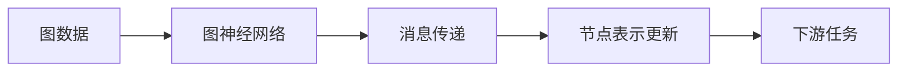
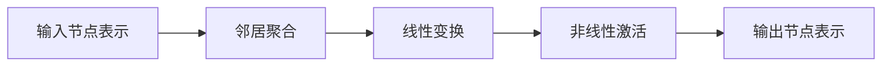
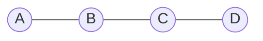

# 图神经网络原理与代码实战案例讲解

## 1.背景介绍

### 1.1 图数据的重要性

在现实世界中,许多复杂系统都可以用图的形式来表示和建模。图不仅能够描述实体之间的关系,还能捕捉数据中的复杂拓扑结构。图数据广泛存在于社交网络、交通网络、知识图谱、分子结构、计算机网络等诸多领域。随着大数据时代的到来,对于图数据的分析和处理需求也与日俱增。

### 1.2 图神经网络的兴起

传统的机器学习算法往往将图数据进行扁平化处理,无法很好地利用图数据中蕴含的丰富结构信息。为了更好地处理图数据,近年来图神经网络(Graph Neural Networks, GNNs)应运而生并迅速发展。图神经网络能够直接对图数据进行端到端的学习,有效地捕捉图结构特征,为图数据的表示学习和推理任务提供了强有力的工具。

### 1.3 应用前景广阔

图神经网络已经在诸多领域展现出巨大的应用潜力,如社交网络分析、交通预测、化学分子属性预测、知识图谱推理、计算机视觉等。随着模型和算法的不断完善,图神经网络必将为更多领域带来创新性的解决方案。

## 2.核心概念与联系

### 2.1 图的表示

在介绍图神经网络之前,我们首先需要了解图数据的表示形式。一个图G=(V,E)由节点集合V和边集合E组成,其中每条边连接两个节点。图可以是有向的或无向的、加权的或未加权的。

在实践中,图通常用邻接矩阵或邻接表的形式来存储。邻接矩阵是一种稀疏矩阵,其中元素A[i,j]表示节点i和节点j之间是否有边相连。邻接表则使用链表或字典的形式存储每个节点的邻居节点。

### 2.2 消息传递机制

图神经网络的核心思想是在图的拓扑结构上传递消息,使每个节点能够逐步整合来自邻居节点的特征信息,从而学习出更加准确的节点表示。这种消息传递机制可以形式化为:

```
m_i^(k) = Φ(h_i^(k-1), {h_j^(k-1), j∈N(i)})
h_i^(k) = Ψ(h_i^(k-1), m_i^(k))
```

其中$h_i^(k)$表示节点i在第k层的表示向量,$N(i)$表示节点i的邻居节点集合,$\Phi$和$\Psi$分别是消息函数和更新函数,用于计算消息向量$m_i^(k)$和更新节点表示$h_i^(k)$。

通过上述迭代更新,每个节点的表示向量最终将包含整个图的结构信息,从而为下游任务提供更加丰富的特征。



### 2.3 图神经网络分类

根据消息传递的范围,图神经网络可以分为以下几种主要类型:

1. **图卷积神经网络(GCN)**:在节点的k-hop邻域内进行消息传递。
2. **图注意力网络(GAT)**:引入注意力机制,自动学习邻居节点的权重。
3. **图同构网络(GIN)**:通过可学习的更新函数,实现对图同构的检测。
4. **图自编码器(GAE/VGAE)**:无监督学习图数据的潜在表示。

除此之外,还有一些针对特殊类型图数据(如动态图、异构图等)设计的变种模型。

## 3.核心算法原理具体操作步骤

在这一节,我们将重点介绍图卷积神经网络(GCN)的核心原理和具体操作步骤。GCN是最早也是最广为人知的图神经网络模型之一。

### 3.1 GCN层的前向传播

给定一个图G=(V,E),其中V是节点集合,E是边集合。令A为图的邻接矩阵,D为度矩阵(对角线元素为节点度)。GCN层的前向传播过程可以表示为:

$$H^{(l+1)} = \sigma(\hat{D}^{-\frac{1}{2}}\hat{A}\hat{D}^{-\frac{1}{2}}H^{(l)}W^{(l)})$$

其中$\hat{A} = A + I_N$是加入自环的邻接矩阵,$\hat{D}_{ii} = \sum_j\hat{A}_{ij}$是新的度矩阵,$H^{(l)}$是第l层的节点表示矩阵,$W^{(l)}$是第l层的权重矩阵,$\sigma$是非线性激活函数(如ReLU)。

这一公式实现了节点表示在邻域内的聚合操作,即每个节点的新表示是其邻居节点表示的加权和,并通过一个线性变换和非线性激活函数进行转换。



### 3.2 GCN模型架构

一个典型的GCN模型由多层GCN层堆叠而成,输入是原始节点特征矩阵$X$,输出是最终的节点表示矩阵$Z$。模型架构如下所示:

$$Z = f(X, A) = \text{GCN}_K(\cdots\text{GCN}_2(\text{GCN}_1(X, A), A)\cdots, A)$$

其中$\text{GCN}_l$表示第l层GCN层的操作。通过多层的卷积操作,节点表示能够逐渐整合更大范围的邻域信息。

### 3.3 GCN模型训练

对于有监督的节点分类或链接预测任务,GCN模型的训练过程如下:

1. 初始化模型参数(GCN层的权重矩阵)。
2. 前向传播计算节点表示$Z$。
3. 根据下游任务的目标函数(如交叉熵损失),计算损失。
4. 反向传播,更新模型参数。
5. 重复2-4,直至模型收敛。

对于无监督的节点表示学习任务,可以使用图自编码器(GAE/VGAE)的框架对GCN模型进行训练。

## 4.数学模型和公式详细讲解举例说明

在上一节中,我们已经介绍了GCN层的核心公式:

$$H^{(l+1)} = \sigma(\hat{D}^{-\frac{1}{2}}\hat{A}\hat{D}^{-\frac{1}{2}}H^{(l)}W^{(l)})$$

这里我们将对这一公式进行更加详细的解释和推导。

### 4.1 邻接矩阵和度矩阵

首先,我们定义图的邻接矩阵A和度矩阵D如下:

- 对于无向无权图,如果节点i和节点j之间有边相连,则$A_{ij} = A_{ji} = 1$,否则为0。
- 对于有向无权图,如果有一条边从节点i指向节点j,则$A_{ij} = 1$,否则为0。
- 对于无向加权图,如果节点i和节点j之间有边相连,则$A_{ij} = A_{ji} = w_{ij}$,其中$w_{ij}$是边的权重,否则为0。
- 对于有向加权图,如果有一条边从节点i指向节点j,则$A_{ij} = w_{ij}$,否则为0。
- 度矩阵D是一个对角矩阵,其中$D_{ii} = \sum_jA_{ij}$,即节点i的度(入度或出度之和)。

### 4.2 公式推导

现在,我们来推导GCN层的核心公式。我们希望每个节点的新表示是其邻居节点表示的加权和,并通过一个线性变换和非线性激活函数进行转换。具体来说,对于节点i,我们有:

$$h_i^{(l+1)} = \sigma\left(\sum_{j\in\mathcal{N}(i)\cup\{i\}}a_{ij}h_j^{(l)}W^{(l)}\right)$$

其中$\mathcal{N}(i)$表示节点i的邻居节点集合,包括节点i本身(自环)。$a_{ij}$是节点j对节点i表示的权重,通常设置为$a_{ij} = \frac{1}{|\mathcal{N}(i)|}$,即简单的平均。

将上式用矩阵形式表示,我们得到:

$$H^{(l+1)} = \sigma(\hat{A}H^{(l)}W^{(l)})$$

其中$\hat{A} = D^{-1}A$是归一化的邻接矩阵,确保每个节点的邻居权重之和为1。

然而,上式存在一个问题:对于孤立节点(度为0的节点),其表示将一直保持不变。为了解决这个问题,我们对邻接矩阵进行了修改,加入了自环:

$$\hat{A} = A + I_N$$

其中$I_N$是N阶单位矩阵。这样,每个节点至少会传递自身的表示。

接下来,我们对$\hat{A}$进行对称归一化,得到:

$$\hat{D}^{-\frac{1}{2}}\hat{A}\hat{D}^{-\frac{1}{2}}$$

其中$\hat{D}$是新的度矩阵,定义为$\hat{D}_{ii} = \sum_j\hat{A}_{ij}$。这种对称归一化可以避免梯度异常值的出现,使模型更加稳定。

最终,我们得到了GCN层的完整公式:

$$H^{(l+1)} = \sigma(\hat{D}^{-\frac{1}{2}}\hat{A}\hat{D}^{-\frac{1}{2}}H^{(l)}W^{(l)})$$

### 4.3 实例分析

为了更好地理解GCN层的工作原理,我们来分析一个简单的例子。假设我们有一个无向无权图,如下所示:



对应的邻接矩阵A和度矩阵D为:

$$A = \begin{bmatrix}
0 & 1 & 0 & 0\\
1 & 0 & 1 & 0\\
0 & 1 & 0 & 1\\
0 & 0 & 1 & 0
\end{bmatrix},\quad
D = \begin{bmatrix}
1 & 0 & 0 & 0\\
0 & 2 & 0 & 0\\
0 & 0 & 2 & 0\\
0 & 0 & 0 & 1
\end{bmatrix}$$

我们令$H^{(0)}$为原始节点特征矩阵,通过GCN层的运算,可以得到第一层的节点表示$H^{(1)}$:

$$\begin{aligned}
\hat{A} &= A + I_4\\
&= \begin{bmatrix}
1 & 1 & 0 & 0\\
1 & 1 & 1 & 0\\
0 & 1 & 1 & 1\\
0 & 0 & 1 & 1
\end{bmatrix}\\
\hat{D} &= \begin{bmatrix}
2 & 0 & 0 & 0\\
0 & 3 & 0 & 0\\
0 & 0 & 3 & 0\\
0 & 0 & 0 & 2
\end{bmatrix}\\
\hat{D}^{-\frac{1}{2}} &= \begin{bmatrix}
\frac{1}{\sqrt{2}} & 0 & 0 & 0\\
0 & \frac{1}{\sqrt{3}} & 0 & 0\\
0 & 0 & \frac{1}{\sqrt{3}} & 0\\
0 & 0 & 0 & \frac{1}{\sqrt{2}}
\end{bmatrix}\\
H^{(1)} &= \sigma\left(\hat{D}^{-\frac{1}{2}}\hat{A}\hat{D}^{-\frac{1}{2}}H^{(0)}W^{(0)}\right)
\end{aligned}$$

可以看到,节点A的新表示$h_A^{(1)}$是其自身原始表示$h_A^{(0)}$和邻居节点B的表示$h_B^{(0)}$的加权和,经{"msg_type":"generate_answer_finish","data":"","from_module":null,"from_unit":null}