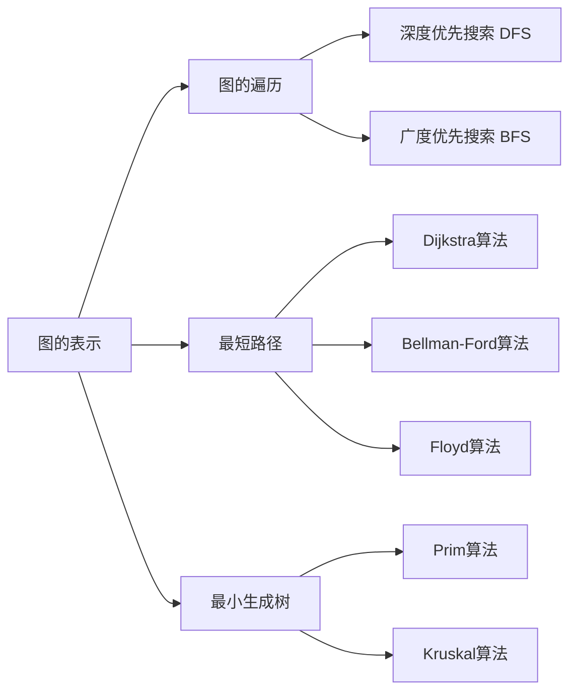
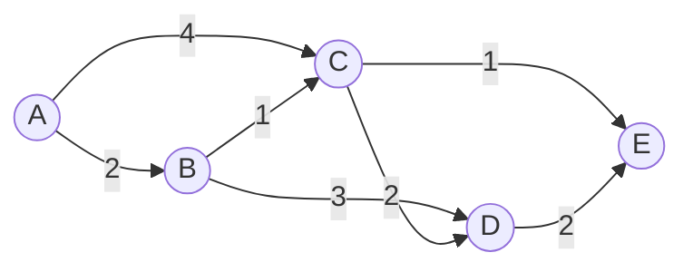
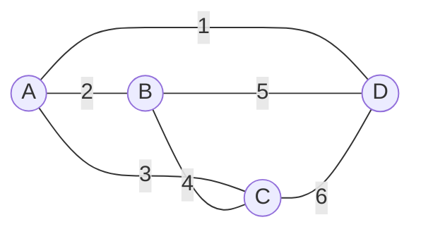
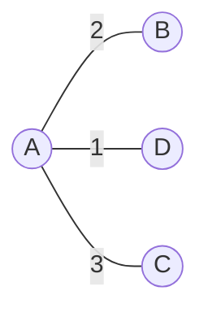

# 图算法 原理与代码实例讲解

## 1.背景介绍
### 1.1 图的定义与表示
#### 1.1.1 图的定义
图(Graph)是一种由顶点(Vertex)和边(Edge)组成的离散数据结构。顶点也称为节点(Node),边也称为弧(Arc)。图可以表示为G=(V,E),其中V是顶点集合,E是边集合。如果边是有方向的,称为有向图(Directed Graph);如果边是无方向的,称为无向图(Undirected Graph)。

#### 1.1.2 图的表示方式
常见的图的表示方式有:
- 邻接矩阵(Adjacency Matrix):用一个二维数组表示图,其中 A[i][j]=1 表示顶点i到顶点j有一条边,A[i][j]=0 表示没有边。
- 邻接表(Adjacency List):用一个链表数组表示图,其中每个链表对应一个顶点,链表中存储与该顶点相连的其他顶点。
- 边集数组:用一个结构体数组表示图的边集合,每个结构体包含起点、终点、权重等信息。

### 1.2 图算法的重要性
图算法在计算机科学和工程领域有着广泛的应用,如:
- 网络流量规划
- 社交网络分析 
- 推荐系统
- 路径规划导航
- 任务调度
- 生物信息学

掌握图算法对于解决实际问题、优化系统性能、设计高效算法都有重要意义。

## 2.核心概念与联系
### 2.1 图的基本概念
- 顶点的度(Degree):与该顶点相连的边数。有向图中分为出度和入度。
- 路径(Path):由边依次连接的一系列顶点。
- 回路/环(Cycle):起点和终点为同一个顶点的路径。
- 连通图:任意两个顶点之间都存在路径的无向图。
- 强连通图:任意两个顶点之间都存在有向路径的有向图。

### 2.2 图的遍历
图的遍历是许多图算法的基础,常见的遍历方式有:
- 深度优先搜索(DFS):从一个顶点出发,沿着一条路径走到底,然后回溯,继续探索下一条路径。
- 广度优先搜索(BFS):从一个顶点出发,先访问其所有相邻顶点,然后再逐层向外访问。

### 2.3 最短路径问题
在带权图中,最短路径问题是指找到两个顶点之间权重和最小的路径。常见算法有:
- Dijkstra算法:适用于边权非负的情况,时间复杂度O((V+E)logV)。
- Bellman-Ford算法:适用于边权可以为负的情况,时间复杂度O(VE)。
- Floyd算法:适用于求任意两点间最短路径,时间复杂度O(V^3)。

### 2.4 最小生成树
在带权无向连通图中,最小生成树(MST)是一棵权重和最小的生成树。常见算法有:
- Prim算法:从一个顶点开始,每次选择一条权重最小的边加入生成树,直到所有顶点都在树中。
- Kruskal算法:每次选择一条权重最小的边,如果加入后不会形成环,则加入生成树。

下面是图算法中几个核心概念的联系:



## 3.核心算法原理具体操作步骤
### 3.1 深度优先搜索 DFS
1. 选择一个起始顶点,将其标记为已访问,并压入栈中
2. 如果栈不为空,则弹出栈顶顶点v,否则算法结束
3. 依次检查v的每个未被访问过的邻接点w
   - 如果w未被访问,则标记w为已访问,并把w压入栈中
4. 重复步骤2-3,直到栈为空

### 3.2 广度优先搜索 BFS  
1. 选择一个起始顶点,将其标记为已访问,并入队列
2. 如果队列不为空,则取出队首顶点v,否则算法结束
3. 依次检查v的每个未被访问过的邻接点w
   - 如果w未被访问,则标记w为已访问,并把w入队
4. 重复步骤2-3,直到队列为空

### 3.3 Dijkstra算法
1. 初始化:起点s的距离为0,其他点的距离为无穷大。创建一个优先队列Q存储顶点及其距离
2. 如果Q不为空,取出距离最小的顶点u,否则算法结束
3. 对u的每个邻接点v,如果 dist(s,u)+w(u,v) < dist(s,v),则更新v的距离,并将v加入Q
4. 重复步骤2-3,直到Q为空

### 3.4 Prim算法
1. 任选一个起始顶点,将其加入生成树
2. 在剩余顶点中,选择一个与当前生成树有边相连,且边权最小的顶点v,将v加入生成树
3. 重复步骤2,直到所有顶点都在生成树中

### 3.5 Kruskal算法
1. 将所有边按权重从小到大排序
2. 依次考虑每条边(u,v),如果u和v不在同一个连通分量中,则将该边加入生成树,合并u和v所在的连通分量
3. 重复步骤2,直到所有顶点都在同一个连通分量中

## 4.数学模型和公式详细讲解举例说明
### 4.1 图的数学定义
无向图G可以表示为二元组G=(V,E),其中:
- V是顶点集合,$V=\{v_1,v_2,...,v_n\}$
- E是边集合,$E=\{(v_i,v_j)|v_i,v_j \in V\}$

有向图D可以表示为二元组D=(V,A),其中: 
- V是顶点集合,$V=\{v_1,v_2,...,v_n\}$
- A是有向边(弧)集合,$A=\{<v_i,v_j>|v_i,v_j \in V\}$

### 4.2 最短路径的数学模型
设图G=(V,E),边(u,v)的权重为w(u,v),dist(s,v)表示从起点s到顶点v的最短路径长度。则最短路径问题可以表示为:

$$
dist(s,v)=
\begin{cases}
0 & v=s \\
min\{dist(s,u)+w(u,v)|(u,v)\in E\} & v \neq s
\end{cases}
$$

例如,考虑下图所示的带权有向图:



求从A到E的最短路径。根据Dijkstra算法,计算过程如下:

1. 初始化:$dist(A,A)=0, dist(A,B)=2, dist(A,C)=4, dist(A,D)=\infty, dist(A,E)=\infty$
2. 选择A,更新与A相邻的顶点:$dist(A,B)=2, dist(A,C)=4$
3. 选择B,更新与B相邻的顶点:$dist(A,C)=min\{dist(A,C),dist(A,B)+1\}=3, dist(A,D)=5$
4. 选择C,更新与C相邻的顶点:$dist(A,D)=min\{dist(A,D),dist(A,C)+2\}=5, dist(A,E)=4$
5. 选择E,更新完毕,算法结束

因此,从A到E的最短路径长度为4,路径为A->C->E。

### 4.3 最小生成树的数学模型
设连通图G=(V,E),边(u,v)的权重为w(u,v)。最小生成树可以表示为一个子图T=(V,E'),满足:
1. T是G的生成树,即T包含G的所有顶点,且T中任意两个顶点之间有且仅有一条路径
2. T的权重和$\sum_{(u,v)\in E'} w(u,v)$在G的所有生成树中最小

例如,考虑下图所示的带权无向图:



求该图的最小生成树。根据Kruskal算法,计算过程如下:

1. 将所有边按权重从小到大排序:(A,D)=1,(A,B)=2,(A,C)=3,(B,C)=4,(B,D)=5,(C,D)=6
2. 选择(A,D),加入生成树
3. 选择(A,B),加入生成树
4. 选择(A,C),加入生成树
5. 选择(B,C),发现A-B-C形成环,不加入生成树
6. 选择(B,D),发现A-D-B形成环,不加入生成树 
7. 选择(C,D),发现A-C-D形成环,不加入生成树
8. 所有顶点都在生成树中,算法结束

因此,该图的最小生成树为:



最小生成树的权重和为1+2+3=6。

## 5.项目实践：代码实例和详细解释说明
下面以C++语言为例,给出几个经典图算法的代码实现。

### 5.1 深度优先搜索 DFS
```cpp
vector<vector<int>> adj; // 邻接表
vector<bool> visited; // 标记顶点是否被访问过

void dfs(int v) {
    visited[v] = true;
    for (int u : adj[v]) {
        if (!visited[u]) {
            dfs(u);
        }
    }
}
```

说明:
- `adj`是图的邻接表表示,`adj[v]`存储与顶点v直接相连的顶点列表。
- `visited`用于标记每个顶点是否被访问过,避免重复访问。
- `dfs`函数递归地访问顶点v和v的所有未被访问过的邻接点。

### 5.2 广度优先搜索 BFS
```cpp
vector<vector<int>> adj; // 邻接表
vector<bool> visited; // 标记顶点是否被访问过

void bfs(int s) {
    queue<int> q;
    visited[s] = true;
    q.push(s);
    while (!q.empty()) {
        int v = q.front(); 
        q.pop();
        for (int u : adj[v]) {
            if (!visited[u]) {
                visited[u] = true;
                q.push(u);
            }
        }
    }
}
```

说明:
- `adj`和`visited`的作用与DFS相同。
- `bfs`函数使用队列`q`来实现BFS,每次取出队首顶点v,并将v的所有未被访问过的邻接点入队。

### 5.3 Dijkstra算法
```cpp
vector<vector<pair<int, int>>> adj; // 邻接表,pair<v,w>表示边(u,v)的权重w
vector<int> dist; // 存储起点到每个顶点的最短距离

void dijkstra(int s) {
    dist.assign(adj.size(), INF);
    dist[s] = 0;
    priority_queue<pair<int, int>, vector<pair<int, int>>, greater<pair<int, int>>> pq;
    pq.emplace(0, s);
    while (!pq.empty()) {
        int d = pq.top().first, u = pq.top().second;
        pq.pop();
        if (d > dist[u]) continue; // 已有更短路径,跳过
        for (auto [v, w] : adj[u]) {
            if (dist[u] + w < dist[v]) {
                dist[v] = dist[u] + w;
                pq.emplace(dist[v], v);
            }
        }
    }
}
```

说明:
- `adj`是图的邻接表表示,`adj[u]`存储与顶点u直接相连的顶点v和边(u,v)的权重w。
- `dist`存储起点s到每个顶点的最短距离,初始化为无穷大。
- `dijkstra`函数使用优先队列`p