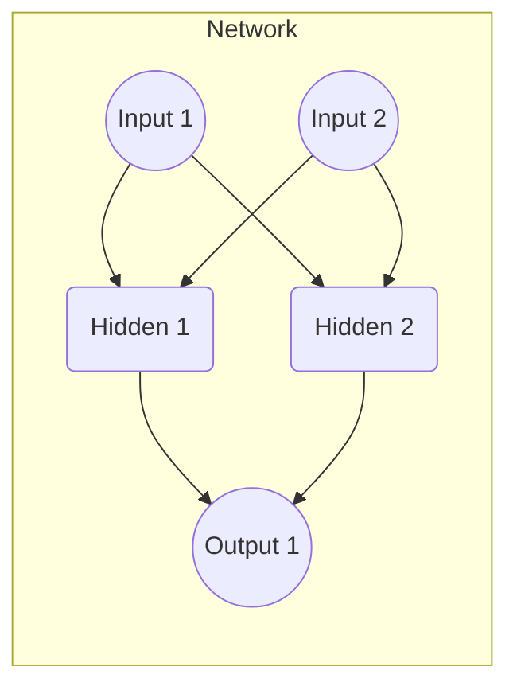

# 图解反向传播：从链式法则到梯度下降

## 1.背景介绍

在机器学习和深度学习领域中,反向传播算法是训练神经网络的关键步骤之一。它通过计算损失函数相对于网络权重的梯度,有效地调整权重参数,从而使网络输出结果逐步逼近期望值。反向传播算法的核心思想源于链式法则,通过链式求导规则,可以从输出层开始,沿着网络的反方向传播误差,并计算每一层权重的梯度。

尽管反向传播算法的数学原理并不复杂,但对于初学者而言,理解其中的推导过程和梯度计算细节仍然是一个挑战。本文旨在通过直观的图解方式,逐步阐释反向传播算法的原理,帮助读者掌握链式法则在反向传播中的应用,并深入理解梯度下降在神经网络训练中的作用。

## 2.核心概念与联系

在深入探讨反向传播算法之前,我们需要先了解一些核心概念和它们之间的联系。

### 2.1 链式法则

链式法则是微积分中的一个基本原理,它描述了复合函数的导数计算方式。对于一个复合函数 $y = f(g(x))$,其导数可以表示为:

$$\frac{dy}{dx} = \frac{dy}{dg} \cdot \frac{dg}{dx}$$

这个公式揭示了复合函数的导数是内外函数导数的乘积。链式法则在反向传播算法中扮演着关键角色,因为神经网络本质上就是一系列嵌套的函数组合。

### 2.2 损失函数

在监督学习中,我们需要定义一个损失函数(Loss Function)来衡量模型输出与期望输出之间的差距。常见的损失函数包括均方误差(Mean Squared Error, MSE)、交叉熵(Cross-Entropy)等。损失函数的值越小,表示模型的预测结果越接近期望值。

### 2.3 梯度下降

梯度下降(Gradient Descent)是一种优化算法,它通过沿着损失函数的负梯度方向更新模型参数,从而最小化损失函数的值。在神经网络训练中,我们需要计算损失函数相对于每个权重参数的梯度,并根据梯度值调整权重,使损失函数值不断减小。

### 2.4 反向传播

反向传播算法利用链式法则,从输出层开始,沿着网络的反方向传播误差,计算每一层权重的梯度。通过梯度下降优化算法,不断调整权重参数,使网络输出结果逐步接近期望值。反向传播算法可以被视为链式法则在神经网络中的应用。

## 3.核心算法原理具体操作步骤

现在,让我们逐步探究反向传播算法的具体原理和操作步骤。为了便于理解,我们将使用一个简单的神经网络示例,包含一个输入层、一个隐藏层和一个输出层。



### 3.1 前向传播

在训练神经网络时,我们首先需要进行前向传播(Forward Propagation)。这个过程包括以下步骤:

1. 将输入数据传递给输入层
2. 在每一层,对输入进行加权求和和非线性激活函数运算,得到该层的输出
3. 将上一层的输出作为下一层的输入,重复步骤2,直到到达输出层
4. 计算输出层的输出与期望输出之间的损失函数值

### 3.2 反向传播

前向传播完成后,我们需要计算每个权重参数对损失函数的贡献,即梯度。这个过程称为反向传播(Backward Propagation),它包括以下步骤:

1. 计算输出层的误差项(Error Term),即损失函数对输出层输出的偏导数
2. 利用链式法则,将输出层的误差项传播回隐藏层,计算隐藏层每个节点的误差项
3. 对于每个权重参数,计算损失函数相对于该权重的梯度,即误差项与输入的乘积
4. 重复步骤2和3,直到计算完所有层的权重梯度

### 3.3 权重更新

计算出每个权重参数的梯度后,我们可以使用梯度下降优化算法来更新权重:

$$w_{new} = w_{old} - \eta \cdot \frac{\partial L}{\partial w}$$

其中,η是学习率(Learning Rate),决定了每次更新的步长大小。通过不断迭代地进行前向传播、反向传播和权重更新,神经网络的输出结果将逐步逼近期望值。

## 4.数学模型和公式详细讲解举例说明

为了更好地理解反向传播算法的数学原理,让我们以一个具体的例子来详细说明。假设我们有一个简单的神经网络,包含一个输入层、一个隐藏层和一个输出层,如下图所示:


### 4.1 前向传播

假设输入层的输入为 $x_1$ 和 $x_2$,隐藏层的权重分别为 $w_1$、$w_2$、$w_3$、$w_4$,偏置项为 $b_1$ 和 $b_2$,输出层的权重为 $w_5$ 和 $w_6$,偏置项为 $b_3$。我们使用 ReLU 作为隐藏层的激活函数,输出层无激活函数。

前向传播过程如下:

1. 隐藏层输出:
   $$h_1 = \max(0, w_1x_1 + w_3x_2 + b_1)$$
   $$h_2 = \max(0, w_2x_1 + w_4x_2 + b_2)$$

2. 输出层输出:
   $$y = w_5h_1 + w_6h_2 + b_3$$

### 4.2 反向传播

假设我们使用均方误差(MSE)作为损失函数,期望输出为 $t$,则损失函数可以表示为:

$$L = \frac{1}{2}(y - t)^2$$

我们需要计算损失函数相对于每个权重参数的梯度。

1. 输出层梯度:
   $$\frac{\partial L}{\partial y} = y - t$$

2. 隐藏层梯度:
   $$\frac{\partial L}{\partial h_1} = \frac{\partial L}{\partial y} \cdot \frac{\partial y}{\partial h_1} = (y - t) \cdot w_5$$
   $$\frac{\partial L}{\partial h_2} = \frac{\partial L}{\partial y} \cdot \frac{\partial y}{\partial h_2} = (y - t) \cdot w_6$$

3. 权重梯度:
   $$\frac{\partial L}{\partial w_5} = \frac{\partial L}{\partial y} \cdot \frac{\partial y}{\partial w_5} = (y - t) \cdot h_1$$
   $$\frac{\partial L}{\partial w_6} = \frac{\partial L}{\partial y} \cdot \frac{\partial y}{\partial w_6} = (y - t) \cdot h_2$$
   $$\frac{\partial L}{\partial w_1} = \frac{\partial L}{\partial h_1} \cdot \frac{\partial h_1}{\partial w_1} = (y - t) \cdot w_5 \cdot \mathbb{1}_{h_1 > 0} \cdot x_1$$
   $$\frac{\partial L}{\partial w_2} = \frac{\partial L}{\partial h_2} \cdot \frac{\partial h_2}{\partial w_2} = (y - t) \cdot w_6 \cdot \mathbb{1}_{h_2 > 0} \cdot x_1$$
   $$\frac{\partial L}{\partial w_3} = \frac{\partial L}{\partial h_1} \cdot \frac{\partial h_1}{\partial w_3} = (y - t) \cdot w_5 \cdot \mathbb{1}_{h_1 > 0} \cdot x_2$$
   $$\frac{\partial L}{\partial w_4} = \frac{\partial L}{\partial h_2} \cdot \frac{\partial h_2}{\partial w_4} = (y - t) \cdot w_6 \cdot \mathbb{1}_{h_2 > 0} \cdot x_2$$

其中,$ \mathbb{1}_{h_i > 0}$ 是指示函数,表示当 $h_i > 0$ 时取值为 1,否则为 0。这是因为 ReLU 激活函数的导数在正半轴上为 1,在负半轴上为 0。

通过计算出每个权重参数的梯度,我们就可以使用梯度下降算法来更新权重,从而最小化损失函数值。

## 5.项目实践：代码实例和详细解释说明

为了更好地理解反向传播算法的实现,我们将使用 Python 和 NumPy 库编写一个简单的神经网络示例。这个示例将包括前向传播、反向传播和权重更新的过程。

```python
import numpy as np

# 激活函数及其导数
def relu(x):
    return np.maximum(0, x)

def relu_prime(x):
    return np.where(x > 0, 1, 0)

# 初始化权重和偏置
np.random.seed(42)
W1 = np.random.randn(2, 2)
b1 = np.random.randn(2)
W2 = np.random.randn(1, 2)
b2 = np.random.randn(1)

# 前向传播
def forward_propagation(X):
    Z1 = np.dot(X, W1.T) + b1
    A1 = relu(Z1)
    Z2 = np.dot(A1, W2.T) + b2
    return Z2, A1

# 反向传播
def backward_propagation(X, y, Z2, A1):
    m = X.shape[0]
    dZ2 = Z2 - y
    dW2 = (1 / m) * np.dot(dZ2.T, A1)
    db2 = (1 / m) * np.sum(dZ2, axis=0)
    dZ1 = np.dot(dZ2, W2) * relu_prime(A1)
    dW1 = (1 / m) * np.dot(dZ1.T, X)
    db1 = (1 / m) * np.sum(dZ1, axis=0)
    return dW1, db1, dW2, db2

# 更新权重
def update_weights(W1, b1, W2, b2, dW1, db1, dW2, db2, learning_rate):
    W1 = W1 - learning_rate * dW1
    b1 = b1 - learning_rate * db1
    W2 = W2 - learning_rate * dW2
    b2 = b2 - learning_rate * db2
    return W1, b1, W2, b2

# 训练模型
def train(X, y, epochs, learning_rate):
    for epoch in range(epochs):
        Z2, A1 = forward_propagation(X)
        dW1, db1, dW2, db2 = backward_propagation(X, y, Z2, A1)
        W1, b1, W2, b2 = update_weights(W1, b1, W2, b2, dW1, db1, dW2, db2, learning_rate)
        cost = np.mean(np.square(Z2 - y))
        if epoch % 100 == 0:
            print(f"Epoch {epoch}, Cost: {cost}")

# 示例用法
X = np.array([[0, 0], [0, 1], [1, 0], [1, 1]])
y = np.array([[0], [1], [1], [0]])
train(X, y, epochs=10000, learning_rate=0.01)
```

在这个示例中,我们定义了一个简单的神经网络,包含一个输入层、一个隐藏层和一个输出层。我们使用 ReLU 作为隐藏层的激活函数,并定义了前向传播、反向传播和权重更新的函数。

在 `forward_propagation` 函数中,我们计算隐藏层和输出层的输出。在 `backward_propagation` 函数中,我们利用链式法则计算每个权重参数的梯度。在 `update_weights` 函数中,我们使用梯度下降算法更新权重和偏置。

`train` 函数将输入数据 `X` 和期望输出