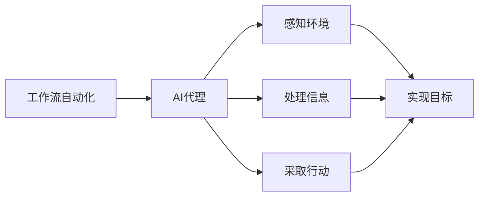

# 在电子商务中部署AI代理工作流的实战指南

## 1.背景介绍

随着人工智能(AI)技术的不断发展和应用范围的扩大,电子商务行业正在经历一场前所未有的变革。AI代理工作流的引入为电子商务企业带来了巨大的机遇,帮助它们优化业务流程、提高运营效率、增强客户体验。本文将探讨如何在电子商务环境中成功部署AI代理工作流,并提供实用的指导和最佳实践。

### 1.1 AI代理工作流在电子商务中的重要性

电子商务涉及复杂的业务流程,包括产品展示、订单处理、客户服务、库存管理等多个环节。传统的人工操作方式往往效率低下、成本高昂且容易出错。AI代理工作流通过自动化和智能化,可以显著提高这些流程的效率和准确性,从而为企业带来竞争优势。

### 1.2 AI代理工作流的典型应用场景

在电子商务中,AI代理工作流可以应用于多个领域,例如:

- 智能客户服务:基于自然语言处理(NLP)和机器学习的虚拟助手,可以提供24/7的在线支持,快速响应客户查询并解决常见问题。
- 个性化推荐:利用协同过滤和深度学习算法,为用户推荐感兴趣的产品和内容,提高转化率。
- 智能定价:通过分析历史数据和市场趋势,动态调整产品价格,实现利润最大化。
- 欺诈检测:使用异常检测模型识别可疑交易活动,保护电子商务平台的安全性。

## 2.核心概念与联系

在部署AI代理工作流之前,我们需要了解一些核心概念及它们之间的关系。

### 2.1 工作流自动化(Workflow Automation)

工作流自动化是指使用软件系统自动执行一系列任务和流程的过程。在电子商务中,工作流自动化可以应用于订单履行、客户服务、库存管理等多个环节,提高效率和一致性。

### 2.2 人工智能代理(AI Agent)

人工智能代理是指能够感知环境、处理信息并采取行动以实现特定目标的智能系统。在电子商务场景中,AI代理可以承担各种角色,如虚拟助手、推荐引擎、定价引擎等。

工作流自动化和AI代理是密切相关的概念。工作流自动化提供了一个框架,用于定义和执行一系列任务,而AI代理则充当智能化的执行者,感知环境、处理信息并采取行动以完成特定目标。

### 2.3 机器学习(Machine Learning)

机器学习是人工智能的一个重要分支,它赋予计算机从数据中学习和改进的能力。在电子商务中,机器学习可以应用于多个领域,如个性化推荐、欺诈检测、需求预测等。

### 2.4 自然语言处理(Natural Language Processing)

自然语言处理(NLP)是一门研究计算机处理和理解人类语言的技术。在电子商务场景中,NLP常被用于构建智能虚拟助手、情感分析、文本挖掘等应用。

上述概念密切相关,并在AI代理工作流的部署中发挥着重要作用。工作流自动化提供了框架,AI代理作为执行者,机器学习和自然语言处理等技术为智能化提供算力支持。

## 3.核心算法原理具体操作步骤

部署AI代理工作流涉及多个步骤,包括数据准备、模型训练、系统集成等。下面我们将详细介绍其中的核心算法原理和具体操作步骤。

### 3.1 数据收集和预处理

高质量的数据是训练AI模型的基础。在电子商务场景中,我们需要收集各种类型的数据,如用户行为数据(浏览记录、购买记录等)、产品数据(描述、价格、评论等)、客户服务对话数据等。

数据预处理是将原始数据转换为机器可读格式的过程,通常包括以下步骤:

1. **数据清洗**: 处理缺失值、异常值和重复数据。
2. **标准化**: 将数据转换为统一的格式和单位。
3. **特征提取**: 从原始数据中提取有用的特征,如文本数据的TF-IDF向量。
4. **数据分割**: 将数据集划分为训练集、验证集和测试集。

### 3.2 模型训练

根据具体的应用场景,我们可以选择合适的机器学习算法和神经网络模型,并在准备好的数据集上进行训练。以下是一些常见的算法和模型:

- **协同过滤**(Collaborative Filtering)用于个性化推荐,包括基于用户的协同过滤和基于项目的协同过滤。
- **深度神经网络**(Deep Neural Networks)广泛应用于计算机视觉、自然语言处理等领域,如卷积神经网络(CNN)、循环神经网络(RNN)、transformer等。
- **决策树**(Decision Trees)和**随机森林**(Random Forests)常用于分类和回归任务,如欺诈检测、需求预测等。
- **聚类算法**(Clustering Algorithms)如K-Means、层次聚类等,可用于客户细分和产品分类。

模型训练过程通常遵循以下步骤:

1. **初始化模型参数**
2. **前向传播**:输入数据,计算模型输出
3. **计算损失函数**:比较模型输出与真实标签的差异
4. **反向传播**:根据损失函数,计算参数梯度
5. **参数更新**:使用优化算法(如梯度下降)更新模型参数
6. **重复2-5**,直到模型收敛或达到指定迭代次数

对于深度学习模型,我们还需要注意以下几点:

- **超参数调优**:调整学习率、批量大小、正则化强度等超参数,以获得最佳性能。
- **提前停止**:在验证集上的性能不再提高时,停止训练以防止过拟合。
- **模型集成**:结合多个模型的预测结果,提高泛化能力。

### 3.3 系统集成与部署

在完成模型训练后,我们需要将其集成到现有的电子商务系统中,并与其他模块(如Web服务器、数据库等)进行交互。这个过程通常包括以下步骤:

1. **模型封装**:将训练好的模型封装为可重用的组件或API服务。
2. **系统集成**:将模型组件集成到电子商务平台的现有架构中。
3. **数据管道构建**:建立从数据源到模型输入的数据管道,实现实时数据传输。
4. **监控和维护**:持续监控模型性能,根据新数据进行重训练,确保模型的准确性。

在部署过程中,我们还需要注意以下几个方面:

- **可扩展性**:系统应能够轻松扩展以处理更大的数据量和更高的流量。
- **容错性**:系统应具有容错能力,能够从故障中恢复。
- **安全性**:采取适当的安全措施,保护敏感数据和模型。

总的来说,部署AI代理工作流是一个复杂的过程,需要数据、算法、系统和基础设施等多方面的支持。团队需要具备跨学科的专业知识,并采用敏捷的开发方法来快速迭代和改进。

## 4.数学模型和公式详细讲解举例说明

在电子商务中部署AI代理工作流涉及多种数学模型和算法,下面我们将详细介绍其中的一些核心模型。

### 4.1 协同过滤(Collaborative Filtering)

协同过滤是一种常用的个性化推荐算法,基于这样一个假设:那些过去有相似兴趣的用户,在将来也可能有相似的兴趣。根据相似度计算方式的不同,协同过滤可分为基于用户(User-Based)和基于项目(Item-Based)两种方法。

#### 4.1.1 基于用户的协同过滤

基于用户的协同过滤通过计算两个用户之间的相似度,找到与目标用户兴趣相近的邻居用户,并基于邻居用户的喜好为目标用户生成推荐。

用户相似度通常使用余弦相似度或皮尔逊相关系数计算:

$$
\text{sim}(u, v) = \frac{\sum\limits_{i \in I_{uv}}(r_{ui} - \overline{r_u})(r_{vi} - \overline{r_v})}{\sqrt{\sum\limits_{i \in I_{uv}}(r_{ui} - \overline{r_u})^2}\sqrt{\sum\limits_{i \in I_{uv}}(r_{vi} - \overline{r_v})^2}}
$$

其中 $r_{ui}$ 和 $r_{vi}$ 分别表示用户 $u$ 和 $v$ 对项目 $i$ 的评分, $\overline{r_u}$ 和 $\overline{r_v}$ 是用户 $u$ 和 $v$ 的平均评分, $I_{uv}$ 是两个用户都评分过的项目集合。

对于目标用户 $u$,推荐分数 $\hat{r}_{ui}$ 可以用加权平均的方式计算:

$$
\hat{r}_{ui} = \overline{r_u} + \frac{\sum\limits_{v \in N(u, k)}{\text{sim}(u, v)(r_{vi} - \overline{r_v})}}{\sum\limits_{v \in N(u, k)}|\text{sim}(u, v)|}
$$

其中 $N(u, k)$ 表示与用户 $u$ 最相似的 $k$ 个邻居用户集合。

#### 4.1.2 基于项目的协同过滤

基于项目的协同过滤方法类似,不过是计算项目之间的相似度,找到与目标项目相似的邻居项目,并基于用户对这些邻居项目的评分为目标项目生成预测评分。

项目相似度可以使用调整后的余弦相似度计算:

$$
\text{sim}(i, j) = \frac{\sum\limits_{u \in U_{ij}}(r_{ui} - \overline{r_u})(r_{uj} - \overline{r_u})}{\sqrt{\sum\limits_{u \in U_{ij}}(r_{ui} - \overline{r_u})^2}\sqrt{\sum\limits_{u \in U_{ij}}(r_{uj} - \overline{r_u})^2}}
$$

其中 $U_{ij}$ 表示对项目 $i$ 和 $j$ 都评分过的用户集合。

对于目标用户 $u$ 和项目 $i$,推荐分数 $\hat{r}_{ui}$ 可以用加权平均的方式计算:

$$
\hat{r}_{ui} = \overline{r_u} + \frac{\sum\limits_{j \in N(i, k)}{\text{sim}(i, j)(r_{uj} - \overline{r_u})}}{\sum\limits_{j \in N(i, k)}|\text{sim}(i, j)|}
$$

其中 $N(i, k)$ 表示与项目 $i$ 最相似的 $k$ 个邻居项目集合。

上述公式展示了协同过滤算法的数学原理,通过计算相似度并结合邻居的偏好生成推荐分数。在实际应用中,我们还需要考虑数据稀疏性、冷启动问题等挑战,并结合其他技术(如矩阵分解、深度学习等)以提高推荐质量。

### 4.2 逻辑回归(Logistic Regression)

逻辑回归是一种广泛应用于分类问题的监督学习算法,常用于欺诈检测、垃圾邮件过滤等任务。对于二分类问题,逻辑回归模型将输入特征 $\boldsymbol{x}$ 映射到 $[0, 1]$ 区间的概率值 $\hat{y}$,表示样本属于正类的可能性。

逻辑回归模型的数学表达式为:

$$
\hat{y} = P(y = 1 | \boldsymbol{x}) = \sigma(\boldsymbol{w}^T\boldsymbol{x} + b)
$$

其中 $\sigma(z) = \frac{1}{1 + e^{-z}}$ 是 Sigmoid 函数, $\boldsymbol{w}$ 和 $b$ 分