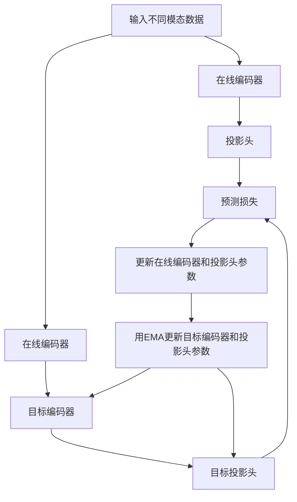

# 基于BYOL的异构表示对齐

## 1.背景介绍

### 1.1 表示学习的重要性

在深度学习领域,表示学习(Representation Learning)是一个至关重要的概念。表示学习旨在从原始数据中自动学习出有用的特征表示,这些特征表示能够捕捉数据的内在结构和模式,并且对于后续的任务(如分类、检测等)具有很强的判别能力。高质量的表示对于提高深度学习模型的性能至关重要。

### 1.2 异构表示对齐的必要性

在实际应用中,我们经常会遇到异构数据的情况,即数据来源于不同的模态(如图像、文本、视频等)。由于不同模态数据的表示形式存在差异,如何学习到能够捕捉不同模态数据内在语义关联的统一表示,并在此基础上进行有效的跨模态学习,是一个具有重要研究价值的问题。异构表示对齐(Heterogeneous Representation Alignment)正是针对这一问题而提出的解决方案。

## 2.核心概念与联系  

### 2.1 异构表示对齐概念

异构表示对齐旨在将来自不同模态的数据映射到同一个潜在的语义空间中,使得不同模态的数据在该空间中具有相似的表示。通过这种方式,我们可以捕捉不同模态数据之间的语义关联,并在此基础上进行跨模态学习和推理。

### 2.2 与自监督表示学习的联系

异构表示对齐与自监督表示学习(Self-Supervised Representation Learning)存在密切联系。自监督表示学习旨在从大量未标注数据中学习出有用的表示,而不需要依赖人工标注的监督信号。通过设计合适的自监督预测任务,模型可以从数据中捕捉到有用的统计规律,并学习到能够捕捉数据内在结构的表示。

异构表示对齐可以被视为一种特殊形式的自监督表示学习,其中预测任务是通过最大化不同模态数据之间的互信息(Mutual Information)来实现的。通过这种方式,模型可以学习到能够捕捉不同模态数据内在语义关联的统一表示。

### 2.3 BYOL框架

Bootstrap Your Own Latent (BYOL)是一种新颖的自监督表示学习框架,它通过引入一个对比学习(Contrastive Learning)的新视角,极大地提高了表示学习的效率和质量。BYOL的核心思想是通过在线和目标两个编码器之间的互相预测,来学习出能够捕捉数据内在结构的表示。

BYOL框架具有以下几个关键特点:

1. 无需使用传统对比学习中的负样本对
2. 通过在线和目标编码器之间的互相预测来学习表示
3. 停止梯度(Stop Gradient)机制确保了在线和目标编码器之间的渐进式对齐
4. 目标编码器的参数是在线编码器参数的指数移动平均(Exponential Moving Average)

由于BYOL框架的高效性和出色的表现,将其应用于异构表示对齐任务是一个很有吸引力的选择。

## 3.核心算法原理具体操作步骤

基于BYOL的异构表示对齐算法的核心思想是:通过在线和目标编码器之间的互相预测,学习出能够捕捉不同模态数据内在语义关联的统一表示。具体的操作步骤如下:



1. **输入数据**: 输入来自不同模态(如图像、文本等)的数据对。

2. **在线编码器**: 将输入数据映射到潜在表示空间,得到对应的表示向量。在线编码器的参数在训练过程中会被更新。

3. **目标编码器**: 与在线编码器具有相同的网络结构,但其参数是在线编码器参数的指数移动平均(EMA)。目标编码器的作用是为在线编码器提供更加"平滑"和"一致"的目标,从而提高表示学习的稳定性。

4. **投影头**: 将编码器输出的表示向量进一步映射到一个较低维的空间,以提高表示的判别性。

5. **预测损失**: 计算在线编码器输出的投影表示与目标编码器输出的投影表示之间的均方误差(MSE)损失。

6. **更新在线编码器和投影头参数**: 使用梯度下降法根据预测损失更新在线编码器和投影头的参数。

7. **更新目标编码器和投影头参数**: 使用指数移动平均(EMA)的方式更新目标编码器和投影头的参数,确保目标编码器能够为在线编码器提供一个"平滑"和"一致"的目标。

通过上述步骤,模型可以学习到能够捕捉不同模态数据内在语义关联的统一表示。由于BYOL框架无需使用传统对比学习中的负样本对,因此具有更高的计算效率和更好的表现。

## 4.数学模型和公式详细讲解举例说明

在基于BYOL的异构表示对齐算法中,数学模型和公式扮演着重要的角色。下面我们将详细讲解相关的数学模型和公式。

### 4.1 表示学习目标

表示学习的目标是学习一个映射函数 $f_\theta$,将原始输入数据 $x$ 映射到一个潜在表示空间中的向量表示 $z = f_\theta(x)$,使得该向量表示 $z$ 能够捕捉输入数据 $x$ 的内在结构和模式。在异构表示对齐的场景下,我们希望不同模态的数据在该潜在表示空间中具有相似的表示,从而能够捕捉不同模态数据之间的语义关联。

### 4.2 BYOL损失函数

在BYOL框架中,我们使用在线编码器 $f_\theta$ 和目标编码器 $f_\xi$ 来学习表示。其中,目标编码器的参数 $\xi$ 是在线编码器参数 $\theta$ 的指数移动平均。

我们定义投影头函数 $g_\phi$ 和 $g_\psi$,将编码器输出的表示向量映射到一个较低维的空间。则BYOL的损失函数可以表示为:

$$\mathcal{L}_\text{BYOL} = \left\Vert g_\phi(f_\theta(x)) - g_\psi(f_\xi(x))\right\Vert_2^2$$

其中 $\left\Vert \cdot \right\Vert_2$ 表示 $L_2$ 范数。该损失函数旨在最小化在线编码器输出的投影表示与目标编码器输出的投影表示之间的均方误差。

在训练过程中,我们使用梯度下降法更新在线编码器 $f_\theta$ 和投影头 $g_\phi$ 的参数,同时使用指数移动平均(EMA)的方式更新目标编码器 $f_\xi$ 和投影头 $g_\psi$ 的参数:

$$
\begin{aligned}
\theta &\leftarrow \theta - \eta \frac{\partial \mathcal{L}_\text{BYOL}}{\partial \theta} \\
\phi &\leftarrow \phi - \eta \frac{\partial \mathcal{L}_\text{BYOL}}{\partial \phi} \\
\xi &\leftarrow \tau \xi + (1 - \tau)\theta \\
\psi &\leftarrow \tau \psi + (1 - \tau)\phi
\end{aligned}
$$

其中 $\eta$ 是学习率, $\tau \in [0, 1)$ 是指数移动平均的衰减率。

通过上述损失函数和参数更新策略,BYOL框架可以学习到能够捕捉数据内在结构的表示,同时避免了传统对比学习中使用负样本对带来的计算开销。

### 4.3 异构表示对齐中的BYOL损失函数

在异构表示对齐的场景下,我们希望不同模态的数据在潜在表示空间中具有相似的表示。因此,我们可以将BYOL损失函数扩展到多个模态:

$$\mathcal{L}_\text{BYOL}^\text{multi} = \sum_{m=1}^M \left\Vert g_\phi^m(f_\theta^m(x^m)) - g_\psi^m(f_\xi^m(x^m))\right\Vert_2^2$$

其中 $M$ 表示模态的数量, $x^m$ 表示第 $m$ 个模态的输入数据, $f_\theta^m$ 和 $f_\xi^m$ 分别表示第 $m$ 个模态的在线编码器和目标编码器, $g_\phi^m$ 和 $g_\psi^m$ 分别表示第 $m$ 个模态的投影头。

通过最小化上述多模态BYOL损失函数,我们可以学习到能够捕捉不同模态数据内在语义关联的统一表示。

### 4.4 举例说明

为了更好地理解上述数学模型和公式,我们以图像-文本异构表示对齐为例进行说明。

假设我们有一个图像-文本数据对 $(x_\text{img}, x_\text{txt})$,其中 $x_\text{img}$ 表示图像数据, $x_\text{txt}$ 表示对应的文本描述。我们的目标是学习出能够捕捉图像和文本内在语义关联的统一表示。

我们定义图像编码器 $f_\theta^\text{img}$ 和文本编码器 $f_\theta^\text{txt}$,以及对应的目标编码器 $f_\xi^\text{img}$ 和 $f_\xi^\text{txt}$。同时,我们定义图像投影头 $g_\phi^\text{img}$ 和文本投影头 $g_\phi^\text{txt}$,以及对应的目标投影头 $g_\psi^\text{img}$ 和 $g_\psi^\text{txt}$。

则图像-文本异构表示对齐的BYOL损失函数可以表示为:

$$\mathcal{L}_\text{BYOL}^\text{multi} = \left\Vert g_\phi^\text{img}(f_\theta^\text{img}(x_\text{img})) - g_\psi^\text{img}(f_\xi^\text{img}(x_\text{img}))\right\Vert_2^2 + \left\Vert g_\phi^\text{txt}(f_\theta^\text{txt}(x_\text{txt})) - g_\psi^\text{txt}(f_\xi^\text{txt}(x_\text{txt}))\right\Vert_2^2$$

通过最小化上述损失函数,我们可以学习到能够捕捉图像和文本内在语义关联的统一表示。在实际应用中,我们可以根据具体的任务需求,选择合适的编码器和投影头网络结构。

## 5.项目实践：代码实例和详细解释说明

为了更好地理解基于BYOL的异构表示对齐算法,我们提供了一个基于PyTorch的代码实例。该实例实现了一个简单的图像-文本异构表示对齐任务,并使用BYOL框架进行表示学习。

### 5.1 数据准备

在本实例中,我们使用MSCOCO数据集作为示例。MSCOCO数据集包含了大量的图像和对应的文本描述,非常适合用于图像-文本异构表示对齐任务。

我们首先需要从MSCOCO数据集中加载图像和文本数据,并进行必要的预处理,如图像resize、文本tokenization等。为了简化示例,我们假设数据已经被正确地加载和预处理。

### 5.2 模型定义

我们定义了一个简单的图像编码器`ImageEncoder`和文本编码器`TextEncoder`,以及对应的投影头`ImageProjectionHead`和`TextProjectionHead`。这些模块将被用于BYOL框架中的在线编码器和投影头。

```python
import torch.nn as nn

class ImageEncoder(nn.Module):
    # 简单的图像编码器
    ...

class TextEncoder(nn.Module):
    # 简单的文本编码器
    ...

class ImageProjectionHead(nn.Module):
    # 图像投影头
    ...

class TextProjectionHead(nn.Module):
    # 文本投影头
    ...
```

###