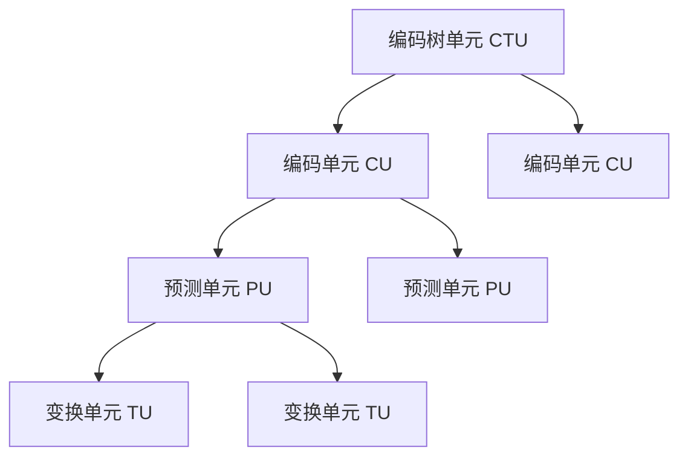

# 基于HEVC编码的视频水印算法

## 1. 背景介绍

### 1.1 视频水印技术概述

随着数字媒体的快速发展,视频作为一种重要的信息载体,其版权保护问题日益受到重视。视频水印技术作为一种有效的版权保护手段,通过将一些标识信息隐藏在视频数据中,可以实现对视频内容的版权声明、溯源、认证和防伪等功能,因此受到了广泛关注。

视频水印技术可以分为两大类:空域水印和压缩域水印。空域水印直接在视频像素数据上嵌入水印信息,算法简单但鲁棒性较差。压缩域水印则在视频压缩编码过程中嵌入水印,具有更好的鲁棒性和透明性。

### 1.2 HEVC视频编码标准

高效率视频编码(High Efficiency Video Coding, HEVC)是最新的视频压缩编码标准,相比之前的H.264/AVC标准,HEVC在同等视频质量下可以节省50%以上的码率,因此在4K/8K超高清视频传输和存储方面具有重要应用价值。HEVC采用了诸多先进的编码技术,如编码树单元(Coding Tree Unit, CTU)、预测单元(Prediction Unit, PU)、变换单元(Transform Unit, TU)等,极大提高了编码效率。

## 2. 核心概念与联系

### 2.1 视频水印的基本要求

一个理想的视频水印算法应当满足以下几个基本要求:

1. **鲁棒性(Robustness)**: 水印信息应当能够抵御各种常见的视频处理操作,如编码压缩、几何变换、滤波等,不被破坏或移除。
2. **透明性(Imperceptibility)**: 嵌入水印后的视频质量不应有明显的视觉失真,保持与原始视频的无差异性。
3. **安全性(Security)**: 水印信息应当对非法用户隐藏,只有合法用户才能检测和提取水印。
4. **容量(Capacity)**: 水印算法应当具有一定的信息承载能力,以满足实际应用需求。

### 2.2 HEVC编码结构与水印嵌入

HEVC的编码结构为层次化的四级树状结构,自顶向下依次为:

1. 编码树单元(CTU)
2. 编码单元(CU)
3. 预测单元(PU)
4. 变换单元(TU)

其中,CTU是最大的编码单元,通常大小为64x64像素。CU是CTU的子块,用于进行编码模式选择。PU是CU的子块,用于进行inter预测或intra预测。TU是PU的子块,用于进行变换和熵编码。



基于HEVC编码结构的视频水印算法,通常是在CTU、CU、PU或TU级别嵌入水印信息。不同级别的水印嵌入策略具有不同的特点,需要根据具体应用场景进行权衡选择。

## 3. 核心算法原理具体操作步骤 

### 3.1 基于CTU级别的水印嵌入

在CTU级别嵌入水印的基本思路是:对每个CTU进行分析,根据其特征信息(如纹理复杂度等)选择是否嵌入水印及嵌入强度。这种方法的优点是可以根据视频内容的局部特征自适应地调整水印强度,从而在透明性和鲁棒性之间取得平衡。算法步骤如下:

1. 计算每个CTU的纹理复杂度指标
2. 根据纹理复杂度指标确定是否嵌入水印及嵌入强度
3. 对选中的CTU,修改其部分像素值以嵌入水印比特
4. 对嵌入水印的CTU进行HEVC编码

### 3.2 基于CU级别的水印嵌入  

在CU级别嵌入水印的基本思路是:对每个CU进行分析,根据其预测模式(inter预测或intra预测)选择不同的水印嵌入方式。这种方法可以很好地利用HEVC编码的预测残差信息,提高水印的鲁棒性。算法步骤如下:

1. 对每个CU,确定其预测模式(inter或intra)
2. 对于inter预测的CU,修改其运动矢量以嵌入水印比特
3. 对于intra预测的CU,修改其预测残差以嵌入水印比特  
4. 对嵌入水印的CU进行HEVC编码

### 3.3 基于PU级别的水印嵌入

在PU级别嵌入水印的基本思路是:对每个PU进行分析,根据其预测方向选择不同的水印嵌入位置和方式。这种方法可以很好地利用HEVC的角度预测编码,提高水印的鲁棒性。算法步骤如下:

1. 对每个PU,确定其预测方向(水平、垂直或角度预测)
2. 根据预测方向,选择PU边界像素或角点像素进行水印嵌入
3. 修改选定的像素值以嵌入水印比特
4. 对嵌入水印的PU进行HEVC编码  

### 3.4 基于TU级别的水印嵌入

在TU级别嵌入水印的基本思路是:对每个TU进行变换系数分析,根据系数的能量分布情况选择合适的系数位置嵌入水印比特。这种方法可以很好地抵御HEVC的量化和熵编码操作,提高水印的鲁棒性。算法步骤如下:

1. 对每个TU进行变换(如DCT变换)
2. 分析变换系数的能量分布,选择中高频系数进行水印嵌入
3. 修改选定的变换系数值以嵌入水印比特
4. 对嵌入水印的TU进行HEVC编码

不同级别的水印嵌入策略各有优缺点,需要根据具体应用场景进行权衡选择。通常来说,CTU级别和CU级别的水印嵌入算法透明性较好,但鲁棒性相对较差;而PU级别和TU级别的水印嵌入算法则鲁棒性较强,但可能会对视频质量产生一定影响。

## 4. 数学模型和公式详细讲解举例说明

### 4.1 纹理复杂度计算

纹理复杂度指标通常用于衡量图像或视频帧的纹理活跃程度,可以作为水印嵌入强度的依据。常用的纹理复杂度计算方法有:

1. **基于梯度的方法**

设图像块的像素值为$f(x,y)$,其水平和垂直梯度分别为:

$$
\begin{aligned}
G_x(x,y) &= f(x+1,y) - f(x,y) \\
G_y(x,y) &= f(x,y+1) - f(x,y)
\end{aligned}
$$

则该图像块的梯度幅值可表示为:

$$
G(x,y) = \sqrt{G_x(x,y)^2 + G_y(x,y)^2}
$$

图像块的纹理复杂度可定义为该块内所有像素的梯度幅值之和:

$$
T_C = \sum_{x,y} G(x,y)
$$

2. **基于小波变换的方法**

对图像块进行小波变换,得到各级小波系数。纹理复杂度可定义为中高频小波系数的能量之和:

$$
T_C = \sum_{i,j} |C_{ij}|^2
$$

其中$C_{ij}$为中高频小波系数。

3. **基于灰度共现矩阵的方法**

构建图像块的灰度共现矩阵,计算矩阵的对比度、熵、能量等统计特征值,这些特征值可以很好地描述图像块的纹理特性。

### 4.2 运动矢量修改嵌入水印

对于inter预测的CU,可以通过修改其运动矢量来嵌入水印比特。设CU的原始运动矢量为$(mv_x, mv_y)$,嵌入比特$b$后的新运动矢量为:

$$
\begin{cases}
mv_x' = mv_x + \alpha \cdot (-1)^b \\
mv_y' = mv_y + \beta \cdot (-1)^b
\end{cases}
$$

其中$\alpha$和$\beta$为步长因子,用于控制水印强度。嵌入比特0时,运动矢量保持不变;嵌入比特1时,运动矢量发生一定偏移。

### 4.3 预测残差修改嵌入水印

对于intra预测的CU,可以通过修改其预测残差来嵌入水印比特。设预测残差像素为$r(x,y)$,嵌入比特$b$后的新残差像素为:

$$
r'(x,y) = r(x,y) + \gamma \cdot (-1)^b \cdot \omega(x,y)
$$

其中$\gamma$为强度因子,用于控制水印强度;$\omega(x,y)$为伪随机序列,用于提高水印的安全性。

### 4.4 变换系数修改嵌入水印

对于TU,可以通过修改其变换系数来嵌入水印比特。设变换系数为$C(u,v)$,嵌入比特$b$后的新变换系数为:

$$
C'(u,v) = C(u,v) + \delta \cdot (-1)^b \cdot Q(u,v)
$$

其中$\delta$为强度因子,用于控制水印强度;$Q(u,v)$为量化步长,用于保证修改后的系数仍在量化间隔内。通常选择中高频系数进行修改,以减小对视频质量的影响。

以上公式给出了几种常见的水印嵌入方法,实际算法中还需要结合其他处理,如伪随机序列生成、扩频调制、误码率优化等,以提高水印的鲁棒性和安全性。

## 5. 项目实践:代码实例和详细解释说明

下面给出一个基于HEVC编码的视频水印嵌入和检测的Python代码示例,采用了基于CTU级别的水印嵌入策略。

### 5.1 水印嵌入代码

```python
import numpy as np
from hevc_codec import encode_ctu, decode_ctu

# 水印信息
watermark = '这是一个示例水印'
watermark_bits = ''.join(format(ord(c), '08b') for c in watermark)

# 纹理复杂度阈值
texture_threshold = 1000

def embed_watermark(video_frames, watermark_bits):
    watermarked_frames = []
    bit_idx = 0
    
    for frame in video_frames:
        ctus = split_into_ctus(frame)
        watermarked_ctus = []
        
        for ctu in ctus:
            texture_complexity = calculate_texture_complexity(ctu)
            
            if texture_complexity > texture_threshold:
                watermark_bit = int(watermark_bits[bit_idx])
                watermarked_ctu = embed_bit_in_ctu(ctu, watermark_bit)
                watermarked_ctus.append(watermarked_ctu)
                bit_idx = (bit_idx + 1) % len(watermark_bits)
            else:
                watermarked_ctus.append(ctu)
        
        watermarked_frame = combine_ctus(watermarked_ctus)
        watermarked_frames.append(watermarked_frame)
    
    return watermarked_frames

def embed_bit_in_ctu(ctu, bit):
    # 修改CTU像素值以嵌入水印比特
    ...
    
    # 对修改后的CTU进行HEVC编码
    encoded_ctu = encode_ctu(watermarked_ctu)
    
    return encoded_ctu
```

该代码首先将水印信息转换为二进制比特流。然后对每个视频帧进行CTU划分,计算每个CTU的纹理复杂度,并根据复杂度决定是否嵌入水印比特。对于选中的CTU,调用`embed_bit_in_ctu`函数修改其像素值以嵌入水印比特,并对修改后的CTU进行HEVC编码。最后将所有编码后的CTU重新组合为新的视频帧。

### 5.2 水印检测代码

```python
def detect_watermark(watermarked_frames):
    extracted_bits = ''
    
    for frame in watermarked_frames:
        ctus