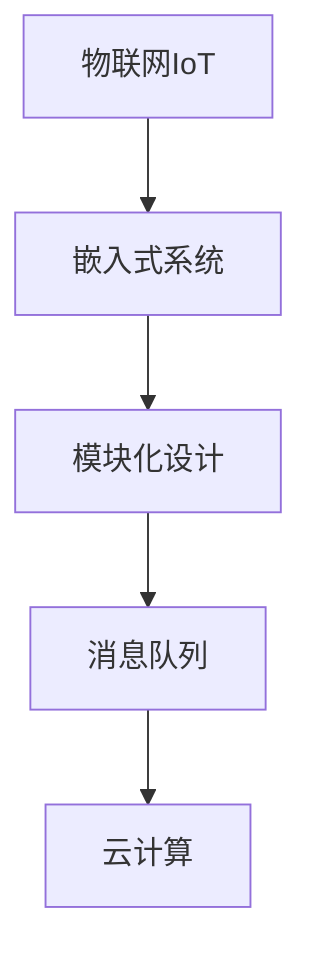

# 基于Java的智能家居设计：构建基于Java的模块化智能家居系统

## 1.背景介绍

### 1.1 智能家居的兴起

随着科技的快速发展,物联网、人工智能等新兴技术的不断涌现,智能家居应运而生。智能家居系统通过将家居设备与互联网相连,利用各种传感器、控制器和智能算法,实现对家居环境的自动化控制和智能管理。这不仅为人们的生活带来了极大的便利,同时也提高了能源利用效率,促进了环保理念的实现。

### 1.2 智能家居系统的发展现状

早期的智能家居系统主要依赖于专有的硬件和软件,存在兼容性差、扩展性低、成本高等问题。近年来,开源社区和主流编程语言为智能家居系统的开发提供了更加灵活、模块化的解决方案。其中,Java语言以其跨平台、面向对象等优势,成为构建智能家居系统的首选。

### 1.3 基于Java的智能家居系统的优势

基于Java构建的智能家居系统具有以下优势:

- **跨平台性**:Java程序可在多种操作系统上运行,适用于不同硬件平台。
- **面向对象**:Java语言天生支持面向对象编程范式,有利于代码的模块化和可维护性。
- **健壮的生态系统**:Java拥有丰富的第三方库和框架,可快速集成各种功能。
- **安全性**:Java内置了安全管理器,可有效防止恶意代码的执行。

## 2.核心概念与联系

构建基于Java的智能家居系统,需要理解和掌握以下几个核心概念及其联系:

### 2.1 物联网(IoT)

物联网(Internet of Things)是指通过互联网将各种物品与网络相连,实现信息交换和远程控制。智能家居系统正是物联网在家庭环境中的应用。

### 2.2 嵌入式系统

嵌入式系统是指在特定的计算机硬件系统中植入软件,用于控制和监视特定的功能或操作。智能家居中的各种传感器、执行器等设备均属于嵌入式系统。

### 2.3 模块化设计

模块化设计是将系统划分为相对独立的模块,每个模块负责特定的功能,通过定义良好的接口实现模块间的交互。这种设计方式有利于代码的可维护性和可扩展性。

### 2.4 消息队列

消息队列是一种异步通信机制,用于在不同组件之间传递消息或数据。在智能家居系统中,消息队列可用于设备与控制中心之间的通信,实现灵活的解耦。

### 2.5 云计算

云计算是一种按需获取计算资源的模式,可提供存储、计算、网络等服务。在智能家居系统中,云计算可用于存储和处理大量的数据,并提供远程访问和控制功能。

### 2.6 核心概念关系

上述核心概念相互关联,共同构建了基于Java的智能家居系统。物联网技术实现了设备的互联,嵌入式系统负责设备的控制和数据采集,模块化设计保证了系统的可维护性和扩展性,消息队列实现了组件间的通信,云计算为系统提供了数据存储、计算和远程访问等功能。



## 3.核心算法原理具体操作步骤

构建一个基于Java的模块化智能家居系统,需要涉及多个核心算法和技术,下面将详细介绍其中几个关键部分的原理和具体操作步骤。

### 3.1 设备发现与连接

智能家居系统需要自动发现并连接家中的各种智能设备,这通常基于特定的网络协议实现。以下是一种常见的设备发现与连接流程:

1. **广播发现**:系统通过广播的方式向局域网内发送设备发现请求。
2. **设备响应**:局域网内的智能设备接收到请求后,将自身的设备信息回复给系统。
3. **建立连接**:系统根据收到的设备信息,选择合适的协议与设备建立连接。
4. **配置设备**:连接建立后,系统可对设备进行配置,如设置设备ID、功能等。

下面是一个使用Java的`MulticastSocket`类实现设备发现的示例代码:

```java
// 发送广播数据
DatagramSocket socket = new DatagramSocket();
byte[] data = "DISCOVER_DEVICES".getBytes();
InetAddress address = InetAddress.getByName("239.255.255.250");
DatagramPacket packet = new DatagramPacket(data, data.length, address, 9999);
socket.send(packet);

// 接收设备响应
byte[] buffer = new byte[1024];
DatagramPacket response = new DatagramPacket(buffer, buffer.length);
socket.receive(response);
String deviceInfo = new String(response.getData(), 0, response.getLength());
```

### 3.2 数据处理与控制

智能家居系统需要对采集到的数据进行处理,并根据特定的规则或算法对设备进行控制。以温度控制为例,其核心算法步骤如下:

1. **获取温度数据**:从温度传感器采集当前的温度值。
2. **与目标值比较**:将采集到的温度值与预设的目标温度值进行比较。
3. **控制执行器**:如果温度值偏离目标值,则控制空调等执行器对温度进行调节。
4. **反馈与记录**:将控制操作记录到日志中,并反馈给用户当前的温度状态。

以下是使用Java实现上述算法的示例代码:

```java
// 获取当前温度
TemperatureSensor sensor = new TemperatureSensor();
double currentTemp = sensor.getTemperature();

// 与目标值比较
double targetTemp = 25.0; // 预设目标温度
double diff = Math.abs(currentTemp - targetTemp);

// 控制执行器
if (diff > 1.0) { // 如果温差超过1度
    AirConditioner ac = new AirConditioner();
    if (currentTemp > targetTemp) {
        ac.setCoolingMode(); // 制冷模式
    } else {
        ac.setHeatingMode(); // 制热模式
    }
}

// 反馈与记录
System.out.println("当前温度: " + currentTemp + "°C");
Logger.log("调节温度: " + (currentTemp > targetTemp ? "制冷" : "制热"));
```

### 3.3 规则引擎

在智能家居系统中,通常需要根据用户的设置或特定的场景来执行相应的操作,这可以通过规则引擎来实现。规则引擎的核心算法步骤如下:

1. **规则定义**:根据系统需求,使用特定的语法定义规则。
2. **事实断言**:将当前系统状态作为事实断言到规则引擎中。
3. **规则匹配**:规则引擎根据断言的事实匹配相应的规则。
4. **规则执行**:对匹配成功的规则执行相应的操作。

以下是一个使用Java规则引擎Drools实现简单场景控制的示例:

```java
// 定义规则
String rule = "import com.example.model.*\n" +
              "rule \"GoodNightRule\"\n" +
              "when\n" +
              "    $h : HomeStatus(isNight == true, isAway == false)\n" +
              "then\n" +
              "    turnOffLights();\n" +
              "    setThermostatTemp(22);\n" +
              "end";

// 加载规则
KieServices kieServices = KieServices.Factory.get();
KieFileSystem kieFileSystem = kieServices.newKieFileSystem();
kieFileSystem.write("src/main/resources/rules.drl", rule);
KieBuilder kieBuilder = kieServices.newKieBuilder(kieFileSystem);
kieBuilder.buildAll();
KieModule kieModule = kieBuilder.getKieModule();
KieContainer kieContainer = kieServices.newKieContainer(kieModule.getReleaseId());

// 断言事实并执行规则
KieSession kieSession = kieContainer.newKieSession();
HomeStatus homeStatus = new HomeStatus(true, false);
kieSession.insert(homeStatus);
kieSession.fireAllRules();
```

在上述示例中,我们定义了一个"GoodNightRule"规则,当系统检测到夜间且用户在家的情况时,该规则将自动执行关闭灯光和调节温度的操作。

## 4.数学模型和公式详细讲解举例说明

在智能家居系统的设计和实现过程中,往往需要使用各种数学模型和公式来描述和解决实际问题。以下是一些常见的数学模型和公式,并给出了详细的讲解和示例说明。

### 4.1 fuzzy控制

fuzzy控制是一种基于模糊逻辑的控制方法,适用于复杂的非线性系统。在智能家居系统中,fuzzy控制可用于温度、照明等环境因素的智能调节。

fuzzy控制的核心是通过构建模糊规则库和模糊推理机制,将精确的输入值映射到模糊的语言值,再根据规则进行推理,最终得到精确的输出控制量。

假设我们要控制房间的温度,输入变量为当前温度和目标温度,输出变量为空调的制冷或制热程度。fuzzy控制的数学模型可表示为:

$$
y=f(x_1,x_2,\ldots,x_n)
$$

其中,$x_1,x_2,\ldots,x_n$为输入变量,$y$为输出变量,$f$为模糊推理过程。

以下是一个简化的fuzzy温度控制规则示例:

```
IF CurrentTemp IS VeryLow AND TargetTemp IS Medium THEN CoolingOutput IS Low
IF CurrentTemp IS Low AND TargetTemp IS High THEN CoolingOutput IS High
...
```

在实现时,我们需要定义输入输出变量的模糊集合及其隶属度函数,构建规则库,并使用模糊推理算法(如Mamdani或Sugeno模型)进行计算。

### 4.2 PID控制

PID控制是一种广泛应用于工业控制系统的经典控制算法,在智能家居系统中也有应用,如温度、湿度等环境因素的精确控制。

PID控制的数学模型为:

$$
u(t)=K_p e(t)+K_i\int_0^t e(\tau)d\tau+K_d\frac{de(t)}{dt}
$$

其中,$u(t)$为控制输出,$e(t)$为偏差,$K_p$、$K_i$、$K_d$分别为比例、积分、微分系数。

该模型包含三个分量:

- 比例项$K_p e(t)$:根据当前偏差值进行调整,可快速响应误差。
- 积分项$K_i\int_0^t e(\tau)d\tau$:累计历史偏差,消除静态误差。
- 微分项$K_d\frac{de(t)}{dt}$:根据偏差变化率进行调整,预测系统行为。

通过合理设置$K_p$、$K_i$、$K_d$值,可使系统快速收敛到稳定状态。

以温度控制为例,设当前温度为$T_c$,目标温度为$T_d$,控制输出为空调制冷/制热功率$P$,则PID控制器可表示为:

$$
P(t)=K_p(T_d-T_c)+K_i\int_0^t (T_d-T_c)d\tau+K_d\frac{d(T_d-T_c)}{dt}
$$

通过调节$K_p$、$K_i$、$K_d$值,可使房间温度快速、精确地达到并维持在目标温度。

### 4.3 时间序列分析

时间序列分析是一种研究事物随时间变化规律的数学方法,在智能家居系统中可用于对用户行为、能源消耗等数据进行分析和预测。

常见的时间序列分析模型包括自回归移动平均模型(ARMA)、指数平滑模型等。以ARMA模型为例,其数学表达式为:

$$
y_t=c+\phi_1y_{t-1}+\ldots+\phi_py_{t-p}+\theta_1\epsilon_{t-1}+\ldots+\theta_q\epsilon_{t-q}+\epsilon_t
$$

其中,$y_t$为时间$t$时的观测值,$c$为常数项,$\phi_1,\ldots,\phi_p$为自回归参数,$\theta_1,\ldots,\theta_q$为移动平均参数,$\epsilon_t$为白噪声序列。

假设我们要对某家庭的用电量数据进行分