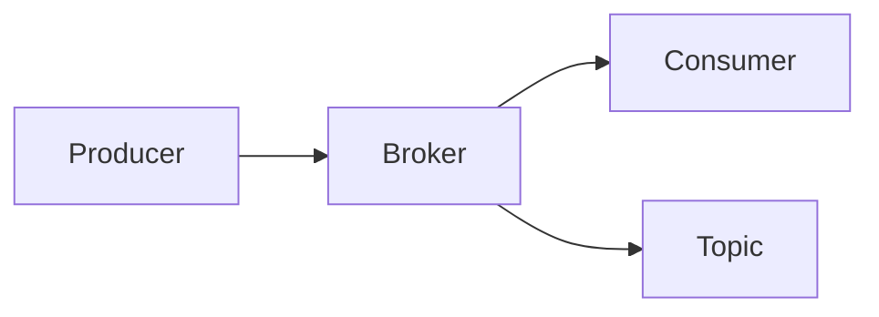

## 1.背景介绍

在今天的大数据时代，数据流动的速度和规模已经超出了传统数据库的处理能力。为了满足这种大规模、高速度的数据流动需求，消息队列成为了一种理想的解决方案。Apache Kafka就是这样一种高吞吐量的消息队列系统，它能够处理大规模的实时数据，满足企业级应用的需求。

## 2.核心概念与联系

Kafka是一种分布式的、基于发布/订阅模式的消息队列系统。它的主要组成部分包括：Producer（生产者）、Broker（消息中间件服务器）、Consumer（消费者）和Topic（主题）。

- Producer：负责生产数据，将数据发送到Kafka Broker。
- Broker：存储由Producer发送的数据，并将数据提供给Consumer消费。
- Consumer：消费Broker中的数据。
- Topic：是Kafka中数据的载体，每条消息都属于一个Topic。



## 3.核心算法原理具体操作步骤

Kafka通过以下核心算法和操作步骤来实现高吞吐量的消息队列：

1. 分区：Kafka的Topic被划分为多个分区，每个分区可以在不同的服务器上。这种分布式的存储方式使得Kafka可以通过并行处理来提高吞吐量。

2. 副本：为了保证数据的可靠性，Kafka为每个分区设置了副本。副本之间通过ZooKeeper进行同步。

3. 写入数据：Producer将数据发送到Broker的某个Topic的分区上，数据被追加到该分区的日志文件中。

4. 读取数据：Consumer从Broker的某个Topic的分区上读取数据，按照日志文件中的顺序进行读取。

5. 偏移量：每条消息在日志文件中的位置称为偏移量。Consumer通过保存偏移量，可以在断电后从上次读取的位置继续读取。

## 4.数学模型和公式详细讲解举例说明

假设我们有一个Kafka集群，包含n个Broker，每个Broker可以处理m个分区。每个分区可以处理p个Producer和c个Consumer。那么，Kafka集群的吞吐量T可以表示为：

$$
T = n \times m \times p \times c
$$

这个公式说明，Kafka集群的吞吐量与Broker数量、分区数量、Producer数量和Consumer数量成正比。因此，我们可以通过增加这些数量来提高Kafka集群的吞吐量。

## 5.项目实践：代码实例和详细解释说明

以下是一个使用Java API向Kafka发送和接收消息的简单示例：

```java
// 创建Producer
Properties props = new Properties();
props.put("bootstrap.servers", "localhost:9092");
props.put("key.serializer", "org.apache.kafka.common.serialization.StringSerializer");
props.put("value.serializer", "org.apache.kafka.common.serialization.StringSerializer");
Producer<String, String> producer = new KafkaProducer<>(props);

// 发送消息
ProducerRecord<String, String> record = new ProducerRecord<>("my-topic", "key", "value");
producer.send(record);
producer.close();

// 创建Consumer
props = new Properties();
props.put("bootstrap.servers", "localhost:9092");
props.put("group.id", "test");
props.put("key.deserializer", "org.apache.kafka.common.serialization.StringDeserializer");
props.put("value.deserializer", "org.apache.kafka.common.serialization.StringDeserializer");
Consumer<String, String> consumer = new KafkaConsumer<>(props);

// 接收消息
consumer.subscribe(Arrays.asList("my-topic"));
while (true) {
    ConsumerRecords<String, String> records = consumer.poll(Duration.ofMillis(100));
    for (ConsumerRecord<String, String> record : records) {
        System.out.printf("offset = %d, key = %s, value = %s%n", record.offset(), record.key(), record.value());
    }
}
```

## 6.实际应用场景

Kafka广泛应用于实时数据处理、日志收集、流处理等场景。例如，LinkedIn使用Kafka来处理每天数十亿条的实时用户行为数据；Netflix使用Kafka来处理其日志和监控数据；Twitter使用Kafka来处理其实时用户推文数据。

## 7.工具和资源推荐

- Apache Kafka：Kafka的官方网站，提供Kafka的下载、文档和教程。
- Confluent：提供Kafka的商业支持和额外的工具，如Kafka Connect和Kafka Streams。
- Kafka Manager：一个开源的Kafka集群管理工具，可以查看Topic、Broker和Consumer的状态。

## 8.总结：未来发展趋势与挑战

随着大数据和实时计算的发展，Kafka的重要性将越来越高。但同时，Kafka也面临着如何处理更大规模数据、如何提供更高可用性、如何简化管理和运维等挑战。

## 9.附录：常见问题与解答

1. Kafka如何保证数据的可靠性？

   Kafka通过副本机制来保证数据的可靠性。每个分区有多个副本，其中一个作为Leader，其他的作为Follower。Producer只写Leader，Follower从Leader同步数据。当Leader宕机时，会从Follower中选举新的Leader。

2. Kafka如何处理大规模数据？

   Kafka通过分区和并行处理来处理大规模数据。每个Topic被划分为多个分区，每个分区可以在不同的服务器上。Producer和Consumer可以并行地向多个分区写入和读取数据。

作者：禅与计算机程序设计艺术 / Zen and the Art of Computer Programming