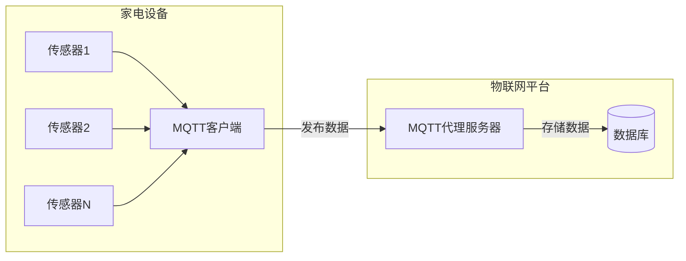
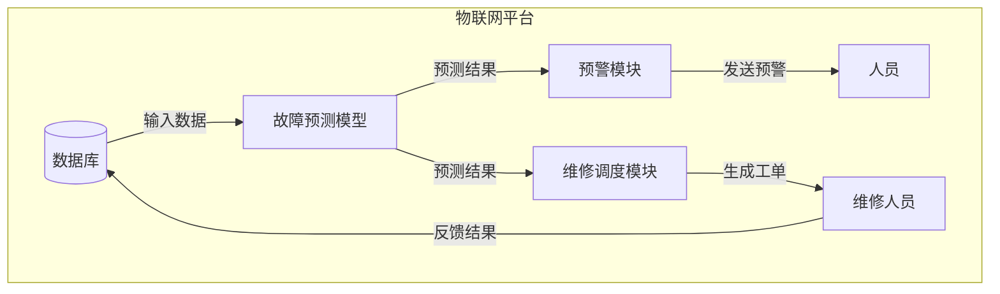

# 基于MQTT协议和RESTful API的家电故障预测与维护系统

## 1.背景介绍

### 1.1 家电行业现状与挑战

随着人们生活水平的不断提高,家电产品在日常生活中扮演着越来越重要的角色。然而,家电产品的故障和维修一直是困扰消费者的一大痛点。传统的家电维修模式存在以下几个主要问题:

1. **响应时间长**:当家电出现故障时,消费者需要拨打服务热线,等待维修人员上门,整个过程往往需要较长时间。
2. **维修成本高**:维修费用通常较高,尤其是对于一些小故障,修理费用可能超过购买新产品的价格。
3. **故障预防能力差**:传统模式下,维修人员无法提前预测和预防家电故障,只能被动地等待故障发生后再进行维修。

为了解决这些问题,提高家电产品的可靠性和用户体验,我们需要一种创新的家电故障预测与维护系统。

### 1.2 物联网和大数据在家电领域的应用

物联网(IoT)和大数据技术的发展为家电行业带来了新的机遇。通过在家电产品中嵌入传感器和通信模块,我们可以实时采集家电的运行数据,并将这些数据传输到云端进行存储和分析。利用大数据分析和机器学习算法,我们可以从海量的运行数据中发现隐藏的模式和规律,从而实现对家电故障的预测和预防。

基于物联网和大数据技术,我们可以构建一个智能化的家电故障预测与维护系统,实现以下目标:

1. **提前预测故障**:通过分析家电运行数据,提前发现潜在的故障风险,避免故障发生。
2. **优化维修计划**:根据预测结果,合理安排维修计划,提高维修效率。
3. **减少维修成本**:通过提前预防故障,降低维修频率,从而减少维修成本。
4. **提升用户体验**:避免家电故障带来的不便,提高用户的满意度。

## 2.核心概念与联系

### 2.1 MQTT协议

MQTT(Message Queuing Telemetry Transport)是一种轻量级的发布/订阅模式的消息传输协议,它被广泛应用于物联网领域。MQTT协议具有以下特点:

1. **轻量级**:MQTT协议的头部只有2字节,非常适合于低带宽、不可靠的网络环境。
2. **发布/订阅模式**:MQTT采用发布/订阅模式,发布者将消息发送到主题(Topic),订阅者订阅感兴趣的主题即可接收相应的消息。
3. **三种通信机制**:MQTT支持三种通信机制:最多一次(At most once)、至少一次(At least once)和只有一次(Exactly once),可以根据实际需求选择合适的机制。
4. **支持QoS等级**:MQTT支持三种QoS(Quality of Service)等级,分别是0(最多一次)、1(至少一次)和2(只有一次),用于控制消息传输的可靠性。

在我们的家电故障预测与维护系统中,MQTT协议可以用于实现家电与云端的数据通信。每台家电都可以作为MQTT客户端,将运行数据以消息的形式发布到指定的主题。云端的MQTT代理服务器则订阅相应的主题,接收并存储家电发送的数据。

### 2.2 RESTful API

RESTful API(Representational State Transfer Application Programming Interface)是一种基于HTTP协议的应用程序接口,它遵循REST(Representational State Transfer)架构风格,具有以下特点:

1. **面向资源**:RESTful API将服务器上的所有资源都抽象为URI(Uniform Resource Identifier)。
2. **统一接口**:RESTful API定义了一组统一的操作,包括GET(获取资源)、POST(新建资源)、PUT(更新资源)和DELETE(删除资源)。
3. **无状态**:RESTful API是无状态的,每个请求都包含了完整的信息,不依赖于之前的请求。
4. **支持多种数据格式**:RESTful API支持多种数据格式,如JSON、XML等,方便与不同的客户端进行交互。

在我们的家电故障预测与维护系统中,RESTful API可以用于实现云端与外部系统(如移动应用、Web应用等)的交互。外部系统可以通过RESTful API获取家电的运行状态、故障预测结果等信息,也可以通过API发送维修请求或其他指令。

### 2.3 物联网平台

物联网平台是一个集成了多种功能的综合性平台,它为物联网应用提供了基础设施和服务支持。一个典型的物联网平台通常包括以下几个核心组件:

1. **设备管理**:用于管理和监控连接到平台的各种物联网设备。
2. **数据管理**:提供数据存储、处理和分析等功能,支持对海量设备数据进行管理。
3. **消息路由**:实现设备与云端之间的数据交换,常采用MQTT等消息传输协议。
4. **规则引擎**:根据预定义的规则对设备数据进行处理,实现自动化决策和控制。
5. **API网关**:提供RESTful API或其他接口,供外部系统与物联网平台进行交互。

在我们的家电故障预测与维护系统中,物联网平台扮演着关键的角色。它集成了MQTT代理服务器、数据存储和分析模块、RESTful API网关等多种功能,为整个系统提供了基础支撑。

## 3.核心算法原理具体操作步骤

### 3.1 数据采集

家电故障预测与维护系统的第一步是采集家电的运行数据。我们需要在家电产品中嵌入各种传感器,如温度传感器、振动传感器、电流传感器等,实时监测家电的运行状态。这些数据通过MQTT协议发布到物联网平台的MQTT代理服务器上。

数据采集的具体步骤如下:

1. 家电作为MQTT客户端连接到MQTT代理服务器。
2. 家电订阅一个或多个主题,用于接收来自云端的控制命令。
3. 家电在指定的主题上发布运行数据,包括传感器读数、故障代码等。
4. MQTT代理服务器将接收到的数据存储在数据库中,供后续分析使用。

### 3.2 数据预处理

采集到的原始数据通常需要进行预处理,以提高后续分析的质量和效率。数据预处理可能包括以下步骤:

1. **数据清洗**:去除异常值、缺失值等无效数据。
2. **数据转换**:对数据进行标准化、归一化等转换,使数据符合模型的输入要求。
3. **数据分段**:将时序数据按照一定的时间窗口进行分段,方便进行批量处理。
4. **数据标注**:对历史数据进行人工标注,标记故障类型,作为监督学习模型的训练数据。

### 3.3 故障预测模型

在数据预处理完成后,我们可以基于机器学习算法构建故障预测模型。常用的算法包括:

1. **时序模型**:如ARIMA、LSTM等,适用于对时序数据进行预测。
2. **监督学习模型**:如逻辑回归、决策树、随机森林等,适用于对已标注的故障数据进行分类。
3. **无监督学习模型**:如聚类算法、异常检测算法等,适用于发现数据中的异常模式。

具体的模型选择取决于数据的特征和预测目标。我们可以尝试多种模型,并通过交叉验证等方法评估模型的性能,选择最优模型用于故障预测。

模型训练的步骤如下:

1. 将预处理后的数据划分为训练集和测试集。
2. 在训练集上训练模型,优化模型参数。
3. 在测试集上评估模型性能,计算准确率、召回率等指标。
4. 根据评估结果,选择最优模型,并将其部署到生产环境中。

### 3.4 故障预警和维修调度

基于故障预测模型的输出结果,我们可以实现故障预警和维修调度功能。具体步骤如下:

1. 模型持续监测家电的运行数据,预测故障风险。
2. 当预测出故障风险超过阈值时,向相关人员发送预警通知。
3. 根据故障类型、严重程度等信息,自动生成维修工单,安排维修人员上门维修。
4. 维修人员完成维修后,将维修结果反馈到系统中,用于持续优化故障预测模型。

## 4.数学模型和公式详细讲解举例说明

在家电故障预测与维护系统中,我们可以应用多种数学模型和算法,下面我们将详细介绍其中的两种常用模型。

### 4.1 时序预测模型:ARIMA

ARIMA(Auto-Regressive Integrated Moving Average)模型是一种广泛应用于时序数据预测的经典模型。它由三个部分组成:自回归(AR)、差分(I)和移动平均(MA)。

ARIMA模型的数学表达式如下:

$$
y_t = c + \phi_1 y_{t-1} + \phi_2 y_{t-2} + ... + \phi_p y_{t-p} + \theta_1 \epsilon_{t-1} + \theta_2 \epsilon_{t-2} + ... + \theta_q \epsilon_{t-q} + \epsilon_t
$$

其中:

- $y_t$是时间$t$时的观测值
- $c$是常数项
- $\phi_1, \phi_2, ..., \phi_p$是自回归系数
- $\theta_1, \theta_2, ..., \theta_q$是移动平均系数
- $\epsilon_t$是时间$t$时的残差项,服从均值为0、方差为$\sigma^2$的正态分布

ARIMA模型的优点是可以很好地捕捉时序数据中的趋势、周期性和自相关性,因此在家电运行数据的预测中有着广泛的应用。

以家电电流数据为例,我们可以构建ARIMA模型对未来的电流值进行预测。如果预测值与实际值的差异超过一定阈值,则可能预示着故障的发生,从而触发预警机制。

### 4.2 监督学习模型:随机森林

随机森林(Random Forest)是一种基于决策树的集成学习算法,常用于分类和回归任务。它的原理是通过构建多个决策树,并将它们的预测结果进行组合,从而获得更加准确和稳定的预测结果。

随机森林的数学模型可以表示为:

$$
f(x) = \frac{1}{M} \sum_{m=1}^M f_m(x)
$$

其中:

- $f(x)$是随机森林的预测结果
- $M$是决策树的数量
- $f_m(x)$是第$m$棵决策树的预测结果

每棵决策树都是通过以下步骤构建的:

1. 从原始训练集中有放回地抽取$N$个样本,构建一个新的训练集
2. 在新的训练集上,对每个节点随机选择$m$个特征,并根据这$m$个特征的信息增益来分裂节点
3. 重复上述步骤,直到每个节点都是纯净的或者达到其他停止条件

随机森林在家电故障预测中的应用场景是:基于家电的历史运行数据和故障标签,训练一