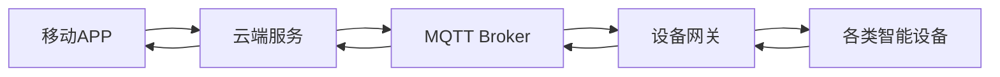

# 基于MQTT协议和RESTful API的智能家居网络安全评估

## 1. 背景介绍
### 1.1 智能家居的兴起与安全隐患
随着物联网技术的飞速发展,智能家居已经逐渐走进千家万户。通过互联网将各种家用电器、安防系统、照明系统等连接起来,用户可以方便地对家中的设备进行远程控制和管理。然而,在享受智能家居带来便利的同时,其网络安全问题也日益凸显。黑客可以利用智能家居系统的漏洞,非法入侵并控制家中的各种设备,不仅严重威胁用户的隐私和财产安全,更有可能危及生命安全。
### 1.2 MQTT协议与RESTful API在智能家居中的应用
在智能家居系统中,MQTT(消息队列遥测传输)协议和RESTful API被广泛应用。MQTT是一种轻量级的发布/订阅模式的消息传输协议,特别适用于低带宽和不稳定的网络环境,在物联网领域得到广泛应用。而RESTful API则提供了一种简单、统一的Web服务接口,方便不同系统之间的数据交互。智能家居系统通常使用MQTT实现设备之间的通信,使用RESTful API实现用户与系统的交互。
### 1.3 智能家居网络安全评估的必要性
智能家居的安全漏洞主要来自两个方面:一是设备和协议层面的漏洞,二是应用层面的漏洞。设备厂商可能对产品的安全性重视不够,而且MQTT等物联网协议的安全特性也不够完善。同时,智能家居APP的开发者如果缺乏安全意识,也可能引入各种漏洞。因此,对智能家居系统进行全面的网络安全评估是十分必要的,这不仅可以及时发现系统中存在的安全隐患,还可以推动厂商提高产品安全性,为用户营造一个更加安全的智能家居环境。

## 2. 核心概念与联系
### 2.1 MQTT协议概述
MQTT(Message Queuing Telemetry Transport)是一种基于发布/订阅模式的轻量级消息传输协议。它工作在TCP/IP协议族上,可以为远程设备提供实时可靠的消息服务。MQTT协议的核心概念包括:
- Publisher(发布者):负责将消息发送给Broker
- Subscriber(订阅者):负责从Broker接收消息
- Broker(代理):负责接收、存储和转发消息
- Topic(主题):Publisher发布消息时指定的主题,Subscriber订阅感兴趣的主题来接收相关消息
- QoS(服务质量):定义消息的传输质量,有三个等级QoS0、QoS1和QoS2

### 2.2 RESTful API概述  
REST(Representational State Transfer)是一种软件架构风格,它使用HTTP、URI等Web标准来定义API接口。RESTful API具有以下特点:
- 资源化:将系统中的实体抽象为资源,并用URI来标识
- 无状态:服务端不保存客户端状态,客户端请求需自含所有信息
- 统一接口:使用标准的HTTP方法如GET、POST、PUT、DELETE来操作资源
- 多种表现形式:资源可以有多种表现形式,如JSON、XML等

### 2.3 MQTT与RESTful API在智能家居中的关系
在智能家居系统中,MQTT协议主要用于设备与设备、设备与云端之间的通信。设备作为Publisher将采集到的数据发送到Broker,其他设备或云端服务作为Subscriber来订阅数据。同时,用户或云端也可以通过MQTT向设备发送控制指令。
而RESTful API主要用于实现移动APP与云端之间的交互。APP将用户的操作请求通过REST API发送给云端,云端处理后再通过MQTT协议将控制指令下发给设备。同时,设备上报的数据也通过云端转换为REST形式供APP查询。
下面是一个典型的智能家居系统架构图:


### 2.4 智能家居网络安全涉及的主要方面
智能家居的网络安全问题主要涉及以下几个方面:
- 设备安全:包括设备认证、固件安全、数据加密等
- 通信安全:主要是MQTT通信的安全,如传输加密、访问控制等 
- 应用安全:包括移动APP和云端服务的安全,如身份认证、权限管理、数据保护等
- 隐私保护:防止用户隐私数据被非法获取和滥用

只有对智能家居系统的各个层面进行全面的安全加固,才能真正保障用户的使用安全。下面我们将重点探讨MQTT协议和RESTful API的安全问题。

## 3. 核心算法原理和具体操作步骤
### 3.1 MQTT协议的安全机制
MQTT协议提供了多种安全机制来保障通信安全,主要包括:
#### 3.1.1 客户端身份认证
MQTT支持多种认证方式:
- 用户名密码认证:客户端连接时提供用户名和密码,Broker验证后才允许连接
- 客户端证书认证:基于SSL/TLS的双向认证,客户端和Broker都需要提供证书
- 基于Token的认证:客户端提供访问Token,Broker验证Token的有效性

具体实现时,可以在CONNECT报文中携带认证信息。Broker收到后进行验证,通过后返回CONNACK报文,否则直接断开连接。

#### 3.1.2 传输加密
MQTT支持基于SSL/TLS的传输层加密。客户端与Broker建立连接时,先进行SSL握手,协商加密算法和密钥,后续的所有通信都是加密的。这可以防止数据被窃听和篡改。
在mosquitto等MQTT Broker中,可以通过配置参数来启用SSL/TLS支持:
```
port 8883
cafile /etc/mosquitto/ca_certificates/ca.crt
certfile /etc/mosquitto/certs/server.crt
keyfile /etc/mosquitto/certs/server.key
```

#### 3.1.3 访问控制
MQTT支持基于主题(Topic)的访问控制。可以在Broker上定义一系列的ACL(Access Control List)规则,控制客户端对主题的发布和订阅权限。
例如在mosquitto中,可以修改配置文件:
```
allow_anonymous false
password_file /etc/mosquitto/passwd
acl_file /etc/mosquitto/acl
```
然后在acl文件中定义ACL规则:
```
user device1
topic write device1/#

user device2 
topic read device1/#
```
上面的规则指定device1可以向device1/#主题发布消息,device2可以订阅device1/#主题。

### 3.2 RESTful API的安全机制
RESTful API的安全核心是对访问进行身份认证和授权,具体可采取以下措施:

#### 3.2.1 使用HTTPS  
所有的API都应通过HTTPS提供服务,保障传输安全。服务端需要配置SSL证书:
```
server {
  listen              443 ssl;
  server_name         api.example.com;
  ssl_certificate     /etc/nginx/ssl/server.crt;
  ssl_certificate_key /etc/nginx/ssl/server.key;
  ...
}
```

#### 3.2.2 实现完善的认证授权
- 对所有API请求进行身份认证,验证其身份的合法性。可基于用户名密码、SessionID或Access Token等方式实现。
- 采用基于角色或权限的访问控制方式,对不同用户的访问权限进行细粒度控制。
- 实现完善的用户管理,如注册、登录、密码管理等。

#### 3.2.3 防范常见的Web攻击
- 注入攻击:对所有用户输入进行过滤和转义,防止SQL注入、命令注入等。
- 跨站脚本攻击:对用户输入的HTML、JS等内容进行过滤或编码。
- 跨站请求伪造:检查请求的Referer字段,使用CSRF Token等方式验证请求的合法性。

#### 3.2.4 保护好API密钥
如果API采用密钥(如Access Key + Secret Key)的方式进行认证,需要保护好密钥:
- 不要在前端代码中嵌入密钥,要放在服务端
- 密钥要经过加密存储,不能明文保存
- 如果密钥泄露,要及时更换

#### 3.2.5 请求速率限制
对API的请求速率进行限制,防止恶意频繁请求导致服务不可用。可以限制单IP的请求速率,或者限制单用户的请求速率。
下面是Nginx配置限速的示例:
```
limit_req_zone $binary_remote_addr zone=mylimit:10m rate=10r/s;

server {
  ...
  location /api {
    limit_req zone=mylimit burst=20 nodelay;
    proxy_pass http://my_api;
  }
}
```
以上配置限制了每个IP每秒最多请求10次API,峰值可达20次。

## 4. 数学模型和公式详解
在MQTT协议和RESTful API的安全通信中,主要应用了以下几种数学模型和算法。

### 4.1 非对称加密算法
非对称加密采用公钥和私钥两个密钥。公钥用于加密,私钥用于解密。常见的算法有RSA、ECC等。
以RSA为例,公钥和私钥的生成过程如下:
1. 随机选择两个大素数 $p$ 和 $q$,计算 $N=p \times q$。
2. 根据欧拉函数,求得 $r=\varphi(N)=(p-1)(q-1)$。
3. 选择一个小于 $r$ 的整数 $e$,满足 $gcd(e,r)=1$。($e$,$N$)就是公钥。
4. 计算 $e$ 关于 $r$ 的模反元素 $d$,满足 $ed \equiv 1 \pmod r$。($d$,$N$)就是私钥。

加密和解密的过程:
- 加密:明文 $m$ 加密后的密文 $c \equiv m^e \pmod N$。
- 解密:密文 $c$ 解密后的明文 $m \equiv c^d \pmod N$。

之所以安全是基于大整数因数分解问题的难度。

### 4.2 对称加密算法
对称加密采用同一个密钥进行加密和解密,主要用于保护通信数据的机密性。常见的算法有AES、ChaCha20等。
以AES为例,加密和解密过程如下:
1. 密钥扩展:由种子密钥生成轮密钥。
2. 初始轮:AddRoundKey
3. 重复9轮:SubBytes, ShiftRows, MixColumns, AddRoundKey
4. 最后一轮:SubBytes, ShiftRows, AddRoundKey

其中涉及的数学运算包括:
- 有限域上的多项式乘法:$c(x)=a(x) \otimes b(x) \bmod m(x)$
- 多项式乘法的矩阵表示:$c=a \cdot b$

### 4.3 消息认证码
消息认证码(Message Authentication Code)用于验证消息的完整性和真实性,防止消息被篡改。常见的算法有HMAC、GMAC等。
以HMAC为例,设消息为 $M$,密钥为 $K$,哈希函数为 $H$,计算过程为:
$$
HMAC(K,M)=H((K' \oplus opad) \parallel H((K' \oplus ipad) \parallel M))
$$
其中:
- $K'$ 是由 $K$ 派生出的密钥
- $opad$ 是外层填充,值为0x5c5c5c...5c5c
- $ipad$ 是内层填充,值为0x363636...3636
- $\parallel$ 表示拼接

安全性基于哈希函数的单向性和密钥的机密性。

### 4.4 数字签名
数字签名用于验证消息的完整性和发送方身份,防止消息被伪造。常见的算法有RSA、DSA、ECDSA等。
以RSA签名为例,设消息为 $M$,私钥为$(d,n)$,公钥为$(e,n)$,哈希函数为 $H$,签名和验证过程为:
- 签名:$S \equiv H(M)^d \pmod n$
- 验证:$H(M) \equiv S^e \pmod n$

只有私钥持有者才能生成合法的签名,而任何人都可以用公钥验证签名,安全性基于私钥的机密性。

## 5. 