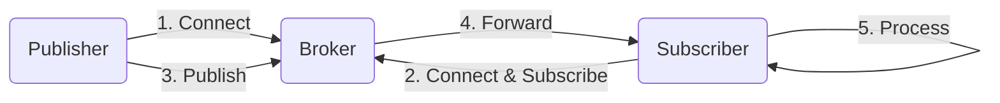
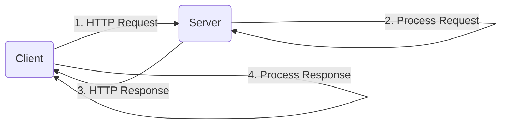
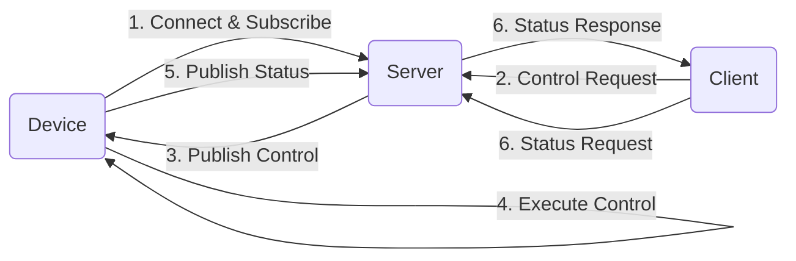
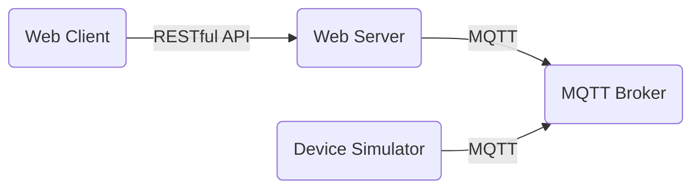

# 基于MQTT协议和RESTful API的智能家居设备远程控制与状态监测

## 1.背景介绍

### 1.1 智能家居概述

随着物联网技术的快速发展,智能家居应用越来越普及。智能家居系统通过将家电、安防、照明等设备连接到互联网,实现对这些设备的远程监控和控制,为人们的生活带来了极大的便利。

### 1.2 远程控制和状态监测的重要性

远程控制和状态监测是智能家居系统的两大核心功能。远程控制允许用户在任何地方通过移动应用或网页操作家中的设备,如开关灯光、调节空调温度等。状态监测则让用户实时了解家中设备的工作状态,如门窗的开合情况、电器的用电量等,从而实现对家庭环境的掌控。

### 1.3 MQTT和RESTful API

MQTT(Message Queuing Telemetry Transport)是一种轻量级的发布/订阅模式的消息传输协议,适用于物联网场景下的数据通信。RESTful API(Representational State Transfer Application Programming Interface)则是一种软件架构风格,它通过HTTP协议提供标准化的数据访问接口。

本文将介绍如何利用MQTT协议和RESTful API实现智能家居设备的远程控制和状态监测。

## 2.核心概念与联系

### 2.1 MQTT协议

MQTT是一种基于发布/订阅模式的轻量级消息传输协议,由IBM在1999年发布。它的主要特点包括:

- 发布/订阅模式:发布者向主题发布消息,订阅者订阅感兴趣的主题接收消息。
- 轻量级:MQTT协议头部只有2字节,非常适合在低带宽、不可靠网络环境下使用。
- 三种通信模式:最多一次(QoS 0)、至少一次(QoS 1)、只有一次(QoS 2)。
- 支持持久会话:允许断线重连后恢复之前的状态。

MQTT协议中有几个核心组件:

- 发布者(Publisher):发布消息到主题的客户端。
- 订阅者(Subscriber):订阅主题接收消息的客户端。
- 主题(Topic):消息的传输载体,有层级结构。
- 代理(Broker):消息的中转站,负责分发消息。

### 2.2 RESTful API

RESTful API是一种软件架构风格,它基于HTTP协议,通过URI(统一资源标识符)来标识和定位资源,使用标准的HTTP方法(GET、POST、PUT、DELETE等)执行操作。

RESTful API具有以下特点:

- 无状态:客户端和服务器之间的通信不保存会话状态。
- 统一接口:使用标准的HTTP方法对资源执行操作。
- 分层系统:客户端和服务器之间可以有多个层次的约束。
- 可缓存:响应可以被缓存以提高性能。
- 代码在客户端和服务器上的部署:客户端和服务器上的代码可以分开部署。

### 2.3 MQTT和RESTful API的联系

MQTT和RESTful API可以协同工作,实现智能家居设备的远程控制和状态监测。具体联系如下:

- MQTT用于设备与服务器之间的实时双向通信,如设备状态上报、控制指令下发等。
- RESTful API用于移动应用或网页与服务器之间的交互,如查询设备状态、发送控制指令等。
- 服务器作为中间层,一方面通过MQTT与设备通信,另一方面提供RESTful API给客户端访问。

这种结合利用了MQTT的轻量级、低延迟特性,以及RESTful API的简单、标准化特点,可以高效地实现智能家居系统的核心功能。

## 3.核心算法原理具体操作步骤

### 3.1 MQTT通信流程

MQTT通信遵循发布/订阅模式,其核心流程如下:

1. 发布者(Publisher)连接到MQTT代理(Broker)。
2. 订阅者(Subscriber)连接到MQTT代理,并订阅感兴趣的主题(Topic)。
3. 发布者向特定主题发布消息。
4. 代理将消息转发给订阅了该主题的所有订阅者。
5. 订阅者接收到消息并进行处理。

该流程如下图所示:



### 3.2 RESTful API交互流程

RESTful API通过HTTP协议提供标准化的数据访问接口,其交互流程如下:

1. 客户端(如移动应用或网页)向服务器发送HTTP请求(GET、POST、PUT、DELETE等)。
2. 服务器接收请求,根据请求的URI和HTTP方法执行相应的操作。
3. 服务器返回HTTP响应,包括状态码和响应体(如JSON数据)。
4. 客户端接收响应并进行处理。

该流程如下图所示:



### 3.3 MQTT和RESTful API协同工作流程

在智能家居系统中,MQTT和RESTful API协同工作的流程如下:

1. 设备(如智能灯泡)通过MQTT连接到服务器,并订阅控制主题。
2. 移动应用或网页通过RESTful API向服务器发送控制请求(如开关灯)。
3. 服务器接收RESTful API请求,并将控制指令通过MQTT发布到对应的控制主题。
4. 设备接收到MQTT消息,执行相应的操作(如开关灯)。
5. 设备通过MQTT将状态信息发布到状态主题。
6. 服务器接收到设备的状态信息,并通过RESTful API响应移动应用或网页的状态查询请求。

该流程如下图所示:



通过MQTT和RESTful API的协同工作,实现了智能家居设备的远程控制和状态监测功能。

## 4.数学模型和公式详细讲解举例说明

在MQTT协议中,有一个重要的概念叫做QoS(Quality of Service,服务质量级别),用于控制消息传输的可靠性。MQTT定义了三个QoS级别:

- QoS 0 (最多一次):消息最多被传输一次,可能会丢失。
- QoS 1 (至少一次):消息至少被传输一次,可能会重复。
- QoS 2 (只有一次):消息只传输一次,绝不重复。

我们可以使用概率模型来分析不同QoS级别下消息传输的可靠性。设:

- $p$为单次消息传输成功的概率
- $q=1-p$为单次消息传输失败的概率
- $n$为最大重传次数

### 4.1 QoS 0 (最多一次)

在QoS 0级别下,消息只传输一次,不重传。因此,消息成功传输的概率为$p$,失败的概率为$q$。

### 4.2 QoS 1 (至少一次)

在QoS 1级别下,消息会重传直到成功为止。设$X$为消息成功传输所需的传输次数,则$X$服从几何分布:

$$P(X=k)=q^{k-1}p,\quad k=1,2,\ldots$$

因此,消息成功传输的概率为:

$$P(X<\infty)=\sum_{k=1}^{\infty}q^{k-1}p=\frac{p}{1-q}=p$$

可见,在无限重传的情况下,QoS 1级别下消息成功传输的概率仍为$p$,但会产生重复消息的问题。

### 4.3 QoS 2 (只有一次)

在QoS 2级别下,消息只传输一次,不会重复。但是,如果传输失败,会进行有限次数的重传。设$Y$为消息成功传输的事件,则:

$$P(Y)=p+\sum_{k=2}^{n+1}C_n^{k-1}p^kq^{n-k+1}$$

其中,$C_n^k$为组合数,表示从$n$个元素中取$k$个元素的组合数量。

该公式的意义是:消息要么第一次就成功传输(概率为$p$),要么在$n$次重传中至少有一次成功(概率为$\sum_{k=2}^{n+1}C_n^{k-1}p^kq^{n-k+1}$)。

当$n\rightarrow\infty$时,QoS 2级别下消息成功传输的概率将趋近于1,但代价是无限重传次数。在实际应用中,通常会设置一个合理的最大重传次数$n$,在可靠性和效率之间寻求平衡。

通过上述数学模型和公式分析,我们可以更好地理解MQTT协议中QoS级别对消息传输可靠性的影响,为智能家居系统的设计和优化提供理论依据。

## 5.项目实践:代码实例和详细解释说明

本节将提供一个基于MQTT协议和RESTful API实现智能家居设备远程控制和状态监测的示例项目,并详细解释相关代码。

### 5.1 项目架构

该示例项目包括以下几个主要组件:

- MQTT代理(Broker):使用开源软件Mosquitto作为MQTT代理。
- 智能设备模拟器:使用Python编写,模拟智能家居设备的行为,通过MQTT与代理通信。
- Web服务器:使用Node.js编写,提供RESTful API供客户端访问,并通过MQTT与代理通信。
- Web客户端:使用HTML/CSS/JavaScript编写,通过RESTful API与Web服务器交互,实现远程控制和状态监测功能。

项目架构如下图所示:



### 5.2 智能设备模拟器

智能设备模拟器使用Python编写,主要代码如下:

```python
import paho.mqtt.client as mqtt

# MQTT代理配置
broker_address = "localhost"
broker_port = 1883

# 主题
control_topic = "home/device/control"
status_topic = "home/device/status"

# 连接回调函数
def on_connect(client, userdata, flags, rc):
    print("Connected to MQTT broker with result code " + str(rc))
    client.subscribe(control_topic)

# 消息回调函数
def on_message(client, userdata, msg):
    payload = msg.payload.decode()
    print("Received control message: " + payload)
    # 执行控制操作
    if payload == "on":
        device_state = "on"
    elif payload == "off":
        device_state = "off"
    # 发布状态信息
    client.publish(status_topic, device_state)

# 创建MQTT客户端
client = mqtt.Client()
client.on_connect = on_connect
client.on_message = on_message

# 连接到MQTT代理
client.connect(broker_address, broker_port)

# 保持连接
client.loop_forever()
```

该代码模拟了一个智能家居设备,通过MQTT连接到代理,订阅控制主题`home/device/control`。当收到控制消息时,执行相应的操作(如开关设备),并将设备状态发布到状态主题`home/device/status`。

### 5.3 Web服务器

Web服务器使用Node.js编写,提供RESTful API供客户端访问,并通过MQTT与代理通信。主要代码如下:

```javascript
const express = require('express');
const mqtt = require('mqtt');
const app = express();

// MQTT代理配置
const broker_address = 'mqtt://localhost';

// 主题
const control_topic = 'home/device/control';
const status_topic = 'home/device/status';

// 创建MQTT客户端
const client = mqtt.connect(broker_address);

// 连接回调函数
client.on('connect', () => {
  console.log('Connected to MQTT broker');
  client.subscribe(status_topic);
});

// 消息回调函数
client.on('message', (topic, message) => {
  if (topic === status_topic) {
    device_state = message.toString();
    console.log('Device state:', device_state);
  }
});

// RESTful API
app.get('/device/status', (req, res) => {
  