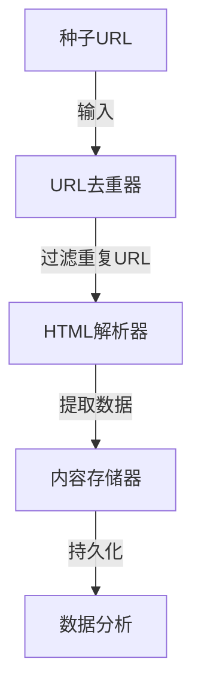

# 基于Python的电影票房爬取与分析

## 1.背景介绍

在当今时代,电影产业已经成为一个巨大的娱乐经济体。电影的票房数据不仅反映了观众的喜好趋势,同时也是衡量一部电影成功与否的重要指标。对于电影制作公司、发行商和投资方来说,准确掌握票房数据对于制定营销策略、评估投资回报率至关重要。然而,获取及时准确的票房数据并非一件容易的事情,这就需要我们借助网络爬虫技术来实现自动化采集和分析。

## 2.核心概念与联系

### 2.1 网络爬虫

网络爬虫(Web Crawler)是一种自动化程序,它可以系统地浏览万维网,按照一定的规则获取网站数据。爬虫通常由以下几个主要部分组成:

- 种子URL(Seed URLs):起始页面的URL集合
- URL去重器(URL Deduplicator):避免重复抓取相同页面
- HTML解析器(HTML Parser):从网页中提取所需数据
- 内容存储器(Content Store):存储抓取的数据



### 2.2 数据分析

通过网络爬虫获取到电影票房数据后,我们需要对这些数据进行分析和处理,以获得有价值的见解。常见的数据分析方法包括:

- 数据清洗:处理缺失值、异常值等脏数据
- 数据可视化:使用图表等直观展示数据特征
- 统计分析:计算平均值、中位数等统计量
- 关联分析:发现数据间的关联关系
- 机器学习:构建预测模型,进行票房预测等

## 3.核心算法原理具体操作步骤

### 3.1 网络爬虫算法

网络爬虫的核心算法是广度优先搜索(BFS)或深度优先搜索(DFS)。以BFS为例,算法步骤如下:

1. 将种子URL放入队列
2. 从队列取出一个URL并访问该网页
3. 提取网页中的URL并去重
4. 将新URL放入队列
5. 重复步骤2-4,直到队列为空

```python
from collections import deque
import requests

def bfs_crawler(seed_urls):
    queue = deque(seed_urls)  # 初始化队列
    visited = set()  # 已访问的URL集合

    while queue:
        url = queue.popleft()  # 取出队首URL
        if url in visited:
            continue  # 已访问过则跳过

        visited.add(url)  # 标记为已访问
        html = requests.get(url).text  # 获取网页HTML
        
        # 提取HTML中的URL
        new_urls = extract_urls(html)  
        
        # 去重并加入队列
        for new_url in new_urls:
            if new_url not in visited:
                queue.append(new_url)
```

### 3.2 数据分析算法

对于电影票房数据的分析,常用的算法包括:

- **线性回归**: 用于预测票房与其他特征(如制作成本、上映时间等)之间的线性关系
- **决策树**: 根据特征对电影进行分类,可用于票房分类预测
- **聚类算法**: 如K-Means,可以根据票房等特征对电影进行聚类分析

以线性回归为例,算法步骤如下:

1. 收集数据,包括电影票房(y)和其他特征(X)
2. 将数据分为训练集和测试集
3. 使用训练集数据,计算回归系数$\beta$:
   $$\hat{\beta} = (X^T X)^{-1} X^T y$$
4. 在测试集上验证模型效果,计算均方根误差(RMSE):
   $$RMSE = \sqrt{\frac{1}{n}\sum_{i=1}^{n}(y_i - \hat{y}_i)^2}$$
5. 使用模型进行票房预测:$\hat{y} = X\hat{\beta}$

## 4.数学模型和公式详细讲解举例说明

线性回归是一种常用的监督学习算法,用于建模自变量X和因变量y之间的线性关系。在电影票房预测中,我们可以将票房作为因变量y,将影响票房的因素(如制作成本、上映时间等)作为自变量X,从而构建线性回归模型。

线性回归的数学模型可以表示为:

$$y = X\beta + \epsilon$$

其中:
- $y$是n×1的因变量向量
- $X$是n×(k+1)的自变量矩阵,第一列为1(截距项)
- $\beta$是(k+1)×1的回归系数向量
- $\epsilon$是n×1的误差向量

我们的目标是找到最佳的$\beta$,使得$\sum_{i=1}^{n}\epsilon_i^2$最小化。通过最小二乘法,可以得到$\beta$的解析解:

$$\hat{\beta} = (X^T X)^{-1} X^T y$$

为了评估模型的性能,我们通常使用均方根误差(RMSE)作为指标:

$$RMSE = \sqrt{\frac{1}{n}\sum_{i=1}^{n}(y_i - \hat{y}_i)^2}$$

其中$\hat{y}_i$是模型对第i个样本的预测值。RMSE值越小,模型的预测精度越高。

以下是一个简单的线性回归示例,使用Python的scikit-learn库:

```python
import numpy as np
from sklearn.linear_model import LinearRegression

# 样本数据
X = np.array([[1, 1], [1, 2], [1, 3], [1, 4], [1, 5]])
y = np.array([2, 3, 4, 5, 6])

# 创建线性回归模型
model = LinearRegression()

# 训练模型
model.fit(X, y)

# 查看回归系数
print(f"回归系数: {model.coef_}")  # 输出: 回归系数: [1.]
print(f"截距: {model.intercept_}")  # 输出: 截距: 1.0

# 进行预测
X_new = np.array([[1, 6], [1, 7]])
y_pred = model.predict(X_new)
print(f"预测值: {y_pred}")  # 输出: 预测值: [7. 8.]
```

在这个例子中,我们使用了一个简单的线性模型$y = x + 1$,并基于训练数据拟合出了回归系数$\beta = [1, 1]$。最后,我们使用该模型对新的输入数据进行了预测。

## 5.项目实践:代码实例和详细解释说明

在本节中,我们将通过一个实际项目,演示如何使用Python进行电影票房数据的爬取和分析。

### 5.1 票房数据爬取

我们将使用requests和BeautifulSoup库从电影数据网站Maoyan获取票房数据。以下是核心代码:

```python
import requests
from bs4 import BeautifulSoup

def crawl_boxoffice(url):
    response = requests.get(url)
    html = response.text
    soup = BeautifulSoup(html, 'html.parser')

    movies = []
    for movie_div in soup.find_all('div', class_='movie-box'):
        title = movie_div.find('span', class_='name').text.strip()
        boxoffice = movie_div.find('span', class_='boxoffice').text.strip()
        movies.append({'title': title, 'boxoffice': boxoffice})

    return movies

# 示例用法
url = 'https://piaofang.maoyan.com/'
movies = crawl_boxoffice(url)
for movie in movies:
    print(f"{movie['title']}: {movie['boxoffice']}")
```

在这段代码中,我们定义了一个`crawl_boxoffice`函数,它接受一个URL作为参数,并返回一个包含电影标题和票房信息的字典列表。

1. 首先,我们使用`requests.get(url)`获取网页HTML内容。
2. 然后,使用`BeautifulSoup`解析HTML,并找到包含电影信息的`div`元素。
3. 对于每个`div`元素,我们提取电影标题和票房数据,并将它们添加到结果列表中。
4. 最后,我们返回包含所有电影信息的列表。

在示例用法部分,我们调用`crawl_boxoffice`函数,传入猫眼电影网站的URL,并打印出爬取到的电影标题和票房信息。

### 5.2 票房数据分析

接下来,我们将使用pandas和scikit-learn库对爬取到的票房数据进行分析和建模。

```python
import pandas as pd
from sklearn.linear_model import LinearRegression
from sklearn.model_selection import train_test_split
from sklearn.metrics import mean_squared_error

# 加载数据
data = pd.read_csv('boxoffice.csv')

# 数据预处理
X = data[['production_cost', 'release_date']]
y = data['boxoffice']

# 划分训练集和测试集
X_train, X_test, y_train, y_test = train_test_split(X, y, test_size=0.2, random_state=42)

# 创建线性回归模型
model = LinearRegression()

# 训练模型
model.fit(X_train, y_train)

# 评估模型
y_pred = model.predict(X_test)
rmse = mean_squared_error(y_test, y_pred, squared=False)
print(f'RMSE: {rmse:.2f}')

# 进行预测
new_data = pd.DataFrame({'production_cost': [100000000], 'release_date': [20230101]})
prediction = model.predict(new_data)
print(f'预测票房: {prediction[0]:.2f}')
```

在这段代码中,我们首先加载了一个包含电影票房、制作成本和上映日期等信息的CSV文件。然后,我们进行了以下步骤:

1. 将数据划分为特征矩阵X(制作成本和上映日期)和目标向量y(票房)。
2. 使用`train_test_split`函数将数据划分为训练集和测试集。
3. 创建线性回归模型实例。
4. 使用训练集数据训练模型。
5. 在测试集上评估模型性能,计算均方根误差(RMSE)。
6. 使用训练好的模型对新的电影数据进行票房预测。

在这个示例中,我们假设电影的票房与制作成本和上映日期有关。通过线性回归模型,我们可以根据这些特征预测电影的票房表现。

## 6.实际应用场景

基于Python的电影票房爬取和分析技术在实际应用中具有广泛的用途,包括但不限于以下几个方面:

1. **电影制作公司**:电影制作公司可以利用票房数据分析来评估投资回报率,制定营销策略,并为未来的电影制作提供参考。

2. **电影发行商**:发行商可以根据票房预测结果,合理安排电影的上映时间和排片场次,优化发行策略。

3. **投资机构**:投资机构可以基于票房数据分析,评估电影项目的投资风险和预期收益,从而做出明智的投资决策。

4. **影院运营商**:影院运营商可以利用票房数据,了解观众的喜好趋势,调整影厅布局和影片选映,提高经营效益。

5. **营销机构**:营销机构可以根据票房数据,制定精准的营销策略,开展有针对性的宣传活动,提高电影的知名度和关注度。

6. **学术研究**:票房数据分析也可以为电影学、市场营销等相关学科提供研究素材,探索影响票房的各种因素及其相互关系。

总的来说,基于Python的电影票房爬取和分析技术为整个电影产业链提供了有力的数据支持,有助于各方主体做出更加科学、合理的决策。

## 7.工具和资源推荐

在进行电影票房爬取和分析时,我们可以使用一些优秀的Python库和工具,以提高效率和质量。以下是一些推荐:

1. **网络爬虫库**:
   - `requests`: 用于发送HTTP请求并获取响应
   - `BeautifulSoup`: 用于解析HTML文档
   - `Scrapy`: 一个强大的网络爬虫框架

2. **数据处理库**:
   - `pandas`: 用于数据清洗、预处理和操作
   - `numpy`: 用于科学计算和数组操作

3. **数据可视化库**:
   - `matplotlib`: 用于创建静态图形
   - `seaborn`: 基于matplotlib的高级数据可视化库
   - `plotly`: 用于创建交互式数据可视化

4. **机器学习库**:
   - `sci