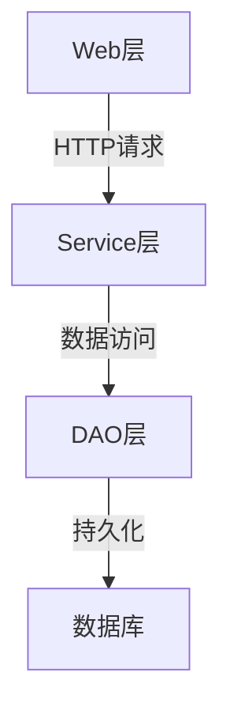

# 基于WEB的考务管理系统的设计与实现

## 1.背景介绍

随着信息技术的不断发展和普及,基于WEB的考务管理系统逐渐取代了传统的纸质考试模式,成为现代教育体系中不可或缺的重要组成部分。考务管理系统旨在提高考试工作的效率和质量,实现考试过程的规范化、标准化和信息化。

考务管理系统主要包括以下几个核心功能模块:

- 考生信息管理模块:用于管理考生的基本信息、考试成绩等数据。
- 试卷管理模块:用于组卷、试题库管理、试卷分发等功能。
- 考场管理模块:用于考场分配、监考人员安排等工作。
- 成绩管理模块:用于成绩统计、分析和查询等功能。
- 系统管理模块:用于管理系统用户、权限分配等操作。

基于WEB的考务管理系统具有跨平台、无地域限制、方便维护升级等优势,可以极大地提高考试工作的效率和准确性。

## 2.核心概念与联系

基于WEB的考务管理系统涉及以下几个核心概念:

1. **B/S架构(Browser/Server)**: 系统采用B/S架构,即浏览器/服务器架构,用户通过浏览器访问服务器上部署的Web应用程序。

2. **MVC模式(Model-View-Controller)**: 系统遵循MVC设计模式,将数据模型(Model)、用户界面(View)和控制逻辑(Controller)分离,提高代码的可维护性和可重用性。

3. **数据库(Database)**: 系统使用关系型数据库(如MySQL、Oracle等)存储考生信息、试卷信息、成绩数据等核心数据。

4. **Web服务器(Web Server)**: 系统部署在Web服务器(如Apache、Nginx等)上,用于处理用户请求并返回响应。

5. **身份认证与授权(Authentication & Authorization)**: 系统需要对用户进行身份认证和授权管理,确保数据安全和访问控制。

这些核心概念相互关联、相互作用,构成了基于WEB的考务管理系统的基础架构。

## 3.核心算法原理具体操作步骤

基于WEB的考务管理系统涉及多种算法和技术,其中一些核心算法原理和具体操作步骤如下:

### 3.1 组卷算法

组卷算法是考务管理系统中一个关键环节,用于根据设定的规则和条件从试题库中自动选择试题,生成符合要求的试卷。常见的组卷算法包括:

1. **蒙特卡罗算法**:通过随机抽样的方式从试题库中选取试题,并根据约束条件(如题型、难度等)进行调整,直到满足组卷要求。

2. **启发式搜索算法**:基于一定的评价函数,通过局部优化的方式逐步构建出满足要求的试卷。

3. **整数规划算法**:将组卷问题建模为一个整数规划问题,通过求解该优化问题获得最优解。

以蒙特卡罗算法为例,其具体操作步骤如下:

```
输入: 试题库T、题型分值要求R、试卷总分值S
输出: 满足要求的试卷P

1) 初始化试卷P为空集
2) 根据题型分值要求R,计算每种题型的题量
3) 对每种题型:
    a) 从试题库T中随机抽取指定数量的试题
    b) 根据试题难度等条件,调整试题顺序
    c) 将调整后的试题添加到试卷P中
4) 若试卷P的总分值不等于S,则返回步骤3)
5) 输出试卷P
```

### 3.2 成绩分析算法

成绩分析算法用于对考生的考试成绩进行统计和分析,为教师和管理人员提供有价值的信息。常见的成绩分析算法包括:

1. **统计分析算法**:计算平均分、最高分、最低分、标准差等统计量,用于了解成绩的整体分布情况。

2. **相关分析算法**:分析成绩与其他因素(如性别、年龄等)之间的相关性,发现影响成绩的潜在因素。

3. **聚类分析算法**:根据成绩数据,将考生划分为若干个群组,发现具有相似特征的考生群体。

以统计分析算法为例,其具体操作步骤如下:

```
输入: 考生成绩集合S = {s1, s2, ..., sn}
输出: 平均分mean、最高分max、最低分min、标准差std

1) 初始化mean = 0, max = 0, min = 正无穷
2) 遍历成绩集合S:
    a) 累加成绩,计算总分sum
    b) 更新max = max(max, si)
    c) 更新min = min(min, si)
3) 计算mean = sum / n
4) 计算标准差std:
    a) 初始化sum_sq = 0
    b) 遍历成绩集合S,计算sum_sq += (si - mean)^2
    c) std = sqrt(sum_sq / n)
5) 输出mean, max, min, std
```

## 4.数学模型和公式详细讲解举例说明

在考务管理系统中,数学模型和公式广泛应用于各个环节,如组卷算法、成绩分析等。下面以组卷算法中的整数规划模型为例,详细讲解相关数学模型和公式。

### 4.1 整数规划模型

整数规划模型将组卷问题建模为一个约束优化问题,其目标是在满足一系列约束条件的前提下,构建出最优的试卷。

假设试题库中共有$n$道试题,每道试题$i$的分值为$s_i$,难度为$d_i$。我们需要从中选择一些试题,构成总分值为$S$的试卷。同时,还需要满足以下约束条件:

1. 每种题型的题量在一定范围内。
2. 试卷的总体难度在一定范围内。

我们可以引入两个决策变量:

- $x_i$: 表示第$i$道试题是否被选入试卷,如果选入则$x_i=1$,否则$x_i=0$。
- $y_j$: 表示第$j$种题型的实际题量。

则整数规划模型可以表示为:

$$
\begin{aligned}
\max \ & \sum_{i=1}^n d_i x_i \\
\text{s.t.} \ & \sum_{i=1}^n s_i x_i = S \\
& l_j \leq \sum_{i \in T_j} x_i \leq u_j, \quad \forall j \\
& \sum_{i=1}^n d_i x_i \leq D \\
& x_i \in \{0, 1\}, \quad \forall i
\end{aligned}
$$

其中:

- 目标函数$\max \sum_{i=1}^n d_i x_i$表示最大化试卷的总体难度。
- 第一个约束条件$\sum_{i=1}^n s_i x_i = S$确保试卷的总分值为$S$。
- 第二个约束条件$l_j \leq \sum_{i \in T_j} x_i \leq u_j$确保每种题型的题量在规定范围内,其中$T_j$表示第$j$种题型的试题集合。
- 第三个约束条件$\sum_{i=1}^n d_i x_i \leq D$限制试卷的总体难度不超过$D$。
- 最后一个约束条件$x_i \in \{0, 1\}$表示$x_i$是一个0-1整数变量。

通过求解上述整数规划模型,我们可以得到最优的试卷组成方案。

### 4.2 举例说明

假设我们需要从一个包含20道试题的试题库中,组建一张总分为100分的试卷。试题的分值和难度信息如下表所示:

| 试题编号 | 分值 | 难度 |
|----------|------|------|
| 1        | 5    | 3    |
| 2        | 5    | 4    |
| ...      | ...  | ...  |
| 20       | 10   | 5    |

同时,我们还有以下约束条件:

- 选择题题量在5~8道之间。
- 填空题题量在3~5道之间。
- 简答题题量在2~4道之间。
- 试卷的总体难度不超过80。

我们可以构建如下整数规划模型:

$$
\begin{aligned}
\max \ & \sum_{i=1}^{20} d_i x_i \\
\text{s.t.} \ & \sum_{i=1}^{20} s_i x_i = 100 \\
& 5 \leq \sum_{i \in T_1} x_i \leq 8 \\
& 3 \leq \sum_{i \in T_2} x_i \leq 5 \\
& 2 \leq \sum_{i \in T_3} x_i \leq 4 \\
& \sum_{i=1}^{20} d_i x_i \leq 80 \\
& x_i \in \{0, 1\}, \quad \forall i
\end{aligned}
$$

其中$T_1$、$T_2$、$T_3$分别表示选择题、填空题和简答题的试题集合。

通过求解该整数规划模型,我们可以得到满足所有约束条件的最优试卷方案。

## 5.项目实践:代码实例和详细解释说明

为了更好地理解基于WEB的考务管理系统的实现细节,下面将给出一个基于Java语言和Spring框架的项目实践代码示例,并对其进行详细的解释说明。

### 5.1 系统架构

该系统采用了典型的三层架构,包括表现层(Web层)、业务逻辑层(Service层)和数据访问层(DAO层)。同时,还引入了Spring框架提供的依赖注入、AOP等特性,提高了代码的可维护性和可扩展性。



### 5.2 数据模型

在数据访问层,我们定义了几个核心的数据模型类,用于映射数据库中的表结构。以`Exam`(考试)和`Question`(试题)为例:

```java
@Entity
@Table(name = "exam")
public class Exam {
    @Id
    @GeneratedValue(strategy = GenerationType.IDENTITY)
    private Long id;

    @Column(nullable = false)
    private String name;

    @Column(nullable = false)
    private LocalDateTime startTime;

    @Column(nullable = false)
    private LocalDateTime endTime;

    // 其他字段和getter/setter方法
}

@Entity
@Table(name = "question")
public class Question {
    @Id
    @GeneratedValue(strategy = GenerationType.IDENTITY)
    private Long id;

    @Column(nullable = false)
    private String content;

    @Column(nullable = false)
    private QuestionType type;

    @Column(nullable = false)
    private int score;

    @Column(nullable = false)
    private int difficulty;

    // 其他字段和getter/setter方法
}
```

### 5.3 数据访问层

数据访问层使用Spring Data JPA提供的Repository接口,简化了对数据库的基本增删改查操作。

```java
@Repository
public interface ExamRepository extends JpaRepository<Exam, Long> {
    // 自定义查询方法
}

@Repository
public interface QuestionRepository extends JpaRepository<Question, Long> {
    // 自定义查询方法
}
```

### 5.4 业务逻辑层

业务逻辑层包含了系统的核心功能,如组卷、阅卷、成绩分析等。下面以组卷功能为例,展示相关代码实现。

```java
@Service
public class PaperService {
    @Autowired
    private QuestionRepository questionRepository;

    public Paper generatePaper(PaperConfig config) {
        List<Question> questions = new ArrayList<>();
        // 根据配置信息,从试题库中选取试题
        questions.addAll(selectQuestions(config.getChoiceQuestionCount(),
                                         QuestionType.CHOICE));
        questions.addAll(selectQuestions(config.getFillBlankCount(),
                                         QuestionType.FILL_BLANK));
        // ...

        // 计算试卷总分
        int totalScore = questions.stream()
                                  .mapToInt(Question::getScore)
                                  .sum();

        // 创建试卷对象并返回
        return new Paper(questions, totalScore);
    }

    private List<Question> selectQuestions(int count, QuestionType type) {
        // 从试题库中随机选取指定数量和类型的试题
        return questionRepository.findByTypeAndIdIn(
                type,
                ThreadLocalRandom.current()
                                 .ints(count, 0, questionRepository.countByType(type))
                                 .mapToObj(