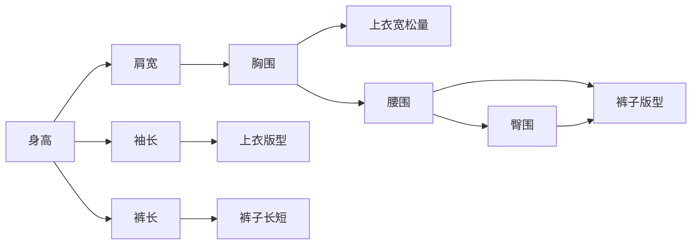
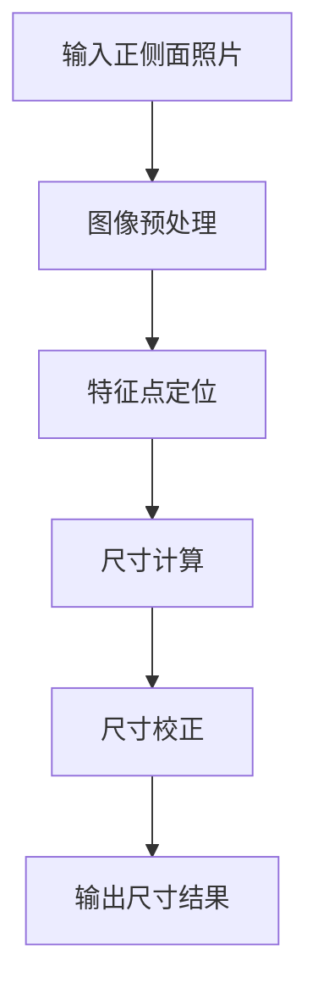

# 基于matlab的面向衣物设计的人体关键尺码提取与分析

## 1. 背景介绍

随着服装定制化需求的不断增长,如何快速、准确地获取人体关键尺寸数据成为服装设计和生产中的一个重要问题。传统的人工测量方法耗时费力,难以满足大规模定制化生产的需求。因此,研究开发一种基于计算机视觉技术的自动人体关键尺寸提取与分析系统具有重要意义。

本文探讨了如何利用Matlab强大的图像处理和数值计算功能,实现人体关键尺寸的自动提取与分析。通过对人体正面和侧面照片的分析处理,提取出与服装设计密切相关的一系列关键尺寸参数,为服装设计人员提供数据参考,提高服装设计的效率和合身性。

### 1.1 研究意义

- 提高人体尺寸测量效率,节省人工成本
- 为服装定制化生产提供数据支撑
- 促进服装行业信息化、智能化发展
- 为虚拟试衣、在线购物等应用提供数据基础

### 1.2 国内外研究现状

- 国外的Bodymetrics、[TC]2等公司开发了商用人体三维扫描仪,但造价昂贵,应用受限
- 国内高校和研究机构开展了一些人体尺寸测量的研究,但大多基于深度相机,成本较高
- 基于RGB图像的人体尺寸测量方法研究相对较少,技术尚不成熟,有待进一步探索

### 1.3 本文的研究内容和创新点

- 提出了一种基于单目RGB图像的人体关键尺寸自动提取方法
- 针对服装设计需求,提取了一系列与服装设计密切相关的人体关键尺寸参数
- 利用Matlab强大的图像处理和曲线拟合功能,实现关键点定位和尺寸计算
- 开发了人体尺寸提取与分析的原型系统,具有一定的实用性和推广价值

## 2. 核心概念与关联

在服装设计中,人体测量尺寸是一个非常重要的概念。设计师需要根据这些尺寸来设计出合身、美观、舒适的服装。以下是一些与服装设计密切相关的人体关键尺寸:

- 身高:从头顶到脚底的垂直距离
- 肩宽:左右肩峰骨之间的水平距离  
- 胸围:胸部最丰满处的水平周长
- 腰围:腰部最细处的水平周长
- 臀围:臀部最丰满处的水平周长
- 袖长:从肩峰点沿手臂外侧到腕骨下缘的距离
- 裤长:从腰线到脚踝的垂直距离

这些尺寸数据相互关联,共同决定了服装的版型和尺寸。例如,肩宽和胸围影响上衣的宽松量,腰围和臀围影响裤子的版型,身高和裤长决定裤子的长短等。因此准确测量和分析这些关键尺寸,对服装设计至关重要。

以下是人体关键尺寸概念之间的关系示意图:



## 3. 核心算法原理与操作步骤

本文采用基于人体轮廓分析的方法,通过对人体正面和侧面照片的处理,自动提取关键尺寸信息。主要步骤如下:

### 3.1 图像预处理

- 输入人体正面和侧面照片
- 转换为灰度图像
- 中值滤波去除噪声
- 自适应阈值分割提取人体轮廓

### 3.2 特征点定位

- 通过轮廓分析,定位头顶、颈部、肩部、腰部、臀部、膝盖、脚踝等特征点
- 利用肤色检测和边缘检测,定位手臂外侧轮廓
- 建立人体坐标系,以腰部中心为原点,上下方向为y轴,水平方向为x轴

### 3.3 尺寸计算

- 根据特征点坐标,计算身高、肩宽、袖长、裤长等尺寸
- 对人体轮廓进行水平切片,计算胸围、腰围、臀围等周长尺寸 
- 利用最小二乘法拟合臀部曲线,计算臀围
- 将像素尺寸转换为实际尺寸,需预先标定像素与实际长度的比例关系

### 3.4 尺寸校正

- 对测量结果进行异常值检测和过滤
- 结合人体比例经验公式,对个别尺寸进行校正
- 多次测量取平均,提高测量精度

算法流程图:



## 4. 数学模型与公式讲解

在人体尺寸计算过程中,用到了一些数学模型和公式,主要包括:

### 4.1 坐标转换

设人体坐标系下某点坐标为$(x,y)$,图像坐标系下坐标为$(u,v)$,两个坐标系之间的变换关系为:

$$
\begin{cases}
u = a x + b y + c \\
v = d x + e y + f
\end{cases}
$$

其中,$a,b,c,d,e,f$为变换参数,可以通过已知点的坐标求解。

### 4.2 周长计算

对人体轮廓图进行水平切片,得到一系列轮廓点坐标$(x_i,y_i),i=1,2,...,n$。根据两点间距离公式,计算相邻两点间的距离,然后求和得到周长:

$$
L = \sum_{i=1}^{n-1} \sqrt{(x_i-x_{i+1})^2 + (y_i-y_{i+1})^2}
$$

### 4.3 曲线拟合

利用最小二乘法对臀部轮廓点进行曲线拟合,以得到平滑的臀围曲线。设拟合曲线为$y=f(x)$,则最小化误差平方和:

$$
\min \sum_{i=1}^n (y_i - f(x_i))^2
$$

其中$f(x)$可以选择合适的函数形式,如多项式、样条函数等。求解上述最小化问题,得到拟合曲线的参数。

### 4.4 尺寸换算

设像素尺寸为$l_p$,实际尺寸为$l_r$,像素与实际长度的比例系数为$\alpha$,则有:

$$
l_r = \alpha \cdot l_p
$$

其中$\alpha$可以通过标定物体的已知尺寸求得。

例如,在拍摄时放置一个已知长度$L$的标定尺,测得其在图像中的像素长度为$L_p$,则:

$$
\alpha = \frac{L}{L_p}
$$

## 5. 项目实践:代码实例与详解

下面给出了使用Matlab实现人体关键尺寸提取的部分代码示例:

```matlab
% 读取图像
img = imread('human_front.jpg');
img_side = imread('human_side.jpg');

% 预处理
gray = rgb2gray(img);
gray_side = rgb2gray(img_side);
gray = medfilt2(gray, [5 5]);
gray_side = medfilt2(gray_side, [5 5]);
bw = imbinarize(gray, adaptthresh(gray, 0.5));
bw_side = imbinarize(gray_side, adaptthresh(gray_side, 0.5));

% 提取轮廓
contour = bwperim(bw);
contour_side = bwperim(bw_side);

% 特征点定位
[y, x] = find(contour);
top = min(y);
bottom = max(y);
left = min(x);
right = max(x);
height = bottom - top;
width = right - left;

[y_side, x_side] = find(contour_side);
[~, i_neck] = min(diff(x_side));
neck_x = x_side(i_neck);

% 肩宽计算
[~, i_shoulder_left] = min(abs(x - left));
[~, i_shoulder_right] = min(abs(x - right));
shoulder_y = (y(i_shoulder_left) + y(i_shoulder_right)) / 2;
shoulder_width = sqrt((x(i_shoulder_right)-x(i_shoulder_left))^2 + ...
                      (y(i_shoulder_right)-y(i_shoulder_left))^2);
                  
% 袖长计算
arm_contour = bwselect(bw, x(i_shoulder_right), shoulder_y);
[y_arm, x_arm] = find(arm_contour);
[~, i_arm] = max(y_arm);
arm_length = sqrt((x_arm(i_arm)-x(i_shoulder_right))^2 + ...
                  (y_arm(i_arm)-shoulder_y)^2);
                
% 裤长计算                
[~, i_crotch] = min(diff(y_side));
crotch_y = y_side(i_crotch);
pants_length = bottom - crotch_y;

% 周长计算
slice_y = linspace(top, bottom, 100);
girth = zeros(size(slice_y));
for i = 1:length(slice_y)
    slice = contour & (y == round(slice_y(i)));
    [slice_y, slice_x] = find(slice);
    if length(slice_x) > 1
        girth(i) = sum(sqrt(diff(slice_x).^2 + diff(slice_y).^2));
    end
end
[~, i_chest] = max(girth);
chest_girth = girth(i_chest);
[~, i_waist] = min(girth);
waist_girth = girth(i_waist);
hip_girth = max(girth(i_waist:end));

% 臀围拟合
[hip_y, hip_x] = find(contour_side & (y_side > crotch_y));
hip_curve = fit(hip_x, hip_y, 'smoothingspline');
hip_girth = 2 * integral(@(x)sqrt(1+differentiate(hip_curve,x).^2), min(hip_x), max(hip_x));

% 尺寸换算
pixel2cm = 0.5; % 假设1像素对应0.5厘米
height = height * pixel2cm;
shoulder_width = shoulder_width * pixel2cm;
arm_length = arm_length * pixel2cm;
pants_length = pants_length * pixel2cm;
chest_girth = chest_girth * pixel2cm;
waist_girth = waist_girth * pixel2cm;
hip_girth = hip_girth * pixel2cm;

% 显示结果
fprintf('身高: %.1f cm\n', height);
fprintf('肩宽: %.1f cm\n', shoulder_width); 
fprintf('袖长: %.1f cm\n', arm_length);
fprintf('裤长: %.1f cm\n', pants_length);
fprintf('胸围: %.1f cm\n', chest_girth);
fprintf('腰围: %.1f cm\n', waist_girth);
fprintf('臀围: %.1f cm\n', hip_girth);
```

以上代码实现了以下功能:

1. 读取人体正面和侧面照片,进行灰度化、中值滤波、二值化等预处理
2. 提取人体轮廓,并通过轮廓分析定位特征点,如肩部、颈部、裆部等
3. 根据特征点坐标计算身高、肩宽、袖长、裤长等尺寸
4. 对人体轮廓进行水平切片,计算胸围、腰围、臀围等周长尺寸
5. 利用样条插值对臀部曲线进行拟合,计算臀围
6. 将像素尺寸转换为实际尺寸,输出结果

其中用到的一些关键函数:

- `rgb2gray`: 将RGB彩色图像转换为灰度图像
- `medfilt2`: 对图像进行中值滤波,去除噪声
- `imbinarize`: 对图像进行二值化,分割前景和背景
- `bwperim`: 提取二值图像的轮廓  
- `find`: 找出数组中非零元素的下标
- `fit`: 对数据点进行曲线拟合
- `integral`: 计算定积分,用