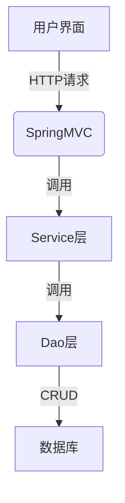
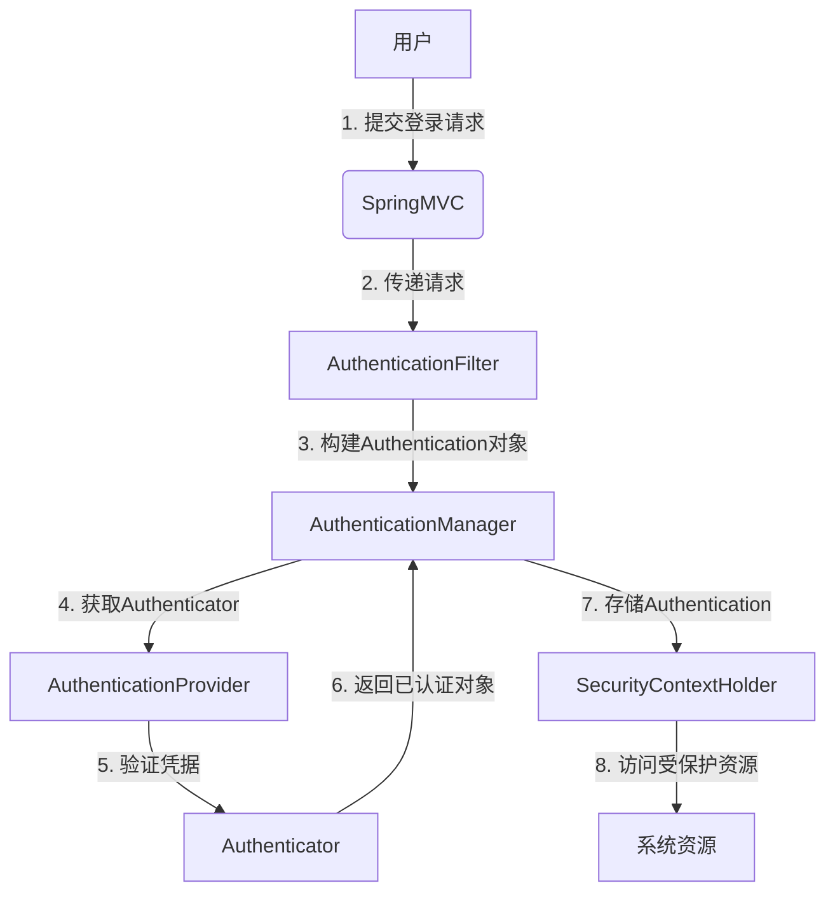
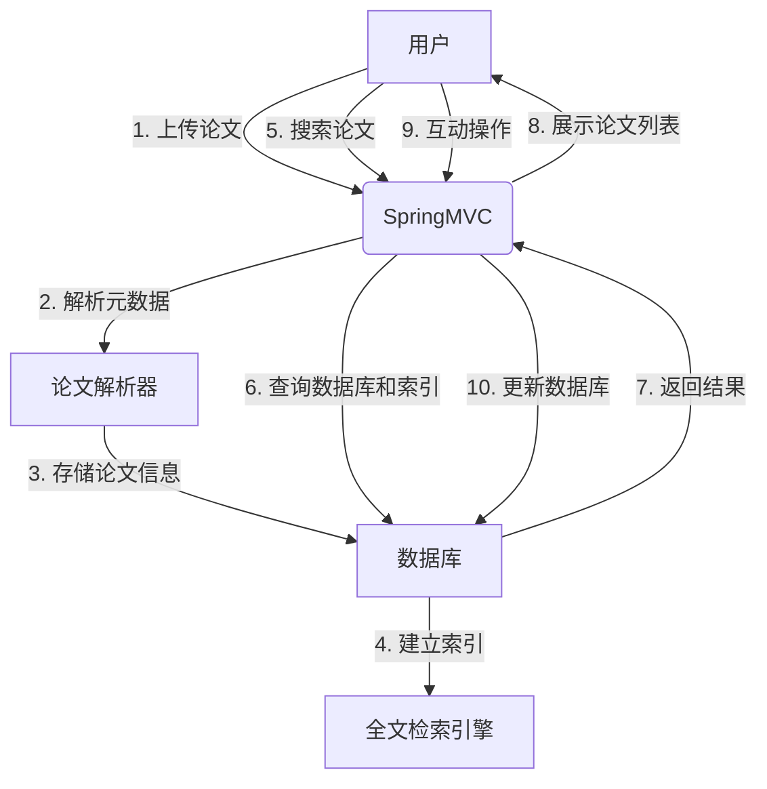

# 基于SSM的学术互动系统

## 1. 背景介绍

随着互联网技术的不断发展,学术交流和研究合作的需求与日俱增。传统的线下学术交流方式已无法满足当代学者的需求,因此构建一个高效、便捷的学术互动平台势在必行。基于SSM(Spring、SpringMVC、MyBatis)框架的学术互动系统应运而生,旨在为学术界提供一个开放、协作的环境,促进学术资源的共享和学者之间的交流合作。

### 1.1 学术交流的重要性

学术交流是推动学术发展的重要动力。通过交流,学者们可以分享研究成果、探讨新理论、启发创新思维,并建立合作关系。良好的学术交流有助于知识的传播和创新,推动学科的进步。然而,传统的线下交流方式存在诸多限制,如时间、地点、规模等,无法满足现代学术交流的需求。

### 1.2 现有学术交流平台的不足

目前,虽然已有一些学术交流平台,但大多存在以下问题:

- 功能单一,无法满足多样化的交流需求
- 用户体验差,界面设计陈旧
- 缺乏有效的协作机制
- 安全性和隐私保护措施不足

因此,构建一个功能完善、用户体验优秀、安全可靠的学术互动平台成为当务之急。

## 2. 核心概念与联系

### 2.1 SSM框架

SSM框架是指Spring、SpringMVC和MyBatis三个框架的集成应用。

- Spring: 一个轻量级的控制反转(IoC)和面向切面编程(AOP)的框架,用于管理对象的生命周期和依赖关系。
- SpringMVC: 基于Spring框架的Web层框架,用于构建高效的Web应用程序。
- MyBatis: 一个持久层框架,用于执行SQL语句、映射结果集和参数,简化了JDBC编程。

SSM框架的集成使得开发人员可以专注于业务逻辑,提高了开发效率和代码的可维护性。

### 2.2 系统架构

学术互动系统采用了经典的三层架构设计:

1. **表现层(View)**: 基于SpringMVC框架,负责接收用户请求,展示数据并与用户交互。
2. **业务逻辑层(Controller)**: 处理用户请求,调用服务层方法,协调数据流程。
3. **持久层(Model)**: 基于MyBatis框架,负责与数据库进行交互,执行CRUD操作。

此外,系统还包括安全认证、日志记录、缓存等模块,以确保系统的安全性和高效运行。



## 3. 核心算法原理具体操作步骤

### 3.1 用户认证

为了保证系统的安全性,学术互动系统采用了基于Spring Security的用户认证机制。用户认证的核心算法步骤如下:

1. 用户输入用户名和密码,提交登录请求。
2. SpringMVC将请求传递给认证过滤器(AuthenticationFilter)。
3. 认证过滤器从请求中获取用户凭据,构建认证请求(Authentication)对象。
4. 认证管理器(AuthenticationManager)从配置的认证提供者(AuthenticationProvider)中获取相应的认证器(Authenticator)。
5. 认证器验证用户凭据的有效性,如果通过则生成已认证的Authentication对象。
6. 认证管理器将已认证的Authentication对象传递给SpringSecurity上下文(SecurityContextHolder)。
7. 用户认证成功,可以访问受保护的资源。



### 3.2 论文管理

论文是学术互动系统的核心资源,因此论文管理模块是系统的重要组成部分。论文管理的核心算法步骤如下:

1. 用户上传论文文件(PDF、Word等格式)。
2. 系统解析论文元数据,如标题、作者、摘要等。
3. 用户填写论文相关信息,如关键词、研究领域等。
4. 系统对论文进行全文检索,建立索引。
5. 用户可以根据标题、作者、关键词等条件搜索论文。
6. 系统返回匹配的论文列表,用户可以浏览、下载论文。
7. 用户可以对论文进行评论、点赞等互动操作。



## 4. 数学模型和公式详细讲解举例说明

### 4.1 全文检索

全文检索是学术互动系统中一个重要的功能,它允许用户根据关键词快速查找相关论文。全文检索的核心是建立倒排索引,将每个词与其出现的文档相关联。

假设有一个文档集合$D = \{d_1, d_2, \ldots, d_n\}$,其中每个文档$d_i$由一系列词$w_1, w_2, \ldots, w_m$组成。我们可以构建一个倒排索引$I$,其中每个词$w_i$对应一个文档列表$L_i$,包含出现该词的所有文档。

$$I = \{(w_1, L_1), (w_2, L_2), \ldots, (w_m, L_m)\}$$

当用户输入查询$q = \{q_1, q_2, \ldots, q_k\}$时,系统可以快速找到包含所有查询词的文档集合:

$$R = L_{q_1} \cap L_{q_2} \cap \ldots \cap L_{q_k}$$

为了提高检索效率,我们可以对倒排索引进行优化,例如:

- 去除停用词(如"the"、"and"等高频词)
- 词干提取(将单词还原为词根形式)
- 词频-逆向文档频率(TF-IDF)加权

通过这些优化技术,我们可以有效地减小索引的大小,提高检索的准确性和效率。

### 4.2 论文相似度计算

在学术互动系统中,计算论文相似度是一个重要的功能,可用于推荐相关论文、发现重复论文等。常见的相似度计算方法包括余弦相似度、Jaccard相似度等。

假设有两篇论文$A$和$B$,它们可以用向量$\vec{A}$和$\vec{B}$表示,其中每个维度对应一个词的权重(如TF-IDF值)。那么,两篇论文的余弦相似度可以表示为:

$$\text{sim}_\text{cos}(\vec{A}, \vec{B}) = \frac{\vec{A} \cdot \vec{B}}{||\vec{A}|| \times ||\vec{B}||}$$

其中$\vec{A} \cdot \vec{B}$表示向量点乘,$||\vec{A}||$和$||\vec{B}||$分别表示向量的L2范数。

余弦相似度的取值范围为$[0, 1]$,值越大表示两篇论文越相似。我们可以设置一个阈值$\theta$,当$\text{sim}_\text{cos}(\vec{A}, \vec{B}) > \theta$时,认为两篇论文相似。

除了余弦相似度,我们还可以使用其他相似度度量,如Jaccard相似度:

$$\text{sim}_\text{jac}(\vec{A}, \vec{B}) = \frac{|\vec{A} \cap \vec{B}|}{|\vec{A} \cup \vec{B}|}$$

它衡量了两个向量中共现词的比例。不同的相似度度量适用于不同的场景,我们需要根据具体需求选择合适的方法。

## 5. 项目实践: 代码实例和详细解释说明

### 5.1 用户认证模块

以下是基于Spring Security实现用户认证的代码示例:

```java
// 配置认证管理器
@Bean
public AuthenticationManager authenticationManager() throws Exception {
    return new ProviderManager(Arrays.asList(authenticationProvider()));
}

// 配置认证提供者
@Bean
public AuthenticationProvider authenticationProvider() {
    DaoAuthenticationProvider provider = new DaoAuthenticationProvider();
    provider.setUserDetailsService(userDetailsService);
    provider.setPasswordEncoder(passwordEncoder());
    return provider;
}

// 配置密码编码器
@Bean
public PasswordEncoder passwordEncoder() {
    return new BCryptPasswordEncoder();
}
```

在上面的代码中,我们配置了认证管理器(AuthenticationManager)、认证提供者(AuthenticationProvider)和密码编码器(PasswordEncoder)。

认证提供者使用了UserDetailsService接口来加载用户信息,下面是一个基于数据库的实现示例:

```java
@Service
public class UserDetailsServiceImpl implements UserDetailsService {
    @Autowired
    private UserRepository userRepository;

    @Override
    public UserDetails loadUserByUsername(String username) throws UsernameNotFoundException {
        User user = userRepository.findByUsername(username);
        if (user == null) {
            throw new UsernameNotFoundException("User not found");
        }
        return new org.springframework.security.core.userdetails.User(
                user.getUsername(),
                user.getPassword(),
                user.isEnabled(),
                true,
                true,
                true,
                getAuthorities(user.getRoles())
        );
    }

    private Collection<? extends GrantedAuthority> getAuthorities(List<Role> roles) {
        return roles.stream()
                .map(role -> new SimpleGrantedAuthority("ROLE_" + role.getName()))
                .collect(Collectors.toList());
    }
}
```

在这个实现中,我们从数据库中加载用户信息,并将其转换为Spring Security所需的UserDetails对象。同时,我们也定义了用户的权限(GrantedAuthority)。

### 5.2 论文管理模块

以下是论文管理模块的核心代码示例:

```java
// 论文上传
@PostMapping("/papers/upload")
public ResponseEntity<String> uploadPaper(@RequestParam("file") MultipartFile file) {
    // 解析论文元数据
    PaperMetadata metadata = paperParser.parseMetadata(file);

    // 保存论文信息
    Paper paper = new Paper();
    paper.setTitle(metadata.getTitle());
    paper.setAuthors(metadata.getAuthors());
    paper.setAbstract(metadata.getAbstract());
    paper.setFile(file.getBytes());
    paperRepository.save(paper);

    // 建立全文索引
    fullTextSearchEngine.indexPaper(paper);

    return ResponseEntity.ok("Paper uploaded successfully");
}

// 论文搜索
@GetMapping("/papers/search")
public ResponseEntity<List<Paper>> searchPapers(@RequestParam("query") String query) {
    // 从全文索引中搜索
    List<Paper> papers = fullTextSearchEngine.search(query);
    return ResponseEntity.ok(papers);
}
```

在上面的代码中,我们实现了论文上传和搜索功能。

- 论文上传时,我们首先使用PaperParser解析论文元数据,然后将论文信息保存到数据库中。最后,我们使用FullTextSearchEngine为论文建立全文索引。
- 论文搜索时,我们直接从FullTextSearchEngine中搜索相关论文,并返回结果列表。

FullTextSearchEngine的实现可以基于开源的全文检索引擎,如Lucene或Elasticsearch。下面是一个基于Lucene的简单示例:

```java
public class LuceneFullTextSearchEngine implements FullTextSearchEngine {
    private IndexWriter indexWriter;
    private IndexSearcher indexSearcher;

    public LuceneFullTextSearchEngine(String indexPath) throws IOException {
        Directory directory = FSDirectory.open(Paths.get(indexPath));
        IndexWriterConfig config = new IndexWriterConfig(new StandardAnalyzer());
        indexWriter = new IndexWriter(directory, config);
        indexSearcher = new IndexSearcher(DirectoryReader.open(directory));
    }

    @Override
    public void indexPaper(Paper paper) throws IOException {
        Document document = new Document();
        document.add(new TextField("title", paper.getTitle(), Field.Store.YES));
        document.add(new TextField("authors", String.join(",", paper.