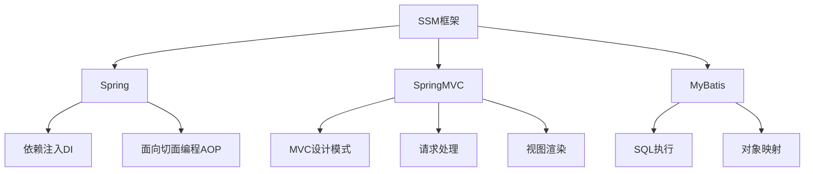
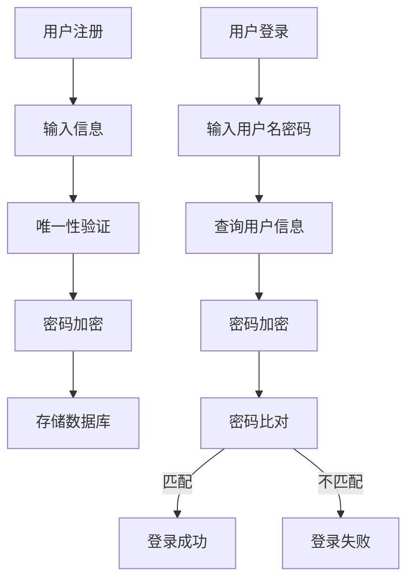
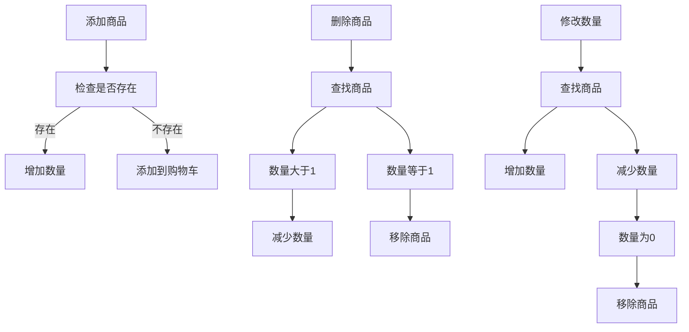
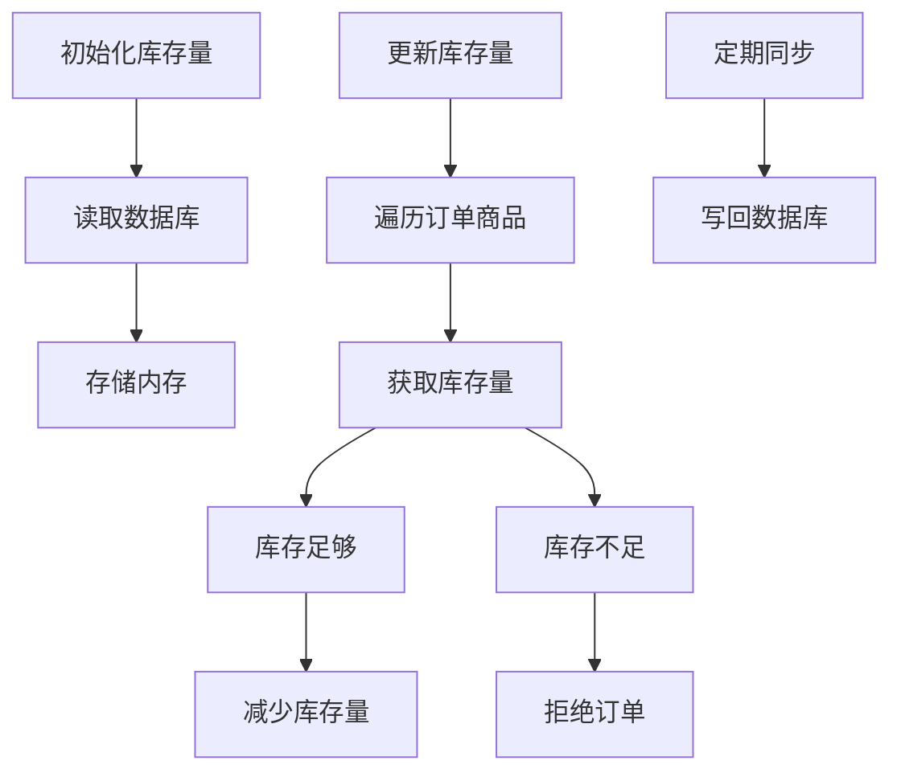
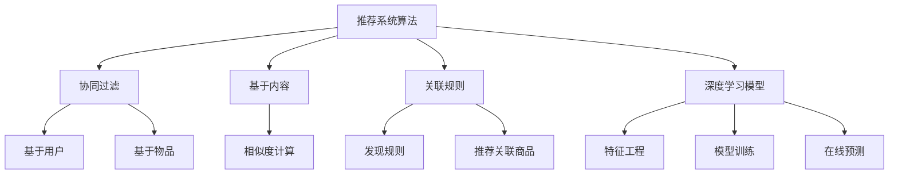

# 基于SSM的蛋糕预订商城

## 1. 背景介绍

随着互联网的快速发展和电子商务的兴起,人们越来越倾向于在线购物和服务。蛋糕作为一种受欢迎的食品,也逐渐进入了线上销售的领域。基于SSM(Spring、SpringMVC和MyBatis)框架构建的蛋糕预订商城系统,为用户提供了一个便捷的在线订购蛋糕的平台。

本文将深入探讨基于SSM框架开发蛋糕预订商城系统的核心概念、算法原理、数学模型、代码实现、应用场景、工具和资源,以及未来发展趋势和挑战。通过全面剖析该系统,读者可以掌握相关技术知识,并为自己的Web应用程序开发提供借鉴和指导。

### 1.1 电子商务发展趋势

电子商务的发展为传统商业模式带来了巨大的变革。根据统计数据,2022年全球电子商务销售额达到5.7万亿美元,预计到2025年将超过8万亿美元。这种快速增长的趋势反映了消费者对线上购物的青睐。

### 1.2 蛋糕市场需求分析

蛋糕作为一种受欢迎的食品,在各种节日和庆祝活动中扮演着重要角色。然而,传统的线下购买方式存在一些不便,例如需要亲自前往实体店、选择有限、交通不便等问题。在线蛋糕预订商城系统的出现,为消费者带来了更加便捷的购买体验。

## 2. 核心概念与联系

### 2.1 SSM框架

SSM框架是指Spring、SpringMVC和MyBatis三个框架的集合,它们分别负责不同的功能:

- **Spring**: 负责管理应用程序的对象及其生命周期,提供了依赖注入(DI)和面向切面编程(AOP)等功能。
- **SpringMVC**: 基于MVC设计模式,负责处理Web请求和响应,将控制逻辑与视图分离。
- **MyBatis**: 一个持久层框架,用于执行SQL语句并将结果映射为Java对象,简化了数据库操作。

这三个框架的有机结合,构建了一个高效、灵活的Web应用程序开发框架,适用于各种规模的项目。

### 2.2 电子商务核心概念

在蛋糕预订商城系统中,涉及到以下几个核心概念:

- **商品目录**: 包含所有可供销售的蛋糕信息,如名称、价格、规格等。
- **购物车**: 用户可以将想要购买的蛋糕加入购物车,方便下单。
- **订单管理**: 用户可以在线下单,并支付相应金额。系统需要处理订单信息并与库存进行对应。
- **会员系统**: 用户可以注册成为会员,享受折扣优惠和积分奖励等福利。
- **支付系统**: 集成第三方支付平台,为用户提供安全便捷的在线支付方式。

这些核心概念相互关联,共同构建了一个完整的电子商务系统。

## 3. 核心算法原理具体操作步骤

### 3.1 会员注册与登录

会员系统是蛋糕预订商城的重要组成部分,它涉及到用户注册、登录、密码加密等核心算法。下面是具体的操作步骤:

1. **用户注册**:
   - 用户输入注册信息(用户名、密码、邮箱等)
   - 系统对用户名和邮箱进行唯一性验证
   - 对密码进行加密处理(如MD5、SHA等算法)
   - 将加密后的密码和其他信息存储到数据库中

2. **用户登录**:
   - 用户输入用户名和密码
   - 系统从数据库中查询用户信息
   - 对输入的密码进行相同的加密处理
   - 比对加密后的密码是否与数据库中的密码匹配
   - 如果匹配,则登录成功;否则,提示用户名或密码错误

密码加密算法的使用可以有效防止明文密码泄露,提高系统的安全性。常用的加密算法包括MD5、SHA-256等,它们都属于不可逆的单向哈希函数。

### 3.2 购物车算法

购物车是电子商务系统中的一个重要功能,它允许用户临时存储想要购买的商品,并在下单时一并结算。购物车算法的核心是对商品的增加、删除和修改进行高效管理。

1. **添加商品到购物车**:
   - 检查购物车中是否已存在该商品
   - 如果存在,则增加商品数量
   - 如果不存在,则将商品及数量添加到购物车中

2. **从购物车中删除商品**:
   - 在购物车中查找要删除的商品
   - 如果商品数量大于1,则减少数量
   - 如果商品数量等于1,则从购物车中移除该商品

3. **修改购物车中商品数量**:
   - 在购物车中查找要修改的商品
   - 根据用户输入,增加或减少商品数量
   - 如果数量减少到0,则从购物车中移除该商品

购物车算法通常使用会话(Session)或缓存(Cache)来存储用户的购物车数据,以保持购物车状态的持久性。

### 3.3 库存管理算法

库存管理是电子商务系统的关键环节,它需要实时跟踪商品库存量,并在下单时进行库存扣减。以下是库存管理算法的具体步骤:

1. **初始化库存量**:
   - 在系统启动时,从数据库中读取所有商品的库存量
   - 将库存量存储在内存中(如缓存或HashMap)

2. **更新库存量**:
   - 当有新订单下单时,遍历订单中的商品
   - 对每件商品,从内存中获取当前库存量
   - 如果库存量足够,则减去订购数量,更新库存量
   - 如果库存量不足,则拒绝订单或提示用户修改数量

3. **定期同步库存量**:
   - 在固定时间间隔或达到特定条件时
   - 将内存中的库存量写回数据库,保持数据一致性

库存管理算法需要考虑并发情况下的数据一致性问题,可以使用乐观锁或悲观锁等机制来避免脏读、不可重复读等问题。

### 3.4 推荐系统算法

为了提高用户体验和销售额,电子商务系统通常会集成推荐系统算法,根据用户的浏览记录和购买历史,推荐感兴趣的商品。常见的推荐算法包括:

1. **协同过滤算法(Collaborative Filtering)**:
   - 基于用户之间的相似度,推荐其他用户喜欢的商品
   - 可以分为基于用户(User-based)和基于物品(Item-based)两种方式

2. **基于内容的推荐算法(Content-based)**:
   - 根据商品的内容特征(如类别、描述等),推荐相似的商品
   - 常用的相似度计算方法有余弦相似度、Jaccard相似度等

3. **基于关联规则的推荐算法(Association Rule)**:
   - 发现用户购买商品之间的关联规则
   - 根据购买了某些商品,推荐其他经常一起购买的商品

4. **基于深度学习的推荐算法**:
   - 利用神经网络模型捕捉用户偏好和商品特征之间的复杂关系
   - 常见模型包括广播机(FM)、深度因子分解机(DeepFM)等

推荐系统算法的选择取决于数据量、计算资源和业务需求,通常需要进行大量的数据预处理和模型训练。

## 4. 数学模型和公式详细讲解举例说明

在电子商务系统中,常常需要使用一些数学模型和公式来量化和优化系统的各个方面。下面将详细讲解几个常见的数学模型和公式。

### 4.1 协同过滤算法中的相似度计算

协同过滤算法是推荐系统中广泛使用的一种技术,它基于用户之间或物品之间的相似度来进行推荐。计算相似度的常用方法有余弦相似度和调整余弦相似度。

1. **余弦相似度(Cosine Similarity)**:

余弦相似度用于计算两个向量之间的夹角余弦值,公式如下:

$$\text{sim}(u, v) = \cos(\theta) = \frac{u \cdot v}{\|u\|\|v\|} = \frac{\sum_{i=1}^{n}u_iv_i}{\sqrt{\sum_{i=1}^{n}u_i^2}\sqrt{\sum_{i=1}^{n}v_i^2}}$$

其中,$ u $和$ v $是两个$ n $维向量,$ u_i $和$ v_i $分别表示向量$ u $和$ v $在第$ i $个维度上的值。

2. **调整余弦相似度(Adjusted Cosine Similarity)**:

调整余弦相似度在余弦相似度的基础上,引入了用户评分均值的调整,公式如下:

$$\text{sim}(u, v) = \frac{\sum_{i \in I}(r_{ui} - \overline{r_u})(r_{vi} - \overline{r_v})}{\sqrt{\sum_{i \in I}(r_{ui} - \overline{r_u})^2}\sqrt{\sum_{i \in I}(r_{vi} - \overline{r_v})^2}}$$

其中,$ r_{ui} $和$ r_{vi} $分别表示用户$ u $和$ v $对物品$ i $的评分,$ \overline{r_u} $和$ \overline{r_v} $分别表示用户$ u $和$ v $的平均评分,$ I $是两个用户都评分过的物品集合。

通过计算用户之间或物品之间的相似度,协同过滤算法可以为目标用户或物品找到最相似的其他用户或物品,从而进行推荐。

### 4.2 关联规则挖掘中的支持度和置信度

在电子商务系统中,关联规则挖掘算法常用于发现用户购买行