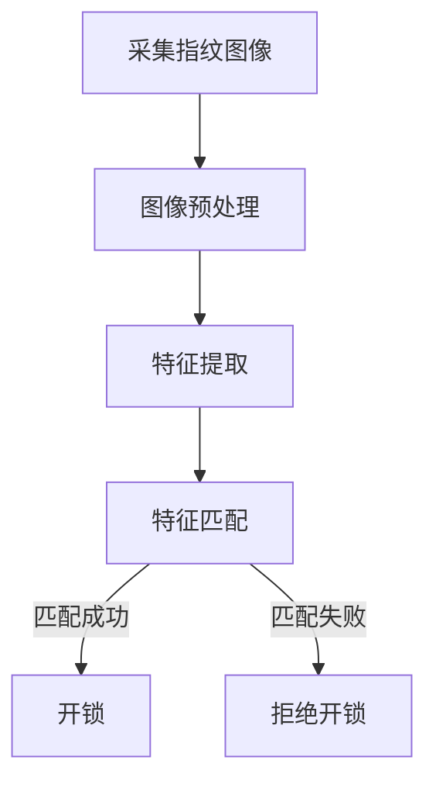
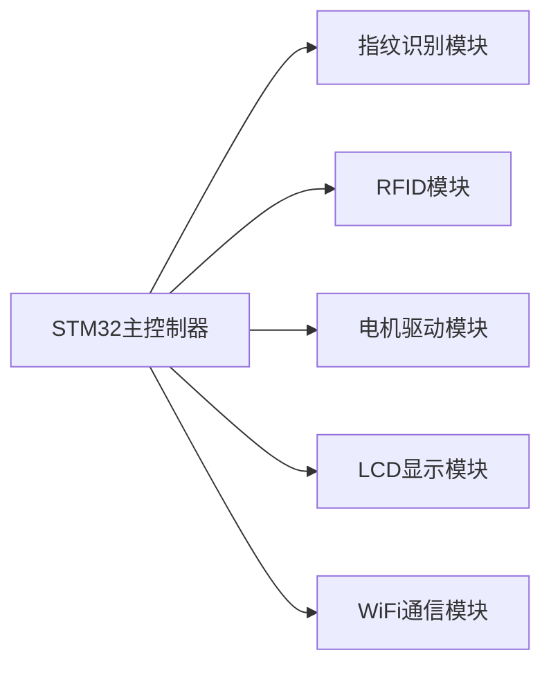
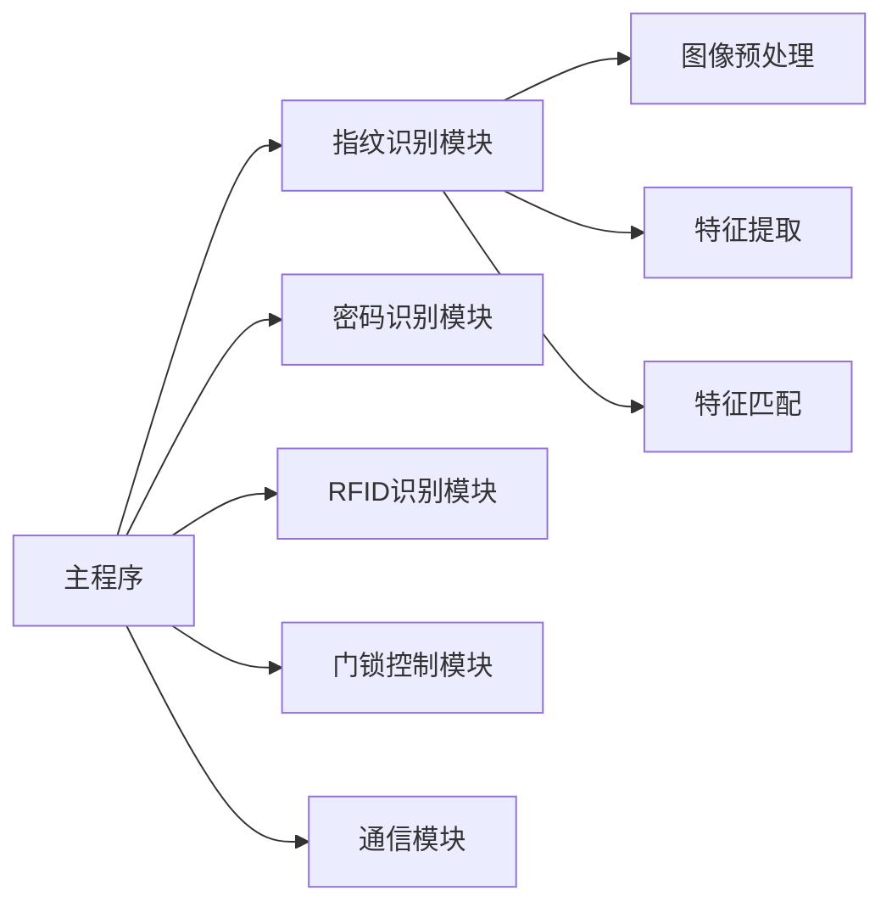

# 基于STM32的智能门锁设计

## 1.背景介绍

随着智能家居技术的不断发展,智能门锁作为家庭安全的第一道防线,越来越受到人们的重视。传统的机械门锁存在诸多缺陷,例如易被撬开、钥匙易丢失等,因此基于嵌入式系统的智能门锁应运而生。STM32作为一款功能强大、价格实惠的ARM Cortex-M内核微控制器,非常适合用于智能门锁的设计与开发。

## 2.核心概念与联系

智能门锁的核心概念包括:

1. **身份识别**:通过指纹、密码、RFID卡等方式对用户进行身份验证。
2. **门锁控制**:根据身份识别结果,控制电机驱动门锁开锁或上锁。
3. **通信模块**:实现远程控制、状态查询等功能,常用WiFi、蓝牙等无线通信方式。
4. **数据存储**:存储用户信息、开锁记录等数据,可采用EEPROM或Flash存储器。
5. **安全防护**:设置非法开锁报警、暴力破解保护等安全机制。

这些核心概念相互关联,构成了一个完整的智能门锁系统。

## 3.核心算法原理具体操作步骤

### 3.1 指纹识别算法

指纹识别是智能门锁最常用的身份验证方式之一,其核心算法包括:

1. **图像预处理**:对采集的指纹图像进行平滑、增强、二值化等预处理,提高图像质量。
2. **特征提取**:提取指纹图像中的特征点(分叉点、终止点等),生成指纹特征模板。
3. **特征匹配**:将提取的特征模板与存储的模板进行匹配,判断是否为合法用户。

指纹识别算法的具体操作步骤如下:



### 3.2 密码识别算法

密码识别是另一种常用的身份验证方式,其算法原理较为简单:

1. 用户输入密码
2. 将输入的密码与存储的密码进行比对
3. 若匹配成功,则开锁;否则拒绝开锁

### 3.3 RFID识别算法

RFID(Radio Frequency Identification,射频识别)是一种无线通信技术,可实现非接触式身份识别。其算法原理为:

1. RFID读写器发射无线电信号
2. RFID卡片接收信号并返回唯一ID
3. 读写器获取ID,并与存储的ID进行比对
4. 若匹配成功,则开锁;否则拒绝开锁

## 4.数学模型和公式详细讲解举例说明

### 4.1 图像预处理

在指纹识别算法中,图像预处理是一个非常重要的环节。常用的预处理方法包括:

1. **直方图均衡化**

直方图均衡化是一种常用的图像增强技术,可以提高图像的对比度。设输入图像的灰度级为$[0, L-1]$,其灰度直方图为$h(r_k)$,则经过直方图均衡化后的输出图像灰度级为:

$$s_k = T(r_k) = \sum_{j=0}^{r_k} \frac{h(r_j)}{n} \times (L-1)$$

其中$n$为图像中像素总数,$T(r_k)$为变换函数。

2. **中值滤波**

中值滤波是一种常用的图像去噪方法。对于一个$3\times3$的邻域窗口,中值滤波的输出为该窗口内9个像素值的中值。设输入图像为$f(x,y)$,输出图像为$g(x,y)$,则中值滤波的数学表达式为:

$$g(x,y) = \text{median}\{f(x-1,y-1), f(x-1,y), \cdots, f(x+1,y+1)\}$$

### 4.2 特征提取

在指纹识别中,特征提取是提取指纹图像中独特的细节特征,生成指纹特征模板。常用的特征提取算法包括:

1. **细节点检测**

细节点包括终止点和分叉点,是指纹图像中最显著的特征。设$P$为一个像素点,若在$P$的领域内存在唯一的一条通过$P$的指纹脊线段,则$P$为终止点;若存在三条或三条以上的指纹脊线段通过$P$,则$P$为分叉点。

2. **方向场估计**

方向场估计是计算每个像素点附近指纹脊线的方向,常用的方法包括梯度算子法、主成分分析法等。设$G_x$和$G_y$分别为$x$方向和$y$方向的梯度幅值,则像素点$(i,j)$处的脊线方向为:

$$\theta(i,j) = \tan^{-1}\left(\frac{G_y(i,j)}{G_x(i,j)}\right)$$

### 4.3 特征匹配

特征匹配是将提取的特征模板与存储的模板进行比对,判断是否为合法用户。常用的特征匹配算法包括:

1. **相关匹配**

相关匹配是计算两个特征模板之间的相似度,相似度越高,则匹配度越高。设$T$为输入特征模板,$R$为存储的参考模板,则相关匹配分数为:

$$S = \frac{\sum_{i=1}^{N}\sum_{j=1}^{N}(T_{ij}-\overline{T})(R_{ij}-\overline{R})}{\sqrt{\sum_{i=1}^{N}\sum_{j=1}^{N}(T_{ij}-\overline{T})^2}\sqrt{\sum_{i=1}^{N}\sum_{j=1}^{N}(R_{ij}-\overline{R})^2}}$$

其中$\overline{T}$和$\overline{R}$分别为$T$和$R$的均值。

2. **欠约束对合法匹配**

欠约束对合法匹配是一种常用的指纹匹配算法,它通过计算两个指纹模板之间的相似度得分,并与预设阈值进行比较,从而判断是否为合法匹配。

## 5.项目实践:代码实例和详细解释说明

### 5.1 硬件设计

智能门锁系统的硬件设计包括STM32主控制器、指纹识别模块、RFID模块、电机驱动模块、LCD显示模块等。



### 5.2 软件设计

智能门锁系统的软件设计包括指纹识别、密码识别、RFID识别、门锁控制、通信模块等模块。



### 5.3 代码实例

以下是STM32智能门锁系统的部分代码实例:

```c
// 指纹识别模块
void fingerprint_recognition() {
    // 采集指纹图像
    capture_fingerprint_image();
    
    // 图像预处理
    preprocess_image();
    
    // 特征提取
    extract_features();
    
    // 特征匹配
    if (match_features()) {
        // 开锁
        unlock_door();
    } else {
        // 拒绝开锁
        deny_access();
    }
}

// 门锁控制模块
void control_door_lock() {
    if (fingerprint_recognized || password_verified || rfid_authorized) {
        // 开锁
        unlock_door();
    } else {
        // 拒绝开锁
        deny_access();
    }
}

// WiFi通信模块
void wifi_communication() {
    // 连接WiFi网络
    connect_wifi();
    
    // 接收远程控制命令
    receive_remote_command();
    
    // 发送门锁状态
    send_door_status();
}
```

上述代码展示了指纹识别、门锁控制和WiFi通信等核心模块的基本功能。在实际项目开发中,需要根据具体需求进行进一步的功能扩展和优化。

## 6.实际应用场景

智能门锁系统可以广泛应用于家庭、办公室、酒店、公寓等多种场景,为人们的生活和工作带来了极大的便利和安全保障。

1. **家庭场景**:智能门锁可以有效防止家庭被盗,同时支持远程开锁、临时密码等功能,方便家人出入。
2. **办公室场景**:智能门锁可以记录员工的出入时间,并限制非法人员的进入,提高办公环境的安全性。
3. **酒店场景**:智能门锁可以实现自助入住、退房,提高服务效率,同时保护客人的隐私安全。
4. **公寓场景**:智能门锁可以为公寓业主提供安全可靠的出入管理,并支持访客临时密码等功能。

## 7.工具和资源推荐

在智能门锁系统的开发过程中,可以使用以下工具和资源:

1. **STM32开发工具**:Keil MDK、IAR Embedded Workbench、System Workbench等集成开发环境。
2. **指纹识别算法库**:NIST指纹图像软件、FingerJetFX等开源算法库。
3. **RFID开发工具**:RFID读写器模块、RFID卡片等硬件设备。
4. **WiFi通信模块**:ESP8266、ESP32等WiFi模块。
5. **在线学习资源**:ST官方文档、嵌入式系统教程、技术论坛等。

## 8.总结:未来发展趋势与挑战

智能门锁技术正在不断发展,未来可能会有以下趋势和挑战:

1. **生物识别技术发展**:除了指纹识别,还可能会集成面部识别、虹膜识别等生物识别技术,提高安全性。
2. **物联网技术融合**:智能门锁将与家庭智能控制系统、云平台等进一步融合,实现更智能化的管理和控制。
3. **安全性挑战**:随着技术的发展,黑客攻击、数据窃取等安全威胁也会增加,需要加强安全防护措施。
4. **低功耗设计挑战**:为了实现长期无人值守运行,需要进一步优化系统的功耗设计。
5. **成本控制挑战**:如何在保证性能和安全性的同时,降低智能门锁的生产成本,是一个需要解决的问题。

## 9.附录:常见问题与解答

1. **指纹识别的准确率如何?**

指纹识别的准确率通常在98%左右,取决于采集图像的质量、算法的性能等多个因素。可以通过优化算法、增加训练样本等方式提高准确率。

2. **智能门锁的电源如何设计?**

智能门锁可以采用电池供电或者直接连接市电。电池供电的优点是便于安装,缺点是需要定期更换电池。市电供电的优点是持久可靠,缺点是安装较为复杂。

3. **如何防止智能门锁被黑客攻击?**

可以采取以下措施提高智能门锁的安全性:加密通信数据、设置暴力破解保护、限制远程访问权限、定期更新固件等。

4. **智能门锁的成本如何控制?**

可以选用性价比较高的硬件模块、优化系统设计、采用模块化设计等方式,在保证性能的同时降低成本。

5. **智能门锁的维护如何进行?**

智能门锁需要定期进行软硬件维护,包括更新固件、检查硬件状态、清理数据存储等。可以通过远程维护或者现场维护的方式进行。

以上是一些常见的问题和解答,希望对您有所帮助。如有其他疑问,欢迎随时提出。

作者: