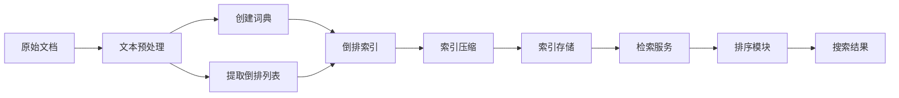

# 基于倒排索引的搜索引擎架构设计

## 1. 背景介绍

### 1.1 搜索引擎的发展历程

搜索引擎是互联网时代最重要的工具之一,它为我们在海量信息中快速准确地找到所需内容提供了便利。从最早的 Archie 到现在的 Google、Bing 等,搜索引擎技术经历了几十年的发展与演进。

### 1.2 搜索引擎面临的挑战

然而,随着网页数量的爆炸式增长,如何从海量数据中高效检索出相关结果,是每个搜索引擎都要面对的巨大挑战。同时用户对搜索质量和响应速度也提出了越来越高的要求。

### 1.3 倒排索引的核心作用

倒排索引(Inverted Index)作为搜索引擎的核心数据结构,在提升检索效率、改善用户体验方面扮演着关键角色。本文将重点探讨基于倒排索引的搜索引擎架构设计,分享一些关键技术要点和实践经验。

## 2. 核心概念与联系

### 2.1 正排索引与倒排索引

在介绍倒排索引之前,我们先来了解下传统的正排索引。正排索引就是以文档 ID 为键,文档内容为值的映射关系。而倒排索引则相反,它以词项(Term)为键,包含该词项的文档列表为值。

### 2.2 倒排索引的结构

一个典型的倒排索引由两部分组成:

- 词典(Term Dictionary):存储所有出现过的词项,并记录每个词项的一些统计信息,如文档频率(DF)等。
- 倒排列表(Posting List):记录每个词项出现在哪些文档中,以及出现的位置、频率等信息。

### 2.3 倒排索引与搜索引擎的关系

有了倒排索引,搜索引擎在处理用户查询时,只需要在词典中定位查询词,然后访问对应的倒排列表,就可以获得包含该词的所有文档。这种索引结构大大提高了查询效率。

## 3. 核心算法原理与操作步骤

### 3.1 倒排索引构建流程

倒排索引的构建主要分为以下几个步骤:

1. 抓取原始文档
2. 文本预处理:字符规范化、分词、去停用词、词干化等
3. 创建词典,记录每个词项的统计信息
4. 遍历文档,提取每个词项的倒排列表信息
5. 将倒排列表写入索引文件

### 3.2 文档排序算法

搜索结果的相关性排序是搜索引擎的一个核心问题。常见的排序算法有:

- TF-IDF:基于词频(TF)和逆文档频率(IDF)的加权统计方法
- BM25:考虑了文档长度因素的概率排序模型
- 基于机器学习的排序模型,如 LambdaMART 等

### 3.3 索引压缩技术

为了节省存储空间,提高索引访问效率,通常需要对倒排列表进行压缩。常见的索引压缩技术有:

- 可变字节编码(VB)
- 游程编码(RLE)
- 差值编码(Delta) 

### 3.4 索引更新策略

网页数据是不断变化的,因此搜索引擎需要定期更新索引,以保证结果的新鲜度。常见的索引更新策略包括:

- 全量重建:定期对所有文档重新建立索引
- 增量更新:只对新增和变更的文档进行增量索引

## 4. 数学模型与公式详解

### 4.1 向量空间模型(VSM)

向量空间模型将文档和查询都表示成向量的形式,通过计算向量之间的相似度来评估相关性。设文档向量为 $\vec{d}$,查询向量为 $\vec{q}$,则相似度可以用余弦公式表示:

$$
sim(q,d) = \frac{\vec{q} \cdot \vec{d}}{|\vec{q}| \times |\vec{d}|}
$$

其中分子是向量点积,分母是向量模长的乘积。

### 4.2 BM25 排序模型

BM25 是一种基于概率的排序模型,考虑了词频、文档长度等因素对相关性的影响。其得分公式为:

$$
score(q,d) = \sum_{i=1}^{n} IDF(q_i) \cdot \frac{f(q_i, d) \cdot (k_1 + 1)}{f(q_i, d) + k_1 \cdot (1 - b + b \cdot \frac{|d|}{avgdl})}
$$

其中:
- $IDF(q_i)$ 是查询词 $q_i$ 的逆文档频率
- $f(q_i, d)$ 是 $q_i$ 在文档 $d$ 中的词频
- $|d|$ 是文档 $d$ 的长度
- $avgdl$ 是所有文档的平均长度
- $k_1$, $b$ 是调节因子,控制词频和文档长度的影响力度

## 5. 项目实践:代码实例与详解

下面我们用 Python 实现一个简单的基于倒排索引的搜索引擎原型。

### 5.1 创建倒排索引

```python
from collections import defaultdict

class InvertedIndex:
    def __init__(self):
        self.index = defaultdict(list)
        
    def add(self, doc_id, doc):
        for word in doc.split():
            self.index[word].append(doc_id)
            
    def search(self, query):
        result = set()
        for word in query.split():
            result |= set(self.index[word])
        return result
        
# 测试代码
docs = [
    "hello world",
    "hello python",
    "python world",
]

index = InvertedIndex()
for i, doc in enumerate(docs):
    index.add(i, doc)

print(index.search("hello"))  # {0, 1}
print(index.search("python world"))  # {0, 1, 2}
```

这个简单的倒排索引实现了添加文档和搜索两个核心功能。在实际项目中,我们还需要考虑更多细节,如索引压缩、增量更新、多线程处理等。

### 5.2 实现 TF-IDF 排序

```python
import math

def tf(word, doc):
    return doc.split().count(word)

def idf(word, docs):
    return math.log(len(docs) / sum(1 for doc in docs if word in doc))

def tfidf(word, doc, docs):
    return tf(word, doc) * idf(word, docs)

# 测试代码  
doc = "this is a sample"
docs = [
    "this is a sample",
    "this is another example",
    "one more sample",
]

print(tfidf("sample", doc, docs))  # 0.1823215567939546
print(tfidf("this", doc, docs))    # 0.0
print(tfidf("example", doc, docs)) # 0.0
```

以上代码展示了如何计算一个词在文档中的 TF-IDF 权重。实际的搜索引擎排序还需要考虑更多因素,并使用更复杂的机器学习排序模型。

## 6. 实际应用场景

搜索引擎技术在很多领域都有广泛应用,下面列举一些常见的场景:

- 通用网页搜索引擎:如 Google、Bing、Baidu 等
- 垂直领域搜索引擎:如学术搜索、法律搜索、医疗搜索等
- 站内搜索:如电商网站、论坛、Wiki 等
- 企业内部搜索:面向员工的企业知识库、文档库搜索等
- 个人信息搜索:如个人笔记、邮件、图片等资料的本地搜索

不同的应用场景对搜索引擎的需求会有所不同,需要针对性地设计索引结构和排序策略。

## 7. 工具与资源推荐

下面推荐一些流行的开源搜索引擎库和相关工具:

- Lucene/Solr:Apache 的开源搜索引擎库与服务器
- Elasticsearch:基于 Lucene 构建的分布式搜索引擎
- Sphinx:高性能的全文搜索引擎
- Xapian:高效的概率检索引擎库
- Whoosh:纯 Python 实现的全文搜索引擎库
- Jieba:中文分词工具
- Gensim:主题模型工具包

此外,一些优秀的搜索引擎相关书籍和论文也值得阅读,如《信息检索导论》、《这就是搜索引擎》、Google 的 MapReduce 和 GFS 论文等。

## 8. 总结:未来发展趋势与挑战

### 8.1 个性化与语义化搜索

未来的搜索引擎将更加注重个性化和语义化,根据用户的兴趣、历史行为、查询意图等,提供更精准、更人性化的搜索结果。知识图谱、查询理解等技术将在其中发挥重要作用。

### 8.2 智能问答与对话式交互

基于自然语言处理和知识库的智能问答系统,将使搜索引擎从"关键词匹配"走向"知识问答"。用户可以用自然语言与搜索引擎进行对话,获得直接而准确的答案。

### 8.3 多模态搜索融合

除了文本信息,图片、视频、语音等多种模态数据在互联网上也占据了很大比重。如何将多模态数据有机融合,实现跨模态的联合检索,是一个富有挑战的课题。

### 8.4 隐私保护与公平性

在大数据时代,搜索引擎面临着用户隐私保护和算法公平性的双重挑战。如何在提供个性化服务的同时,最大限度保护用户隐私,避免算法歧视和信息茧房,需要技术和伦理的共同努力。

总之,搜索引擎技术方兴未艾,未来还有很大的发展空间。作为开发者,我们要紧跟前沿动态,不断学习,用创新的技术让搜索变得更智能、更高效、更有温度。

## 9. 附录:常见问题与解答

### Q1:倒排索引的优缺点是什么?

A1:倒排索引的优点是查询效率高,缺点是构建和维护成本较高,且不太适合动态插入和删除操作频繁的场景。

### Q2:除了倒排索引,还有哪些常见的索引结构?

A2:其他常见的索引结构有正排索引、签名文件、后缀树/后缀数组等。它们在某些特定场合下也有独特的优势。

### Q3:搜索引擎如何处理同义词问题?

A3:可以使用同义词词典对查询词进行扩展,将同义词映射到同一个词项上。也可以在索引阶段,就对文档进行同义词归一化处理。

### Q4:搜索引擎的相关性评估指标有哪些?

A4:常见的相关性评估指标有准确率(Precision)、召回率(Recall)、平均精度(AP)、NDCG 等。不同指标侧重点有所不同,需要权衡选择。

### Q5:搜索引擎的技术架构是怎样的?

A5:一个典型的搜索引擎架构包括爬虫、索引构建、检索服务、排序、缓存等多个模块。各模块通过消息队列松耦合,可以实现灵活的水平扩展。

以上是一些关于搜索引擎的常见问题,欢迎大家进一步探讨交流。

作者：禅与计算机程序设计艺术 / Zen and the Art of Computer Programming

