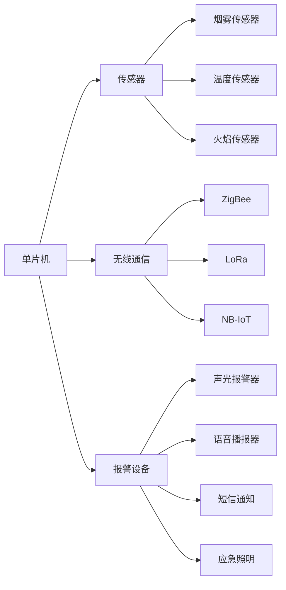

# 基于单片机的火灾自动报警系统设计

## 1. 背景介绍

火灾作为一种严重的自然灾害,每年都会造成巨大的人员伤亡和财产损失。及时准确地火灾报警和灭火是减少火灾危害的关键。传统的人工巡查和火灾报警方式存在响应速度慢、误报率高等问题。随着电子技术和计算机技术的发展,利用单片机实现火灾自动报警系统成为可能,可以大大提高火灾预警和处理的效率。

### 1.1 火灾的危害

#### 1.1.1 人员伤亡
#### 1.1.2 财产损失  
#### 1.1.3 环境破坏

### 1.2 传统火灾报警方式的局限性

#### 1.2.1 人工巡查效率低
#### 1.2.2 火灾报警器误报率高
#### 1.2.3 缺乏智能化和联动性

### 1.3 基于单片机的火灾自动报警系统的优势

#### 1.3.1 实时监测,响应速度快
#### 1.3.2 智能判别,减少误报
#### 1.3.3 联动控制,提高灭火效率

## 2. 核心概念与关联

本系统涉及的核心概念包括:

### 2.1 单片机

单片机是一种集成度高、功能强大的微型计算机系统,包含 CPU、存储器、定时器/计数器、串行口、I/O 口等,可以独立完成各种控制任务。本系统使用单片机作为核心控制器。

### 2.2 传感器

传感器是一种检测装置,能感受到被测量的信息,并转换成电信号输出。常见的火灾传感器有:

#### 2.2.1 烟雾传感器
利用光电效应检测空气中的烟雾浓度。

#### 2.2.2 温度传感器
测量环境温度,判断是否达到火灾报警阈值。

#### 2.2.3 火焰传感器  
利用红外线检测是否有明火。

### 2.3 无线通信

为实现多个传感器节点和报警终端的互联,需要使用无线通信技术,如 ZigBee、LoRa、NB-IoT 等。

### 2.4 报警设备  

报警设备一般包括声光报警器、语音播报器、短信通知、应急照明等,用于火灾发生时提醒人员疏散。

下图展示了火灾自动报警系统的核心概念之间的关联:



## 3. 核心算法原理与操作步骤

火灾自动报警系统的核心算法主要包括:火灾判别算法和报警策略。

### 3.1 火灾判别算法

火灾判别需要综合分析多个传感器的数据,常用的方法有:

#### 3.1.1 阈值法
设定烟雾浓度、温度等参数的报警阈值,当传感器数据超过阈值时判定为火灾。

#### 3.1.2 趋势分析法
连续监测环境参数随时间的变化趋势,当变化速率异常时判定为火灾。

#### 3.1.3 数据融合法
利用贝叶斯推断、支持向量机等算法,将多个传感器数据进行融合分析,提高火灾判别的准确率。

### 3.2 报警策略

当监测到疑似火情时,系统可采取以下报警策略:

#### 3.2.1 就地报警
触发报警区域内的声光报警器,提醒人员撤离。 

#### 3.2.2 远程通知
通过短信、电话等方式通知相关人员。

#### 3.2.3 联动控制
启动灭火设备如喷淋、防火门等,控制火势蔓延。

#### 3.2.4 分级预警  
根据火情严重程度发布不同级别的预警信息。

火灾判别和报警的基本操作步骤如下:

1. 传感器实时采集环境参数
2. 单片机读取传感器数据
3. 根据设定的判别算法分析数据
4. 若判定为火灾,则触发报警
5. 根据报警策略采取相应措施
6. 将火灾信息上报到监控中心
7. 生成火灾报警日志,以备事后分析

## 4. 数学模型与公式

### 4.1 阈值法火灾判别模型

设 $x_i$ 表示第 $i$ 个传感器的数据,$\theta_i$ 为其报警阈值,则火灾判别模型为:

$$
f(x_1,\cdots,x_n) = 
\begin{cases}
1 & \exists i, x_i \geq \theta_i \\
0 & \text{otherwise}
\end{cases}
$$

其中 $f(x_1,\cdots,x_n)=1$ 表示判定为火灾。

### 4.2 趋势分析法火灾判别模型

设 $x_i(t)$ 表示第 $i$ 个传感器在 $t$ 时刻的数据,则数据变化速率为:

$$
v_i(t) = \frac{dx_i(t)}{dt}
$$

当 $v_i(t)$ 超过设定的异常变化速率阈值 $\lambda_i$ 时,判定为火灾:

$$
g(v_1,\cdots,v_n) = 
\begin{cases}
1 & \exists i, v_i \geq \lambda_i \\
0 & \text{otherwise}
\end{cases}
$$

### 4.3 贝叶斯融合火灾判别模型

设有 $m$ 个传感器,第 $i$ 个传感器的数据为 $x_i$,则火灾概率为:

$$
P(F|x_1,\cdots,x_m) = \frac{P(x_1,\cdots,x_m|F)P(F)}{P(x_1,\cdots,x_m)}
$$

其中 $F$ 表示火灾事件,$P(F)$ 为火灾发生的先验概率,$P(x_1,\cdots,x_m|F)$ 为似然函数,可通过历史数据统计得到。

当 $P(F|x_1,\cdots,x_m)$ 超过设定的阈值 $\eta$ 时,判定为火灾:

$$
h(x_1,\cdots,x_m) =
\begin{cases}
1 & P(F|x_1,\cdots,x_m) \geq \eta \\
0 & \text{otherwise}
\end{cases}
$$

## 5. 项目实践:代码实例与说明

下面给出基于 Arduino 单片机和 MQ-2 烟雾传感器的火灾报警代码实例:

```cpp
const int MQ2_PIN = A0; // MQ-2传感器模拟量输出引脚
const int BUZZER_PIN = 8; // 蜂鸣器数字量输出引脚
const int THRESHOLD = 500; // 烟雾浓度报警阈值

void setup() {
  pinMode(MQ2_PIN, INPUT);
  pinMode(BUZZER_PIN, OUTPUT);
  Serial.begin(9600); 
}

void loop() {
  int smoke = analogRead(MQ2_PIN); // 读取烟雾传感器数据
  Serial.print("Smoke: ");
  Serial.println(smoke);
  
  if (smoke >= THRESHOLD) { // 烟雾浓度超过阈值
    digitalWrite(BUZZER_PIN, HIGH); // 触发蜂鸣器报警
    Serial.println("Fire detected!");
  } else {
    digitalWrite(BUZZER_PIN, LOW); // 关闭蜂鸣器
  }
  
  delay(1000); // 每秒检测一次
}
```

代码说明:

1. 定义 MQ-2 传感器和蜂鸣器连接的引脚,以及烟雾浓度报警阈值。
2. 在 `setup()` 函数中初始化引脚模式和串口通信。
3. 在 `loop()` 函数中循环读取 MQ-2 传感器的模拟量数据。
4. 将烟雾浓度数据通过串口打印出来,便于调试。
5. 判断烟雾浓度是否超过设定的阈值,如果超过则触发蜂鸣器报警,并在串口打印报警信息。
6. 如果烟雾浓度恢复正常,则关闭蜂鸣器。
7. 每次检测完毕后延时1秒,避免过于频繁的检测。

实际应用中,可以在此基础上增加更多的传感器、无线通信模块和报警设备,形成一个完整的火灾自动报警系统。

## 6. 实际应用场景

基于单片机的火灾自动报警系统可应用于以下场景:

### 6.1 家庭住宅
在住宅内安装烟雾报警器,一旦发生火情可及时提醒居民逃生,并通过手机 APP 推送报警信息。

### 6.2 商业建筑
在商场、宾馆、办公楼等人员密集的公共建筑中部署火灾自动报警系统,与消防联动,第一时间控制火情,组织人员疏散。

### 6.3 工业园区
对厂房、仓库等重点防火区域进行24小时监控,一旦发生火灾立即启动自动灭火装置,减少财产损失。

### 6.4 森林防火
在林区部署无线传感器网络,实时监测温度、湿度等环境参数,及早发现火情苗头,指导森林防火工作。

### 6.5 历史建筑保护
在文物古建筑中安装火灾报警设备,与4G网络连接,一旦发生火情立即通知相关部门进行抢救。

## 7. 工具与资源推荐

### 7.1 常用单片机型号

- Arduino UNO、Mega2560、Nano等
- STM32 F103、F407等
- ESP8266、ESP32等

### 7.2 常用传感器型号

- MQ-2 烟雾传感器
- DS18B20 温度传感器
- HC-SR501 人体红外传感器

### 7.3 无线通信模块

- CC2530 ZigBee模块
- ESP8266 WiFi模块
- SX1278 LoRa模块

### 7.4 实用的开发工具

- Arduino IDE
- Keil MDK
- 硬件仿真工具 Proteus

### 7.5 相关的开源项目

- [Arduino-Fire-Alarm-System](https://github.com/Satyam-Bhalla/Arduino-Fire-Alarm-System)
- [IoT_Fire_Alarm_System](https://github.com/vkguda/IoT_Fire_Alarm_System)
- [wireless-fire-alarm-system](https://github.com/CUManiar/wireless-fire-alarm-system)

## 8. 总结:未来发展趋势与挑战

火灾自动报警系统在提高火灾预防和应急处置效率方面发挥着重要作用。未来,随着人工智能、大数据、云计算、5G等新技术的发展,火灾自动报警系统将呈现出以下发展趋势:

### 8.1 智能化
利用机器学习算法,对海量的历史火灾数据进行挖掘分析,优化火灾预警模型,提高预警的准确性和实时性。

### 8.2 物联网化  
在传感器、控制器、执行器之间构建物联网,实现火灾信息的全面感知、智能处理和联动控制。

### 8.3 云端化
接入云平台,对不同区域的火灾监控数据进行汇总分析,实现火灾态势的可视化呈现和智能决策。

### 8.4 移动化
支持移动 APP 访问,随时随地掌握火灾动态,远程指挥调度救援力量。  

### 8.5 标准化
制定火灾报警系统的接口、协议等标准规范,促进不同厂商产品的互联互通和数据共享。

同时,火灾自动报警系统的发展也面临着一些挑战:

- 复杂环境下的可靠性
- 海量数据的实时处理能力
- 多源异构信息的融合分析
- 与既有消防系统的兼容对接
- 数据安全与隐私保护

相信通过产学研用各方的共同努力,必将推动火灾自动报警系统的技术创新和产业发展,为智慧消防和平安城市建设{"msg_type":"generate_answer_finish","data":"","from_module":null,"from_unit":null}