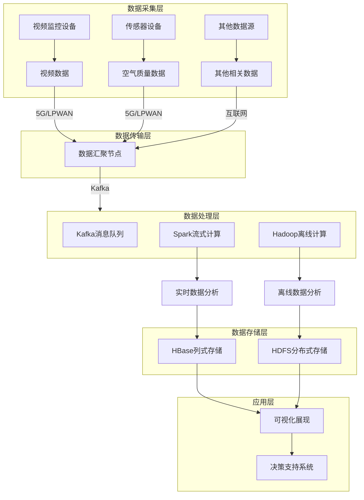
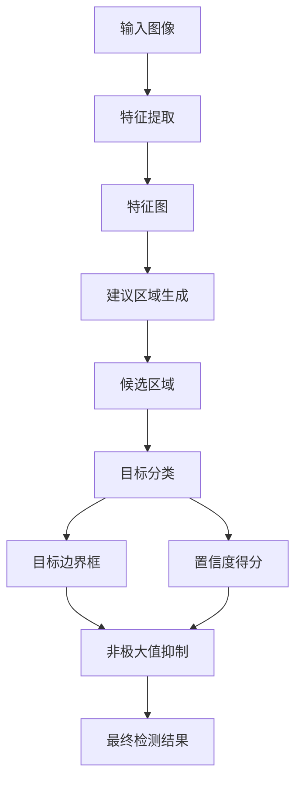
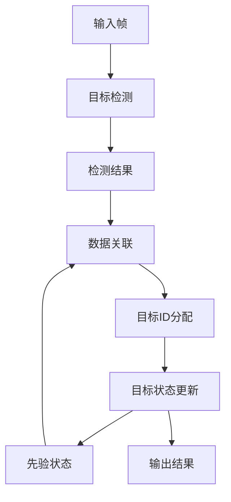

# 基于大数据的城市扬尘数字化监控系统的设计与开发

## 1.背景介绍

### 1.1 扬尘污染问题概述

扬尘污染是指由于自然或人为活动而产生的可入肺颗粒物(PM10和PM2.5)悬浮在空气中,对人体健康和生态环境造成严重危害的一种大气污染现象。城市扬尘主要来源包括施工工地、道路扬尘、裸土地面以及一些工业生产活动等。

扬尘不仅会导致呼吸系统疾病、心血管疾病等健康隐患,还会影响城市景观,降低市民生活质量。因此,有效控制和治理城市扬尘污染,对于创建宜居城市环境至关重要。

### 1.2 传统扬尘监测方式的不足

传统的扬尘监测方式主要依赖人工巡查和固定监测站点,存在以下几方面不足:

1. **覆盖范围有限** 人工巡查和固定监测站点只能覆盖有限区域,难以全面掌握城市扬尘污染状况。
2. **实时性差** 人工巡查和固定监测站点数据采集和处理存在时间滞后,无法实现实时监控。
3. **成本高昂** 人力和固定设施投入成本较高,难以大规模推广。
4. **数据质量参差不齐** 人工监测存在主观因素,固定监测站点布局合理性有待商榷。

### 1.3 大数据助力扬尘监控

随着物联网、人工智能等新兴技术的发展,基于大数据的城市扬尘数字化监控系统应运而生。该系统集成多源异构数据,利用云计算、大数据分析等技术手段,可实现城市扬尘的全天候、全方位实时监控,为精准治理和决策提供有力支撑。

## 2.核心概念与联系

### 2.1 大数据

大数据(Big Data)是指无法用常规软件工具在合理时间内获取、管理和处理的海量、高增长率和多样化的信息资产。大数据技术主要包括:

1. **数据采集** 从各种渠道获取结构化、半结构化和非结构化数据。
2. **数据存储** 使用分布式文件系统(如HDFS)和NoSQL数据库存储海量数据。
3. **数据处理** 利用MapReduce、Spark等并行计算框架进行数据处理和分析。
4. **数据可视化** 通过数据可视化工具呈现分析结果,辅助决策。

### 2.2 物联网(IoT)

物联网(Internet of Things)是指通过各种信息传感设备,实现对物理世界的感知和连接,并进行信息交换和通信的一种网络。物联网技术在扬尘监控中的应用包括:

1. **视频监控** 利用摄像头采集现场视频数据。
2. **传感器监测** 使用PM2.5、PM10传感器采集空气质量数据。
3. **无线通信** 通过5G、LPWAN等技术实现数据传输。

### 2.3 人工智能(AI)

人工智能(Artificial Intelligence)是研究、开发用于模拟、延伸和扩展人类智能的理论、方法、技术及应用系统的一门新的技术科学。在扬尘监控中,AI技术主要应用包括:

1. **计算机视觉** 对视频图像进行目标检测、识别和跟踪。
2. **机器学习** 建模分析扬尘数据,预测扬尘趋势。
3. **自然语言处理** 处理相关文本数据,提取有价值信息。

### 2.4 云计算

云计算(Cloud Computing)是一种按使用量付费的模式,可方便地通过网络获取所需的服务器、存储、数据库和其他计算资源。云计算为扬尘监控系统提供了可伸缩的计算和存储资源。

### 2.5 系统架构概览

基于大数据的城市扬尘数字化监控系统整体架构如下图所示:

该系统主要由数据采集、传输、处理、存储和应用五个层次组成。下面将对各层次的关键技术进行详细介绍。

## 3.核心算法原理具体操作步骤

### 3.1 视频图像处理

#### 3.1.1 目标检测

目标检测是计算机视觉中的一项基本任务,旨在自动定位图像或视频中感兴趣的目标物体。在扬尘监控场景中,需要检测出施工工地、裸土地面、车辆行驶等可能产生扬尘的目标。

目前主流的目标检测算法有基于深度学习的单阶段算法(如YOLO系列)和两阶段算法(如Faster R-CNN)。这些算法的工作原理如下:

1. **特征提取网络** 利用卷积神经网络(如VGGNet、ResNet等)从输入图像中提取特征图。
2. **建议区域生成** 在特征图上滑动窗口或使用先验锚框生成建议区域。
3. **目标分类和精修** 对每个建议区域进行目标分类,同时精修目标边界框。

以YOLO算法为例,其检测流程如下:

#### 3.1.2 目标跟踪

目标跟踪是在视频序列中自动定位运动目标、识别目标并预测其运动轨迹的过程。在扬尘监控中,需要跟踪施工车辆、运输车辆等移动目标,分析其轨迹和运动状态。

常用的目标跟踪算法有相关滤波(如卡尔曼滤波)、核相关滤波、基于检测的跟踪等。以SORT算法为例,其跟踪流程如下:

1. 使用深度学习目标检测算法获取当前帧的检测结果。
2. 将检测结果与先验目标状态进行数据关联,确定目标ID。
3. 使用卡尔曼滤波等算法更新目标状态(位置、运动等)。
4. 输出当前帧的目标ID、边界框和运动状态。

#### 3.1.3 场景理解

除了目标检测和跟踪,扬尘监控还需要对视频场景进行语义理解,如识别场景类型(工地、道路等)、目标行为分析(挖掘、装卸等)等,为决策提供更多维度信息。

场景理解可以通过机器学习的方法实现。例如,使用3D卷积神经网络对视频序列进行端到端建模,同时预测场景类型和目标行为。此外,也可以将目标检测、跟踪和场景理解作为多任务学习的不同分支,共享主干网络的特征表示。

### 3.2 空气质量数据处理

#### 3.2.1 时空插值

由于空气质量监测站点的覆盖范围有限,需要使用时空插值技术对未覆盖区域的空气质量数据进行估算。常用的时空插值方法包括:

1. **克里金插值(Kriging)** 基于空间自相关原理,对未知点进行最优线性无偏估计。
2. **IDW(Inverse Distance Weighting)** 利用已知点数据的距离加权平均值对未知点进行估计。
3. **RBF(Radial Basis Function)** 使用径向基函数对已知点数据进行插值拟合。

以普通克里金插值为例,其基本思路是:已知空间点的观测值可以表示为一个加性模型,包括一个常数项(数据的常数漂移)和一个随机项(空间相关的部分)。在已知点的帮助下,可以对未知点进行最佳线性无偏估计。

#### 3.2.2 时间序列分析

利用时间序列分析技术可以发现空气质量数据中的周期性模式和趋势,从而预测未来的空气质量状况。常用的时间序列分析方法包括:

1. **移动平均法** 使用过去几个时间点的平均值对当前时间点进行预测。
2. **指数平滑法** 对过去观测值赋予指数递减权重,进行加权平均。
3. **ARIMA模型** 将时间序列分解为自回归(AR)、移动平均(MA)和差分(I)三部分。

以ARIMA模型为例,其基本思路是:

1. 通过差分运算消除时间序列的非平稳性。
2. 拟合自回归(AR)模型,描述当前值与过去值的线性关系。
3. 拟合移动平均(MA)模型,描述当前值与过去残差的线性关系。
4. 将AR和MA模型相结合,构建ARIMA模型,进行未来值预测。

### 3.3 异常检测与预警

#### 3.3.1 基于统计的异常检测

统计异常检测方法假设正常数据服从某种概率分布,异常点则是那些偏离该分布的数据点。常用的统计异常检测算法包括:

1. **基于高斯分布的异常检测** 假设正常数据服从高斯分布,计算数据点到均值的马氏距离,距离超过阈值即为异常点。
2. **基于核密度估计的异常检测** 使用核函数对数据分布进行无参数估计,计算数据点的概率密度值,密度值过小即为异常点。

以基于高斯分布的异常检测为例,其步骤如下:

1. 估计正常数据的均值向量$\mu$和协方差矩阵$\Sigma$。
2. 对于新的数据点$x$,计算其马氏距离:

$$
D(x)=\sqrt{(x-\mu)^T\Sigma^{-1}(x-\mu)}
$$

3. 若$D(x)$超过给定阈值$\lambda$,则将$x$标记为异常点。

#### 3.3.2 基于聚类的异常检测

基于聚类的异常检测算法将数据划分为多个簇,簇间的数据点被视为异常点。常用算法包括:

1. **基于密度的聚类** 如DBSCAN算法,将密集区域的数据点聚为簇,离群点视为异常。
2. **基于距离的聚类** 如K-Means算法,异常点距离任何簇心都较远。

以DBSCAN算法为例,其核心思想是:对于核心点(其邻域{"msg_type":"generate_answer_finish","data":"","from_module":null,"from_unit":null}