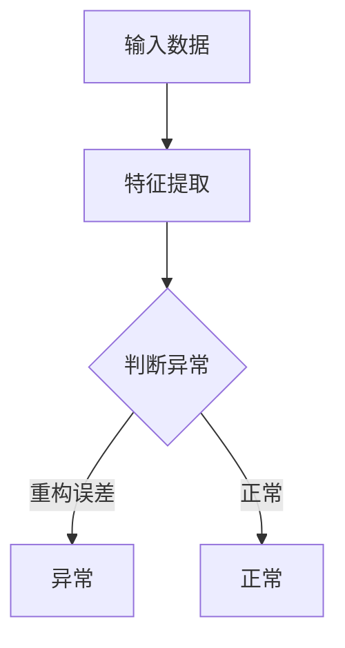

# 基于深度学习的异常检测

## 1. 背景介绍

异常检测是数据分析和机器学习领域的一个重要课题,在工业生产、金融风控、网络安全等诸多领域有着广泛的应用。传统的异常检测方法,如统计学方法、距离度量方法等,在处理高维、非线性数据时往往力不从心。近年来,深度学习技术的兴起为异常检测带来了新的突破,利用深度神经网络强大的特征学习和表达能力,可以更好地刻画数据内在的复杂模式,从而实现更加精准、鲁棒的异常检测。

本文将重点探讨基于深度学习的异常检测技术,从异常检测的背景意义、深度学习的优势出发,系统阐述几种主流的深度异常检测算法,包括自编码器、变分自编码器、生成对抗网络等,并结合实际案例讨论其应用实践。同时,针对深度异常检测面临的挑战,提出一些可能的解决思路和未来发展方向。

### 1.1 异常检测的定义与意义

异常检测(Anomaly Detection),又称为离群点检测(Outlier Detection),是指识别出数据集中明显偏离其余样本的少数个体。形式化地,异常检测就是学习一个函数 $f: X \rightarrow \{0,1\}$,其中 $X$ 为输入数据空间, $f(x)=1$ 表示 $x$ 为异常点, $f(x)=0$ 表示 $x$ 为正常点。

异常数据通常由于测量误差、人为错误、系统故障等原因产生,反映了系统的非正常状态,及时发现和定位这些异常对保障系统稳定运行至关重要。此外,异常有时也蕴含着有价值的信息,如在金融领域,异常交易模式可能预示着欺诈行为。总的来说,异常检测在以下场景有着重要意义:

- 工业生产:设备故障诊断、产品质量检测等
- 金融风控:欺诈检测、反洗钱、信用评估等  
- 网络安全:入侵检测、僵尸网络识别等
- 医疗健康:疾病预警、药物副作用监测等

### 1.2 传统异常检测方法的局限

异常检测是一个非平衡二分类问题,主要难点在于:

1. 异常样本稀少,缺乏足够的异常数据用于训练;
2. 异常形态多样,很难穷举所有可能的异常模式;
3. 正常样本存在噪声,与异常样本边界模糊。

传统的异常检测方法主要包括:

- 统计学方法:假设数据服从某种分布(如高斯分布),将偏离分布的少数样本识别为异常,代表算法有3σ原则、箱线图等。
- 距离度量方法:假设异常点与周围邻居的距离明显偏大,代表算法有KNN、LOF等。
- 聚类方法:将偏离聚类中心的少数点视为异常,代表算法有K-Means、DBSCAN等。
- 单分类SVM:用支持向量描述正常数据的边界,偏离边界的为异常点。

这些方法在处理低维数据时还算有效,但面对高维、非线性数据,往往捉襟见肘。一方面,高维空间的数据分布极为稀疏,统计假设难以成立;另一方面,高维度量如欧氏距离失去判别力,所有点相距遥远。因此,传统方法难以刻画高维数据的真实分布。

### 1.3 深度学习的优势

深度学习通过构建多层神经网络,可以自动学习数据的层次化特征表示,克服了传统机器学习方法的许多不足:

1. 深度神经网络具有强大的非线性拟合能力,可以刻画复杂数据分布;
2. 通过无监督预训练,深度模型可以自动提取高层语义特征,缓解维数灾难;
3. 端到端学习,不需要领域知识和人工特征工程,具有更好的泛化性。

因此,将深度学习应用于异常检测,有望突破传统方法的瓶颈,实现更加智能、精准的异常识别。接下来,我们将重点介绍几种代表性的深度异常检测算法。

## 2. 核心概念与联系

在讨论具体算法之前,我们先来了解几个异常检测领域的核心概念,理清它们之间的联系。

### 2.1 无监督学习与半监督学习

异常检测可以看作一种特殊的分类问题,但由于异常样本稀少,很难获得足够的标注数据用于训练分类器。因此,大多数异常检测算法采用无监督学习范式,仅利用正常样本训练模型,通过学习数据的内在结构,构建正常状态的 profile,偏离该 profile 的样本即判定为异常。

半监督学习介于无监督和有监督之间,假设训练集中含有少量的异常样本。此时,可以同时利用有标签数据和无标签数据,一方面用异常样本辅助学习判定边界,另一方面利用无标签数据挖掘数据整体分布,两者互为补充,可以学到更加鲁棒的检测模型。

### 2.2 重构误差与异常分数

许多深度异常检测算法的核心思想是重构(Reconstruction),即学习一个编码-解码网络,使其能够重构出与输入相近的输出。直观上,异常样本偏离了训练集的主流分布,因此很难被精确地重构出来。据此,可以用重构误差(即输入与重构输出的差异)来刻画样本的异常程度。

常见的重构误差度量有均方误差(MSE)、交叉熵误差(CE)等。为了得到归一化的异常分数,可以对重构误差进行 Normalization,如使用 Sigmoid 函数将其映射到 0~1 范围内。异常分数越大,样本越有可能是异常点。

### 2.3 Mermaid 流程图

下面,我们用 Mermaid 流程图直观展示深度异常检测的一般流程:

总的来说,深度异常检测分为特征提取和异常判定两个阶段。首先,原始数据通过编码网络提取高层特征;然后,解码网络尝试从特征重构出原始数据,并计算重构误差;最后,根据重构误差的大小判断样本是否异常。接下来,我们将重点介绍几种常见的特征提取和异常判定方法。

## 3. 核心算法原理与操作步骤

### 3.1 基于自编码器的异常检测

自编码器(Autoencoder)是一种无监督特征学习模型,由编码器(Encoder)和解码器(Decoder)两部分组成。编码器将输入数据 $x$ 映射为低维隐变量 $z$,解码器再由 $z$ 重构出 $\hat{x}$,使其近似于 $x$。形式化地,自编码器的目标是最小化重构误差:

$$\min_{\theta} \mathcal{L}(x, \hat{x}) = \min_{\theta} \mathcal{L}(x, g_{\theta}(f_{\theta}(x)))$$

其中, $f_{\theta}$ 和 $g_{\theta}$ 分别表示编码器和解码器, $\theta$ 为网络参数, $\mathcal{L}$ 为重构误差函数,如 MSE 或 BCE。

自编码器可以用于异常检测,其基本思路是:用正常样本训练自编码器,使其能很好地重构正常数据,而难以重构异常数据。这样,异常样本的重构误差会明显高于正常样本。因此,可以用重构误差作为样本的异常分数。

自编码器异常检测的一般步骤如下:

1. 构建编码器和解码器网络,并设定损失函数;
2. 用正常样本训练自编码器,使其学会重构正常数据;
3. 用训练好的自编码器对新样本 $x$ 进行重构,得到重构样本 $\hat{x}$;
4. 计算重构误差 $\mathcal{L}(x,\hat{x})$ 作为 $x$ 的异常分数;
5. 设定阈值 $\tau$,若异常分数超过 $\tau$ 则判定为异常,否则为正常。

自编码器的编码-解码结构天然适合异常检测任务,但也存在一些局限:

- 未考虑样本间的关联,容易受孤立噪声点的影响;
- 对异常样本也有一定的重构能力,异常分数的判别性不够理想。

为了克服这些不足,研究者提出了许多改进方法,如引入正则化项、度量学习等,后文将详细讨论。

### 3.2 基于变分自编码器的异常检测

变分自编码器(Variational Autoencoder, VAE)是自编码器的一种变体,与之不同的是,VAE 将隐变量 $z$ 视作随机变量,并显式地对其分布进行建模。一般假设 $z$ 服从各向同性的高斯分布,即 $z \sim \mathcal{N}(0, I)$。

VAE 由识别模型(Inference Model) $q_{\phi}(z|x)$ 和生成模型(Generative Model) $p_{\theta}(x|z)$ 组成,分别对应于编码器和解码器。其目标是最大化边际似然 $p_{\theta}(x)$,但由于边际似然难以直接求解,因此转而最大化其下界(ELBO):

$$\log p_{\theta}(x) \geq \mathbb{E}_{q_{\phi}(z|x)}[\log p_{\theta}(x|z)] - D_{KL}(q_{\phi}(z|x) \| p(z)) \triangleq \mathcal{L}(\theta, \phi; x)$$

其中, $D_{KL}$ 为 KL 散度,用于度量 $q_{\phi}(z|x)$ 与先验 $p(z)$ 的差异。直观上,ELBO 的第一项要求解码器能从隐变量 $z$ 重构出 $x$,第二项则使得隐变量的分布接近标准高斯分布。

基于 VAE 的异常检测,可以从重构误差和隐变量分布两个角度入手:

1. 重构误差法:与标准自编码器类似,用重构误差 $-\log p_{\theta}(x|\hat{z})$ 作为异常分数,其中 $\hat{z}$ 为编码器的输出均值。
2. KL 散度法:正常样本的隐变量分布应与标准高斯分布接近,而异常样本的分布会偏离高斯先验。因此,可用 $D_{KL}(q_{\phi}(z|x) \| p(z))$ 作为异常分数。

此外,重构误差和 KL 散度可以加权组合,形成更鲁棒的异常分数。相比标准自编码器,VAE 通过隐变量建模,可以更好地刻画数据的概率分布,因此在异常检测任务上往往能取得更优的表现。

### 3.3 基于生成对抗网络的异常检测

生成对抗网络(Generative Adversarial Network, GAN)由生成器(Generator)和判别器(Discriminator)组成,两者互为博弈,最终使生成器能生成与真实样本几乎一致的数据。形式化地,GAN 的目标函数为:

$$\min_{G} \max_{D} V(D, G) = \mathbb{E}_{x \sim p_{data}(x)}[\log D(x)] + \mathbb{E}_{z \sim p_z(z)}[\log (1-D(G(z)))]$$

其中, $G$ 和 $D$ 分别表示生成器和判别器, $p_{data}$ 为真实数据分布, $p_z$ 为随机噪声的先验分布。

GAN 虽然最初设计用于生成任务,但也可以用于异常检测。其基本思路是:用正常样本训练 GAN,使其能生成正常数据的分布。对于新样本,若其属于正常类别,则更容易被生成器生成或判别器接受;反之,异常样本偏离了正常分布,因此很难生成或判别。据此,有以下几种异常分数的构造方法:

1. 重构误差法:将新样本 $x$ 输入判别器,提取其特征 $f(x)$,再输入生成器重