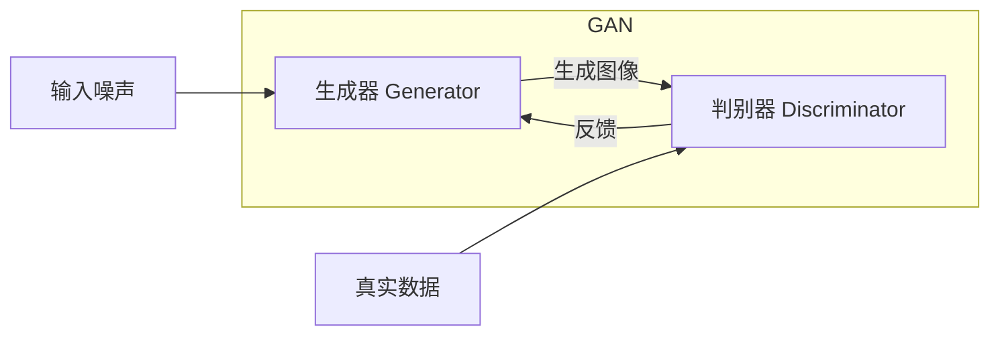
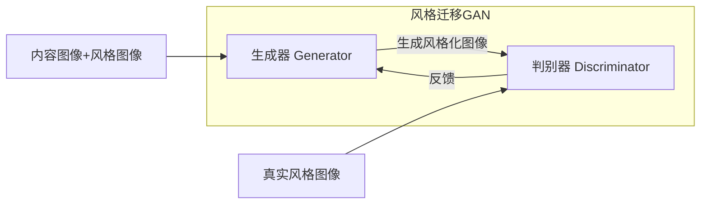
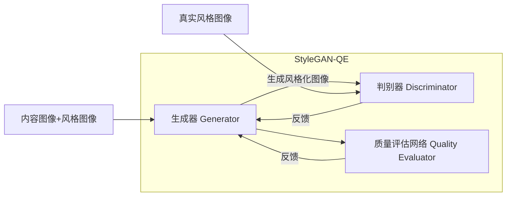

# 基于生成对抗网络的图像风格迁移质量评价模型

## 1.背景介绍

### 1.1 图像风格迁移的概念

图像风格迁移是一种将一种艺术风格应用到另一幅图像上的技术。它的目标是在保留内容图像的内容和语义信息的同时,将风格图像的风格元素(如颜色、笔触、纹理等)迁移到内容图像中,从而创建出一幅新的具有独特艺术风格的图像。

这项技术广泛应用于计算机图形学、计算机视觉和多媒体领域,为图像处理、增强现实、视频制作等领域提供了新的可能性。

### 1.2 传统图像风格迁移方法的局限性

早期的图像风格迁移方法主要基于手工特征提取和参数调优,需要大量的人工干预和经验积累。这些方法通常效果有限,难以捕捉复杂的视觉样式,并且缺乏普适性。

随着深度学习技术的发展,基于卷积神经网络(CNN)的图像风格迁移算法应运而生,能够自动提取图像的内容和风格特征,大大提高了风格迁移的质量和效率。然而,这些方法在评估风格迁移结果的质量时,主要依赖于人工视觉评估,缺乏客观、自动化的评价指标,这在大规模应用场景中显得低效且主观性强。

## 2.核心概念与联系

### 2.1 生成对抗网络(GAN)

生成对抗网络(Generative Adversarial Networks,GAN)是一种由两个神经网络组成的框架,包括生成器(Generator)和判别器(Discriminator)。生成器的目标是生成逼真的数据样本(如图像),而判别器则旨在区分生成的样本和真实数据样本。两个网络相互对抗,最终达到生成器生成的样本足以欺骗判别器的状态。

GAN在图像生成、超分辨率重建、图像翻译等领域表现出色,展现了强大的生成能力。



### 2.2 图像风格迁移与GAN

传统的图像风格迁移方法往往需要手动调参,难以捕捉复杂的视觉样式。而基于GAN的方法能够自动学习图像的内容和风格特征,生成具有目标风格的新图像。

在图像风格迁移任务中,生成器的作用是将内容图像和风格图像的特征融合,生成风格化的图像。判别器则评估生成图像与真实风格图像之间的差异,并将评估结果反馈给生成器,促使其不断改进,最终生成高质量的风格化图像。



### 2.3 图像质量评价

评价生成图像的质量对于图像风格迁移任务至关重要。主观的人工评价往往成本高且效率低下。因此,需要一种客观、自动化的评价模型来量化生成图像的质量,为模型优化和参数调整提供指导。

常见的图像质量评价指标包括:

- 峰值信噪比(PSNR)
- 结构相似性(SSIM)
- 无参考图像质量评估指标(NRQM)

然而,这些指标主要关注图像的像素级相似性,难以很好地评估图像的感知质量。因此,需要一种新的评价模型来更好地衡量图像风格迁移的质量。

## 3.核心算法原理具体操作步骤

基于生成对抗网络的图像风格迁移质量评价模型(StyleGAN-QE)的核心思想是:在GAN的基础上引入一个新的质量评估网络(Quality Evaluator),对生成器输出的风格化图像进行质量评估,并将评估结果反馈给生成器和判别器,促使它们不断改进,最终生成高质量的风格化图像。

该模型的具体操作步骤如下:

1. **数据预处理**:准备内容图像、风格图像和对应的高质量风格化图像作为训练数据。

2. **特征提取**:使用预训练的VGG网络对内容图像、风格图像和风格化图像提取特征。

3. **生成器训练**:
   - 输入:内容图像特征、风格图像特征、随机噪声
   - 输出:生成的风格化图像
   - 损失函数:内容损失(保留内容)、风格损失(迁移风格)、对抗损失(欺骗判别器)

4. **判别器训练**:
   - 输入:真实风格化图像、生成的风格化图像
   - 输出:真实/假的判别结果
   - 损失函数:二分类交叉熵损失

5. **质量评估网络训练**:
   - 输入:生成的风格化图像
   - 输出:质量评分
   - 损失函数:质量评分与真实图像质量之间的均方误差

6. **模型优化**:
   - 生成器:最小化内容损失、风格损失、对抗损失
   - 判别器:最小化判别损失
   - 质量评估网络:最小化质量评分损失

7. **迭代训练**:重复步骤3-6,直到模型收敛。

8. **风格迁移与质量评估**:
   - 使用训练好的生成器对新的内容图像和风格图像进行风格迁移
   - 使用训练好的质量评估网络对生成的风格化图像进行质量评估

该算法的关键在于引入了独立的质量评估网络,能够更好地捕捉图像的感知质量,为生成器和判别器提供更有效的反馈,从而提高最终生成图像的质量。



## 4.数学模型和公式详细讲解举例说明

在StyleGAN-QE模型中,生成器、判别器和质量评估网络的损失函数是核心数学模型。下面将详细介绍每个损失函数的数学表达式及其含义。

### 4.1 生成器损失函数

生成器的损失函数包括三个部分:内容损失、风格损失和对抗损失。

**1) 内容损失**

内容损失用于保留生成图像的内容信息,确保其与输入内容图像的内容相似。通常使用预训练的VGG网络提取特征,并计算生成图像特征与内容图像特征之间的均方误差:

$$L_{\text{content}}(G) = \frac{1}{N}\sum_{i=1}^N\left\|F_i^{\text{gen}} - F_i^{\text{cont}}\right\|_2^2$$

其中,$F_i^{\text{gen}}$和$F_i^{\text{cont}}$分别表示生成图像和内容图像在第$i$层的特征图,$N$是特征图的数量。

**2) 风格损失**

风格损失用于将风格图像的风格元素(如颜色、笔触等)迁移到生成图像中。通常使用格拉姆矩阵(Gram Matrix)来捕捉风格特征,并计算生成图像与风格图像之间的风格差异:

$$L_{\text{style}}(G) = \sum_{i=1}^N\frac{1}{N_i^2M_i^2}\left\|G_i^{\text{gen}} - G_i^{\text{style}}\right\|_F^2$$

其中,$G_i^{\text{gen}}$和$G_i^{\text{style}}$分别表示生成图像和风格图像在第$i$层的格拉姆矩阵,$N_i$和$M_i$分别是第$i$层特征图的高度和宽度。

**3) 对抗损失**

对抗损失是GAN中的核心部分,用于促使生成器生成逼真的图像以欺骗判别器。对抗损失可以采用最小化负熵损失的形式:

$$L_{\text{adv}}(G) = -\mathbb{E}_{x\sim P_{\text{data}}}\left[\log D(G(x))\right]$$

其中,$D$是判别器,$G$是生成器,$x$是输入的内容图像和风格图像。

生成器的总损失函数为:

$$L(G) = \lambda_1L_{\text{content}}(G) + \lambda_2L_{\text{style}}(G) + \lambda_3L_{\text{adv}}(G)$$

其中,$\lambda_1$、$\lambda_2$和$\lambda_3$是超参数,用于平衡三个损失项的相对重要性。

### 4.2 判别器损失函数

判别器的目标是区分真实的风格化图像和生成器生成的风格化图像。通常采用二分类交叉熵损失函数:

$$L_D = -\mathbb{E}_{x\sim P_{\text{data}}}\left[\log D(x)\right] - \mathbb{E}_{z\sim P_z}\left[\log(1-D(G(z)))\right]$$

其中,$x$是真实的风格化图像,$z$是随机噪声,用于生成器生成假的风格化图像$G(z)$。

### 4.3 质量评估网络损失函数

质量评估网络的目标是对生成的风格化图像进行质量评估,并将评估结果反馈给生成器和判别器,促使它们不断改进。通常采用均方误差损失函数:

$$L_{\text{QE}} = \frac{1}{N}\sum_{i=1}^N\left\|Q(G(x_i)) - q_i\right\|_2^2$$

其中,$Q$是质量评估网络,$G$是生成器,$x_i$是输入的内容图像和风格图像,$q_i$是对应的真实风格化图像的质量分数。

在训练过程中,生成器、判别器和质量评估网络会相互影响,共同优化整个模型。

### 4.4 实例说明

假设我们有一张内容图像$x_{\text{cont}}$和一张风格图像$x_{\text{style}}$,目标是将风格图像的风格迁移到内容图像上,生成一张新的风格化图像$x_{\text{gen}}$。

1) 首先,使用预训练的VGG网络提取内容图像和风格图像的特征:

$$F_{\text{cont}} = \text{VGG}(x_{\text{cont}})$$
$$F_{\text{style}} = \text{VGG}(x_{\text{style}})$$

2) 将内容图像特征$F_{\text{cont}}$、风格图像特征$F_{\text{style}}$和随机噪声$z$输入到生成器$G$中,生成风格化图像$x_{\text{gen}}$:

$$x_{\text{gen}} = G(F_{\text{cont}}, F_{\text{style}}, z)$$

3) 计算生成器的内容损失$L_{\text{content}}(G)$、风格损失$L_{\text{style}}(G)$和对抗损失$L_{\text{adv}}(G)$。

4) 将真实风格化图像$x_{\text{real}}$和生成的风格化图像$x_{\text{gen}}$输入到判别器$D$中,计算判别器的损失$L_D$。

5) 将生成的风格化图像$x_{\text{gen}}$输入到质量评估网络$Q$中,计算质量评估损失$L_{\text{QE}}$。

6) 根据各个损失函数,更新生成器$G$、判别器$D$和质量评估网络$Q$的参数。

7) 重复步骤2-6,直到模型收敛。

通过这种方式,StyleGAN-QE模型能够生成高质量的风格化图像,同时提供了客观的质量评估指标,为图像风格迁移任务提供了有效的解决方案。

## 5.项目实践:代码实例和详细解释说明

下面是一个基于PyTorch实现的StyleGAN-QE模型的简化版本代码示例,包括生成器、判别器和质量评估网络的定义,以及训练过程的实现。

### 5.1 导入必要的库

```python
import torch
import torch.nn as nn
import torchvision.models as models
```