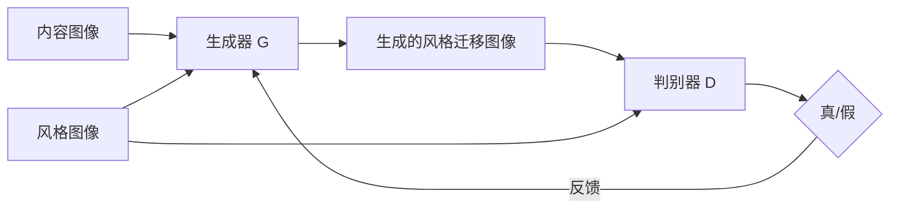

# 基于生成对抗网络的影视特效风格迁移自动化系统

## 1.背景介绍

### 1.1 影视特效的发展历程

影视特效技术经历了从最初的实景拍摄、模型搭建,到后来的计算机图形学(Computer Graphics, CG)技术,再到如今人工智能技术的发展历程。随着计算机技术的不断进步,特效制作从业者们可以利用数字化工具和算法实现越来越逼真、震撼的视觉效果。

### 1.2 人工智能在影视特效中的应用

近年来,人工智能技术在影视特效领域得到了广泛应用,极大地提升了特效制作的效率和质量。主要应用包括:

- 自动抠像:通过深度学习算法实现前景主体和背景的自动分离。
- 动作捕捉:利用机器学习算法从真人演员的动作数据中学习,生成数字角色的动画。  
- 面部表情捕捉与合成:利用人工智能算法捕捉演员面部表情细节,并将其映射到数字角色上。
- 场景理解与重建:通过深度学习对影视场景进行语义分割、三维重建。

### 1.3 风格迁移技术概述

风格迁移(Style Transfer)是一种利用机器学习算法,将一张图像的艺术风格迁移到另一张图像内容中,生成具有艺术风格的新图像的技术。近年来,风格迁移在影视特效、游戏、虚拟现实等领域得到了广泛应用。本文将重点探讨如何利用生成对抗网络实现影视特效中的风格迁移自动化。

## 2.核心概念与联系

### 2.1 卷积神经网络(CNN)

卷积神经网络是一种广泛应用于计算机视觉领域的深度学习模型。它通过卷积、池化等操作提取图像的多尺度特征,可以有效地完成图像分类、检测、分割等任务。CNN 是风格迁移模型的重要组成部分。

### 2.2 生成对抗网络(GAN)  

生成对抗网络由生成器(Generator)和判别器(Discriminator)两个子网络组成。生成器负责生成逼真的假样本,判别器负责判断输入是真实样本还是生成的假样本。两个网络在训练过程中互相博弈,最终使生成器能生成以假乱真的样本。GAN 是实现风格迁移的核心框架。

### 2.3 风格迁移损失函数

为了使生成的图像兼顾内容图像的语义信息和风格图像的艺术特征,风格迁移模型需要精心设计损失函数,主要包括:

- 内容损失(Content Loss):度量生成图像与内容图像在 CNN 特征空间的差异。
- 风格损失(Style Loss):度量生成图像与风格图像在 CNN 特征统计量(如 Gram 矩阵)上的差异。
- 全变分正则化损失(Total Variation Loss):鼓励生成图像的空间平滑性,减少噪点和artifacts。

通过优化这些损失函数,模型可生成兼顾内容和风格的高质量风格迁移图像。

### 2.4 风格迁移模型架构

下图展示了基于 GAN 的影视特效风格迁移自动化系统的总体架构:



生成器接收内容图像和风格图像作为输入,生成风格迁移后的图像。判别器接收风格图像和生成图像,判断生成图像是否在风格上与风格图像一致。生成器和判别器通过对抗训练不断优化,最终使生成器能生成高质量的风格迁移图像。

## 3.核心算法原理具体操作步骤

风格迁移的核心算法可分为如下几个步骤:

### 3.1 数据准备

1. 收集大量影视内容图像和对应风格图像(如油画、水彩画等)作为训练数据集。  
2. 对图像进行预处理,如缩放到固定尺寸、归一化像素值到 [0,1] 范围。
3. 将数据集划分为训练集和测试集。

### 3.2 模型构建 

1. 构建生成器 G 和判别器 D 网络。通常使用 CNN 作为骨干网络。
2. 生成器结构可采用 U-Net、ResNet 等,判别器可采用 PatchGAN。  
3. 定义内容损失、风格损失和全变分正则化损失函数。

### 3.3 模型训练

1. 初始化生成器和判别器的参数。
2. 循环进行如下训练步骤,直到模型收敛:
   - 从训练集中采样一批内容图像和风格图像。
   - 生成器生成风格迁移图像。
   - 判别器对真实风格图像和生成图像进行真假判断。  
   - 计算生成器和判别器的损失函数。
   - 反向传播梯度,更新生成器和判别器的参数。
3. 在测试集上评估模型性能,选择最优模型。

### 3.4 模型推理与应用

1. 使用训练好的生成器对新的内容图像进行风格迁移。
2. 将风格迁移后的图像帧合成视频,用于影视特效制作。
3. 提供交互式工具,允许用户上传内容图像和风格图像,一键生成风格迁移效果。

## 4.数学模型和公式详细讲解举例说明

风格迁移模型的核心是设计合理的损失函数,使生成图像兼顾内容信息和风格特征。下面详细讲解几个关键的数学模型和公式。

### 4.1 内容损失

内容损失度量生成图像 $\hat{y}$ 和内容图像 $y_c$ 在 CNN 特征空间的差异。设 $F_l(y)$ 表示图像 $y$ 在 CNN 第 $l$ 层的特征图,则内容损失定义为:

$$L_{content}(\hat{y},y_c) = \frac{1}{C_lH_lW_l}\sum_{i,j}(F_l(\hat{y})-F_l(y_c))^2$$

其中 $C_l,H_l,W_l$ 分别为特征图的通道数、高度和宽度。通过最小化内容损失,可使生成图像与内容图像在 CNN 特征空间接近,保留内容图像的语义信息。

### 4.2 风格损失

风格损失度量生成图像 $\hat{y}$ 和风格图像 $y_s$ 的 CNN 特征统计量之间的差异。设 $G_l(y)$ 为图像 $y$ 在 CNN 第 $l$ 层特征图的 Gram 矩阵:

$$G_l(y)_{ij} = \frac{1}{C_lH_lW_l}\sum_k F_l(y)_{ik}F_l(y)_{jk}$$

其中 $G_l(y)_{ij}$ 表示第 $i$ 个特征图和第 $j$ 个特征图之间的相关性。风格损失定义为生成图像和风格图像在多个 CNN 层 Gram 矩阵的均方差:

$$L_{style}(\hat{y},y_s) = \sum_{l=0}^L w_l\frac{1}{C_l^2}\sum_{i,j}(G_l(\hat{y})-G_l(y_s))^2$$

其中 $w_l$ 为第 $l$ 层的权重。最小化风格损失可使生成图像与风格图像在 CNN 特征的统计量上接近,从而呈现出相似的风格特征。

### 4.3 全变分正则化损失

为了鼓励生成图像的空间平滑性,减少噪点和artifacts,引入全变分正则化损失:

$$L_{tv}(\hat{y}) = \sum_{i,j}((\hat{y}_{i+1,j}-\hat{y}_{i,j})^2+(\hat{y}_{i,j+1}-\hat{y}_{i,j})^2)$$

其最小化生成图像相邻像素之间的差异,使生成图像更加平滑自然。

### 4.4 总损失函数

风格迁移模型的总损失函数为内容损失、风格损失和全变分正则化损失的加权和:

$$L_{total} = \lambda_cL_{content} + \lambda_sL_{style} + \lambda_{tv}L_{tv}$$

其中 $\lambda_c,\lambda_s,\lambda_{tv}$ 为权重系数,控制各损失项的重要程度。通过优化总损失函数,模型可生成兼顾内容、风格、平滑性的高质量风格迁移图像。

## 5.项目实践：代码实例和详细解释说明

下面以 PyTorch 深度学习框架为例,给出风格迁移模型的关键代码实现和解释说明。

### 5.1 模型定义

```python
class Generator(nn.Module):
    def __init__(self):
        super(Generator, self).__init__()
        # 定义生成器网络结构,如 U-Net、ResNet 等
        ...
    
    def forward(self, x):
        # 前向传播函数,生成风格迁移图像
        ...
        return out

class Discriminator(nn.Module): 
    def __init__(self):
        super(Discriminator, self).__init__()
        # 定义判别器网络结构,如 PatchGAN
        ...
    
    def forward(self, x):  
        # 前向传播函数,判断输入图像的真假
        ...
        return out
```

首先定义生成器和判别器的网络结构。生成器负责将内容图像和风格图像映射为风格迁移图像,判别器负责判断输入图像是真实风格图像还是生成图像。

### 5.2 损失函数实现

```python
def content_loss(gen_feat, content_feat):
    # 内容损失,度量生成图像和内容图像在 CNN 特征空间的差异
    return F.mse_loss(gen_feat, content_feat)

def style_loss(gen_feat, style_feat):
    # 风格损失,度量生成图像和风格图像的 Gram 矩阵差异
    gen_gram = gram_matrix(gen_feat)
    style_gram = gram_matrix(style_feat)
    return F.mse_loss(gen_gram, style_gram)

def gram_matrix(feat):
    # 计算特征图的 Gram 矩阵
    b, c, h, w = feat.size()
    feat = feat.view(b, c, h*w) 
    gram = torch.bmm(feat, feat.transpose(1,2))
    return gram / (c*h*w)

def total_variation_loss(img):
    # 全变分正则化损失,鼓励生成图像的空间平滑性
    h, w = img.size()[-2:]
    tv_h = torch.pow(img[:,:,1:,:]-img[:,:,:-1,:], 2).sum()
    tv_w = torch.pow(img[:,:,:,1:]-img[:,:,:,:-1], 2).sum()
    return (tv_h + tv_w) / (h*w)  
```

根据前面的数学公式,分别实现内容损失、风格损失和全变分正则化损失函数。其中内容损失和风格损失基于预训练的 VGG 网络提取的 CNN 特征,通过最小化生成图像和目标图像的特征差异来优化生成图像的内容和风格。

### 5.3 模型训练

```python
def train(generator, discriminator, dataloader, num_epochs):
    g_optimizer = optim.Adam(generator.parameters(), lr=1e-4)
    d_optimizer = optim.Adam(discriminator.parameters(), lr=1e-4) 
    
    for epoch in range(num_epochs):
        for content_img, style_img in dataloader:
            # 生成风格迁移图像
            gen_img = generator(content_img)
            
            # 计算内容损失
            gen_content_feat = vgg(gen_img)
            content_feat = vgg(content_img)
            content_loss = content_loss(gen_content_feat, content_feat)
            
            # 计算风格损失  
            gen_style_feat = vgg(gen_img)
            style_feat = vgg(style_img)
            style_loss = style_loss(gen_style_feat, style_feat)
              
            # 计算全变分正则化损失
            tv_loss = total_variation_loss(gen_img)
            
            # 判别器损失
            real_out = discriminator(style_img)
            fake_out = discriminator(gen_img)
            d_loss = 0.5 * (F.binary_cross_entropy(real_out, torch.ones_like(real_out)) + 
                            F.binary_cross_entropy(fake_out, torch.zeros_like(fake_out)))
            
            # 生成器损失
            g_loss = content_loss + style_