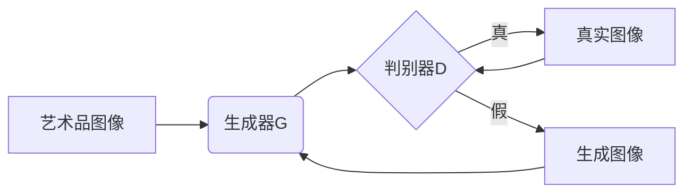

# 基于生成对抗网络的艺术品仿真与风格迁移技术

## 1. 背景介绍
### 1.1 艺术品仿真与风格迁移的意义
#### 1.1.1 保护珍贵艺术品
#### 1.1.2 推动艺术创新
#### 1.1.3 拓展艺术应用场景
### 1.2 生成对抗网络(GAN)的崛起  
#### 1.2.1 GAN的诞生与发展
#### 1.2.2 GAN在计算机视觉领域的应用
#### 1.2.3 GAN在艺术领域的潜力

## 2. 核心概念与联系
### 2.1 生成对抗网络(GAN) 
#### 2.1.1 生成器(Generator)
#### 2.1.2 判别器(Discriminator)  
#### 2.1.3 对抗训练(Adversarial Training)
### 2.2 艺术品仿真
#### 2.2.1 艺术品数字化
#### 2.2.2 艺术品特征提取
#### 2.2.3 艺术品生成与重构
### 2.3 风格迁移  
#### 2.3.1 内容图像与风格图像
#### 2.3.2 特征表示学习
#### 2.3.3 风格融合与转换

## 3. 核心算法原理与具体操作步骤
### 3.1 基于GAN的艺术品仿真算法
#### 3.1.1 数据准备与预处理
#### 3.1.2 生成器网络设计  
#### 3.1.3 判别器网络设计
#### 3.1.4 损失函数与优化策略
#### 3.1.5 训练过程与结果评估
### 3.2 基于GAN的风格迁移算法  
#### 3.2.1 VGGNet特征提取
#### 3.2.2 AdaIN自适应实例归一化
#### 3.2.3 损失函数设计
#### 3.2.4 多尺度融合策略  
#### 3.2.5 训练细节与效果展示

## 4. 数学模型和公式详细讲解举例说明
### 4.1 GAN的数学模型
#### 4.1.1 博弈论视角下的minimax游戏
$$\min_{G} \max_{D} V(D,G) = \mathbb{E}_{x \sim p_{data}(x)}[\log D(x)] + \mathbb{E}_{z \sim p_{z}(z)}[\log (1 - D(G(z)))]$$
#### 4.1.2 生成器与判别器的优化目标  
- 生成器G的优化目标：
$$\min_{G} \mathbb{E}_{z \sim p_{z}(z)}[\log (1 - D(G(z)))]$$
- 判别器D的优化目标：  
$$\max_{D} \mathbb{E}_{x \sim p_{data}(x)}[\log D(x)] + \mathbb{E}_{z \sim p_{z}(z)}[\log (1 - D(G(z)))]$$

### 4.2 风格迁移的数学模型
#### 4.2.1 内容损失与风格损失
- 内容损失：
$$\mathcal{L}_{content}(p,x,l) = \frac{1}{N_l}\sum_{i,j}(F^l_{ij}(p) - F^l_{ij}(x))^2$$
- 风格损失：
$$\mathcal{L}_{style}(a,x) = \sum_{l=0}^L w_l \frac{1}{M_l}\sum_{i,j}(G^l_{ij}(a) - G^l_{ij}(x))^2$$
#### 4.2.2 自适应实例归一化AdaIN
$$AdaIN(x,y) = \sigma(y)(\frac{x-\mu(x)}{\sigma(x)}) + \mu(y)$$

## 5. 项目实践：代码实例和详细解释说明
### 5.1 基于GAN的艺术品仿真项目
#### 5.1.1 环境配置与数据准备
#### 5.1.2 生成器与判别器网络实现
#### 5.1.3 训练流程与可视化 
#### 5.1.4 模型评估与超参数调优
### 5.2 基于GAN的风格迁移项目
#### 5.2.1 VGGNet特征提取器的实现
#### 5.2.2 AdaIN归一化层的实现 
#### 5.2.3 风格融合网络的搭建
#### 5.2.4 损失函数设计与训练技巧
#### 5.2.5 不同风格的迁移效果展示

## 6. 实际应用场景 
### 6.1 数字博物馆中的艺术品展示
### 6.2 艺术创作辅助工具
### 6.3 游戏与电影中的场景设计
### 6.4 时尚设计中的图案生成
### 6.5 广告创意中的视觉效果增强

## 7. 工具和资源推荐
### 7.1 开源代码库
- CycleGAN: https://github.com/junyanz/CycleGAN  
- AdaIN: https://github.com/xunhuang1995/AdaIN-style
- StyleGAN: https://github.com/NVlabs/stylegan
### 7.2 数据集
- WikiArt: https://www.wikiart.org/
- Met Museum Open Access: https://github.com/metmuseum/openaccess 
- Painter by Numbers: https://www.kaggle.com/c/painter-by-numbers
### 7.3 教程与课程
- Coursera GAN Specialization: https://www.coursera.org/specializations/generative-adversarial-networks-gans
- CS231n Convolutional Neural Networks for Visual Recognition: http://cs231n.stanford.edu/

## 8. 总结：未来发展趋势与挑战
### 8.1 艺术品仿真与风格迁移技术的发展趋势 
#### 8.1.1 更高分辨率与细节质量
#### 8.1.2 更强的交互性与可控性
#### 8.1.3 更广泛的跨领域应用
### 8.2 面临的挑战
#### 8.2.1 艺术创作中的版权问题
#### 8.2.2 生成模型的可解释性不足
#### 8.2.3 计算资源与训练成本高昂

## 9. 附录：常见问题与解答  
### 9.1 GAN训练中的模式崩溃问题如何解决？
### 9.2 如何平衡内容保持与风格迁移的比重？
### 9.3 艺术风格迁移是否有损原作者的创作权益？
### 9.4 面对高分辨率艺术图像,GAN的生成质量如何提升？
### 9.5 是否可以实现艺术家风格的无监督学习？

生成对抗网络GAN由生成器G和判别器D组成，通过对抗训练不断提升生成图像的质量，最终实现艺术品的仿真与风格迁移。生成器G将随机噪声z映射到生成图像，努力欺骗判别器D；判别器D则试图区分真实图像与生成图像。双方博弈的过程推动着生成图像不断逼近真实艺术品的视觉效果。

在艺术品仿真与风格迁移的任务中，GAN展现了巨大的创造力和想象力。通过海量艺术作品的学习，GAN能够理解并模仿不同艺术流派的创作风格，再现大师级别的笔触、色彩和构图。同时，GAN也能实现不同风格间的灵活迁移与融合，激发出新颖独特的艺术表现形式。

GAN所生成的逼真艺术品不仅在视觉上以假乱真，更能引发人们对艺术本质、创意来源、机器创造力等问题的深度思考。技术的发展正在推动艺术创作的革新，模糊现实与虚拟的边界。艺术与科技的融合,必将开创更加瑰丽的未来图景。

作者：禅与计算机程序设计艺术 / Zen and the Art of Computer Programming