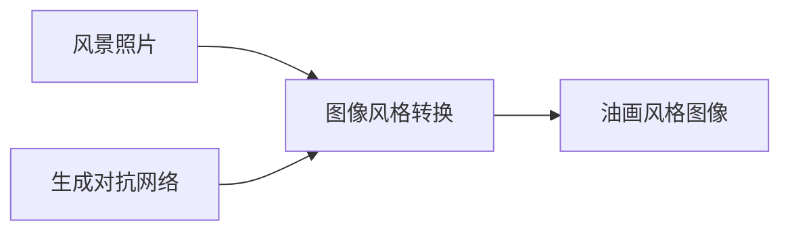

# 基于生成对抗网络的风景照片转换为油画风格的研究

## 1. 背景介绍
### 1.1 图像风格转换的意义
在数字媒体时代,图像处理技术日新月异。其中,图像风格转换是一个充满创造力和想象力的领域。通过将一幅图像转换为另一种艺术风格,我们可以创造出独特而有趣的视觉效果。这不仅为艺术创作提供了新的可能性,也为计算机视觉和深度学习等领域带来了新的研究方向。

### 1.2 生成对抗网络的兴起
近年来,生成对抗网络(Generative Adversarial Networks, GANs)在图像生成和风格转换领域取得了令人瞩目的成果。GANs 由生成器和判别器两部分组成,通过两个网络的对抗学习,可以生成逼真的图像。GANs 强大的生成能力为图像风格转换提供了新的思路和方法。

### 1.3 将风景照片转换为油画风格的应用前景
风景照片是人们喜爱的一种摄影题材,然而普通的风景照片有时缺乏艺术感。将风景照片转换为油画风格,可以赋予其独特的艺术魅力,使其更加吸引人。这种技术不仅可以应用于个人照片的艺术化处理,也可以在电影、游戏、广告等领域得到广泛应用,为视觉艺术创作提供更多可能性。

## 2. 核心概念与联系
### 2.1 风景照片
- 定义:以自然景观为主要拍摄对象的照片
- 特点:真实记录自然景观,构图多样,色彩丰富

### 2.2 油画风格  
- 定义:一种绘画艺术形式,通过油彩在画布上的涂抹、晕染等技法来表现画面
- 特点:色彩厚重饱和,笔触粗犷有力,构图简洁有张力

### 2.3 图像风格转换
- 定义:将一幅图像转换成另一幅图像的风格,同时保留原图像的内容
- 方法:传统方法包括纹理合成、色彩映射等;深度学习方法主要基于卷积神经网络

### 2.4 生成对抗网络 
- 定义:一种由生成器和判别器组成的深度学习模型,通过两个网络的对抗学习来生成逼真的数据
- 原理:生成器尝试生成逼真的数据,判别器尝试判断数据的真假,两个网络互相博弈,最终生成高质量的数据

### 2.5 风景照片到油画风格的转换
- 目标:将风景照片转换为油画风格,赋予其艺术感
- 难点:油画风格的多样性,风景照片的复杂性,保留照片内容的同时转换风格
- 思路:利用 GANs 的生成能力和风格转换能力,设计合适的网络结构和损失函数,实现高质量的风格转换



## 3. 核心算法原理和具体操作步骤
### 3.1 CycleGAN 原理
CycleGAN 是一种用于图像风格转换的生成对抗网络。它由两个生成器 G 和 F,以及两个判别器 D_X 和 D_Y 组成。生成器 G 将图像 X 转换为 Y 风格,生成器 F 将图像 Y 转换为 X 风格。判别器 D_X 和 D_Y 分别判断生成图像的真假。

CycleGAN 的关键是引入了循环一致性损失(Cycle Consistency Loss),即:

$$
L_{cyc}(G,F) = \mathbb{E}_{x~p_{data}(x)}[||F(G(x))-x||_1] + \mathbb{E}_{y~p_{data}(y)}[||G(F(y))-y||_1]
$$

该损失函数确保了 $F(G(x)) \approx x$ 和 $G(F(y)) \approx y$,从而保证了风格转换的可逆性。

### 3.2 CycleGAN 的训练步骤
1. 准备风景照片数据集 X 和油画风格图像数据集 Y
2. 初始化生成器 G 和 F,判别器 D_X 和 D_Y
3. 对于每个训练迭代:
   - 从数据集 X 中采样一批风景照片 x,从数据集 Y 中采样一批油画图像 y
   - 生成器 G 将 x 转换为油画风格得到 G(x),生成器 F 将 y 转换为照片风格得到 F(y) 
   - 判别器 D_Y 判断 G(x) 和 y 的真假,更新 D_Y 的参数
   - 判别器 D_X 判断 F(y) 和 x 的真假,更新 D_X 的参数
   - 计算生成器的对抗损失、循环一致性损失和恒等损失,更新 G 和 F 的参数
4. 重复步骤 3,直到模型收敛或达到预设的迭代次数

### 3.3 风景照片到油画风格转换的具体操作
1. 收集高质量的风景照片和油画图像,构建数据集 
2. 设计 CycleGAN 的生成器和判别器网络结构,可以借鉴已有的优秀模型如 ResNet
3. 选择合适的超参数,如学习率、批量大小、迭代次数等
4. 按照 CycleGAN 的训练步骤训练模型,监控损失函数的变化和生成图像的质量
5. 用训练好的模型对新的风景照片进行风格转换,生成油画风格的图像
6. 评估生成图像的质量,可以通过人工评判或定量指标如 IS、FID 等
7. 不断调整模型和超参数,直到获得满意的风格转换效果

## 4. 数学模型和公式详细讲解举例说明
CycleGAN 的数学模型主要由三部分组成:对抗损失、循环一致性损失和恒等损失。

### 4.1 对抗损失
对抗损失衡量了生成器生成的图像与真实图像的相似度。对于生成器 G 和判别器 D_Y,对抗损失为:

$$
L_{GAN}(G, D_Y, X, Y) = \mathbb{E}_{y~p_{data}(y)}[\log D_Y(y)] + \mathbb{E}_{x~p_{data}(x)}[\log(1-D_Y(G(x)))]
$$

其中 $x$ 为风景照片, $y$ 为油画图像。生成器 G 尝试最小化此损失,而判别器 D_Y 尝试最大化此损失。

类似地,对于生成器 F 和判别器 D_X,对抗损失为:

$$
L_{GAN}(F, D_X, Y, X) = \mathbb{E}_{x~p_{data}(x)}[\log D_X(x)] + \mathbb{E}_{y~p_{data}(y)}[\log(1-D_X(F(y)))]
$$

### 4.2 循环一致性损失
循环一致性损失确保了风格转换的可逆性,即 $F(G(x)) \approx x$ 和 $G(F(y)) \approx y$。数学表达式为:

$$
L_{cyc}(G,F) = \mathbb{E}_{x~p_{data}(x)}[||F(G(x))-x||_1] + \mathbb{E}_{y~p_{data}(y)}[||G(F(y))-y||_1]
$$

其中 $||\cdot||_1$ 表示 L1 范数,用于衡量两个图像之间的差异。

### 4.3 恒等损失
恒等损失鼓励生成器在转换风格的同时保留图像的内容。对于生成器 G 和 F,恒等损失为:

$$
L_{idt}(G,F)=\mathbb{E}_{x~p_{data}(x)}[||F(x)-x||_1]+\mathbb{E}_{y~p_{data}(y)}[||G(y)-y||_1]
$$

### 4.4 完整的目标函数
结合以上三个损失函数,CycleGAN 的完整目标函数为:

$$
L(G,F,D_X,D_Y) = L_{GAN}(G,D_Y,X,Y) + L_{GAN}(F,D_X,Y,X) + \lambda L_{cyc}(G,F) + \mu L_{idt}(G,F)
$$

其中 $\lambda$ 和 $\mu$ 为平衡不同损失的超参数。

**举例说明:**
假设我们有一幅风景照片 x,通过生成器 G 转换为油画风格得到 G(x)。然后,我们将 G(x) 输入生成器 F 进行反向转换,得到 F(G(x))。循环一致性损失就是要最小化 F(G(x)) 和原始照片 x 之间的差异。这样可以确保风格转换的可逆性,即转换后的图像 G(x) 包含了原始照片 x 的主要内容信息。

同时,我们希望生成的油画图像 G(x) 能够尽可能地接近真实的油画 y。对抗损失就是用来衡量 G(x) 与 y 之间的相似度,并鼓励生成器 G 生成更逼真的油画图像。

最后,恒等损失则鼓励生成器在转换风格时尽可能保留原始图像的内容不变,即 F(x) 应该与 x 接近,G(y) 应该与 y 接近。

通过优化这三个损失函数,CycleGAN 可以在保留图像内容的同时,实现风景照片到油画风格的逼真转换。

## 5. 项目实践:代码实例和详细解释说明
下面是一个基于 PyTorch 实现 CycleGAN 进行风景照片到油画风格转换的代码示例:

```python
import torch
import torch.nn as nn
import torch.optim as optim
from torch.utils.data import DataLoader
from torchvision import transforms
from dataset import ImageDataset
from models import Generator, Discriminator

# 超参数设置
lr = 0.0002
batch_size = 1
num_epochs = 200
lambda_cyc = 10
lambda_idt = 5

# 数据预处理
transform = transforms.Compose([
    transforms.Resize((256, 256)),
    transforms.ToTensor(),
    transforms.Normalize(mean=(0.5, 0.5, 0.5), std=(0.5, 0.5, 0.5))
])

# 加载数据集
train_dataset = ImageDataset("path/to/dataset", transform)
train_loader = DataLoader(train_dataset, batch_size=batch_size, shuffle=True)

# 定义生成器和判别器
G_XtoY = Generator()
G_YtoX = Generator()
D_X = Discriminator()
D_Y = Discriminator()

# 定义优化器
optimizer_G = optim.Adam(list(G_XtoY.parameters()) + list(G_YtoX.parameters()), lr=lr, betas=(0.5, 0.999))
optimizer_D_X = optim.Adam(D_X.parameters(), lr=lr, betas=(0.5, 0.999))
optimizer_D_Y = optim.Adam(D_Y.parameters(), lr=lr, betas=(0.5, 0.999))

# 定义损失函数
criterion_GAN = nn.MSELoss()
criterion_cycle = nn.L1Loss()
criterion_identity = nn.L1Loss()

# 训练循环
for epoch in range(num_epochs):
    for i, (real_X, real_Y) in enumerate(train_loader):
        
        # 训练生成器
        optimizer_G.zero_grad()
        
        # 恒等损失
        loss_idt_X = criterion_identity(G_YtoX(real_X), real_X)
        loss_idt_Y = criterion_identity(G_XtoY(real_Y), real_Y)
        loss_idt = (loss_idt_X + loss_idt_Y) / 2
        
        # GAN损失
        fake_Y = G_XtoY(real_X)
        pred_fake = D_Y(fake_Y)
        loss_GAN_XtoY = criterion_GAN(pred_fake, torch.ones_like(pred_fake))
        
        fake_X = G_YtoX(real_Y)
        pred_fake = D_X(fake_X)
        loss_GAN_YtoX = criterion_GAN(pred_fake, torch.ones_like(pred_fake))
        
        loss_GAN = (loss_GAN_XtoY + loss_GAN_YtoX) / 2
        
        # 循环一致性损失
        recov_X = G_YtoX(fake_Y)
        loss_cycle_X = criterion_cycle(recov_X, real_X)
        recov_Y = G_XtoY(fake_X)
        loss_cycle_Y = criterion_cycle(recov_Y, real_Y)
        
        loss_cycle = (loss_cycle