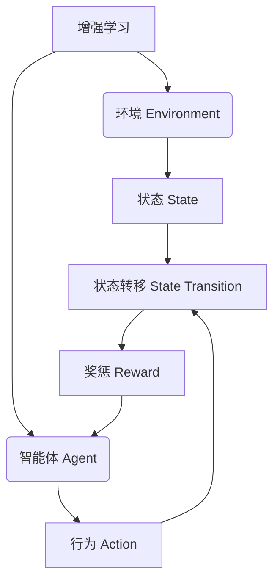

# 增强学习 原理与代码实例讲解

## 1. 背景介绍

### 1.1 什么是增强学习?

增强学习(Reinforcement Learning, RL)是机器学习的一个重要分支,旨在让智能体(Agent)通过与环境(Environment)的交互来学习如何做出最优决策。与监督学习和无监督学习不同,增强学习没有给定的输入输出示例数据集,而是通过试错和奖惩机制来学习。

增强学习的核心思想是让智能体通过与环境交互,根据当前状态选择行为,获得相应的奖励或惩罚,从而逐步优化决策策略。这种学习方式类似于人类或动物的学习过程,通过不断尝试和调整,最终找到最佳行为模式。

### 1.2 增强学习的应用场景

增强学习在诸多领域有广泛的应用前景,例如:

- 机器人控制与导航
- 游戏AI(AlphaGo、Dota等)
- 自动驾驶
- 资源管理与优化
- 投资组合优化
- 对话系统
- 网络路由
- ...

## 2. 核心概念与联系

增强学习主要涉及以下几个核心概念:

### 2.1 环境(Environment)

环境是指智能体所处的外部世界,包含了智能体可以感知和影响的所有对象。环境会根据智能体的行为转移到新的状态,并给出相应的奖惩反馈。

### 2.2 智能体(Agent)

智能体是指能够感知环境状态,并根据某种策略选择行为的决策实体。智能体的目标是通过与环境交互,学习到一种最优策略,从而maximized获得的累积奖励。

### 2.3 状态(State)

状态是指环境在某个特定时刻的具体情况,包含了智能体可以感知的所有信息。状态通常用一个向量或者其他数据结构来表示。

### 2.4 行为(Action)

行为是指智能体在当前状态下可以采取的动作或决策。智能体根据某种策略从可选行为集合中选择一个行为执行。

### 2.5 奖惩(Reward)

奖惩是环境对智能体当前行为的反馈,用一个标量值表示。奖励值越高,表明该行为越好;反之,则表明该行为越差。奖惩是智能体学习的驱动力。

### 2.6 策略(Policy)

策略是指智能体在每个状态下选择行为的规则或函数映射。策略可以是确定性的,也可以是随机的。增强学习的目标就是学习到一个最优策略。

### 2.7 价值函数(Value Function)

价值函数用于评估一个状态的好坏,或者一个状态-行为对的价值。它表示从该状态(或状态-行为对)开始,按照某种策略执行,能获得的预期累积奖励。

### 2.8 Q函数(Q-Function)

Q函数是价值函数的一种,用于评估在某个状态下采取某个行为的价值。它表示从该状态-行为对开始,按照某种策略执行,能获得的预期累积奖励。

## 3. 核心算法原理具体操作步骤

增强学习的核心算法主要有以下几种:

### 3.1 动态规划(Dynamic Programming)

动态规划算法适用于完全可观测、确定性的环境。它通过价值迭代或策略迭代的方式,从已知的环境模型出发,求解最优价值函数或最优策略。

算法步骤:

1. 初始化价值函数或策略
2. 对每个状态-行为对,计算其价值或新策略
3. 更新价值函数或策略
4. 重复2-3步,直至收敛

动态规划的优点是能够精确求解,但缺点是需要完整的环境模型,并且在状态空间很大时计算代价高昂。

### 3.2 蒙特卡罗方法(Monte Carlo Methods)

蒙特卡罗方法不需要环境模型,而是通过采样模拟实际体验,从而估计价值函数或直接学习策略。

算法步骤:

1. 生成一个完整的episode
2. 对episode中的每个状态-行为对,计算其实际回报
3. 根据实际回报更新价值函数或策略
4. 重复1-3步,直至收敛

蒙特卡罗方法的优点是无需环境模型,能处理任意环境;缺点是收敛较慢,需要大量样本。

### 3.3 时序差分学习(Temporal Difference Learning)

时序差分学习结合了动态规划和蒙特卡罗方法的优点,能够基于环境交互的在线样本进行增量式学习,无需等待episode结束。

算法步骤:

1. 初始化价值函数或策略
2. 与环境交互,获取状态、行为、奖励、下一状态
3. 计算时序差分误差
4. 根据误差更新价值函数或策略
5. 重复2-4步,直至收敛

时序差分学习的优点是数据高效利用、低方差、收敛快;缺点是需要仔细设计探索策略,并且存在偏差。

### 3.4 Q-Learning

Q-Learning是时序差分学习的一种特殊情况,它直接学习Q函数,而不是价值函数。Q-Learning能够在无需环境模型的情况下,通过在线交互找到最优策略。

算法步骤:

1. 初始化Q函数
2. 与环境交互,获取状态、行为、奖励、下一状态
3. 根据下一状态的最大Q值,计算当前Q值的目标值
4. 根据目标值和实际Q值的差异,更新Q函数
5. 重复2-4步,直至收敛

Q-Learning的优点是简单、高效、收敛性好;缺点是需要探索所有状态-行为对,在大状态空间下效率低下。

### 3.5 策略梯度(Policy Gradient)

策略梯度方法直接对策略函数进行参数化建模和优化,通过梯度上升的方式最大化期望回报。

算法步骤:

1. 参数化表示策略函数
2. 生成一个episode
3. 计算该episode的累积回报
4. 根据累积回报和策略梯度,更新策略参数
5. 重复2-4步,直至收敛

策略梯度的优点是能够直接优化策略,无需计算价值函数;缺点是收敛慢、高方差,需要仔细设计基线函数。

### 3.6 Actor-Critic

Actor-Critic方法将价值函数估计(Critic)和策略优化(Actor)相结合,克服了价值迭代和策略梯度各自的缺陷。

算法步骤:

1. 初始化Actor(策略函数)和Critic(价值函数)
2. 与环境交互,获取状态、行为、奖励、下一状态
3. 根据时序差分误差,更新Critic
4. 根据Critic评估的优势函数,更新Actor
5. 重复2-4步,直至收敛

Actor-Critic方法结合了价值迭代和策略梯度的优点,能够高效学习,并且具有较低的方差。

### 3.7 深度增强学习(Deep Reinforcement Learning)

上述传统增强学习算法通常使用手工设计的特征表示,难以应对高维复杂的状态空间。深度增强学习将深度神经网络引入增强学习,用于自动提取状态特征和近似价值函数或策略函数,从而能够处理原始高维数据。

常见的深度增强学习算法包括:

- 深度Q网络(Deep Q-Network, DQN)
- 策略梯度与深度神经网络结合
- 深度确定性策略梯度(Deep Deterministic Policy Gradient, DDPG)
- 深度Q网络与策略梯度结合(Deep Q-Network + Policy Gradient)
- ...

深度增强学习的优点是能够处理复杂问题,提高泛化能力;缺点是训练不稳定、样本效率低、需要大量计算资源。

## 4. 数学模型和公式详细讲解举例说明

### 4.1 马尔可夫决策过程(Markov Decision Process)

马尔可夫决策过程(Markov Decision Process, MDP)是增强学习问题的数学模型,具有以下几个要素:

- 状态集合 $\mathcal{S}$
- 行为集合 $\mathcal{A}$
- 转移概率 $\mathcal{P}_{ss'}^a = \Pr(S_{t+1}=s'|S_t=s, A_t=a)$
- 奖励函数 $\mathcal{R}_s^a = \mathbb{E}[R_{t+1}|S_t=s, A_t=a]$
- 折扣因子 $\gamma \in [0, 1)$

在MDP中,智能体的目标是找到一个策略 $\pi: \mathcal{S} \rightarrow \mathcal{A}$,使得从任意初始状态 $s_0$ 开始执行,能够最大化预期的累积折扣奖励:

$$J(\pi) = \mathbb{E}_\pi\left[\sum_{t=0}^\infty \gamma^t R_{t+1}\right]$$

### 4.2 价值函数(Value Function)

价值函数用于评估一个状态的好坏,或者一个状态-行为对的价值。状态价值函数定义为:

$$V^\pi(s) = \mathbb{E}_\pi\left[\sum_{k=0}^\infty \gamma^k R_{t+k+1} | S_t=s\right]$$

它表示在状态 $s$ 下,按照策略 $\pi$ 执行,能获得的预期累积奖励。

行为价值函数(也称为Q函数)定义为:

$$Q^\pi(s, a) = \mathbb{E}_\pi\left[\sum_{k=0}^\infty \gamma^k R_{t+k+1} | S_t=s, A_t=a\right]$$

它表示在状态 $s$ 下采取行为 $a$,之后按照策略 $\pi$ 执行,能获得的预期累积奖励。

价值函数和Q函数满足以下递推关系(Bellman方程):

$$\begin{aligned}
V^\pi(s) &= \sum_a \pi(a|s) \left(\mathcal{R}_s^a + \gamma \sum_{s'} \mathcal{P}_{ss'}^a V^\pi(s')\right) \\
Q^\pi(s, a) &= \mathcal{R}_s^a + \gamma \sum_{s'} \mathcal{P}_{ss'}^a \sum_{a'} \pi(a'|s') Q^\pi(s', a')
\end{aligned}$$

### 4.3 最优价值函数和最优策略

最优价值函数 $V^*(s)$ 和最优Q函数 $Q^*(s, a)$ 定义为:

$$\begin{aligned}
V^*(s) &= \max_\pi V^\pi(s) \\
Q^*(s, a) &= \max_\pi Q^\pi(s, a)
\end{aligned}$$

它们分别表示在状态 $s$ 下,或者在状态 $s$ 采取行为 $a$ 后,执行任何策略所能获得的最大预期累积奖励。

最优策略 $\pi^*$ 定义为:

$$\pi^*(s) = \arg\max_a Q^*(s, a)$$

它表示在每个状态 $s$ 下,选择能够最大化 $Q^*(s, a)$ 的行为 $a$。

最优价值函数和最优Q函数也满足Bellman最优性方程:

$$\begin{aligned}
V^*(s) &= \max_a \left(\mathcal{R}_s^a + \gamma \sum_{s'} \mathcal{P}_{ss'}^a V^*(s')\right) \\
Q^*(s, a) &= \mathcal{R}_s^a + \gamma \sum_{s'} \mathcal{P}_{ss'}^a \max_{a'} Q^*(s', a')
\end{aligned}$$

### 4.4 策略梯度定理(Policy Gradient Theorem)

策略梯度定理为直接优化策略函数提供了理论基础。对于任意可微的策略 $\pi_\theta(s, a)$,其期望回报的梯度为:

$$\nabla_\theta J(\theta) = \mathbb{E}_\pi\left[\sum_{t=0}^\infty \nabla_\theta \log \pi_\theta(A_t|S_t) Q^{\pi_\theta}(S_t, A_t)\right]$$

这个公式表明,我们可以通过对 $\log \pi_\theta(A_t