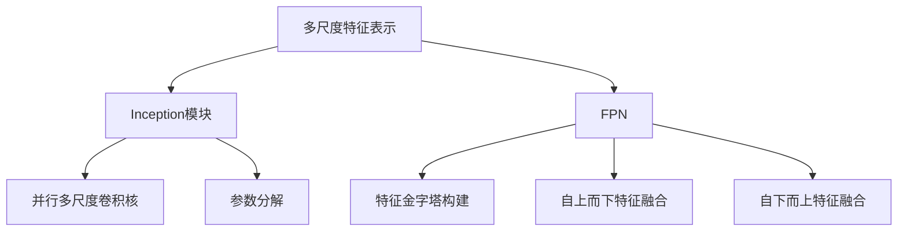

# 多尺度卷积神经网络:Inception和FPN的异同点

## 1.背景介绍

在计算机视觉和图像处理领域,卷积神经网络(Convolutional Neural Networks, CNN)已成为主流的深度学习模型。传统的CNN结构通常由多个卷积层和池化层组成,用于从图像中提取特征。然而,这种标准结构存在一些局限性,例如对不同尺度目标的适应能力较差,以及计算效率和模型大小方面的权衡。为了解决这些问题,研究人员提出了多种改进方法,其中Inception模块和FPN(Feature Pyramid Network)是两种广为人知的多尺度特征提取方法。

### 1.1 Inception模块

Inception模块最初由谷歌的Christian Szegedy等人在2014年提出,用于构建高效的卷积神经网络架构GoogLeNet。Inception模块的核心思想是在同一层内并行应用多个不同尺度的卷积核,从而捕获不同尺度的特征信息。这种设计有助于提高模型的表达能力,同时通过合理的参数分解来控制参数数量,从而提高计算效率。

### 1.2 FPN(Feature Pyramid Network)

FPN是由Facebook AI研究院在2017年提出的一种特征金字塔网络,旨在解决目标检测任务中的多尺度问题。FPN利用自上而下和自下而上的特征融合,构建一个具有多尺度语义特征的金字塔,以便更好地检测和定位不同尺度的目标。与Inception模块侧重于提取多尺度特征不同,FPN更注重特征融合和上下文信息的利用。

## 2.核心概念与联系

### 2.1 多尺度特征表示

多尺度特征表示是Inception模块和FPN的核心思想。在图像识别任务中,不同尺度的目标往往需要不同尺度的特征来表示。例如,识别小物体需要更多的细节信息,而识别大物体则需要更多的上下文信息。传统的CNN结构难以同时捕获多种尺度的特征,因此需要采用特殊的设计来解决这个问题。

Inception模块通过在同一层内并行应用多个不同尺度的卷积核,实现了对多尺度特征的提取。而FPN则通过自上而下和自下而上的特征融合,构建了一个包含多尺度语义特征的金字塔,从而更好地表示不同尺度的目标。

### 2.2 计算效率

在设计深度神经网络时,计算效率是一个重要的考虑因素。Inception模块通过合理的参数分解,大幅减少了参数数量,从而提高了计算效率。具体来说,Inception模块将一个大的卷积核分解为多个小的卷积核,这种分解方式可以显著降低计算量,同时保持相同的感受野大小。

而FPN则通过特征金字塔的设计,避免了重复计算特征图的问题。在传统的多尺度特征提取方法中,通常需要对输入图像进行多次下采样和上采样,从而导致大量的重复计算。FPN通过共享不同尺度的特征图,实现了计算的复用,从而提高了效率。

### 2.3 上下文信息利用

上下文信息对于图像理解和目标检测等任务至关重要。Inception模块主要关注在同一层内提取多尺度特征,但对于利用上下文信息的能力相对有限。而FPN则通过自上而下和自下而上的特征融合,有效地利用了不同层次的上下文信息。

在FPN中,自上而下的路径利用了高层语义特征,为低层特征提供了上下文信息;而自下而上的路径则利用了低层的细节信息,为高层特征提供了位置和细节信息。这种双向特征融合机制,使得FPN能够更好地利用上下文信息,提高了目标检测等任务的性能。



## 3.核心算法原理具体操作步骤

### 3.1 Inception模块

Inception模块的核心思想是在同一层内并行应用多个不同尺度的卷积核,从而捕获不同尺度的特征信息。具体操作步骤如下:

1. **分解卷积核**: 将一个大的卷积核分解为多个小的卷积核,例如将一个7x7的卷积核分解为一个1x7的卷积核和一个7x1的卷积核。这种分解方式可以大幅减少计算量,同时保持相同的感受野大小。

2. **并行多尺度卷积**: 在同一层内并行应用多个不同尺度的卷积核,例如1x1、3x3、5x5等。这些不同尺度的卷积核可以捕获不同尺度的特征信息。

3. **特征映射**: 对每个并行路径的输出特征图进行处理,例如通过1x1卷积核进行特征映射,以减少特征图的通道数,从而控制参数量。

4. **特征拼接**: 将所有并行路径的输出特征图沿着通道维度进行拼接,形成最终的输出特征图。

### 3.2 FPN(Feature Pyramid Network)

FPN的核心思想是构建一个包含多尺度语义特征的金字塔,通过自上而下和自下而上的特征融合来实现多尺度目标检测。具体操作步骤如下:

1. **自下而上特征提取**: 使用标准的卷积神经网络(如ResNet或VGG)从输入图像中提取特征,得到不同尺度的特征图。

2. **构建特征金字塔**: 对于每个特征层,通过上采样和横向连接的方式,构建一个包含多尺度特征的金字塔。具体来说,对于每个特征层,将其上采样并与下一层的特征图进行元素wise相加,从而获得一个新的特征图,该特征图包含了上层的语义信息和下层的细节信息。

3. **自上而下特征融合**: 在构建完特征金字塔后,对于每个特征层,将其与上一层的特征图进行元素wise相加,从而融合自上而下的语义信息。

4. **预测和检测**: 在每个特征层上应用目标检测或分割等任务的预测头,利用融合后的多尺度特征进行预测和检测。

通过上述步骤,FPN可以有效地利用不同层次的特征信息,捕获多尺度目标,提高目标检测等任务的性能。

## 4.数学模型和公式详细讲解举例说明

### 4.1 Inception模块

在Inception模块中,我们需要计算每个并行路径的输出特征图,然后将它们沿着通道维度进行拼接。假设输入特征图的尺寸为$C \times H \times W$,我们定义四个并行路径:

1. 1x1卷积核路径:
   $$
   F_{1 \times 1} = W_{1 \times 1} * X
   $$
   其中$W_{1 \times 1}$是一个$C' \times C \times 1 \times 1$的卷积核,输出特征图的尺寸为$C' \times H \times W$。

2. 3x3卷积核路径:
   $$
   F_{3 \times 3} = W_{3 \times 3} * X
   $$
   其中$W_{3 \times 3}$是一个$C' \times C \times 3 \times 3$的卷积核,输出特征图的尺寸为$C' \times H \times W$。

3. 5x5卷积核路径:
   $$
   F_{5 \times 5} = W_{5 \times 5} * X
   $$
   其中$W_{5 \times 5}$是一个$C' \times C \times 5 \times 5$的卷积核,输出特征图的尺寸为$C' \times H \times W$。

4. 3x3最大池化路径:
   $$
   F_{pool} = \text{max\_pool}(X, 3 \times 3)
   $$
   其中$\text{max\_pool}$表示3x3的最大池化操作,输出特征图的尺寸为$C \times H/3 \times W/3$。为了与其他路径的输出特征图尺寸一致,我们需要对$F_{pool}$进行填充操作。

最终,我们将这四个路径的输出特征图沿着通道维度进行拼接:
$$
F_{out} = \text{concat}(F_{1 \times 1}, F_{3 \times 3}, F_{5 \times 5}, F_{pool})
$$
其中$F_{out}$是最终的输出特征图,尺寸为$(C' + C' + C' + C) \times H \times W$。

### 4.2 FPN(Feature Pyramid Network)

在FPN中,我们需要构建一个包含多尺度特征的金字塔。假设我们有$N$个特征层,记为$\{C_1, C_2, \ldots, C_N\}$,其中$C_1$是最底层的特征图,分辨率最高;$C_N$是最顶层的特征图,分辨率最低。我们定义一个新的特征金字塔$\{P_1, P_2, \ldots, P_N\}$,其中每个$P_i$都是一个融合了多尺度特征的特征图。

构建特征金字塔的过程如下:

1. 自下而上特征提取:
   $$
   P_N = C_N
   $$
   即将最顶层的特征图直接赋值给$P_N$。

2. 构建特征金字塔:
   对于每个$i = N-1, N-2, \ldots, 1$,我们有:
   $$
   P_i = \text{Conv}(C_i + \text{Upsample}(P_{i+1}))
   $$
   其中$\text{Upsample}$表示上采样操作,用于将$P_{i+1}$的分辨率提高到与$C_i$一致;$\text{Conv}$表示一个1x1的卷积操作,用于融合$C_i$和上采样后的$P_{i+1}$。

3. 自上而下特征融合:
   对于每个$i = 2, 3, \ldots, N$,我们有:
   $$
   P_i = P_i + \text{Downsample}(P_{i-1})
   $$
   其中$\text{Downsample}$表示下采样操作,用于将$P_{i-1}$的分辨率降低到与$P_i$一致。这一步骤可以将自上而下的语义信息融合到$P_i$中。

通过上述步骤,我们可以获得一个包含多尺度特征的金字塔$\{P_1, P_2, \ldots, P_N\}$,其中每个$P_i$都融合了自上而下的语义信息和自下而上的细节信息,从而更好地表示不同尺度的目标。

## 5.项目实践:代码实例和详细解释说明

### 5.1 Inception模块实现

以下是使用PyTorch实现Inception模块的示例代码:

```python
import torch
import torch.nn as nn

class InceptionModule(nn.Module):
    def __init__(self, in_channels, out_channels):
        super(InceptionModule, self).__init__()
        
        self.branch1 = nn.Conv2d(in_channels, out_channels, kernel_size=1)
        
        self.branch2 = nn.Sequential(
            nn.Conv2d(in_channels, out_channels, kernel_size=1),
            nn.Conv2d(out_channels, out_channels, kernel_size=3, padding=1)
        )
        
        self.branch3 = nn.Sequential(
            nn.Conv2d(in_channels, out_channels, kernel_size=1),
            nn.Conv2d(out_channels, out_channels, kernel_size=5, padding=2)
        )
        
        self.branch4 = nn.Sequential(
            nn.MaxPool2d(kernel_size=3, stride=1, padding=1),
            nn.Conv2d(in_channels, out_channels, kernel_size=1)
        )
        
    def forward(self, x):
        branch1 = self.branch1(x)
        branch2 = self.branch2(x)
        branch3 = self.branch3(x)
        branch4 = self.branch4(x)
        
        outputs = [branch1, branch2, branch3, branch4]
        return torch.cat(outputs, dim=1)
```

在这个实现中,我们定义了四个并行路径:

1. `branch1`是一个1x1卷积核路径。
2. `branch2`是一个1x1卷积核后接一个3x3卷积核的路径。
3. `branch3`是一个1x1卷积核后接一个5x5