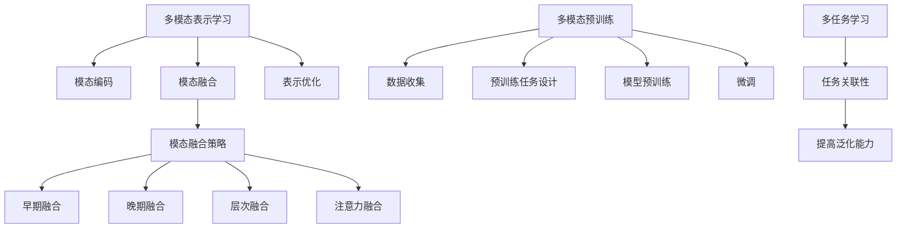

# 多模态大模型：技术原理与实战 中小公司的大模型构建之路

## 1. 背景介绍

### 1.1 人工智能的新时代

近年来,人工智能领域取得了长足的进步,尤其是自然语言处理(NLP)和计算机视觉(CV)等领域的突破性发展。传统的人工智能系统通常专注于单一模态,即只能处理文本、图像或语音等单一形式的数据。然而,现实世界中的数据通常是多模态的,包括文本、图像、视频、语音等多种形式。为了更好地理解和处理这些多模态数据,研究人员提出了多模态学习的概念。

### 1.2 多模态学习的兴起

多模态学习旨在通过联合处理和学习不同模态之间的关系,来提高人工智能系统的性能。例如,在图像描述任务中,系统需要同时理解图像内容和相关文本描述,才能生成准确的描述。多模态学习可以帮助系统更好地捕捉不同模态之间的相关性,从而提高任务性能。

### 1.3 大模型时代的到来

随着计算能力和数据量的不断增长,人工智能领域出现了一种新的趋势:大模型。大模型指的是拥有数十亿甚至上千亿参数的深度神经网络模型。这些大模型通过在海量数据上进行预训练,可以学习到丰富的知识和语义表示,从而在下游任务中表现出优异的性能。

### 1.4 多模态大模型的崛起

将多模态学习和大模型相结合,产生了多模态大模型的概念。多模态大模型旨在同时处理多种模态的数据,并利用大规模预训练来捕捉不同模态之间的关系。这种模型展现出了强大的能力,可以在各种多模态任务中取得出色的表现,如视觉问答、图像描述、多模态对话等。

## 2. 核心概念与联系

### 2.1 多模态表示学习

多模态表示学习是多模态大模型的核心概念之一。它旨在学习不同模态数据的联合表示,捕捉不同模态之间的相关性和交互关系。通过这种方式,模型可以更好地理解和处理多模态数据。

多模态表示学习通常涉及以下几个关键步骤:

1. 模态编码: 将不同模态的原始数据(如文本、图像、视频等)编码为适当的特征表示。
2. 模态融合: 将不同模态的特征表示融合在一起,形成统一的多模态表示。
3. 表示优化: 通过监督或自监督的方式,优化多模态表示,使其能够捕捉不同模态之间的关系和语义信息。

### 2.2 多模态预训练

多模态预训练是另一个核心概念。它借鉴了自然语言处理领域中预训练语言模型的思路,旨在通过在大规模多模态数据上进行预训练,学习通用的多模态表示。

多模态预训练通常包括以下几个步骤:

1. 数据收集: 收集大量的多模态数据,如图像-文本对、视频-字幕对等。
2. 预训练任务设计: 设计合适的预训练任务,如遮蔽语言模型、图像文本对比等,以学习多模态表示。
3. 模型预训练: 在设计的预训练任务上训练大规模多模态模型,获得通用的多模态表示。
4. 微调: 在下游任务上对预训练模型进行微调,将通用表示迁移到特定任务。

### 2.3 模态融合策略

模态融合策略是多模态大模型中另一个关键概念。它指的是如何有效地将不同模态的表示融合在一起,形成统一的多模态表示。常见的模态融合策略包括:

1. 早期融合: 在特征提取阶段就将不同模态的特征进行拼接或融合。
2. 晚期融合: 分别对不同模态进行特征提取,然后在后续阶段将提取到的特征进行融合。
3. 层次融合: 在不同层次上进行模态融合,如低层次的特征融合和高层次的语义融合。
4. 注意力融合: 使用注意力机制动态地融合不同模态的表示。

选择合适的模态融合策略对于多模态大模型的性能至关重要。

### 2.4 多任务学习

多任务学习是多模态大模型中常用的训练范式。它旨在同时优化多个相关任务,利用不同任务之间的关联性提高模型的泛化能力。在多模态大模型中,多任务学习可以帮助模型更好地捕捉不同模态之间的关系,提高模型在各种多模态任务上的性能。

### 2.5 核心概念关系图

以下是上述核心概念之间的关系图:

## 3. 核心算法原理具体操作步骤

### 3.1 多模态表示学习算法

多模态表示学习算法旨在学习不同模态数据的联合表示,捕捉不同模态之间的相关性和交互关系。以下是一种常见的多模态表示学习算法的具体操作步骤:

1. **模态编码**:
   - 对于文本模态,可以使用预训练语言模型(如BERT)提取文本特征;
   - 对于图像模态,可以使用预训练的卷积神经网络(如ResNet)提取图像特征;
   - 对于其他模态,使用相应的编码器提取特征表示。

2. **模态融合**:
   - 将不同模态的特征表示拼接或融合在一起,形成初始的多模态表示。
   - 常见的融合方式包括向量拼接、元素级相加、外积等。

3. **表示优化**:
   - 设计监督或自监督的目标函数,优化多模态表示。
   - 对于监督学习,可以使用标注数据,设计与任务相关的损失函数;
   - 对于自监督学习,可以设计预测性任务,如遮蔽语言模型、图像文本对比等。

4. **模型训练**:
   - 使用优化算法(如随机梯度下降)训练多模态表示模型,最小化目标函数。
   - 可以采用预训练和微调的策略,先在大规模数据上预训练,再在特定任务上微调。

5. **表示应用**:
   - 将学习到的多模态表示应用于下游任务,如视觉问答、图像描述等。
   - 可以将多模态表示作为输入,送入任务特定的模型进行预测或生成。

### 3.2 多模态预训练算法

多模态预训练算法旨在通过在大规模多模态数据上进行预训练,学习通用的多模态表示。以下是一种常见的多模态预训练算法的具体操作步骤:

1. **数据收集**:
   - 收集大量的多模态数据,如图像-文本对、视频-字幕对等。
   - 对数据进行适当的预处理和清洗,确保数据质量。

2. **预训练任务设计**:
   - 设计合适的预训练任务,如遮蔽语言模型、图像文本对比等。
   - 这些任务应能够捕捉不同模态之间的关系和语义信息。

3. **模型架构设计**:
   - 设计适当的模型架构,能够同时处理多种模态的数据。
   - 常见的架构包括转换器模型、融合模型等。

4. **模型预训练**:
   - 在设计的预训练任务上训练多模态模型,优化模型参数。
   - 可以采用自监督或半监督的方式进行预训练。

5. **模型微调**:
   - 在下游任务上对预训练模型进行微调,将通用表示迁移到特定任务。
   - 可以根据任务特点设计合适的微调策略,如层级微调、任务自适应等。

6. **模型评估**:
   - 在标准数据集上评估微调后模型的性能。
   - 根据评估结果,可以进一步优化模型架构、预训练任务和微调策略。

### 3.3 模态融合算法

模态融合算法旨在有效地将不同模态的表示融合在一起,形成统一的多模态表示。以下是一种常见的模态融合算法的具体操作步骤:

1. **特征提取**:
   - 对于每种模态,使用相应的编码器提取特征表示。
   - 常见的编码器包括文本编码器(如BERT)、图像编码器(如ResNet)等。

2. **特征融合**:
   - 将不同模态的特征表示进行融合,形成初始的多模态表示。
   - 常见的融合方式包括向量拼接、元素级相加、外积等。

3. **注意力机制**:
   - 使用注意力机制动态地融合不同模态的表示。
   - 计算每个模态对整体表示的注意力权重,并根据权重进行加权融合。

4. **表示优化**:
   - 设计监督或自监督的目标函数,优化多模态表示。
   - 对于监督学习,可以使用标注数据,设计与任务相关的损失函数;
   - 对于自监督学习,可以设计预测性任务,如遮蔽语言模型、图像文本对比等。

5. **模型训练**:
   - 使用优化算法(如随机梯度下降)训练多模态融合模型,最小化目标函数。
   - 可以采用预训练和微调的策略,先在大规模数据上预训练,再在特定任务上微调。

6. **表示应用**:
   - 将学习到的多模态表示应用于下游任务,如视觉问答、图像描述等。
   - 可以将多模态表示作为输入,送入任务特定的模型进行预测或生成。

### 3.4 多任务学习算法

多任务学习算法旨在同时优化多个相关任务,利用不同任务之间的关联性提高模型的泛化能力。以下是一种常见的多任务学习算法的具体操作步骤:

1. **任务数据准备**:
   - 收集多个相关任务的训练数据,如图像分类、目标检测、语义分割等。
   - 对数据进行适当的预处理和清洗,确保数据质量。

2. **模型架构设计**:
   - 设计能够同时处理多个任务的模型架构。
   - 常见的架构包括共享编码器、多头输出、任务自适应模块等。

3. **多任务训练**:
   - 定义每个任务的损失函数,并将它们加权求和作为总体损失函数。
   - 使用优化算法(如随机梯度下降)同时优化所有任务的损失函数。
   - 可以采用预训练和微调的策略,先在大规模数据上预训练,再在多任务数据上微调。

4. **任务关联建模**:
   - 设计机制捕捉不同任务之间的关联性,如注意力机制、门控机制等。
   - 利用任务关联性引导模型学习更加通用的表示。

5. **模型评估**:
   - 在每个任务的标准数据集上评估模型的性能。
   - 根据评估结果,可以进一步优化模型架构、损失函数设计和任务关联建模策略。

6. **模型应用**:
   - 将训练好的多任务模型应用于实际场景中的相关任务。
   - 利用多任务学习提高模型的泛化能力和鲁棒性。

## 4. 数学模型和公式详细讲解举例说明

### 4.1 多模态融合模型

多模态融合模型旨在将不同模态的表示有效地融合在一起,形成统一的多模态表示。以下是一种常见的多模态融合模型的数学表示:

假设我们有两个模态,分