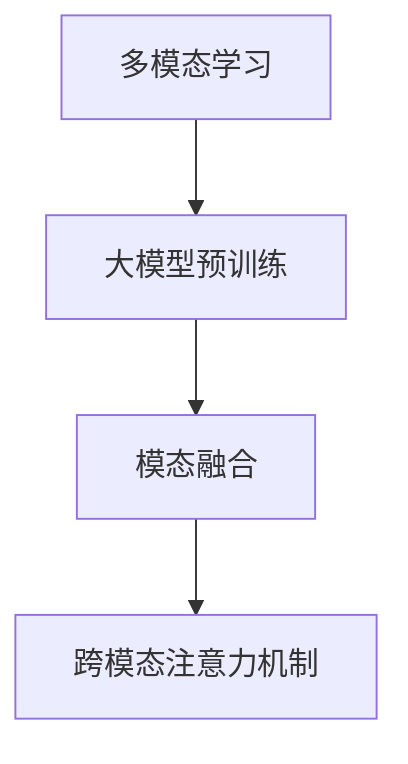

# 多模态大模型：技术原理与实战 多模态大模型的核心技术

## 1.背景介绍

### 1.1 人工智能发展简史

人工智能的发展可以追溯到上世纪50年代,当时一些先驱者提出了"智能机器"的设想。随后在图灵测试的指引下,研究人员开始探索如何使计算机具备类似人类的智能行为。

20世纪60年代,人工智能领域取得了一些初步进展,例如发明了逻辑推理、机器学习和计算机视觉等技术。然而,由于计算能力和数据量的限制,这一时期的人工智能系统表现有限。

21世纪初,深度学习技术的兴起推动了人工智能的新一轮飞跃。大规模数据和强大的计算能力使得训练深层神经网络成为可能,在计算机视觉、自然语言处理等领域取得了突破性进展。

### 1.2 大模型时代的到来

2018年,OpenAI发布了Transformer模型,展示了其在机器翻译等任务中的卓越表现。此后,越来越大的语言模型不断问世,如GPT、BERT等,它们能够从海量文本数据中学习知识,在自然语言处理任务上表现出色。

同时,计算机视觉领域也出现了一系列大型视觉模型,如CLIP、Stable Diffusion等,它们能够从大量图像数据中学习视觉概念和表征,在图像分类、生成等任务上表现出众。

近年来,研究人员开始探索将不同模态(如文本、图像、视频等)的信息融合到单一模型中,诞生了多模态大模型。这种模型能够同时处理和生成多种模态数据,展现出强大的泛化能力,被视为人工智能发展的新前沿。

### 1.3 多模态大模型的重要意义

多模态大模型的出现,标志着人工智能系统正在朝着更加贴近人类认知和交互方式的方向发展。人类获取和处理信息的方式是多模态的,我们通过视觉、听觉、文本等多种渠道感知和理解世界。因此,多模态大模型有望帮助计算机系统更好地模拟和支持人类的认知过程。

此外,多模态大模型在诸多应用领域展现出巨大潜力,如智能助手、多媒体内容生成与分析、医疗影像辅助诊断等。它们有望推动人工智能技术在更多场景中发挥作用,为人类生产生活带来全新体验。

## 2.核心概念与联系

### 2.1 多模态学习

多模态学习(Multimodal Learning)是指从多种模态数据(如文本、图像、语音等)中学习知识表征和建模的过程。与传统的单一模态学习不同,多模态学习需要模型能够融合多源异构信息,捕捉不同模态之间的相关性和互补性。

多模态学习的核心挑战在于如何有效地融合和建模不同模态之间的交互关系。常见的方法包括特征级融合(将不同模态的特征拼接或融合)、模态间注意力机制(学习模态间的依赖关系)等。

### 2.2 大模型预训练

大模型预训练(Large Model Pretraining)是当前主流的多模态模型训练范式。其基本思路是:首先在大规模无标注数据上对模型进行预训练,使其学习到通用的知识表征;然后在特定任务的标注数据上进行微调(Fine-tuning),将预训练知识迁移到目标任务。

这种预训练+微调的范式能够充分利用海量无标注数据,有效提升模型的泛化能力。同时,通过在下游任务上进行微调,模型可以快速适应特定领域,提高任务性能。

### 2.3 模态融合

模态融合(Modality Fusion)是多模态模型的核心环节,旨在将不同模态的信息有效地整合到统一的表征空间中。常见的融合策略包括:

- 特征级融合:将不同模态的特征向量拼接或融合,作为模型的输入。
- 中间融合:在模型的中间层级别(如Transformer编码器层)进行模态融合。
- 后期融合:在模型的最终输出层级别(如分类层)进行模态融合。

不同的融合策略各有优缺点,需要根据具体任务和模型架构进行权衡选择。

### 2.4 跨模态注意力机制

跨模态注意力机制(Cross-Modal Attention)是多模态模型中常用的关键技术,它能够学习不同模态之间的相关性和依赖关系。

具体来说,跨模态注意力机制通过计算查询模态(如文本)和键值模态(如图像)之间的相关性分数,对不同模态的表征进行重新加权,从而融合多模态信息。这种机制赋予了模型捕捉跨模态交互的能力。

### 2.5 核心概念关系总结

以上几个核心概念相互关联,共同构建了多模态大模型的技术体系:

- 多模态学习旨在从异构数据中学习知识表征,是多模态模型的根本目标。
- 大模型预训练为多模态模型提供了通用知识库和强大的表征能力。
- 模态融合则是实现多模态学习的关键技术手段。
- 跨模态注意力机制是实现有效模态融合的核心机制。

## 3.核心算法原理具体操作步骤

### 3.1 Transformer编码器

Transformer编码器是多模态大模型的基础架构之一,它能够对输入序列(如文本、图像等)进行编码,捕捉不同位置元素之间的依赖关系。

Transformer编码器的核心是多头自注意力机制,其基本操作步骤如下:

1. 线性投影:将输入序列的每个元素投影到查询(Query)、键(Key)和值(Value)空间。

   $$Q = XW_Q,\ K = XW_K,\ V = XW_V$$

   其中$X$为输入序列,$W_Q,W_K,W_V$为可训练参数。

2. 缩放点积注意力:计算查询与所有键的相关性得分,并对值进行加权求和。

   $$\text{Attention}(Q, K, V) = \text{softmax}(\frac{QK^T}{\sqrt{d_k}})V$$

   其中$d_k$为缩放因子,用于避免内积值过大导致梯度饱和。

3. 多头注意力:将注意力机制扩展到多个子空间,捕捉不同的依赖模式。

   $$\text{MultiHead}(Q, K, V) = \text{Concat}(\text{head}_1, \dots, \text{head}_h)W^O$$
   $$\text{head}_i = \text{Attention}(QW_i^Q, KW_i^K, VW_i^V)$$

4. 残差连接和层归一化:将多头注意力的输出与输入序列相加,并进行层归一化,以保持梯度稳定。

5. 前馈网络:对归一化后的序列应用前馈网络进行进一步编码。

通过堆叠多个这样的编码器层,Transformer能够捕捉输入序列中的长程依赖关系,为后续的多模态融合奠定基础。

### 3.2 视觉Transformer编码器

对于图像等视觉模态输入,Transformer编码器需要进行适当的修改,以捕捉图像的空间结构信息。

常见的视觉Transformer编码器包括ViT(Vision Transformer)和Swin Transformer等,它们的基本操作步骤如下:

1. 图像分割:将输入图像分割为多个图像块(Image Patch),每个块被视为一个输入元素。

2. 线性投影:将每个图像块投影到查询、键和值空间,类似于文本Transformer编码器。

3. 空间位置编码:为每个图像块添加其在图像中的位置信息,以保留空间结构。

4. 多头自注意力:计算图像块之间的注意力权重,捕捉全局依赖关系。

5. 局部窗口注意力:在Swin Transformer中,还引入了局部窗口注意力机制,用于捕捉局部邻域依赖。

6. 跨层连接:通过跨层连接和层归一化,融合不同层级的特征表征。

通过上述步骤,视觉Transformer编码器能够有效地编码图像的内容和空间结构信息,为后续的多模态融合做好准备。

### 3.3 跨模态注意力融合

跨模态注意力融合是多模态大模型中实现模态融合的核心机制,它能够学习不同模态之间的相关性和依赖关系。

具体操作步骤如下:

1. 模态编码:使用Transformer编码器(或视觉Transformer编码器)分别对文本序列和图像进行编码,得到查询模态(如文本)的查询向量$Q$,以及键值模态(如图像)的键向量$K$和值向量$V$。

2. 跨模态注意力计算:计算查询向量与所有键向量的相关性得分,并对值向量进行加权求和,实现模态融合。

   $$\text{CrossAttention}(Q, K, V) = \text{softmax}(\frac{QK^T}{\sqrt{d_k}})V$$

3. 多头跨模态注意力:扩展到多个子空间,捕捉不同的模态依赖模式。

   $$\text{MultiCrossHead}(Q, K, V) = \text{Concat}(\text{head}_1, \dots, \text{head}_h)W^O$$
   $$\text{head}_i = \text{CrossAttention}(QW_i^Q, KW_i^K, VW_i^V)$$

4. 残差连接和层归一化:将多头跨模态注意力的输出与查询模态的输入相加,并进行层归一化。

5. 前馈网络:对归一化后的查询模态序列应用前馈网络进行进一步编码。

通过多层堆叠的跨模态注意力机制,模型能够逐步融合不同模态的信息,形成统一的多模态表征,为下游任务(如文本生成、视觉问答等)提供强大的支持。

## 4.数学模型和公式详细讲解举例说明

### 4.1 缩放点积注意力机制

缩放点积注意力机制是Transformer模型中的核心机制之一,它能够捕捉输入序列中不同位置元素之间的依赖关系。

具体来说,给定一个查询向量$q$、一组键向量$K=\{k_1, k_2, \dots, k_n\}$和一组值向量$V=\{v_1, v_2, \dots, v_n\}$,缩放点积注意力的计算过程如下:

1. 计算查询向量与每个键向量的点积,得到相关性分数向量$e$:

   $$e_i = q \cdot k_i$$

2. 对相关性分数向量进行缩放和softmax操作,得到注意力权重向量$\alpha$:

   $$\alpha_i = \frac{e^{e_i/\sqrt{d_k}}}{\sum_{j=1}^n e^{e_j/\sqrt{d_k}}}$$

   其中$d_k$为键向量的维度,用于缩放点积值,避免较大的点积值导致softmax函数的梯度较小。

3. 使用注意力权重向量对值向量进行加权求和,得到注意力输出向量$o$:

   $$o = \sum_{i=1}^n \alpha_i v_i$$

通过上述计算,注意力机制能够自适应地为每个位置分配不同的权重,捕捉输入序列中的长程依赖关系。

例如,在机器翻译任务中,注意力机制能够学习到源语言和目标语言之间的对应关系,从而更好地进行翻译。

### 4.2 多头注意力机制

多头注意力机制是在缩放点积注意力机制的基础上进一步扩展的,它能够从不同的子空间捕捉不同的依赖模式,提高模型的表示能力。

具体来说,给定查询矩阵$Q$、键矩阵$K$和值矩阵$V$,多头注意力的计算过程如下:

1. 将$Q$、$K$和$V$分别线性投影到$h$个子空间,得到$Q_i$、$K_i$和$V_i$:

   $$Q_i = QW_i^