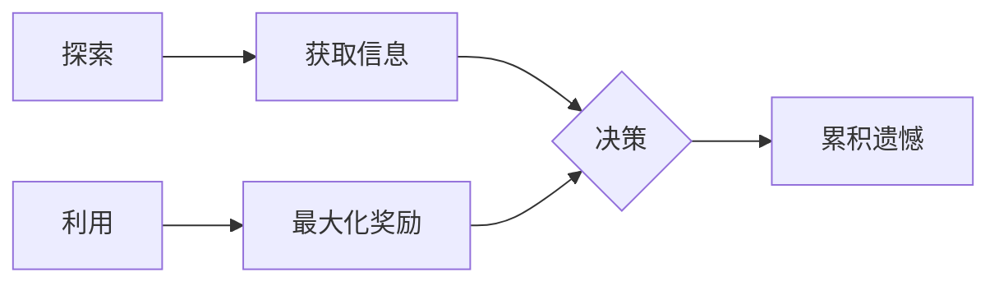

# 多臂老虎机问题原理与代码实战案例讲解

## 1. 背景介绍

### 1.1 多臂老虎机问题的起源与发展
多臂老虎机问题(Multi-Armed Bandit Problem)起源于20世纪初的赌博游戏。在赌场中，老虎机是一种经典的赌博游戏机，玩家通过拉动操纵杆来博取奖金。老虎机之所以被称为"老虎机"，是因为最早的老虎机上绘有老虎的图案。"多臂"指的是老虎机上有多个操纵杆可供选择。

从数学角度来看，多臂老虎机问题是在探索与利用(Exploration and Exploitation)之间寻求平衡的问题。每个操纵杆都有一个未知的奖金概率分布，玩家通过反复试验来估计每个操纵杆的期望收益，目标是找到收益最大的那个操纵杆。

### 1.2 多臂老虎机问题在机器学习中的应用
多臂老虎机问题在机器学习，特别是强化学习领域有着广泛的应用。它为理解探索与利用的平衡提供了一个简单而有力的框架。在实际应用中，我们经常面临类似的决策问题，例如：

- 在线广告投放：选择哪些广告能够最大化点击率？
- 推荐系统：向用户推荐哪些物品能够最大化用户满意度？
- 药物试验：选择哪种治疗方案能够最大化患者的康复概率？

这些问题都可以抽象为多臂老虎机问题。通过研究多臂老虎机问题，我们可以设计出高效的算法来解决现实世界中的诸多决策问题。

## 2. 核心概念与联系

### 2.1 探索与利用
- 探索(Exploration)：尝试不同的选择，收集关于环境的信息。
- 利用(Exploitation)：基于已有的信息，选择当前看起来最优的选择。

探索与利用是一对矛盾体。过度探索会导致算法在次优的选择上浪费太多时间；过度利用则可能错失全局最优的选择。优秀的算法需要在二者之间取得平衡。

### 2.2 累积遗憾
- 遗憾(Regret)：算法的选择与最优选择之间的差距。
- 累积遗憾(Cumulative Regret)：算法在多次决策中遗憾的累加。

我们希望设计出累积遗憾尽可能小的算法。理想情况下，随着决策次数的增加，平均遗憾(cumulative regret / T)应当收敛到0。

### 2.3 概念之间的联系
在多臂老虎机问题中，我们通过探索来获取关于每个臂的信息，通过利用来最大化累积奖励。一个好的算法需要平衡探索与利用，使得累积遗憾最小化。



## 3. 核心算法原理具体操作步骤

### 3.1 ε-贪心算法
ε-贪心算法是一种简单而有效的算法。它以概率ε随机探索，以概率1-ε选择当前估计最优的臂。

1. 初始化：为每个臂分配一个初始估计值（通常是0）。
2. 决策：以概率ε随机选择一个臂，否则选择当前估计值最高的臂。
3. 更新：根据选择的臂的反馈奖励更新其估计值。
4. 重复步骤2-3，直到达到预设的决策次数。

### 3.2 Upper Confidence Bound (UCB)算法
UCB算法通过一个置信区间来平衡探索与利用。它选择当前估计值与不确定性之和最大的臂。

1. 初始化：为每个臂分配一个初始估计值（通常是0）。
2. 决策：对于每个臂，计算其UCB值：$\text{UCB}_i = \bar{x}_i + \sqrt{\frac{2 \ln t}{n_i}}$，其中$\bar{x}_i$是第i个臂的估计值，$n_i$是第i个臂被选择的次数，$t$是总决策次数。选择UCB值最高的臂。
3. 更新：根据选择的臂的反馈奖励更新其估计值和选择次数。
4. 重复步骤2-3，直到达到预设的决策次数。

### 3.3 汤普森采样(Thompson Sampling)算法
汤普森采样是一种基于贝叶斯原理的算法。它为每个臂维护一个后验分布，并根据后验分布采样来选择臂。

1. 初始化：为每个臂分配一个先验分布（通常是Beta(1,1)）。
2. 决策：对于每个臂，从其后验分布中采样一个估计值。选择采样值最高的臂。
3. 更新：根据选择的臂的反馈奖励更新其后验分布。
4. 重复步骤2-3，直到达到预设的决策次数。

## 4. 数学模型和公式详细讲解举例说明

### 4.1 多臂老虎机的数学模型
我们可以用一个元组$(K, \{\mu_i\}_{i=1}^K)$来表示一个K臂老虎机问题，其中$\mu_i$表示第i个臂的期望奖励。在每一轮决策中，算法选择一个臂$I_t \in \{1, \dots, K\}$，并观察到一个奖励$r_t$，我们假设$r_t$是从均值为$\mu_{I_t}$的分布中独立采样得到的。

算法的目标是最大化累积奖励$\sum_{t=1}^T r_t$，或者等价地，最小化累积遗憾：

$$R_T = \sum_{t=1}^T (\mu^* - \mu_{I_t})$$

其中$\mu^* = \max_{i=1, \dots, K} \mu_i$是最优臂的期望奖励。

### 4.2 ε-贪心算法的数学描述
在ε-贪心算法中，我们维护每个臂的经验平均奖励$\bar{x}_i$：

$$\bar{x}_i = \frac{1}{n_i} \sum_{t=1}^T r_t \mathbb{1}\{I_t = i\}$$

其中$n_i = \sum_{t=1}^T \mathbb{1}\{I_t = i\}$是第i个臂被选择的次数。

在每一轮决策中，我们以概率ε随机选择一个臂，以概率1-ε选择$\arg\max_{i=1, \dots, K} \bar{x}_i$。

ε-贪心算法的累积遗憾上界为：

$$R_T \leq \frac{K\ln T}{\Delta} + \frac{1}{\Delta}\sum_{i:\Delta_i>0} \Delta_i$$

其中$\Delta_i = \mu^* - \mu_i$是次优臂i与最优臂之间的差距，$\Delta = \min_{i:\Delta_i>0} \Delta_i$是最小的非零差距。

### 4.3 UCB算法的数学描述
在UCB算法中，我们选择$\arg\max_{i=1, \dots, K} \text{UCB}_i$，其中：

$$\text{UCB}_i = \bar{x}_i + \sqrt{\frac{2 \ln t}{n_i}}$$

这个公式平衡了经验平均奖励$\bar{x}_i$和不确定性$\sqrt{\frac{2 \ln t}{n_i}}$。不确定性项随着$n_i$的增加而减小，鼓励算法探索被选择次数较少的臂。

UCB算法的累积遗憾上界为：

$$R_T \leq 8 \sum_{i:\Delta_i>0} \left(\frac{\ln T}{\Delta_i}\right) + \left(1+\frac{\pi^2}{3}\right)\sum_{i=1}^K \Delta_i$$

相比ε-贪心算法，UCB算法的理论保证更强，因为它的遗憾上界只依赖于次优臂的差距，而不依赖于最小非零差距。

### 4.4 汤普森采样算法的数学描述
在汤普森采样算法中，我们为每个臂维护一个Beta分布的后验：

$$\theta_i \sim \text{Beta}(S_i+1, F_i+1)$$

其中$S_i$是第i个臂观察到的奖励次数，$F_i$是第i个臂观察到的未奖励次数。

在每一轮决策中，我们从每个臂的后验中采样一个$\theta_i$，并选择$\arg\max_{i=1, \dots, K} \theta_i$。

汤普森采样算法的累积遗憾上界为：

$$\mathbb{E}[R_T] \leq \sum_{i:\Delta_i>0} \left(\frac{12}{\Delta_i} + 4\Delta_i\right) \ln T$$

这个上界的形式与UCB算法类似，但是更紧。在实践中，汤普森采样通常比UCB算法表现更好。

## 5. 项目实践：代码实例和详细解释说明

下面我们用Python实现这三种算法。

### 5.1 ε-贪心算法

```python
import numpy as np

class EpsilonGreedy:
    def __init__(self, epsilon, counts, values):
        self.epsilon = epsilon
        self.counts = counts
        self.values = values
        return

    def initialize(self, n_arms):
        self.counts = np.zeros(n_arms, dtype=int)
        self.values = np.zeros(n_arms, dtype=float)
        return

    def select_arm(self):
        if np.random.random() < self.epsilon:
            return np.random.randint(len(self.values))
        else:
            return np.argmax(self.values)

    def update(self, chosen_arm, reward):
        self.counts[chosen_arm] += 1
        n = self.counts[chosen_arm]
        value = self.values[chosen_arm]
        new_value = ((n - 1) / float(n)) * value + (1 / float(n)) * reward
        self.values[chosen_arm] = new_value
        return
```

这个类实现了ε-贪心算法。`initialize`方法初始化计数和估计值数组。`select_arm`方法根据ε-贪心策略选择一个臂。`update`方法根据观察到的奖励更新选择的臂的估计值。

### 5.2 UCB算法

```python
import numpy as np

class UCB1:
    def __init__(self, counts, values):
        self.counts = counts
        self.values = values
        return

    def initialize(self, n_arms):
        self.counts = np.zeros(n_arms, dtype=int)
        self.values = np.zeros(n_arms, dtype=float)
        return

    def select_arm(self):
        n_arms = len(self.counts)
        for arm in range(n_arms):
            if self.counts[arm] == 0:
                return arm

        ucb_values = self.values + np.sqrt(2 * np.log(np.sum(self.counts)) / self.counts)
        return np.argmax(ucb_values)

    def update(self, chosen_arm, reward):
        self.counts[chosen_arm] += 1
        n = self.counts[chosen_arm]
        value = self.values[chosen_arm]
        new_value = ((n - 1) / float(n)) * value + (1 / float(n)) * reward
        self.values[chosen_arm] = new_value
        return
```

这个类实现了UCB1算法。`initialize`和`update`方法与ε-贪心算法类似。`select_arm`方法计算每个臂的UCB值，并选择UCB值最高的臂。如果有臂还没有被选择过，则优先选择这些臂。

### 5.3 汤普森采样算法

```python
import numpy as np

class ThompsonSampling:
    def __init__(self, alpha, beta):
        self.alpha = alpha
        self.beta = beta
        return

    def initialize(self, n_arms):
        self.alpha = np.ones(n_arms, dtype=int)
        self.beta = np.ones(n_arms, dtype=int)
        return

    def select_arm(self):
        theta = np.random.beta(self.alpha, self.beta)
        return np.argmax(theta)

    def update(self, chosen_arm, reward):
        if reward == 1:
            self.alpha[chosen_arm] += 1
        else:
            self.beta[chosen_arm] += 1
        return
```

这个类实现了汤普森采样算法。`initialize`方法初始化每个臂的Beta分布参数。`select_arm`方法从每个臂的后验Beta分布中采样一个值，并选择采样值最高的臂。`update`方法根据观察到的奖励更新选择的臂的Beta分布参数。

### 5.4 测试与比较

```python
import numpy as np
import matplotlib.pyplot as plt

def test_algorithm(algorithm, arms, num_sims, horizon):
    chosen_arms = np.zeros((num_sims, horizon))